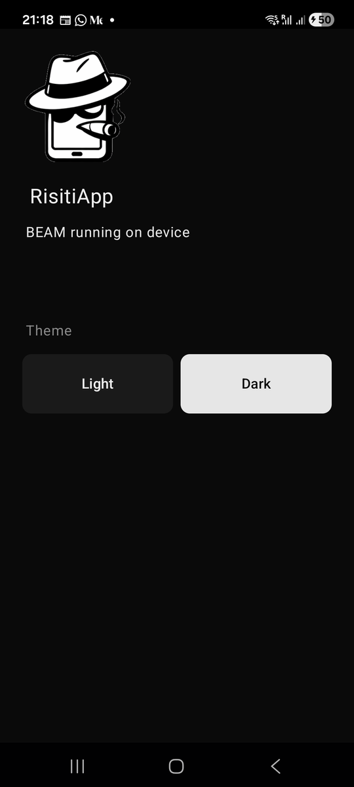

# Chapter 2: Your Android Workbench

Previously, we saw what Mob puts on your phone: a full BEAM, your `.beam`
files, and a native layer that draws what your screens describe. In this
chapter we are setting up the tools that build all of that on your computer,
and we'll run our application on the phone for the first time.

This process will take a while the first time, mostly downloads. Once it's
finished, you will push and run updates on your phone in seconds.

I am using Ubuntu and an Android phone. iOS requires a Mac, which I don't use
for this book. If you are on a Mac, follow the official Mob installation
guide for your environment, then meet us at "Step 7: Check the toolchain".

By the end of this chapter, you will know:

- What each tool in the Android toolchain does, and why Mob needs it.
- How to create a new Mob project.
- How to get your app onto your phone, and how to update it in seconds.
- What to do when it doesn't start.

## What we are installing, and why

When you build a Phoenix app, Mix and Erlang are all you need. A mobile app
needs a few more tools, because part of it is native Android code that must
be compiled and packaged. Here is the full list, with what each one is for:

| Tool | What it does for us |
|---|---|
| **Elixir and Hex** | Compile our code, fetch Mob and its plugins. |
| **Java 17** | Runs Gradle, Android's build tool, which compiles the native side and packages the APK. |
| **Android SDK command-line tools** | Gives us `sdkmanager`, which installs everything below. |
| **Platform tools (ADB)** | `adb`, the Android Debug Bridge: the cable between your computer and your phone. It installs apps, copies files and reads logs. |
| **Android platform 35** | The Android API our app is compiled against. |
| **NDK** | The Native Development Kit. Compiles C and Zig code for the phone's processor, which is how the BEAM and Mob's NIF get onto the phone. |
| **Zig** | Builds Mob's NIF, the bridge between the BEAM and the native UI. |
| **`mob_new`** | The generator. Like `phx_new`, but for Mob apps. |

Let's go through them one by one.

## Step 1: Prepare the phone

Your phone has to agree to talk to your computer. Android hides that switch
in *Developer options*.

1. Open **Settings → About phone**.
2. Tap **Build number** seven times. Android will tell you that you are now a
   developer.
3. Go back to **Settings → System → Developer options** (the exact place
   depends on your phone's brand).
4. Turn on **USB debugging**.

Plug the phone into your computer with a USB cable. We'll come back to it in
Step 8.

## Step 2: Elixir, Hex and the Mob generator

You need Elixir 1.18 or later. Check what you have:

```
elixir --version
```

Next, make sure Hex is installed, then install the Mob generator:

```
mix local.hex
mix archive.install hex mob_new
```

This book uses `mob_new` 0.6.6. If you installed it before, run the same
command again to upgrade: older versions generate projects for older Mob
releases.

## Step 3: Create the app

Create the app with `mix mob.new`:

```
mkdir -p ~/elixir
cd ~/elixir
mix mob.new risiti_app --android --blank
cd risiti_app
```

We are passing two flags:

- `--android`, because we are targeting Android. If you are targeting iOS,
  you will pass `--ios` instead. Drop the flag to generate both.
- `--blank`, which gives us a clean app with a single home screen. Without
  it, Mob generates a showcase with about 75 example components and demo
  screens. It's worth generating once in another folder to explore, but for
  the book we want to write every screen ourselves.

`risiti_app` is the name of the application we'll be building: Risiti, the
expense app this whole book is about. You can call yours something else; just
remember to replace `risiti_app` and `RisitiApp` in the rest of the book.

> **If Risiti is already on your phone.** A generated app's Android package
> is `com.example.risiti_app`. If you've installed a Risiti build with that
> same package, deploying your new project replaces it, along with its data.
> Change `applicationId` in `android/app/build.gradle` (say, to
> `com.example.risiti_book`) before your first deploy.

Here is what the generator gave us:

```
risiti_app/
├── android/         # the native Android project (Gradle, Kotlin)
├── config/
├── lib/risiti_app/
│   ├── app.ex        # the entry point: Mob calls on_start/0 here
│   ├── home_screen.ex
│   └── repo.ex       # an Ecto repo backed by SQLite on the phone
├── priv/repo/migrations/
├── test/
├── mix.exs
└── mob.exs          # Mob's own config: plugins, paths
```

You will spend almost all of your time in `lib/`. The `android/` folder is
the native shell that hosts the BEAM; you won't need to touch it in Part I.

## Step 4: Install Java

Android's build tool, Gradle, runs on Java. The minimum supported version is
Java 17:

```
sudo apt update
sudo apt install -y openjdk-17-jdk unzip wget
java --version
```

The last command confirms the installed version.

## Step 5: Install the Android SDK

Google ships the Android tools as a set of zip files. We'll put them under
`~/Android/Sdk`, which is where Android Studio would put them too.

First, the command-line tools, which give us `sdkmanager`:

```
mkdir -p "$HOME/Android/Sdk/cmdline-tools"
cd /tmp
wget https://dl.google.com/android/repository/commandlinetools-linux-11076708_latest.zip
unzip -q commandlinetools-linux-11076708_latest.zip
mv cmdline-tools "$HOME/Android/Sdk/cmdline-tools/latest"
```

Next, tell your shell where the SDK lives. I use zsh, so I add these lines
to `~/.zshrc`. If you use bash, add them to `~/.bashrc` instead:

```
export ANDROID_HOME="$HOME/Android/Sdk"
export ANDROID_SDK_ROOT="$ANDROID_HOME"
export ANDROID_NDK_HOME="$ANDROID_HOME/ndk/27.2.12479018"
export ANDROID_NDK_ROOT="$ANDROID_NDK_HOME"
export PATH="$HOME/.local/bin:$ANDROID_HOME/cmdline-tools/latest/bin:$ANDROID_HOME/platform-tools:$PATH"
```

Reload the file so the current terminal picks them up:

```
source ~/.zshrc
```

Now accept Google's licences and install the platform tools (ADB), the
Android platform and the NDK:

```
yes | sdkmanager --licenses
sdkmanager --install "platform-tools" "platforms;android-35" "build-tools;34.0.0" "ndk;27.2.12479018"
```

Confirm that ADB is on your path:

```
which adb
adb version
```

> **Why that exact NDK version?** The generated `android/app/build.gradle`
> asks for NDK `27.2.12479018`, and the pre-built BEAM runtime Mob downloads
> was compiled with it. Installing a different version means Gradle will
> either fail or download the right one anyway.

## Step 6: Install Zig

Mob's NIF is written in Zig, so the native build needs the Zig compiler.
Mob uses a specific development build of Zig; the easiest way to get exactly
that version is with [mise](https://mise.jdx.dev), a tool version manager.

```
curl -sSf https://mise.run | sh
echo 'eval "$($HOME/.local/bin/mise activate zsh)"' >> ~/.zshrc
source ~/.zshrc
mise --version
```

Then install and select Zig:

```
mise install zig@0.17.0-dev.269+ebff43698
mise use --global zig@0.17.0-dev.269+ebff43698
zig version
```

If you use bash, replace `activate zsh` with `activate bash` and `~/.zshrc`
with `~/.bashrc`.

## Step 7: First-run Mob install, then check the toolchain

Back in the project folder, run Mob's first-time setup:

```
cd ~/elixir/risiti_app
mix deps.get
mix mob.install
```

`mix mob.install` does three things:

1. Asks for any machine-specific paths it can't detect and writes them to
   `mob.local.exs`, a git-ignored file, and to `android/local.properties`,
   which tells Gradle where your SDK is.
2. Downloads the pre-built Erlang/OTP runtime for Android. This is the BEAM
   that will run on your phone.
3. Writes a placeholder app icon.

Now ask Mob whether everything is in place:

```
mix mob.doctor
```

`mob.doctor` checks your tools, your project configuration, the downloaded
runtime and your connected devices, and tells you how to fix anything that's
missing. Fix everything it reports before moving on. It's the first command
to run whenever something isn't working, so keep it in mind.

## Step 8: Connect the phone and deploy

With the phone plugged in, ask ADB what it sees:

```
adb devices
```

The first time, your phone shows a dialog asking whether to *Allow USB
debugging* from this computer. Tap **Allow**. Then run the command again:

```
List of devices attached
RZCTB0GKNKH     device
```

`RZCTB0GKNKH` is my phone's ID; yours will be different. If you see
`unauthorized` instead of `device`, look at the phone for the dialog. Mob has
its own view of the same list, with a little more detail:

```
mix mob.devices
```

Now, let's launch it! The first deploy builds the native app, so pass
`--native`:

```
mix mob.deploy --native --android --device YOUR_DEVICE_ID
```

Replace `YOUR_DEVICE_ID` with the ID from `adb devices`. Mob asks for an
explicit `--device` for physical phones so you never deploy to the wrong
phone by accident.

The first native build takes a few minutes. Gradle downloads its own
dependencies, compiles the Kotlin side, the NDK compiles the NIF, and
everything is packaged into an APK and installed on your phone. Then your
`.beam` files are pushed and the app starts.



That is a real native Android app, and everything you see on it was decided
by Elixir code running on the phone: the generator's home screen, with a
light and dark switch to prove the BEAM is listening.

## The daily loop

You only need `--native` the first time, or when native code changes (for
example when you add a plugin that ships native code). For everyday Elixir
changes, drop it:

```
mix mob.deploy --device YOUR_DEVICE_ID
```

```
Compiling 1 file (.ex)
Generated risiti_app app

Deploying to devices...

  Pushing 416 BEAM file(s) to 1 device(s)...
  SM-A536E  →  pushing... ✓

Deployed to 1 device(s)
Apps restarted. Run mix mob.connect to open IEx.
```

This compiles your project and pushes only the `.beam` files to the phone.
If the app's BEAM is reachable over Erlang distribution, the changed modules
are hot-loaded in place without even restarting the app. Otherwise the app
restarts. Either way it takes seconds.

One catch with hot-loading: it changes the code running in memory, and the
screen keeps its old assigns. If you've changed what `mount/3` puts in the
assigns, the screen can crash on the new `render/1`, or show a strange mix of
old and new. When that happens, close the app and deploy again: with the app
not running, `mob.deploy` writes the new files to the phone and starts it
fresh.

The generated `mix.exs` also has shorter aliases for these commands:

```
mix android.native --device YOUR_DEVICE_ID   # mix mob.deploy --native --android
mix android --device YOUR_DEVICE_ID          # mix mob.deploy --android
```

Extra arguments pass straight through to `mob.deploy`. If you'd rather not
type the device ID every time, set it once in your shell with
`export ANDROID_SERIAL=YOUR_DEVICE_ID`; Mob treats it like `--device`.

Two more commands you will love:

- `mix mob.watch` watches `lib/` and hot-pushes every module you save to the
  running app. Edit, save, look at the phone.
- `mix mob.connect` opens an IEx shell *connected to the BEAM on your
  phone*. You can call your own functions, inspect processes and read
  `Mob.State`, live, on the device.

So my daily development loop looks like this:

```
cd ~/elixir/risiti_app
adb devices
mix mob.deploy --device YOUR_DEVICE_ID
mix mob.watch
```

## When it doesn't start

Sooner or later the app will open to a blank screen or close itself. Here's
where to look, in order.

**1. Run `mix mob.doctor`.** It catches most setup problems: a missing tool,
a wrong path, an unauthorized device.

**2. Read the phone's log.** Android collects every app's output in a log
called *logcat*. Mob's logs, and any crash in your Elixir code, end up there:

```
adb logcat | grep -i -E "mob|beam|risiti"
```

A crashed screen shows the Elixir error and stack trace, just as it would in
your terminal.

**3. "NIF not loaded".** If the log says `:nif_not_loaded`, a plugin with
native code was added without a native rebuild. Deploy with `--native`.

**4. "No such file" for migrations.** On the phone, your app doesn't live in
the usual `_build` layout, so `Application.app_dir/2` can't find `priv/`. The
generated `app.ex` already handles this with the `MOB_BEAMS_DIR` environment
variable. If you move migrations, keep that function.

**5. The device is `unauthorized` or missing.** Unplug the cable, plug it
back in, and accept the dialog on the phone. Some cables only charge; if
`adb devices` stays empty, try another cable.

## What we have so far

- A complete Android toolchain on your computer.
- A new Mob project called `risiti_app`.
- The app running on your phone, and a loop that updates it in seconds.

The code at the end of this chapter is the untouched generated project, so
there is no `code/02/` folder.

See you in the next chapter, where we'll write our first native screen.
