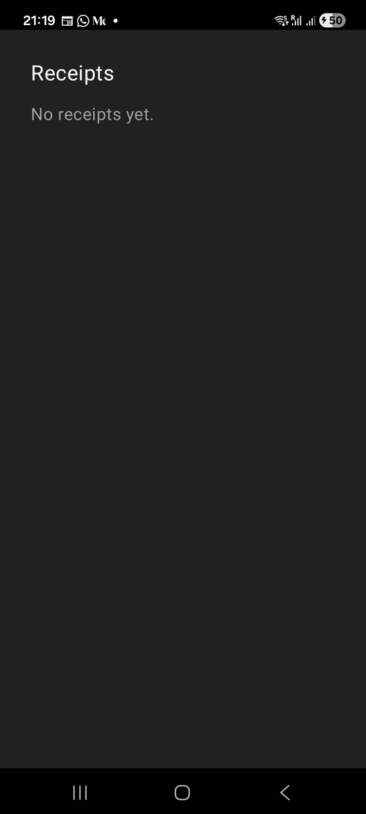

# Chapter 3: Your First Screen

Previously, we set up our development environment and launched the app on
our phone. Now we are going to write Risiti's first native screen, the
receipts screen people will open the app for, and make it the screen the app
opens on.

By the end of this chapter, you will know:

- What a screen is in Mob, and what it has in common with a LiveView.
- How to write UI with the `~MOB` sigil.
- How to set the starting screen of your application.

## A screen is a process

If you are coming from Phoenix, think of a screen in a mobile app as a
LiveView. It contains the UI, the actions, and most of the logic to handle
those actions.

A screen in Mob is a GenServer that implements the `Mob.Screen` behaviour.
At minimum it implements two callbacks:

- `mount/3` plays the same role as `mount/3` in a Phoenix LiveView. It's the
  starting point of the screen, where you prepare its state.
- `render/1` plays the same role as `render/1` in a LiveView. It describes
  what the screen shows.

Each screen that's alive runs in its own process. If a screen crashes, Mob
restarts it without taking down the rest of the app. You get that for free
because it's the BEAM.

Let's see what that looks like.

## Writing the screen

Mob doesn't care where you put your screens, but a folder for them keeps
things tidy as the app grows. Risiti's home screen lists receipts, so we'll
call it `ReceiptsScreen`. Let's create
`lib/risiti_app/screens/receipts_screen.ex` and add the following content:

```elixir
# lib/risiti_app/screens/receipts_screen.ex
defmodule RisitiApp.Screens.ReceiptsScreen do
  use Mob.Screen

  @impl Mob.Screen
  def mount(_params, _session, socket) do
    {:ok, socket}
  end

  @impl Mob.Screen
  def render(_assigns) do
    ~MOB"""
    <Column background={:background} padding={:space_lg}>
      <Text text="Receipts" text_size={:xl} text_color={:on_background} padding={:space_sm} />
      <Text text="No receipts yet." text_color={:muted} padding={:space_sm} />
    </Column>
    """
  end
end
```

There are no receipts yet, so for now the screen says so. By Chapter 12
this same module will be listing receipts from a database.

Here is what's going on.

The `use Mob.Screen` line tells Mob that this module is a screen that renders
native UI. Every screen in your application must use `Mob.Screen`. It also
imports the `~MOB` sigil and gives you sensible defaults for the callbacks
you don't write.

`mount/3` receives three arguments: the params the screen was opened with
(we'll use them in Chapter 5), a session, and the socket. Just like in a
LiveView, the socket holds the screen's state in its assigns. We have no
state yet, so we return the socket as it is.

`render/1` describes the UI. In a LiveView you write HEEx with `~H` and get
HTML. In Mob you write `~MOB` and get native UI.

## The `~MOB` sigil

You'll notice that the components are different from what you use in a
Phoenix application. There are no `div`s or `p`s. Instead:

- `<Column>` stacks its children vertically, top to bottom.
- `<Text>` shows a piece of text.

The attributes will look familiar too, with one difference: values that
start with a colon, such as `:background`, `:space_lg` or `:xl`, are
**design tokens**, not literal values. `:space_lg` means "the theme's large
spacing", `:on_background` means "the colour for text on the background".
`:muted` is the colour for secondary text. When the theme changes, everything
follows. We'll explore tokens properly in Chapter 7, when Risiti gets its own
paper-and-ink look.

Here is the important part: `~MOB` doesn't produce a string. It produces
plain Elixir data. You can see it for yourself in IEx:

```elixir
iex> RisitiApp.Screens.ReceiptsScreen.render(%{})
%{
  type: :column,
  children: [
    %{
      type: :text,
      children: [],
      props: %{
        text: "Receipts",
        padding: :space_sm,
        text_size: :xl,
        text_color: :on_background
      }
    },
    %{
      type: :text,
      children: [],
      props: %{text: "No receipts yet.", padding: :space_sm, text_color: :muted}
    }
  ],
  props: %{padding: :space_lg, background: :background}
}
```

That tree of maps is what Mob hands to the native side, and Jetpack Compose
turns it into real Android views. Because it's data, you can build it with
any Elixir you like. That will matter a lot when we write reusable
components.

## The starting screen

We don't have routes like in a web application. Instead, we tell Mob which
screen the app starts on, and from there the user navigates to other
screens. The start screen is the entry point of our UI, and acts like the `/`
route of a web application.

Let's open `lib/risiti_app/app.ex`. Of course by now you know that you will
replace `risiti_app` with your application name.

```elixir
# lib/risiti_app/app.ex
defmodule RisitiApp.App do
  @moduledoc "Application entry point for RisitiApp."

  use Mob.App

  @impl Mob.App
  def navigation(_platform) do
    stack(:main, root: RisitiApp.HomeScreen)
  end

  @impl Mob.App
  def on_start do
    Mob.DNS.configure_pure_beam()

    {:ok, _} = Application.ensure_all_started(:ecto_sqlite3)
    {:ok, _} = RisitiApp.Repo.start_link()
    Ecto.Migrator.with_repo(RisitiApp.Repo, fn repo ->
      Ecto.Migrator.run(repo, migrations_dir(), :up, all: true)
    end)

    Mob.Screen.start_root(RisitiApp.HomeScreen)
    Mob.Dist.ensure_started(node: :"risiti_app_android@127.0.0.1", cookie: :mob_secret)
  end

  # ... migrations_dir/0
end
```

I've removed the generator's comments to keep it short. We have three
functions here:

- `navigation/1` declares the shape of the app's navigation: here, a single
  stack of screens called `:main`, with `RisitiApp.HomeScreen` at its root.
  The argument is the platform, so you could give Android a drawer and iOS a
  tab bar.
- `on_start/0` runs once when the BEAM starts on the phone. It's where you
  start the things your app needs: here, the DNS setup, the SQLite database
  and its migrations, the first screen, and Erlang distribution so
  `mix mob.connect` can reach the app.
- `migrations_dir/0` finds the migrations on the phone. We'll come back to
  it in Chapter 12.

To make our new screen the start screen, we change both places that name
the home screen:

- In `navigation/1`, replace `RisitiApp.HomeScreen` with
  `RisitiApp.Screens.ReceiptsScreen`.
- In `on_start/0`, replace `Mob.Screen.start_root(RisitiApp.HomeScreen)` with
  `Mob.Screen.start_root(RisitiApp.Screens.ReceiptsScreen)`.

```elixir
  @impl Mob.App
  def navigation(_platform) do
    stack(:main, root: RisitiApp.Screens.ReceiptsScreen)
  end
```

```elixir
    Mob.Screen.start_root(RisitiApp.Screens.ReceiptsScreen)
```

`start_root/1` is what actually shows the first screen. `navigation/1` tells
Mob which screen sits at the root of the stack, which matters when the user
goes back from deeper screens. Keep the two in agreement.

We'll leave the generated `home_screen.ex` where it is for now and delete it
in Chapter 7, when it starts fighting with Risiti's theme.

## Run it

With these changes, we can deploy the app and see the new screen:

```
mix mob.deploy --device YOUR_DEVICE_ID
```

Replace `YOUR_DEVICE_ID` with your device ID. We didn't touch native code,
so there's no need for `--native`: Mob pushes the changed `.beam` files and
restarts the app.



That text is not a web page. It's a real native view on your device, and
the only code we wrote to get it there was Elixir.

## A test, without a phone

Deploying to a phone to check one line of text gets slow. Mob ships
`Mob.ScreenCase`, the screen equivalent of `Phoenix.LiveViewTest`, which
drives a screen inside the BEAM on your computer. No phone, no emulator.

Let's create `test/risiti_app/screens/receipts_screen_test.exs`:

```elixir
# test/risiti_app/screens/receipts_screen_test.exs
defmodule RisitiApp.Screens.ReceiptsScreenTest do
  use Mob.ScreenCase

  alias RisitiApp.Screens.ReceiptsScreen

  test "shows the receipts heading" do
    view = mount_screen(ReceiptsScreen)
    assert text(view) =~ "Receipts"
    assert_renderable(view)
  end
end
```

`mount_screen/1` calls `mount/3` and `render/1` for us. `text/1` collects all
the text in the rendered tree. `assert_renderable/1` checks that every node
in the tree is a component the native side can actually draw, so a typo like
`<Colum>` fails here instead of on the phone.

```
mix test
```

You will see a warning that `mob_nif.so` couldn't be loaded. That's
expected: the NIF is built for the phone, not your computer, and screen
tests don't need it. We'll give testing a full chapter later; for now, it's
enough to know that every screen in this book comes with a test.

## What we have so far

- Risiti's `ReceiptsScreen`, written with `~MOB`.
- The app now starts on it.
- A test that checks it without a phone.

The code at the end of this chapter is in `code/03/`.

Now that you know how to create and display a screen, let's take it further
in the next chapter, where we learn how to navigate between screens.
