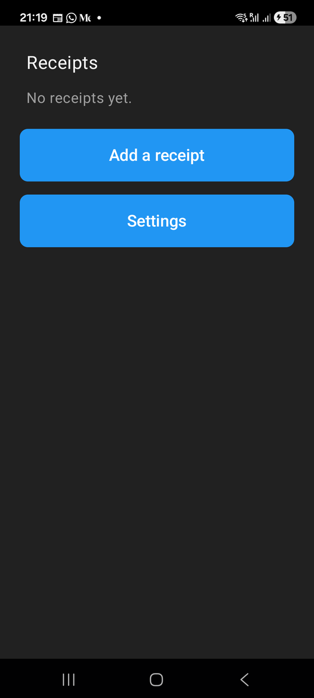
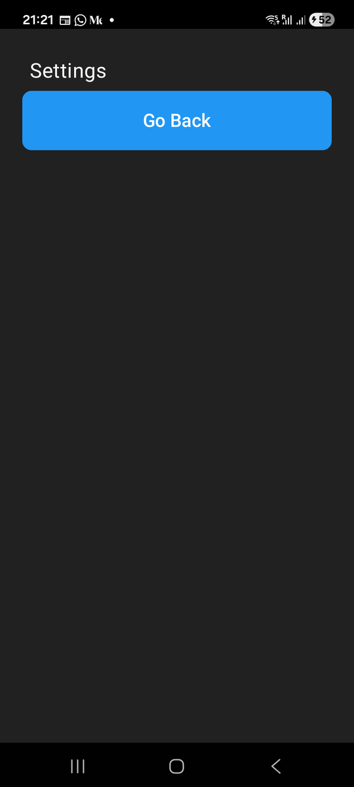

# Chapter 4: Moving Between Screens

Previously, we created our first native screen and made it the starting point
of our application. Now we want to see how to move between screens.

A mobile app is a collection of connected screens. You will hardly find a
one-screen application, and when you find one, it will be very limited. We
need a way for the user to choose a screen, do a specific task there, and
come back.

By the end of this chapter, you will know:

- How a tap on a button reaches your Elixir code.
- How to open a new screen, and how to go back.
- What a navigation stack is, and why the phone's back gesture already works.

## The navigation stack

On the web, every page has a URL and the browser keeps your history. A
mobile app has no URLs. Instead, it keeps a **stack** of screens.

- When you open a screen, it is **pushed** on top of the stack and slides in.
- When you go back, the top screen is **popped** off and you see the one
  underneath.
- The screen at the bottom, the one the app started on, is the **root**.

```
push Settings           pop
┌───────────┐       ┌───────────┐       ┌───────────┐
│           │       │ Settings  │       │           │
│           │  ──►  ├───────────┤  ──►  │           │
│ Receipts  │       │ Receipts  │       │ Receipts  │
└───────────┘       └───────────┘       └───────────┘
```

That's the `stack(:main, root: ...)` we saw in `app.ex` in the last chapter.

So, to move between screens, we need:

- Multiple screens to move between.
- Buttons for the user to tap.
- A way to push a specific screen.
- A way to pop back to the previous one.

## From a tap to your code

Here is how a tap travels:

1. The user taps a button on the screen.
2. The native side sends a `{:tap, tag}` message to the screen process that
   rendered the button.
3. The matching `handle_info/2` clause in your screen handles it.

The button decides *which* process gets the message and *what* the tag is,
through its `on_tap` attribute:

```elixir
on_tap={{self(), :open_settings}}
```

The first element is a pid: `self()`, the screen's own process. The second
is the tag, any term you like. If you are coming from LiveView, think of
`on_tap` as `phx-click` for the mobile device, except that you also say
who should receive the event.

Why the pid? Because a screen is just a process, you could just as well send
the tap to another process: a parent screen, or a GenServer that does
background work. Most of the time it's `self()`.

## Adding the buttons

Risiti's home screen needs two ways out: one to add a receipt, and one to
the settings. Change the content of
`lib/risiti_app/screens/receipts_screen.ex` to the following:

```elixir
# lib/risiti_app/screens/receipts_screen.ex
defmodule RisitiApp.Screens.ReceiptsScreen do
  use Mob.Screen

  @impl Mob.Screen
  def mount(_params, _session, socket) do
    {:ok, socket}
  end

  @impl Mob.Screen
  def render(_assigns) do
    # Who handles each tap: this screen's process, with a tag naming the action.
    add_tap = {self(), :add_manual}
    settings_tap = {self(), :open_settings}

    ~MOB"""
    <Column background={:background} padding={:space_lg}>
      <Text text="Receipts" text_size={:xl} text_color={:on_background} padding={:space_sm} />
      <Text text="No receipts yet." text_color={:muted} padding={:space_sm} />
      <Spacer size={16} />
      <Button
        text="Add a receipt"
        background={:primary}
        text_color={:on_primary}
        text_size={:lg}
        padding={:space_sm}
        fill_width={true}
        on_tap={add_tap}
      />
      <Spacer size={16} />
      <Button
        text="Settings"
        background={:primary}
        text_color={:on_primary}
        text_size={:lg}
        padding={:space_sm}
        fill_width={true}
        on_tap={settings_tap}
      />
    </Column>
    """
  end

  @impl Mob.Screen
  def handle_info({:tap, :add_manual}, socket) do
    {:noreply, Mob.Socket.push_screen(socket, RisitiApp.Screens.ReceiptFormScreen)}
  end

  def handle_info({:tap, :open_settings}, socket) do
    {:noreply, Mob.Socket.push_screen(socket, RisitiApp.Screens.SettingsScreen)}
  end

  def handle_info(_message, socket), do: {:noreply, socket}
end
```

The tag names, `:add_manual` and `:open_settings`, are the ones the real
Risiti uses. "Manual" because later the main way to add a receipt will be
the camera, and typing one in by hand will be the fallback.

Let's break down what we just did.

### The tap events

First, in `render/1`, we defined `add_tap` and `settings_tap`. You will
notice that they both reference the current screen's pid, because this screen
will respond to the taps. Note that `render/1` runs inside the screen process,
so `self()` is the screen.

Next, we added two `<Button>`s, separated by `<Spacer>`s. Buttons are what the
user taps for a call to action. Spacers add breathing room between
components. The button attributes are mostly self-explanatory: the `:primary`
background with `:on_primary` text is the theme's main action colour, and
`fill_width={true}` stretches the button across the screen.

### Responding with `handle_info/2`

Then we added `handle_info/2` clauses to respond to the taps. The message
has the shape `{:tap, tag}`: `:tap` is the kind of event, and the tag is
whatever we put in `on_tap`. Each clause pattern matches on its own tag.

Once a message matches a clause, Mob runs it and expects a
`{:noreply, socket}` tuple back, exactly like a GenServer.

The last clause is a catch-all. Without it, any message the screen doesn't
expect would crash it with a `FunctionClauseError`. Screens receive more
messages than you might think (more on that in later chapters), so always
end your `handle_info/2` clauses with one.

> **Why `handle_info` and not `handle_event`?** In a LiveView, browser events
> go to `handle_event/3`. In Mob, native events are just messages sent to the
> screen process, so they arrive in `handle_info/2` like any other message.
> That's convenient: a tap, a timer and a message from another process are
> handled the same way.

## Push and pop

In Mob, we use `Mob.Socket.push_screen/2` to go to a specific screen and
`Mob.Socket.pop_screen/1` to go back to the previous one.

The following line tells Mob to take the user to the receipt form:

```elixir
{:noreply, Mob.Socket.push_screen(socket, RisitiApp.Screens.ReceiptFormScreen)}
```

Note that `push_screen/2` doesn't navigate right away. It records a
navigation action on the socket, and Mob carries it out after your callback
returns. That's the same idea as `push_navigate/2` in LiveView, and it keeps
your callbacks pure: they return a new socket, and the framework acts on it.

There is no screen to go back to from the `ReceiptsScreen`, since it's the
root. So here we only push.

## Adding the form and settings screens

At the moment we don't have the receipt form or the settings screen. Let's
create them before we test the app. For now they're placeholders: a title
and a way back. The form gets its fields in Chapter 13, and Settings gets
its first real setting in Chapter 7.

They take the same structure as the `ReceiptsScreen`. The difference is that
they are the last screens in the user's journey, so the only navigation they
need is back to the previous screen. We'll pop instead of push.

Create `lib/risiti_app/screens/receipt_form_screen.ex`:

```elixir
# lib/risiti_app/screens/receipt_form_screen.ex
defmodule RisitiApp.Screens.ReceiptFormScreen do
  use Mob.Screen

  @impl Mob.Screen
  def mount(_params, _session, socket) do
    {:ok, socket}
  end

  @impl Mob.Screen
  def render(_assigns) do
    go_back = {self(), :back}

    ~MOB"""
    <Column background={:background} padding={:space_lg}>
      <Text text="New receipt" text_size={:xl} text_color={:on_background} padding={:space_sm} />
      <Button text="Go Back" on_tap={go_back} text_size={:lg} padding={:space_sm} />
    </Column>
    """
  end

  @impl Mob.Screen
  def handle_info({:tap, :back}, socket) do
    {:noreply, Mob.Socket.pop_screen(socket)}
  end

  def handle_info(_message, socket), do: {:noreply, socket}
end
```

Next, create `lib/risiti_app/screens/settings_screen.ex`:

```elixir
# lib/risiti_app/screens/settings_screen.ex
defmodule RisitiApp.Screens.SettingsScreen do
  use Mob.Screen

  @impl Mob.Screen
  def mount(_params, _session, socket) do
    {:ok, socket}
  end

  @impl Mob.Screen
  def render(_assigns) do
    go_back = {self(), :back}

    ~MOB"""
    <Column background={:background} padding={:space_lg}>
      <Text text="Settings" text_size={:xl} text_color={:on_background} padding={:space_sm} />
      <Button text="Go Back" on_tap={go_back} text_size={:lg} padding={:space_sm} />
    </Column>
    """
  end

  @impl Mob.Screen
  def handle_info({:tap, :back}, socket) do
    {:noreply, Mob.Socket.pop_screen(socket)}
  end

  def handle_info(_message, socket), do: {:noreply, socket}
end
```

In both screens, the **Go Back** button sends `{:tap, :back}`, and the
handler pops the screen.

## Run it

Deploy the app:

```
mix mob.deploy --device YOUR_DEVICE_ID
```

You should now be able to move between the screens.



Tap **Settings**, and the settings screen slides in:



## The back gesture is free

Try something: open the settings screen, then use your phone's back
gesture (swipe from the edge, or the back button on older phones) instead
of the **Go Back** button.

It works, and we didn't write a line of code for it. Mob's router handles the
system back gesture for every screen: if there's a screen to pop, it pops;
if you're on the root screen, the app closes, as Android users expect.

So why keep a **Go Back** button at all? Because not every user knows the
gesture, and on iOS there's no back button at the bottom of the screen.
Visible navigation is kinder.

## Testing navigation

Navigation is the kind of thing you don't want to check by hand every time.
`Mob.ScreenCase` lets us send the tap message to a screen and ask where it
navigated:

```elixir
# test/risiti_app/screens/receipts_screen_test.exs
defmodule RisitiApp.Screens.ReceiptsScreenTest do
  use Mob.ScreenCase

  alias RisitiApp.Screens.{ReceiptFormScreen, ReceiptsScreen, SettingsScreen}

  test "shows the receipts heading" do
    view = mount_screen(ReceiptsScreen)
    assert text(view) =~ "Receipts"
    assert_renderable(view)
  end

  test "tapping Add a receipt pushes the receipt form" do
    view = ReceiptsScreen |> mount_screen() |> render_info({:tap, :add_manual})
    assert navigated_to(view) == ReceiptFormScreen
  end

  test "tapping Settings pushes the settings screen" do
    view = ReceiptsScreen |> mount_screen() |> render_info({:tap, :open_settings})
    assert navigated_to(view) == SettingsScreen
  end

  test "Go Back pops the settings screen" do
    view = SettingsScreen |> mount_screen() |> render_info({:tap, :back})
    assert navigated_to(view) == {:pop}
  end
end
```

`render_info/2` sends a message to the screen's `handle_info/2`, exactly like
the native side does when the button is tapped. `navigated_to/1` returns
the screen we pushed, or the raw action, such as `{:pop}`, when there's no
destination.

```
mix test
```

## Other ways to move

`push_screen/2` and `pop_screen/1` will take you a long way, but
`Mob.Socket` has a few more navigation functions you'll meet later in the
book:

| Function | What it does | When to use it |
|---|---|---|
| `pop_to/2` | Pops until a given screen is on top. | Finishing a multi-step flow. |
| `pop_to_root/1` | Pops everything back to the root. | A "Home" button. |
| `reset_to/2` | Replaces the whole stack with one screen. | After sign-in, so "back" doesn't return to the login screen. |

## What we have so far

- A `ReceiptsScreen` with two buttons.
- `ReceiptFormScreen` and `SettingsScreen`, which pop back.
- Tests for every navigation path.

The code at the end of this chapter is in `code/04/`.

Next, we'll see how to pass parameters from one screen to another, so the
form knows *which* receipt the user tapped.
