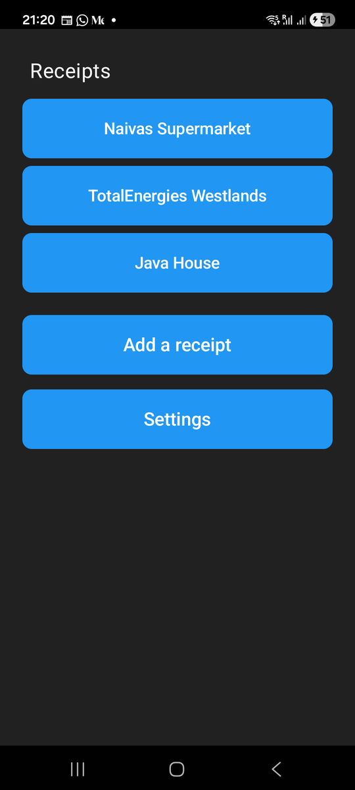
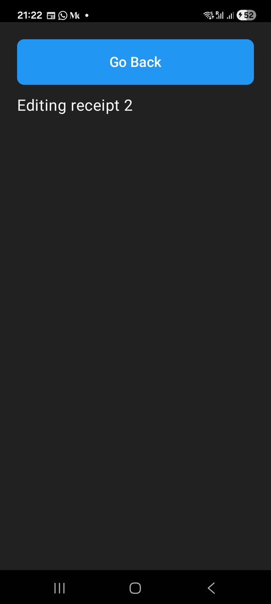

# Chapter 5: Passing Parameters Between Screens

Previously, we saw how to move between screens. Now we are taking it further,
to see how to pass parameters from one screen to another.

At some point you will need the next screen to know what the user tapped on
the previous one. In Risiti, the receipts screen will list every receipt.
When the user taps one, the form must open *that* receipt, so it can show
its vendor and amount and let the user fix a mistake. To do that, you pass
the receipt's ID to the form, so it knows what to load.

This benefits you in two ways. First, you show the user the right
information. More importantly, you write less code. The same
`ReceiptFormScreen` that adds a new receipt will edit any existing one; the
parameter tells it which.

By the end of this chapter, you will know:

- How to put data inside a tap event.
- How to pass params to the next screen with `push_screen/3`.
- How the next screen receives them in `mount/3`.

## Putting the ID in the tap

In the last chapter, every tag was an atom: `:add_manual`, `:open_settings`,
`:back`. But a tag can be any Elixir term. That means we can put the
receipt's ID right inside it:

```elixir
on_tap={{self(), {:open_receipt, 1}}}
```

When this button is tapped, the screen receives `{:tap, {:open_receipt, 1}}`,
and we can pattern match the ID straight out of it:

```elixir
def handle_info({:tap, {:open_receipt, id}}, socket) do
  # id is 1
end
```

> **In the Medium version of this chapter** I put the ID in a string,
> `"go-to-item-1"`, and matched it with `"go-to-item-" <> id`. That works,
> but the ID always comes back as a string, even when it started as an
> integer, and a typo in the prefix fails silently. A tuple keeps the ID's
> type, reads clearly, and is what the Risiti code does everywhere.

## Three receipts to tap

We don't have a database yet, so let's put three receipts on the screen by
hand, each one a button that carries its own ID. In
`lib/risiti_app/screens/receipts_screen.ex`, replace the "No receipts yet."
text with three buttons:

```elixir
    ~MOB"""
    <Column background={:background} padding={:space_lg}>
      <Text text="Receipts" text_size={:xl} text_color={:on_background} padding={:space_sm} />
      <Spacer size={8} />
      <Button text="Naivas Supermarket" fill_width={true} padding={:space_sm} on_tap={{self(), {:open_receipt, 1}}} />
      <Spacer size={8} />
      <Button text="TotalEnergies Westlands" fill_width={true} padding={:space_sm} on_tap={{self(), {:open_receipt, 2}}} />
      <Spacer size={8} />
      <Button text="Java House" fill_width={true} padding={:space_sm} on_tap={{self(), {:open_receipt, 3}}} />
      <Spacer size={24} />
      <Button
        text="Add a receipt"
        ...
```

And add a clause at the top of the `handle_info/2` clauses:

```elixir
  @impl Mob.Screen
  def handle_info({:tap, {:open_receipt, id}}, socket) do
    {:noreply, Mob.Socket.push_screen(socket, RisitiApp.Screens.ReceiptFormScreen, %{id: id})}
  end
```

Which gives you the following UI:



Take note that the three buttons send the same kind of event,
`:open_receipt`; only the ID is different. In Chapter 12 the ID will be the
receipt's database ID, and the buttons will become a proper list, but the
event will stay exactly the same.

This approach lets us:

- Pattern match on the event name in `handle_info/2`.
- Pull the ID out and pass it along as a parameter.

You will also notice that we wrote the `on_tap` tuples inline this time,
`on_tap={{self(), {:open_receipt, 1}}}`, instead of in variables at the top
of `render/1`. The double braces are the sigil's `{...}` around an Elixir
tuple. Both styles work; use the one that reads better.

## Sending the params

Look at the new `handle_info/2` clause again:

```elixir
def handle_info({:tap, {:open_receipt, id}}, socket) do
  {:noreply, Mob.Socket.push_screen(socket, RisitiApp.Screens.ReceiptFormScreen, %{id: id})}
end
```

Note that we pattern match on the ID, then pass it in a map as the third
argument of `push_screen/3`. Those params are handed to the new screen's
`mount/3` as its first argument.

## Receiving the params

The receipt form has to handle two cases now: opened with an ID, it edits
that receipt; opened without one, from **Add a receipt**, it's a new
receipt. Change `lib/risiti_app/screens/receipt_form_screen.ex`:

```elixir
# lib/risiti_app/screens/receipt_form_screen.ex
defmodule RisitiApp.Screens.ReceiptFormScreen do
  use Mob.Screen

  @impl Mob.Screen
  def mount(params, _session, socket) do
    # Opened with %{id: id} to edit a receipt, or with no params for a new one.
    {:ok, Mob.Socket.assign(socket, :id, params[:id])}
  end

  @impl Mob.Screen
  def render(assigns) do
    ~MOB"""
    <Column background={:background} padding={:space_lg}>
      <Button text="Go Back" text_size={:lg} padding={:space_sm} on_tap={{self(), :back}} />
      <Spacer size={16} />
      <Text text={title(@id)} text_size={:xl} text_color={:on_background} />
    </Column>
    """
  end

  defp title(nil), do: "New receipt"
  defp title(id), do: "Editing receipt #{id}"

  @impl Mob.Screen
  def handle_info({:tap, :back}, socket) do
    {:noreply, Mob.Socket.pop_screen(socket)}
  end

  def handle_info(_message, socket), do: {:noreply, socket}
end
```

Let's explain what is happening.

The params from the previous screen arrive in `mount/3` as the first
argument. They're exactly the map we passed to `push_screen/3`, keys and
types unchanged: `%{id: 1}` arrives as `%{id: 1}`. Unlike URL params in
Phoenix, nothing is turned into a string on the way, because nothing leaves
the BEAM.

`params[:id]` is `nil` when the form was opened with no params, so one
assign covers both cases, and two clauses of `title/1` turn it into the
heading.

Note the `@id` in `render/1`. Just like in HEEx, `@id` is short for
`assigns.id`. You'll also notice that `render/1` now takes `assigns` rather
than `_assigns`: the `@` shorthand needs a variable called `assigns` to be in
scope.

## Run it

```
mix mob.deploy --device YOUR_DEVICE_ID
```

Tap **TotalEnergies Westlands**:



Go back and tap **Add a receipt**, and the same screen says "New receipt".
That's how you move between screens with parameters.

## Testing it

Two things are worth testing here: that tapping a receipt pushes the form
*with the right ID*, and that the form handles both ways of being opened.
Add to `test/risiti_app/screens/receipts_screen_test.exs`:

```elixir
  test "tapping a receipt opens the form with that receipt's id" do
    view = ReceiptsScreen |> mount_screen() |> render_info({:tap, {:open_receipt, 2}})

    assert navigated_to(view) == ReceiptFormScreen
    assert {:push, ReceiptFormScreen, %{id: 2}} = view.socket.__mob__.nav_action
  end

  test "the form says which receipt it is editing" do
    assert text(mount_screen(ReceiptFormScreen, %{id: 2})) =~ "Editing receipt 2"
    assert text(mount_screen(ReceiptFormScreen)) =~ "New receipt"
  end
```

`navigated_to/1` tells us which screen was pushed, but not the params. To
check those, we look at the navigation action itself, which Mob keeps on
the socket. The second test shows the other side: `mount_screen/2` takes the
params as its second argument, so we can mount the form exactly as the
receipts screen would.

## Don't pass the whole receipt

You might be tempted to skip the ID and pass the whole receipt:

```elixir
push_screen(socket, ReceiptFormScreen, %{receipt: receipt})
```

It works, because params can be any term. But get into the habit of passing
the ID and loading the record in `mount/3`. Once receipts live in a database
(Chapter 12), the form will always show the latest version, and it can be
opened from anywhere that knows an ID: a search result, the approvals inbox,
a push notification. The real Risiti form is opened from all three.

## What we have so far

- Three receipts whose buttons carry an ID.
- A `ReceiptFormScreen` that knows which receipt it was given, or that it's
  a new one.
- Tests that check the ID makes the trip.

The code at the end of this chapter is in `code/05/`.

Our screens work, but they don't look like much. In the next chapter we'll
learn how Mob lays things out on the screen with columns, rows and boxes,
and give the receipts screen the shape of the real Risiti home screen.
