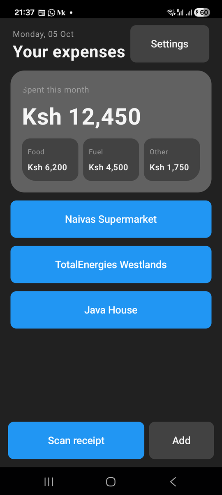
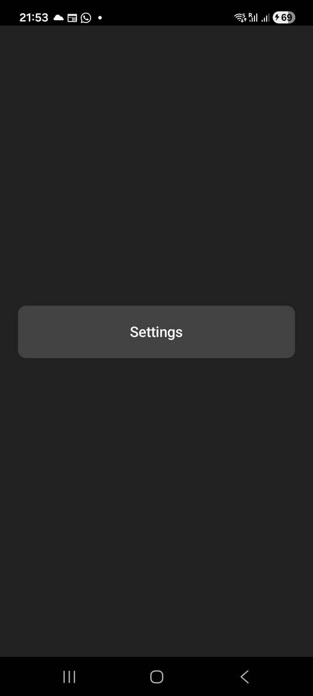

# Chapter 6: Columns, Rows and Boxes

Previously, we passed a receipt's ID from the receipts screen to the form.
Our screens work, but they are a pile of text and buttons stacked one on top
of the other. In this chapter we'll learn how Mob lays things out, and give
the receipts screen the shape of the real Risiti home screen.

On the web you lay things out with CSS: flexbox, grid, margins, and a lot of
trial and error. Mob's layout is much smaller. There are a handful of
containers, each with one job, and you nest them. If you've used flexbox,
you already understand most of it.

By the end of this chapter, you will know:

- The layout components: `Column`, `Row`, `Box`, `Scroll`, `Spacer` and
  `Divider`.
- How to space things out with `padding`, `gap` and `Spacer`.
- How to share space between siblings with `weight`.
- How to pin something to the bottom of the screen.
- What the numbers in a layout actually measure on a phone.

## What we're building

Here is the receipts screen we want at the end of this chapter:



From top to bottom:

- A **header**: today's date in small letters over "Your expenses", with a
  Settings button on the right.
- The **spend card**: what was spent this month, in big numbers, and under
  it three small boxes splitting it into Food, Fuel and Other.
- The **receipts**, which scroll.
- The **dock**, pinned to the bottom: a wide "Scan receipt" button and a
  small "Add" button, where a thumb can reach them.

The numbers are hard-coded for now. In Chapter 8 they'll be added up from
real receipts.

## The containers

| Component | What it does | Flexbox equivalent |
|---|---|---|
| `<Column>` | Stacks children top to bottom. | `flex-direction: column` |
| `<Row>` | Places children left to right. | `flex-direction: row` |
| `<Box>` | Holds children in a frame you can colour, round and pad. Children are layered on top of each other. | A `div` with a background |
| `<Scroll>` | Makes its content scroll when it's taller than its space. | `overflow-y: auto` |
| `<Spacer>` | Empty space of a given size. | An empty `div` with a height |
| `<Divider>` | A thin line between sections. | `<hr>` |

Every screen we've written so far was one `Column`. Real screens nest them:
a `Column` of `Row`s, a `Row` of `Box`es, each with its own spacing.

## A word about sizes

When you write `padding={16}` or `<Spacer size={16} />`, the 16 is not
pixels. Phones have very different pixel densities: the same 16 physical
pixels would look tiny on a sharp phone and huge on a cheap one. So Android
measures layout in **density-independent pixels**, *dp*, where 1 dp is about
the same physical size on every phone. Text is measured in a similar unit
that also follows the user's font size setting.

You don't have to think about the conversion. Just know that `16` means
"16 dp", and it will look about the same on every phone.

The theme also has named spacing tokens, which we've used since Chapter 3:

| Token | Size |
|---|---|
| `:space_xs` | 4 |
| `:space_sm` | 8 |
| `:space_md` | 16 |
| `:space_lg` | 24 |
| `:space_xl` | 32 |

Risiti's own screens mostly use plain numbers, tuned by eye on a real phone:
22 at the screen's edges, 18 around the cards. Both are fine. Pick one style
per screen and stick to it.

## The new receipts screen

Change `lib/risiti_app/screens/receipts_screen.ex` to the following:

```elixir
# lib/risiti_app/screens/receipts_screen.ex
defmodule RisitiApp.Screens.ReceiptsScreen do
  use Mob.Screen

  @impl Mob.Screen
  def mount(_params, _session, socket) do
    {:ok,
     Mob.Socket.assign(socket,
       month_total: "Ksh 12,450",
       by_group: [{"Food", "Ksh 6,200"}, {"Fuel", "Ksh 4,500"}, {"Other", "Ksh 1,750"}]
     )}
  end

  @impl Mob.Screen
  def render(assigns) do
    ~MOB"""
    <Column background={:background} fill_width={true} fill_height={true}>
      <Row padding_left={22} padding_right={22} padding_top={12} padding_bottom={14}>
        <Column weight={1}>
          <Text text="Monday, 05 Oct" text_size={13} text_color={:muted} />
          <Text text="Your expenses" text_size={26} font_weight="bold" text_color={:on_background} />
        </Column>
        <Button
          text="Settings"
          width={120}
          background={:surface}
          text_color={:on_surface}
          padding={:space_sm}
          on_tap={{self(), :open_settings}}
        />
      </Row>

      <Scroll weight={1}>
        <Column padding_left={18} padding_right={18} gap={14}>
          <Box background={:surface_raised} corner_radius={24} padding={20} fill_width={true}>
            <Column>
              <Text text="Spent this month" text_size={13} text_color={:muted} />
              <Spacer size={10} />
              <Text text={@month_total} text_size={36} font_weight="bold" text_color={:on_surface} />
              <Spacer size={14} />
              <Row gap={8}>
                {Enum.map(@by_group, fn {label, amount} -> split_cell(label, amount) end)}
              </Row>
            </Column>
          </Box>

          <Button text="Naivas Supermarket" fill_width={true} padding={:space_sm} on_tap={{self(), {:open_receipt, 1}}} />
          <Button text="TotalEnergies Westlands" fill_width={true} padding={:space_sm} on_tap={{self(), {:open_receipt, 2}}} />
          <Button text="Java House" fill_width={true} padding={:space_sm} on_tap={{self(), {:open_receipt, 3}}} />
        </Column>
      </Scroll>

      <Row padding={14} gap={8}>
        <Button
          text="Scan receipt"
          weight={1}
          background={:primary}
          text_color={:on_primary}
          padding={:space_sm}
          on_tap={{self(), :take_photo}}
        />
        <Button
          text="Add"
          width={96}
          background={:surface}
          text_color={:on_surface}
          padding={:space_sm}
          on_tap={{self(), :add_manual}}
        />
      </Row>
    </Column>
    """
  end

  # One of the three boxes under the total: a label over an amount.
  defp split_cell(label, amount) do
    ~MOB"""
    <Box weight={1} background={:surface} corner_radius={14} padding={10}>
      <Column>
        <Text text={label} text_size={11} text_color={:muted} />
        <Text text={amount} text_size={13} font_weight="semibold" text_color={:on_surface} />
      </Column>
    </Box>
    """
  end

  # handle_info/2 clauses as before
end
```

The `handle_info/2` clauses haven't changed. **Scan receipt** sends
`{:tap, :take_photo}`, which nothing handles yet; it falls through to the
catch-all and does nothing until we meet the camera in Chapter 14.

Let's take the layout from the outside in.

### The outer column: three parts

```elixir
<Column background={:background} fill_width={true} fill_height={true}>
  <Row ...>          header
  <Scroll weight={1}> the middle, which scrolls
  <Row ...>          the dock
</Column>
```

The whole screen is one column with three children. `fill_width` and
`fill_height` make it take the whole screen. That matters, because of what
happens to the middle child.

### `weight`: whatever space is left

```elixir
<Scroll weight={1}>
```

`weight` shares out the space a container has left after its other children
have taken what they need. Here, the header takes the height of its text,
the dock takes the height of its buttons, and the `Scroll`, with
`weight={1}`, gets *everything else*. That's what pins the dock to the
bottom of the screen: the scroll pushes it there, however tall the phone.

If you know flexbox, `weight` is `flex-grow`. Two siblings with `weight={1}`
split the space in half; one with `weight={2}` would get twice as much as
one with `weight={1}`.

### `Scroll`: the middle

A phone screen is short. As soon as there are more than a few receipts, they
won't all fit. Wrapping the middle in a `<Scroll>` means it scrolls when it
needs to and does nothing when it doesn't. The header and dock stay where
they are, because they're outside it.

Note that `Scroll` takes **one** child, here a `Column`, and scrolls it. If
you want several things in a scroll, put them in a column first.

### `gap`: even space between children

```elixir
<Column padding_left={18} padding_right={18} gap={14}>
```

`padding` is the space *inside* a container, around its edges. `gap` is the
space *between* its children. With `gap={14}`, the spend card and every
receipt button are 14 dp apart, so we don't need a `<Spacer>` between each
one.

`padding_left` and `padding_right` pad just the sides; there's also
`padding_top` and `padding_bottom`. Use `<Spacer>` when one particular space
should differ from the rest, as inside the spend card, where the big number
gets a little more air than the label above it.

### The header: a row with a stretchy column

```elixir
<Row padding_left={22} padding_right={22} padding_top={12} padding_bottom={14}>
  <Column weight={1}>
    <Text text="Monday, 05 Oct" ... />
    <Text text="Your expenses" ... />
  </Column>
  <Button text="Settings" ... />
</Row>
```

The same `weight` trick, sideways. In a row, `weight={1}` takes the width
the Settings button doesn't need, which pushes the button to the right edge.
The column keeps the date and the title together as one block.

A `Row` centres its children vertically by default. Pass `align={:top}` or
`align={:bottom}` to change that.

Note the `width={120}` on the Settings button. It isn't decoration. Here is
the same screen without it, on a real phone:



Everything vanished except one giant Settings button. On Android, a
`<Button>` that sits in a row next to a sibling with a `weight`, and has no
`weight` or `width` of its own, takes all the space there is, and pushes the
rest of the screen out of sight. The tests passed, because the tree was
right; it's how Compose sizes a Material button that goes wrong. The rule
that avoids it: **in a row with a weighted child, give every `<Button>`
either a `weight` or a `width`.** Rows where every button is weighted, like
the dock's, or the three buttons in Chapter 7's Settings, are fine.

It's also a good reason to run every screen on a real phone at least once.
`assert_renderable/1` proves the phone *can* draw a tree; only the phone
shows you what it *does* draw.

Note the text sizes: 13 for the small date, 26 bold for the title. A number
works for `text_size` as well as the named sizes (`:sm`, `:xl` and so on).
Sizes that start with a digit have to be quoted atoms if you use the names,
because `:2xl` isn't valid Elixir: `:"2xl"`.

### `Box`: the spend card

```elixir
<Box background={:surface_raised} corner_radius={24} padding={20} fill_width={true}>
  <Column>
    ...
  </Column>
</Box>
```

A `Box` is the closest thing to a styled `div`. Give it a `background`,
round its corners with `corner_radius`, and pad its content. That's a card.

Unlike a `Column`, a `Box` layers its children on top of each other. That's
why the card's content sits in a `Column` inside the box. Layering is useful
for things like a badge in the corner of a picture; for that, `Box` takes
`align` values such as `:center`, `:top_trailing` or `:bottom_leading`.

The card is a neutral `:surface_raised` for now. In the next chapter it
becomes Risiti's dark green spend card.

### The split cells: a helper and `weight` again

```elixir
<Row gap={8}>
  {Enum.map(@by_group, fn {label, amount} -> split_cell(label, amount) end)}
</Row>
```

Three boxes that differ only in their label and amount are a job for a
function. `split_cell/2` returns a small `~MOB` tree, and `Enum.map/2`
calls it three times. Because `~MOB` is just data, a list of trees drops
into the template like any other child.

Each cell has `weight={1}`, so the three share the row's width equally,
whatever the phone's size.

### The dock

```elixir
<Row padding={14} gap={8}>
  <Button text="Scan receipt" weight={1} ... />
  <Button text="Add" ... />
</Row>
```

One more `weight`: **Scan receipt** takes all the width **Add** leaves.
**Add** gets `width={96}`, for the reason we just met.
Scanning is what people will do most, so it gets the big, dark button; the
lesser action gets a small, quiet one. When everything is primary, nothing
is.

## Run it

```
mix mob.deploy --device YOUR_DEVICE_ID
```


Try making the text bigger in your phone's accessibility settings, then open
the app again. The card grows, and the receipts start to scroll under it,
but the header and the dock stay put.

## When a layout looks wrong

Layout bugs on a phone are hard to see from the code. Three habits help:

1. **Give containers a temporary background.** `background={:error}` on a
   `Column` shows you exactly how big it is.
2. **Read the tree in a test.** `render/1` returns data, so
   `IO.inspect(tree(view))` in a test shows you what you actually built.
3. **Check the fills.** A container that is smaller than you expected
   usually needs `fill_width={true}` or `fill_height={true}`, and `weight`
   does nothing inside a parent that doesn't itself have a size.

## Updating the test

Our first test still looks for the old heading. Update it in
`test/risiti_app/screens/receipts_screen_test.exs`:

```elixir
  test "shows the month's spend, split three ways" do
    view = mount_screen(ReceiptsScreen)

    assert text(view) =~ "Spent this month"
    assert text(view) =~ "Ksh 12,450"
    assert text(view) =~ "Fuel"
    assert_renderable(view)
  end
```

`assert_renderable/1` earns its place here: it walks the whole tree, boxes
inside rows inside a scroll inside a column, and fails if any of them isn't
something Compose can draw.

## What we have so far

- A receipts screen with a header, a spend card, a scrolling middle and a
  dock pinned to the bottom.
- `weight` for sharing space, `gap` for even spacing, `Box` for cards.

The code at the end of this chapter is in `code/06/`.

The screen has Risiti's shape, but not its colours: it's still wearing
Mob's plain default theme. In the next chapter, Risiti gets its own look.
