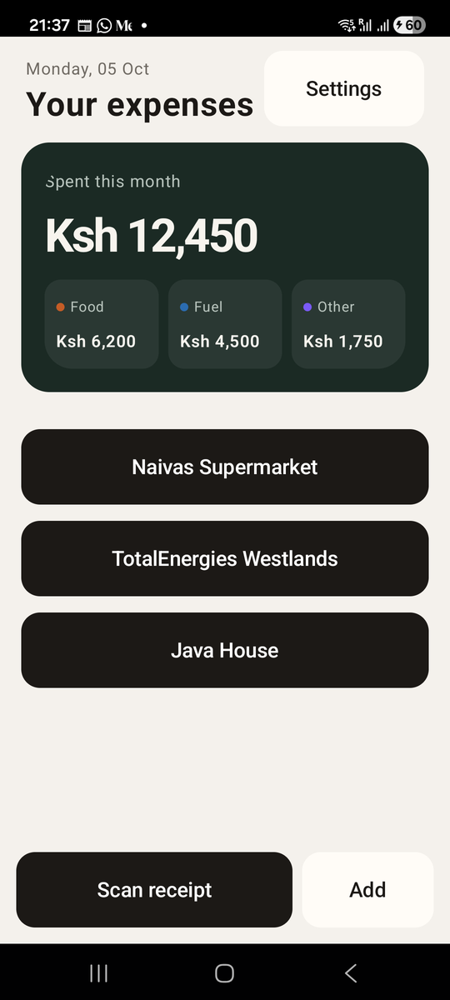
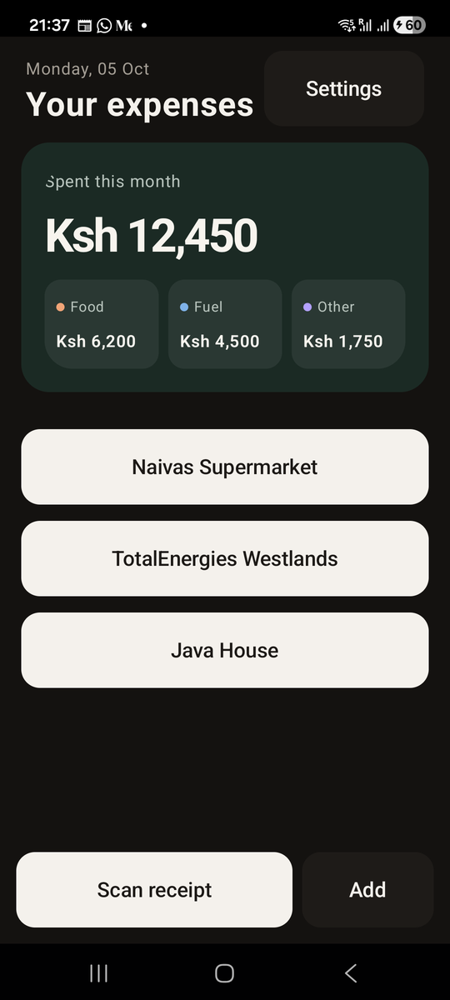

# Chapter 7: Colours, Type and Themes

Previously, we gave the receipts screen the shape of Risiti's home screen.
It has the right shape, but it's wearing Mob's default theme: dark grey with
a standard blue. In this chapter Risiti gets its own look, warm paper and
near-black ink, and the user gets to choose between light and dark.

By the end of this chapter, you will know:

- What design tokens are, and why we've been writing `:primary` instead of
  colours all along.
- How to build a theme of your own and make it the app's theme.
- How to use colours the theme has no token for.
- How to change the theme while the app is running.

## Tokens, not colours

Look back at any screen we've written. We almost never wrote a colour. We
wrote `background={:surface}`, `text_color={:on_primary}`,
`padding={:space_lg}`. Those atoms are **design tokens**: names for a
*role*, not a value.

When Mob renders, it looks each token up in the active theme. `:primary`
might be blue in one theme and near-black in another. Your screens don't
change; the theme does.

If you have used Tailwind with CSS variables, or Material Design's colour
roles, it's the same idea. Here are the colour tokens:

| Token | Use it for |
|---|---|
| `:background` / `:on_background` | The screen behind everything, and text on it. |
| `:surface` / `:on_surface` | Cards, sheets and secondary buttons, and text on them. |
| `:surface_raised` | A card that sits on top of another card. |
| `:primary` / `:on_primary` | The main action, and text on it. |
| `:secondary` / `:on_secondary` | A second kind of accent. |
| `:muted` | Secondary text: labels, hints, placeholders. |
| `:error` / `:on_error` | Problems and warnings. |
| `:border` | Dividers and outlines. |

The pairs matter. Text on a `:primary` button should be `:on_primary`, never
`:on_background`. Follow the pairs and your text stays readable in every
theme, light or dark, without you checking each one.

A theme also holds corner radius tokens (`:radius_sm`, `:radius_md`,
`:radius_lg`, and `:radius_pill` for fully rounded ends) and the spacing
tokens from the last chapter.

## Risiti's theme

Mob comes with `Mob.Theme.Light`, `Mob.Theme.Dark` and an adaptive one that
follows the phone. They're fine for a demo. A product deserves its own.

Risiti looks like a paper ledger: a warm off-white page, near-black ink, and
a deep green reserved for money. Create `lib/risiti_app/theme.ex`:

```elixir
# lib/risiti_app/theme.ex
defmodule RisitiApp.Theme do
  @moduledoc """
  The app's look: warm paper background, near-black ink and a deep green
  accent.

  `Light` and `Dark` are ordinary Mob themes; `Adaptive` picks between them
  from the phone's own setting. Colours the theme has no token for (the dark
  spend card and the three spending groups) come from `color/1`, which
  answers for whichever of the two is active.
  """

  defmodule Light do
    @moduledoc "Paper-and-ink light theme."

    def theme do
      Mob.Theme.build(
        primary: 0xFF1C1916,
        on_primary: 0xFFFFFFFF,
        secondary: 0xFF1F6B4A,
        on_secondary: 0xFFFFFFFF,
        background: 0xFFF4F1EC,
        on_background: 0xFF1C1916,
        surface: 0xFFFFFCF7,
        surface_raised: 0xFFFFFFFF,
        on_surface: 0xFF1C1916,
        muted: 0xFF6F6A63,
        error: 0xFFB42318,
        on_error: 0xFFFFFFFF,
        border: 0xFFE6E0D6,
        radius_sm: 14,
        radius_md: 16,
        radius_lg: 24
      )
    end
  end

  defmodule Dark do
    @moduledoc "The same palette, turned down for night use."

    def theme do
      Mob.Theme.build(
        primary: 0xFFF4F1EC,
        on_primary: 0xFF1C1916,
        secondary: 0xFF5BBF8F,
        on_secondary: 0xFF10201A,
        background: 0xFF141210,
        on_background: 0xFFF4F1EC,
        surface: 0xFF1E1B18,
        surface_raised: 0xFF28241F,
        on_surface: 0xFFF4F1EC,
        muted: 0xFFA39D94,
        error: 0xFFF97066,
        on_error: 0xFF1C1916,
        border: 0xFF34302A,
        radius_sm: 14,
        radius_md: 16,
        radius_lg: 24
      )
    end
  end

  defmodule Adaptive do
    @moduledoc "Follows the phone's light / dark setting."

    def theme do
      case Mob.Theme.color_scheme() do
        :dark -> Dark.theme()
        _ -> Light.theme()
      end
    end
  end

  @light %{
    spend_card: 0xFF1B2A24,
    spend_chip: 0xFF2A3833,
    spend_text: 0xFFF7F4EE,
    spend_muted: 0xFFB7C3BC,
    food: 0xFFC45C26,
    fuel: 0xFF2B6CB0,
    other: 0xFF7A5AF8
  }

  @dark %{
    spend_card: 0xFF1B2A24,
    spend_chip: 0xFF2A3833,
    spend_text: 0xFFF7F4EE,
    spend_muted: 0xFFB7C3BC,
    food: 0xFFF0A477,
    fuel: 0xFF7FB2E8,
    other: 0xFFB3A1FF
  }

  @doc "An ARGB colour the theme has no token for, for the active theme."
  def color(name), do: Map.fetch!(if(dark?(), do: @dark, else: @light), name)

  def dark?, do: Mob.Theme.current() == Dark.theme()
end
```

Let's break it down.

### A theme is a module with `theme/0`

Mob doesn't need anything special from a theme: any module with a
`theme/0` function that returns a `%Mob.Theme{}` will do. `Mob.Theme.build/1`
makes that struct from the tokens you give it, and fills in the rest from
Mob's defaults.

### Colours as ARGB integers

`0xFF1C1916` is a colour written as one hexadecimal number: `FF` is the
alpha (fully opaque), then red `1C`, green `19`, blue `16`. It's the same
`#1C1916` you'd write in CSS, with the opacity in front. Mob also has a
named palette (`:emerald_700`, `:gray_100` and so on), but a brand needs
exact colours.

### `primary` is ink, not a brand colour

You'll notice the light theme's `:primary` is near-black, and `:on_primary`
is white. Risiti's main buttons are ink-coloured, like a pen on paper. Green
is kept for one job, money, in the spend card. Choosing what *not* to colour
is most of the work in a calm design.

### The dark theme inverts, it doesn't just darken

In `Dark`, `:primary` becomes the paper colour and `:on_primary` the ink.
`:background` is a warm near-black rather than pure black, and every colour
is a touch lighter so it still reads on a dark page. A dark theme is a
second design, not the first one with the lights off.

### `Adaptive` follows the phone

`Mob.Theme.color_scheme/0` asks the phone whether it's in light or dark
mode. `Adaptive.theme/0` returns the matching theme. On your laptop, with no
phone to ask, it answers `:light`, so tests can use it safely.

### Colours with no token

The spend card is a deep green in both themes, with its own text colours,
and each spending group has a colour of its own. The theme struct has no
slots for those. So `color/1` keeps them in two maps, one per theme, and
picks the right map by checking which theme is active. A screen writes
`Theme.color(:spend_card)` and doesn't have to care which one that is.

## Making it the app's theme

Open `lib/risiti_app/app.ex` and give `use Mob.App` the theme:

```elixir
# lib/risiti_app/app.ex
defmodule RisitiApp.App do
  @moduledoc "Application entry point for RisitiApp."

  use Mob.App, theme: RisitiApp.Theme.Light
```

That's the theme Mob uses from the first frame.

While you're here: remember the `home_screen.ex` the generator gave us? Its
`mount/3` sets Mob's own light or dark theme from a saved setting. If
anything ever opened it, it would undo ours. We stopped using it in
Chapter 3, so let's delete it, along with its test:

```
rm lib/risiti_app/home_screen.ex test/risiti_app/home_screen_test.exs
```

## The dark green spend card

Now the spend card can wear its colours. In `receipts_screen.ex`, add
`alias RisitiApp.Theme` under `use Mob.Screen`, give each group an atom in
`mount/3`:

```elixir
       by_group: [{:food, "Food", "Ksh 6,200"}, {:fuel, "Fuel", "Ksh 4,500"}, {:other, "Other", "Ksh 1,750"}]
```

and change the card:

```elixir
          <Box
            background={Theme.color(:spend_card)}
            corner_radius={:radius_lg}
            padding={20}
            fill_width={true}
          >
            <Column>
              <Text text="Spent this month" text_size={13} text_color={Theme.color(:spend_muted)} />
              <Spacer size={10} />
              <Text
                text={@month_total}
                text_size={36}
                font_weight="bold"
                letter_spacing={-1.8}
                text_color={Theme.color(:spend_text)}
              />
              <Spacer size={14} />
              <Row gap={8}>
                {Enum.map(@by_group, fn {group, label, amount} -> split_cell(group, label, amount) end)}
              </Row>
            </Column>
          </Box>
```

and the split cells, which gain a coloured dot for their group:

```elixir
  # One of the three boxes under the total: a coloured dot and a label over
  # an amount.
  defp split_cell(group, label, amount) do
    ~MOB"""
    <Box weight={1} background={Theme.color(:spend_chip)} corner_radius={14} padding={10}>
      <Column>
        <Row align={:center}>
          <Box width={7} height={7} corner_radius={4} background={Theme.color(group)} />
          <Spacer size={5} />
          <Text text={label} text_size={11} text_color={Theme.color(:spend_muted)} />
        </Row>
        <Spacer size={3} />
        <Text
          text={amount}
          text_size={13}
          font_weight="semibold"
          text_color={Theme.color(:spend_text)}
        />
      </Column>
    </Box>
    """
  end
```

A few details:

- `corner_radius={:radius_lg}` uses the theme's radius token, which
  Risiti's theme sets to 24.
- `letter_spacing={-1.8}` pulls the big number's digits slightly together.
  Large numbers look loose at normal spacing.
- The dot is just a 7×7 `Box` with a radius of 4: a circle. Not everything
  needs an icon.

## Typography

Text has a handful of props. You've now seen most of them:

| Prop | Values |
|---|---|
| `text_size` | `:xs`, `:sm`, `:base`, `:lg`, `:xl`, `:"2xl"` to `:"6xl"`, or a number |
| `text_color` | Any colour token, or an ARGB integer |
| `font_weight` | `"thin"`, `"light"`, `"medium"`, `"semibold"`, `"bold"` |
| `letter_spacing` | A number; negative pulls letters together |
| `text_align` | `"center"`, `"right"` |
| `max_lines` | Cut the text after this many lines |

A good screen uses few sizes. On Risiti's home: 11 to 13 for labels, 26 bold
for the title, 36 bold for the month's total. That contrast tells the eye
where to look first.

## Letting the user choose

Some people like dark screens, some don't, and some want the app to follow
the phone. The Settings screen finally gets a setting. Change
`lib/risiti_app/screens/settings_screen.ex`:

```elixir
# lib/risiti_app/screens/settings_screen.ex
defmodule RisitiApp.Screens.SettingsScreen do
  use Mob.Screen

  @impl Mob.Screen
  def mount(_params, _session, socket) do
    {:ok, Mob.Socket.assign(socket, :appearance, :light)}
  end

  @impl Mob.Screen
  def render(assigns) do
    ~MOB"""
    <Scroll background={:background}>
      <Column padding={:space_lg} gap={16}>
        <Button
          text="Go Back"
          background={:surface}
          text_color={:on_surface}
          padding={:space_sm}
          on_tap={{self(), :back}}
        />
        <Text text="Settings" text_size={26} font_weight="bold" text_color={:on_background} />
        <Text text="Appearance" text_size={13} font_weight="medium" text_color={:muted} />
        <Row gap={8}>
          {appearance_button("System", :system, @appearance)}
          {appearance_button("Light", :light, @appearance)}
          {appearance_button("Dark", :dark, @appearance)}
        </Row>
      </Column>
    </Scroll>
    """
  end

  # A segmented control: one pill per mode, the chosen one filled.
  defp appearance_button(label, mode, current) do
    {background, text_color} =
      if mode == current, do: {:primary, :on_primary}, else: {:surface, :on_surface}

    ~MOB"""
    <Box
      weight={1}
      height={40}
      background={background}
      border_color={if(mode == current, do: :primary, else: :border)}
      border_width={1}
      corner_radius={:radius_pill}
      align={:center}
      on_tap={{self(), {:appearance, mode}}}
      accessibility_label={"Appearance: #{label}"}
    >
      <Text text={label} text_size={14} font_weight="medium" text_color={text_color} />
    </Box>
    """
  end

  @impl Mob.Screen
  def handle_info({:tap, {:appearance, mode}}, socket) do
    Mob.Theme.set(theme_for(mode))
    {:noreply, Mob.Socket.assign(socket, :appearance, mode)}
  end

  def handle_info({:tap, :back}, socket) do
    {:noreply, Mob.Socket.pop_screen(socket)}
  end

  def handle_info(_message, socket), do: {:noreply, socket}

  defp theme_for(:system), do: RisitiApp.Theme.Adaptive
  defp theme_for(:light), do: RisitiApp.Theme.Light
  defp theme_for(:dark), do: RisitiApp.Theme.Dark
end
```

Three ideas here.

**A helper that returns UI.** `appearance_button/3` draws one pill. The
three differ only in label, mode and whether they're chosen, so one function
draws all three. Note that inside a helper we can't write `@appearance`:
there's no `assigns` variable there. We pass the current choice in as an
argument instead.

**A pill, not a `<Button>`.** Material's `Button` adds 24 dp of padding on
each side of its label. Three of them in a row leave so little room that
"System" is cut down to "Sys…". A `Box` with a border, a pill radius, a
fixed height and an `on_tap` is a button too, and it lets us decide the
padding. `align={:center}` centres the label inside it.

**The selected state.** The chosen option is a solid `:primary` pill; the
others are quiet `:surface` pills with a `:border` outline. The three share
the row with `weight={1}`: a segmented control.

**`accessibility_label`.** A screen reader would read "System" with no
context. "Appearance: System" says what the choice is about. It also gives
our tests a stable way to find each pill.

**Changing the theme at runtime.** `Mob.Theme.set/1` swaps the active theme
for the whole app. It takes the same values as the `theme:` option of
`use Mob.App`. Then we update the `:appearance` assign, which re-renders the
screen in the new theme with the new pill selected.

## Run it

```
mix mob.deploy --device YOUR_DEVICE_ID
```



Open Settings and choose Dark, then go back:



Every screen changed, because every screen reads the same theme.

Now close the app completely and open it again. It's back to light. We
changed the theme, but we didn't *save* the choice anywhere. We'll fix that
in Chapter 11, when we give Risiti a memory.

## Testing it

Create `test/risiti_app/screens/settings_screen_test.exs`:

```elixir
# test/risiti_app/screens/settings_screen_test.exs
defmodule RisitiApp.Screens.SettingsScreenTest do
  use Mob.ScreenCase, async: false

  alias RisitiApp.Screens.SettingsScreen

  test "offers the three appearances" do
    view = mount_screen(SettingsScreen)

    for label <- ["System", "Light", "Dark"],
        do: assert(find(view, :box, accessibility_label: "Appearance: #{label}"))

    assert_renderable(view)
  end

  test "tapping Dark switches the theme and marks Dark as chosen" do
    view = SettingsScreen |> mount_screen() |> render_info({:tap, {:appearance, :dark}})

    assert assigns(view).appearance == :dark

    assert find(view, :box, accessibility_label: "Appearance: Dark").props.background ==
             :primary

    assert RisitiApp.Theme.dark?()
  after
    Mob.Theme.set(RisitiApp.Theme.Light)
  end
end
```

Two new things. `find/3` returns the first node of a given type whose props
match, here the box whose `accessibility_label` is "Appearance: Dark", so we
can check its background. And
the `after` block puts the light theme back, because the theme is global to
the app: a test that leaves it dark would change what the next test sees.
That's also why this module is `async: false`.

## What we have so far

- `RisitiApp.Theme`: Risiti's light, dark and adaptive themes, plus the
  colours they have no token for.
- A dark green spend card with a colour for each spending group.
- An appearance choice in Settings.
- No more generated home screen.

The code at the end of this chapter is in `code/07/`.

Next, we'll replace the three hard-coded receipt buttons with a real list,
one that scrolls smoothly no matter how many receipts there are.
