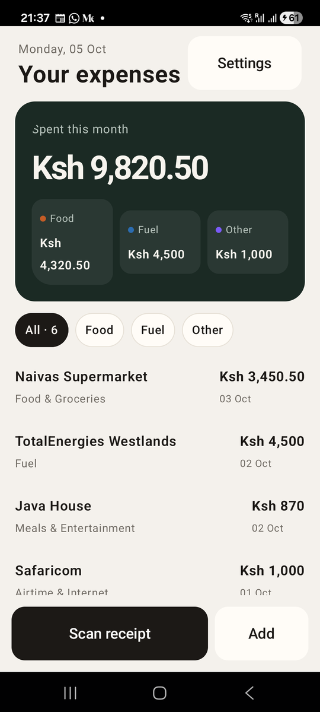
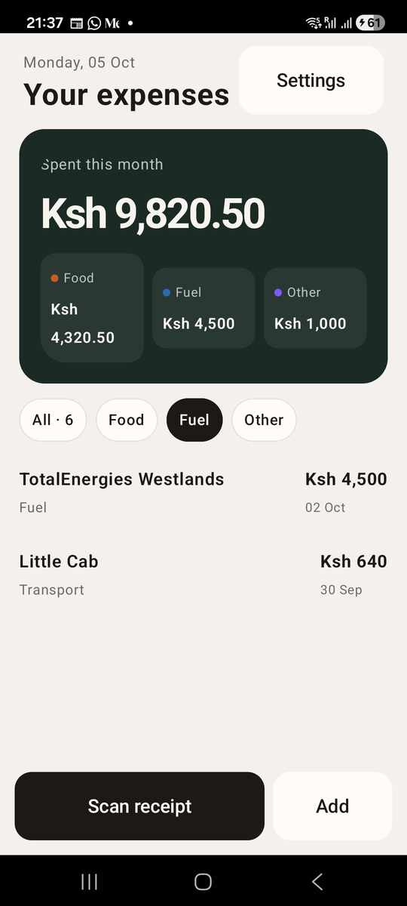

# Chapter 8: Lists That Scroll

Previously, we gave Risiti its paper-and-ink theme and a dark green spend
card. But the card's numbers are made up, and the receipts are three
hard-coded buttons. A real expense book has hundreds of receipts, and the
list is what people open Risiti for. In this chapter we build it properly.

Lists are the heart of most mobile apps. Your messages, your contacts, your
M-Pesa statement, your photos: all lists. Getting them right matters more
than almost anything else on a phone.

By the end of this chapter, you will know:

- Why a long list needs a special component on a phone.
- How to show a list of Elixir data with `<List>` and a row renderer.
- How to react when the user taps a row.
- How to filter a list with a row of pills.
- Why money is never a float.

## Why lists are special

On the web, you can render a thousand rows into a table and the browser will
cope. On a phone, every row is a real native view that takes memory, and a
cheap Android phone with a thousand of them will stutter when you scroll.

Native apps solve this with **lazy lists**: only the rows that are actually
on screen (plus a few above and below) exist as views. As you scroll, rows
that leave the screen are recycled for the rows coming in. Android calls
this a `LazyColumn`.

Mob gives us that through `<List>`. You hand it your Elixir data and a
function that draws one row, and Mob draws only what's visible.

## The expense book

Before we can list receipts, we need some, and we need the sums for the
spend card. We'll get a database in Chapter 12; until then, let's keep
sample receipts in the module that will later own the database. In the real
Risiti that module is `RisitiApp.Transactions`, "the expense book". Create
`lib/risiti_app/transactions.ex`:

```elixir
# lib/risiti_app/transactions.ex
defmodule RisitiApp.Transactions do
  @moduledoc """
  The expense book. For now the receipts are hard-coded; Chapter 12 moves
  them into SQLite without changing what the screens call.
  """

  # Nairobi is UTC+3 all year (no daylight saving), so "today" can be computed
  # without a timezone database, which the phone's runtime doesn't ship.
  @nairobi_offset 3 * 60 * 60

  # The spend card and the filter pills group the categories three ways.
  @groups [
    food: ["Food & Groceries", "Meals & Entertainment"],
    fuel: ["Fuel", "Transport"]
  ]

  @sample [
    %{id: 1, date: ~D[2026-10-03], vendor: "Naivas Supermarket", category: "Food & Groceries", amount_cents: 345_050},
    %{id: 2, date: ~D[2026-10-02], vendor: "TotalEnergies Westlands", category: "Fuel", amount_cents: 450_000},
    %{id: 3, date: ~D[2026-10-02], vendor: "Java House", category: "Meals & Entertainment", amount_cents: 87_000},
    %{id: 4, date: ~D[2026-10-01], vendor: "Safaricom", category: "Airtime & Internet", amount_cents: 100_000},
    %{id: 5, date: ~D[2026-09-30], vendor: "Little Cab", category: "Transport", amount_cents: 64_000},
    %{id: 6, date: ~D[2026-09-29], vendor: "Text Book Centre", category: "Office Supplies", amount_cents: 75_000}
  ]

  def groups, do: [:food, :fuel, :other]

  @doc "The spending group a category belongs to: :food, :fuel or :other."
  def group(category) do
    Enum.find_value(@groups, :other, fn {group, categories} ->
      if category in categories, do: group
    end)
  end

  def group_label(:food), do: "Food"
  def group_label(:fuel), do: "Fuel"
  def group_label(:other), do: "Other"

  @doc "Every receipt, newest first, narrowed to a group unless it's `:all`."
  def list_transactions(filter \\ :all)
  def list_transactions(:all), do: Enum.sort_by(@sample, & &1.date, {:desc, Date})

  def list_transactions(group),
    do: Enum.filter(list_transactions(:all), &(group(&1.category) == group))

  def get_transaction(id), do: Enum.find(@sample, &(&1.id == id))

  @doc "Today's date in Kenya."
  def today do
    DateTime.utc_now() |> DateTime.add(@nairobi_offset, :second) |> DateTime.to_date()
  end

  @doc "For the spend card: what was spent in `month`, in total and per group."
  def summary(month \\ today()) do
    in_month =
      Enum.filter(@sample, &(&1.date.year == month.year and &1.date.month == month.month))

    by_group =
      Map.new(groups(), fn group ->
        {group, for(t <- in_month, group(t.category) == group, do: t.amount_cents) |> Enum.sum()}
      end)

    %{total: by_group |> Map.values() |> Enum.sum(), by_group: by_group, count: length(@sample)}
  end

  @doc "Cents as shillings: 345_050 -> \"Ksh 3,450.50\"."
  def format_amount(cents) do
    shillings =
      div(cents, 100)
      |> Integer.to_string()
      |> String.reverse()
      |> String.replace(~r/.{3}(?=.)/, "\\0,")
      |> String.reverse()

    "Ksh #{shillings}.#{cents |> rem(100) |> Integer.to_string() |> String.pad_leading(2, "0")}"
  end

  @doc "Like `format_amount/1`, without the cents when there are none: \"Ksh 4,500\"."
  def format_short(cents) do
    amount = format_amount(cents)
    if String.ends_with?(amount, ".00"), do: String.slice(amount, 0..-4//1), else: amount
  end
end
```

Nothing here is specific to Mob, which is the point. The screens will only
call `list_transactions/1`, `get_transaction/1`, `summary/0` and the
formatting functions. When the sample list becomes a SQLite table in
Chapter 12, the screens won't notice.

A few decisions are worth explaining.

**Money is in cents.** Ksh 3,450.50 is `345_050`. Never store money as a
float: `0.1 + 0.2` is not `0.3` in any language that uses floating point,
Elixir included, and a month of receipts adds up thousands of them. Whole
cents add up exactly. We'll keep that rule for the whole book, on the phone
and on the server.

**Ten categories, three groups.** A receipt has one of ten categories, from
"Food & Groceries" to "Office Supplies". Ten is too many for a glance, so
the spend card groups them three ways: food, fuel (which includes
transport) and everything else. `group/1` decides which group a category
belongs to.

**Today is Nairobi's today.** The phone's BEAM has no timezone database, so
`Date.utc_today/0` would turn over at 3 a.m. in Kenya. Nairobi is UTC+3 all
year, so we add three hours to UTC and take the date.

**The spend card is one month.** `summary/1` adds up the current month only,
per group. The `count` is every receipt, for the "All" pill.

**`format_short/1` drops ".00".** "Ksh 4,500" reads better than "Ksh
4,500.00" on a card, but "Ksh 3,450.50" keeps its cents.

## The list screen

Now the receipts screen. Here is the new `render/1` and the functions it
uses; the full file is in `code/08/`:

```elixir
# lib/risiti_app/screens/receipts_screen.ex
defmodule RisitiApp.Screens.ReceiptsScreen do
  use Mob.Screen

  alias RisitiApp.{Theme, Transactions}

  @impl Mob.Screen
  def mount(_params, _session, socket) do
    socket =
      socket
      |> Mob.Socket.assign(:group, :all)
      |> Mob.List.put_renderer(:receipts, &receipt_row/1)
      |> load_receipts()

    {:ok, socket}
  end

  defp load_receipts(socket) do
    Mob.Socket.assign(socket,
      items: Transactions.list_transactions(socket.assigns.group),
      summary: Transactions.summary()
    )
  end

  @impl Mob.Screen
  def render(assigns) do
    ~MOB"""
    <Column background={:background} fill_width={true} fill_height={true}>
      <Row padding_left={22} padding_right={22} padding_top={12} padding_bottom={14}>
        <Column weight={1}>
          <Text
            text={Calendar.strftime(Transactions.today(), "%A, %d %b")}
            text_size={13}
            text_color={:muted}
          />
          <Text text="Your expenses" text_size={26} font_weight="bold" text_color={:on_background} />
        </Column>
        <Button ... Settings, as before ... />
      </Row>
      <Column padding_left={18} padding_right={18} padding_bottom={14}>
        {spend_card(@summary)}
      </Column>
      {chips(@group, @summary.count)}
      <Spacer size={10} />
      <List id={:receipts} items={@items} weight={1} padding_left={18} padding_right={18} />
      <Row padding={14} gap={8}>
        ... the dock, as before ...
      </Row>
    </Column>
    """
  end
```

Let's go through what changed.

### The header shows today

```elixir
text={Calendar.strftime(Transactions.today(), "%A, %d %b")}
```

"Monday, 05 Oct" is now today's date in Kenya. `Calendar.strftime/2` is in
Elixir's standard library; no extra package needed.

### The spend card adds up real numbers

The card moved into its own function, `spend_card/1`, which takes the
summary:

```elixir
  defp spend_card(summary) do
    ~MOB"""
    <Box
      background={Theme.color(:spend_card)}
      corner_radius={:radius_lg}
      padding={20}
      fill_width={true}
    >
      <Column>
        <Text text="Spent this month" text_size={13} text_color={Theme.color(:spend_muted)} />
        <Spacer size={10} />
        <Text
          text={Transactions.format_short(summary.total)}
          text_size={36}
          font_weight="bold"
          letter_spacing={-1.8}
          text_color={Theme.color(:spend_text)}
        />
        <Spacer size={14} />
        <Row gap={8}>
          {Enum.map(Transactions.groups(), &split_cell(&1, summary.by_group[&1]))}
        </Row>
      </Column>
    </Box>
    """
  end
```

`split_cell/2` now takes a group and an amount in cents, and gets its label
from `Transactions.group_label/1` and its text from `format_short/1`.

Note that the card is no longer inside a `<Scroll>`. In Chapter 6 the whole
middle of the screen scrolled. Now the list does its own scrolling, so the
card stays put above it, the way it does in the real app.

### The list and its renderer

```elixir
|> Mob.List.put_renderer(:receipts, &receipt_row/1)
```

In `mount/3`, we register a **renderer** for the list with the ID
`:receipts`. A renderer is a function that takes one item and returns the UI
for its row. Mob calls it only for the rows it is about to show.

```elixir
  # One receipt in the list: vendor over category on the left, amount over
  # date on the right.
  defp receipt_row(receipt) do
    ~MOB"""
    <Row padding_top={12} padding_bottom={12} gap={12}>
      <Column weight={1}>
        <Text
          text={receipt.vendor}
          text_size={15}
          font_weight="semibold"
          text_color={:on_background}
          max_lines={1}
        />
        <Text text={receipt.category} text_size={12} text_color={:muted} max_lines={1} />
      </Column>
      <Column>
        <Text
          text={Transactions.format_short(receipt.amount_cents)}
          text_size={15}
          font_weight="bold"
          text_color={:on_background}
        />
        <Text text={Calendar.strftime(receipt.date, "%d %b")} text_size={11} text_color={:muted} />
      </Column>
    </Row>
    """
  end
```

The left column has `weight={1}`, so it takes all the width the amount
doesn't need, which pushes the amount to the right edge. `max_lines={1}`
stops a long vendor name, like "TotalEnergies Westlands Service Station",
from wrapping onto a second line and making that row taller than the rest.

```elixir
<List id={:receipts} items={@items} weight={1} padding_left={18} padding_right={18} />
```

`id` connects the list to its renderer. `items` is the data, any list of
Elixir terms. And `weight={1}` gives the list all the height between the
pills and the dock.

If you don't register a renderer, Mob still shows the list: a string becomes
a row of text, and a map with a `:label` or `:text` key shows that key. It's
handy for a quick prototype; for anything real, write a renderer.

Don't put a `List` inside a `Scroll`. A lazy list needs a fixed height to
know how many rows fit on screen, and inside a scroll its height has no
limit. On Android that layout fails outright.

### Tapping a row

```elixir
  def handle_info({:select, :receipts, index}, socket) do
    receipt = Enum.at(socket.assigns.items, index)

    {:noreply,
     Mob.Socket.push_screen(socket, RisitiApp.Screens.ReceiptFormScreen, %{id: receipt.id})}
  end
```

Mob makes every row tappable. When the user taps one, the screen gets
`{:select, list_id, index}`: the list's ID and the position of the row. We
look the receipt up by its index in the same `@items` the list is showing,
and push the form with its ID, exactly as in Chapter 5. The
`{:open_receipt, id}` buttons are gone.

The form can show the real vendor now. In `receipt_form_screen.ex`:

```elixir
  def mount(params, _session, socket) do
    # Opened with %{id: id} to edit a receipt, or with no params for a new one.
    receipt = if id = params[:id], do: RisitiApp.Transactions.get_transaction(id)
    {:ok, Mob.Socket.assign(socket, :receipt, receipt)}
  end
```

```elixir
  defp title(nil), do: "New receipt"
  defp title(receipt), do: receipt.vendor
```

## Filtering with pills

A row of pills under the card narrows the list: All, Food, Fuel, Other.

```elixir
  # All / Food / Fuel / Other. The strip scrolls sideways in case a large
  # font size pushes the last pill off the screen.
  defp chips(active, count) do
    pills =
      [
        {:all, "All · #{count}"}
        | Enum.map(Transactions.groups(), &{&1, Transactions.group_label(&1)})
      ]
      |> Enum.map(fn {group, label} -> chip(group, label, group == active) end)

    ~MOB"""
    <Scroll axis="horizontal" fill_width={true}>
      <Row padding_left={18} padding_right={18} gap={8}>
        {pills}
      </Row>
    </Scroll>
    """
  end

  defp chip(group, label, active?) do
    {background, text_color} =
      if active?, do: {:on_background, :background}, else: {:surface, :on_surface}

    ~MOB"""
    <Row
      background={background}
      border_color={if(active?, do: :on_background, else: :border)}
      border_width={1}
      corner_radius={:radius_pill}
      padding_left={12}
      padding_right={12}
      padding_top={7}
      padding_bottom={7}
      on_tap={{self(), {:group, group}}}
    >
      <Text text={label} text_size={13} font_weight="medium" text_color={text_color} />
    </Row>
    """
  end
```

Three things are new here.

**A sideways scroll.** `axis="horizontal"` makes a `Scroll` scroll left and
right. Four pills fit on most phones, but someone with large text turned on
would lose the last one off the edge. Now they can swipe to it.

**Anything can be tapped.** A pill isn't a `<Button>`; it's a `Row` with a
border, a pill radius and an `on_tap`. Any container can take `on_tap`,
which lets you build exactly the control you want. Risiti's pills and its
spend card's month picker are all built this way.

**Inverted colours for the selected pill.** The active pill swaps the
background and text colours: `:on_background` behind `:background` text.
In the light theme that's an ink pill with paper text; in the dark theme,
the opposite. No new colour needed.

And the handler:

```elixir
  def handle_info({:tap, {:group, group}}, socket) do
    {:noreply, socket |> Mob.Socket.assign(:group, group) |> load_receipts()}
  end
```

Changing the group reloads the items through `load_receipts/1`, the same
function `mount/3` uses. One function that loads everything the screen
shows, called from wherever the data might change, is a pattern you'll see
all through the real `ReceiptsScreen`.

## Run it

```
mix mob.deploy --device YOUR_DEVICE_ID
```



The total and the three groups now add up the October receipts. Tap
**Fuel**:



## Testing lists

A `<List>` doesn't render its rows in `render/1`; Mob expands them later,
just before drawing. So to see the rows in a test, we expand the list the
way Mob does. Change `test/risiti_app/screens/receipts_screen_test.exs`:

```elixir
# test/risiti_app/screens/receipts_screen_test.exs
defmodule RisitiApp.Screens.ReceiptsScreenTest do
  use Mob.ScreenCase

  alias RisitiApp.Screens.{ReceiptFormScreen, ReceiptsScreen, SettingsScreen}

  # A <List> renders its rows lazily, so expand it the way Mob does on the
  # device before asking what text is on screen.
  defp rows(view) do
    view |> tree() |> Mob.List.expand(view.socket.__mob__.list_renderers, self())
  end

  test "shows the month's spend and every receipt" do
    view = mount_screen(ReceiptsScreen)

    assert text(rows(view)) =~ "Spent this month"
    assert text(rows(view)) =~ RisitiApp.Transactions.format_short(assigns(view).summary.total)
    assert text(rows(view)) =~ "Naivas Supermarket"
    assert text(rows(view)) =~ "Ksh 3,450.50"
    assert_renderable(rows(view))
  end

  test "the Fuel pill keeps only fuel and transport" do
    view = ReceiptsScreen |> mount_screen() |> render_info({:tap, {:group, :fuel}})

    assert Enum.map(assigns(view).items, & &1.vendor) == ["TotalEnergies Westlands", "Little Cab"]
  end

  test "selecting a row opens that receipt" do
    view = ReceiptsScreen |> mount_screen() |> render_info({:select, :receipts, 1})

    assert navigated_to(view) == ReceiptFormScreen
    assert {:push, ReceiptFormScreen, %{id: 2}} = view.socket.__mob__.nav_action
  end

  test "the form shows the receipt it was given" do
    assert text(mount_screen(ReceiptFormScreen, %{id: 2})) =~ "TotalEnergies Westlands"
    assert text(mount_screen(ReceiptFormScreen)) =~ "New receipt"
  end

  test "Add and Settings open their screens" do
    view = ReceiptsScreen |> mount_screen() |> render_info({:tap, :add_manual})
    assert navigated_to(view) == ReceiptFormScreen

    view = ReceiptsScreen |> mount_screen() |> render_info({:tap, :open_settings})
    assert navigated_to(view) == SettingsScreen
  end
end
```

Note the first test doesn't hard-code the month's total. The spend card
adds up *this* month, and "this month" changes; a test that says
"Ksh 9,820.50" would fail on the first of November. Instead it checks that
whatever `summary/0` says is what the card shows.

The arithmetic itself gets a plain ExUnit test, with a fixed month. Create
`test/risiti_app/transactions_test.exs`:

```elixir
# test/risiti_app/transactions_test.exs
defmodule RisitiApp.TransactionsTest do
  use ExUnit.Case, async: true

  alias RisitiApp.Transactions

  test "group/1 sorts categories into food, fuel and other" do
    assert Transactions.group("Meals & Entertainment") == :food
    assert Transactions.group("Transport") == :fuel
    assert Transactions.group("Rent") == :other
  end

  test "summary/1 adds up one month, per group" do
    summary = Transactions.summary(~D[2026-10-01])

    assert summary.total == 982_050
    assert summary.by_group == %{food: 432_050, fuel: 450_000, other: 100_000}
  end

  test "format_amount/1 and format_short/1 show shillings" do
    assert Transactions.format_amount(345_050) == "Ksh 3,450.50"
    assert Transactions.format_amount(5) == "Ksh 0.05"
    assert Transactions.format_short(450_000) == "Ksh 4,500"
    assert Transactions.format_short(345_050) == "Ksh 3,450.50"
  end
end
```

```
mix test
```

## A tip: `mix format` knows `~MOB`

The generated `.formatter.exs` includes `Mob.Formatter`, so `mix format`
formats your `~MOB` templates too: it breaks long tags into one attribute per
line, the way you've seen in some of the code above. Run it before you
commit and you'll never argue about template layout again.

## What we have so far

- `RisitiApp.Transactions`, with sample receipts, groups and money in cents.
- A spend card that adds up this month's receipts.
- A lazy `<List>` of receipts with a row renderer, and rows that open the
  form.
- Filter pills built from plain rows.

The code at the end of this chapter is in `code/08/`.

The receipts screen is getting long, and the real Risiti uses the same
header and the same receipt card on other screens too. In the next chapter
we'll turn them into components.
