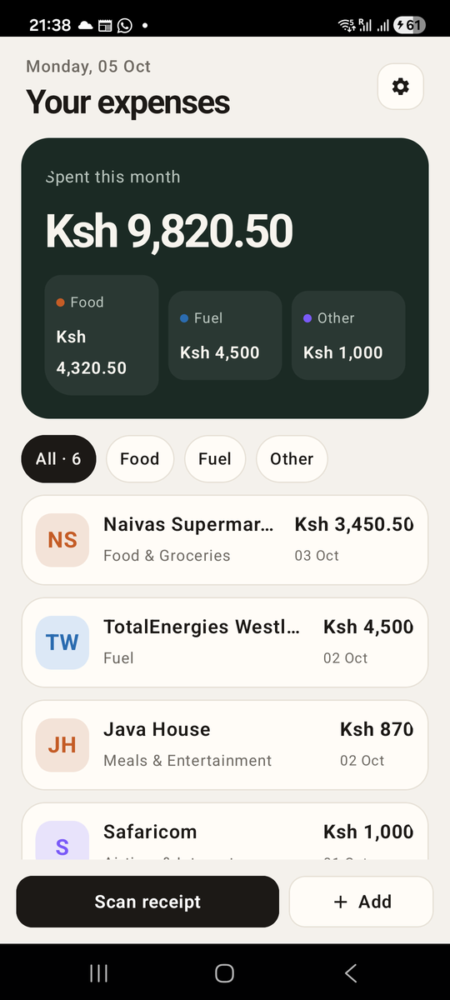

# Chapter 9: Components of Your Own

Previously, we built the receipts list, the spend card and the filter pills.
The receipts screen is now long, and some of what's in it isn't really about
receipts. Its header (a small date over a big title, with a button on the
right) is what every Risiti screen wants at the top. The receipt row is
what the approvals inbox will show too, later in the book. And the dock's
buttons are plain Material buttons, which look out of place on paper.

In this chapter we'll pull those out into components, the same three the
real Risiti uses: `Header`, `TransactionItem` and `ActionButton`. When we're
done, the top of a screen reads like this:

```elixir
<Header title="Settings" show_back={true} />
```

In Phoenix you'd reach for function components and `attr`. Mob has two ways
to share UI, and we've already used the first one without naming it.

By the end of this chapter, you will know:

- When a plain helper function is enough.
- How to write a **composite**, your own tag that works in `~MOB`.
- How to register your tags so Mob and the compiler know about them.
- How to use a composite inside a list.
- How to test a component on its own.

## Way one: a function that returns UI

In Chapter 7 we wrote `appearance_button/3`, and in Chapter 8
`receipt_row/1`, `chip/3` and `split_cell/2`. Each is an ordinary function
that returns `~MOB`. Because `~MOB` is just data, a function returning it is
a component already:

```elixir
{appearance_button("Light", :light, @appearance)}
```

That's the right tool when the piece of UI belongs to one screen, and it's
fine across screens too, as a function in a shared module. Risiti's
`ActionButton` is exactly that.

## Way two: a composite

A **composite** is a tag you define yourself. You write it in `~MOB` like
any built-in tag, and at render time Mob replaces it with the tree your
function returns. No native code is involved: a composite always expands to
the built-in components we already know.

```
<Header title="Settings" show_back={true} />
            │
            ▼  RisitiApp.Components.Header.expand/3
<Row padding_left={22} ...>
  <Box ...><Icon name="back" /></Box>
  <Column weight={1}><Text text="Settings" ... /></Column>
</Row>
```

A composite is a module with one function, `expand/3`:

```elixir
def expand(props, children, ctx)
```

- `props` is a map of the tag's attributes: `%{title: "Settings", show_back: true}`.
- `children` are the nodes between the opening and closing tags, if any.
- `ctx` holds the screen's pid and the platform, for the rare composite
  that needs them.

It returns a node, usually written with `~MOB`.

Composites read best for big, structural pieces that a screen is *made
of*, like a header. Helper functions read best for small pieces you call
with a few arguments, like a button.

## The header

Create `lib/risiti_app/components/header.ex`:

```elixir
# lib/risiti_app/components/header.ex
defmodule RisitiApp.Components.Header do
  @moduledoc """
  Screen header: a small muted kicker over a large title, with optional square
  icon buttons for going back and for actions on the right.

      <Header title="Settings" show_back={true} />
      <Header kicker="Monday, 05 Oct" title="Your expenses" actions={[{"settings", "Settings", :open_settings}]} />

  Each action is `{icon, accessibility_label, tag}`. Taps arrive as
  `{:tap, :back}` and `{:tap, tag}`.
  """

  import Mob.Sigil

  def expand(props, _children, _ctx) do
    title = Map.fetch!(props, :title)
    kicker = Map.get(props, :kicker)
    show_back = Map.get(props, :show_back, false)

    actions =
      props
      |> Map.get(:actions, [])
      |> Enum.map(fn {icon, label, tag} -> icon_button(icon, label, {self(), tag}) end)

    ~MOB"""
    <Row
      fill_width={true}
      padding_top={12}
      padding_left={22}
      padding_right={22}
      padding_bottom={14}
      gap={8}
    >
      {if show_back, do: icon_button("back", "Back", {self(), :back})}
      <Column weight={1}>
        <Text :if={kicker} text={kicker} text_size={13} text_color={:muted} font_weight="medium" />
        <Text
          text={title}
          text_size={26}
          font_weight="bold"
          letter_spacing={-1}
          text_color={:on_background}
          max_lines={2}
        />
      </Column>
      {actions}
    </Row>
    """
  end

  @doc "A 40×40 bordered square holding one icon."
  def icon_button(icon, label, on_tap) do
    ~MOB"""
    <Box
      width={40}
      height={40}
      corner_radius={14}
      background={:surface}
      border_color={:border}
      border_width={1}
      align={:center}
      on_tap={on_tap}
      accessibility_label={label}
    >
      <Icon name={icon} text_size={18} text_color={:on_surface} />
    </Box>
    """
  end
end
```

Here is what's going on.

A composite isn't a screen, so there's no `use Mob.Screen`. We
`import Mob.Sigil` to get `~MOB`.

`Map.fetch!(props, :title)` makes the title required: a `<Header />` without
one fails loudly. `Map.get/3` with a default makes the rest optional. These
lines play the role of `attr` in a Phoenix function component, and the
moduledoc is the documentation `attr` would give you.

**Actions as data.** The buttons on the right are a list of
`{icon, accessibility_label, tag}` tuples. The receipts screen passes one
(Settings); the real app's receipts screen passes three (search, approvals,
settings), depending on who's signed in. The header doesn't need to know.

**Icons.** `<Icon name="back" />` draws one of the icons built into Mob.
The built-in set is small, 29 icons in Mob 0.9.12: `"back"`, `"close"`,
`"settings"`, `"add"`, `"edit"`, `"check"`, `"trash"`, `"search"`,
`"share"`, `"expand_more"`, `"user"`, `"home"` and a few more. A name that
isn't in the set draws as a question mark, which is easy to miss in a test
and obvious on the phone. There's no camera or lock icon, so Risiti's
**Scan receipt** and **Unlock** buttons are words alone for now. The real
Risiti added its own icons by changing Mob's Android code, which we'll learn
to do in Part II.

**Accessibility.** An icon has no text for a screen reader to read, so every
icon button gets an `accessibility_label`. Android's TalkBack reads "Back,
button" instead of nothing. It costs one prop; always add it.

**`self()` in a composite.** The back button sends `{:tap, :back}` to
`self()`. Mob expands composites inside the screen's own process, so
`self()` is the screen that used the header. That's why the screens'
existing `handle_info({:tap, :back}, socket)` clauses keep working.

## The receipt card

Create `lib/risiti_app/components/transaction_item.ex`:

```elixir
# lib/risiti_app/components/transaction_item.ex
defmodule RisitiApp.Components.TransactionItem do
  @moduledoc """
  A transaction as a list card: a tinted badge with the vendor's initials, the
  vendor over its category, and the amount over the date.

      <TransactionItem transaction={transaction} />
  """

  import Mob.Sigil

  alias RisitiApp.{Theme, Transactions}

  def expand(props, _children, _ctx) do
    transaction = Map.fetch!(props, :transaction)
    group = Transactions.group(transaction.category)

    ~MOB"""
    <Column fill_width={true} padding_bottom={10}>
      <Box
        background={:surface}
        border_color={:border}
        border_width={1}
        corner_radius={20}
        padding={12}
        fill_width={true}
      >
        <Row fill_width={true} align={:center} gap={12}>
          <Box
            width={46}
            height={46}
            corner_radius={14}
            background={Theme.color(:"#{group}_tint")}
            align={:center}
          >
            <Text
              text={initials(transaction.vendor)}
              text_color={Theme.color(group)}
              text_size={17}
              font_weight="bold"
            />
          </Box>
          <Column weight={1}>
            <Text
              text={transaction.vendor}
              text_size={15}
              font_weight="semibold"
              text_color={:on_surface}
              max_lines={1}
            />
            <Text text={transaction.category} text_size={12} text_color={:muted} max_lines={1} />
          </Column>
          <Column>
            <Text
              text={Transactions.format_short(transaction.amount_cents)}
              text_size={15}
              font_weight="bold"
              text_color={:on_surface}
            />
            <Text
              text={Calendar.strftime(transaction.date, "%d %b")}
              text_size={11}
              text_color={:muted}
            />
          </Column>
        </Row>
      </Box>
    </Column>
    """
  end

  @doc "Up to two capital letters: \"Java House\" -> \"JH\"."
  def initials(nil), do: "?"

  def initials(name) do
    name
    |> String.split(~r/[^[:alnum:]]+/u, trim: true)
    |> Enum.map_join(&String.first/1)
    |> String.slice(0, 2)
    |> String.upcase()
    |> case do
      "" -> "?"
      initials -> initials
    end
  end
end
```

The row from the last chapter becomes a card: a bordered `Box` with a badge
on the left. The badge shows the vendor's initials, "JH" for Java House, in
the group's colour on a pale tint of it. At a glance, orange is food, blue
is fuel and purple is everything else.

The tints are new colours, so add them to both maps in
`lib/risiti_app/theme.ex`:

```elixir
  @light %{
    ...
    food: 0xFFC45C26,
    food_tint: 0xFFF3E3D8,
    fuel: 0xFF2B6CB0,
    fuel_tint: 0xFFDCE8F6,
    other: 0xFF7A5AF8,
    other_tint: 0xFFE8E3FB
  }

  @dark %{
    ...
    food: 0xFFF0A477,
    food_tint: 0xFF3A2519,
    fuel: 0xFF7FB2E8,
    fuel_tint: 0xFF1A2A3D,
    other: 0xFFB3A1FF,
    other_tint: 0xFF2A2342
  }
```

`Theme.color(:"#{group}_tint")` builds the atom `:food_tint` from the group.
`initials/1` is public, because it's worth a test of its own: vendor names
are messy, and a name made only of punctuation must not crash the list.

## The action button

The last one is a helper, not a composite. Create
`lib/risiti_app/components/action_button.ex`:

```elixir
# lib/risiti_app/components/action_button.ex
defmodule RisitiApp.Components.ActionButton do
  @moduledoc """
  A compact icon-and-label button, in place of Material's roomy `Button`.

      ActionButton.button(nil, "Scan receipt", :take_photo, weight: 1)
      ActionButton.button("trash", "Delete", :delete, style: :danger)

  `icon` is one of Mob's built-in icon names, or nil for a label alone.

  Styles: `:primary` (ink, the default), `:secondary` (bordered surface) and
  `:danger`. Taps arrive as `{:tap, tag}`.
  """

  import Mob.Sigil

  def button(icon, label, tag, opts \\ []) do
    {background, content, border} = colors(Keyword.get(opts, :style, :primary))

    node = ~MOB"""
    <Box
      height={44}
      background={background}
      border_color={border}
      border_width={1}
      corner_radius={14}
      padding_left={14}
      padding_right={14}
      align={:center}
      on_tap={{self(), tag}}
      accessibility_label={label}
    >
      <Row align={:center} gap={6}>
        <Icon :if={icon} name={icon} text_size={18} text_color={content} />
        <Text text={label} text_size={14} font_weight="semibold" text_color={content} max_lines={1} />
      </Row>
    </Box>
    """

    # A Box fills its row on Android unless it is given a width or a weight.
    sizing = opts |> Keyword.take([:weight, :width]) |> Map.new()
    %{node | props: Map.merge(node.props, sizing)}
  end

  defp colors(:primary), do: {:primary, :on_primary, :primary}
  defp colors(:secondary), do: {:surface, :on_surface, :border}
  defp colors(:danger), do: {:error, :on_error, :error}
end
```

Note `<Icon :if={icon} ...>`: pass `nil` as the icon and the button is just
its label.

Look at the last two lines of `button/4`. The function builds the node with
`~MOB`, then *edits it*, merging `weight` or `width` into the outer box's
props. You can do that because the node is a plain map. That's the payoff of
UI as data: when the template language doesn't have a feature, Elixir does.

## Registering the composites

Mob needs to know that `<Header>` means `RisitiApp.Components.Header`.
Create `lib/risiti_app/components.ex`:

```elixir
# lib/risiti_app/components.ex
defmodule RisitiApp.Components do
  @moduledoc "Registers the app's own tags, so screens can write <Header /> and <TransactionItem />."

  @composites [
    header: RisitiApp.Components.Header,
    transaction_item: RisitiApp.Components.TransactionItem
  ]

  def register_all do
    Enum.each(@composites, fn {tag, module} ->
      Mob.Composite.register(tag, {module, :expand})
    end)
  end
end
```

The tag atom is the snake_case version of the tag name: `<TransactionItem>`
is `:transaction_item`, the same rule Mob uses for `<TabBar>` and `:tab_bar`.

Call it first thing in `on_start/0`, in `lib/risiti_app/app.ex`, before any
screen renders:

```elixir
  @impl Mob.App
  def on_start do
    RisitiApp.Components.register_all()

    Mob.DNS.configure_pure_beam()
    # ... the rest as before
```

There's one more place that needs to know. The `~MOB` sigil checks tag names
at compile time and warns about unknown ones, so a typo like `<Colum>` gets
caught early. Our tags are registered at runtime, so the compiler can't see
them. Tell it in `config/config.exs`:

```elixir
# Our own composite tags, so the ~MOB sigil knows them at compile time.
config :mob, :extra_tags, ~w(Header TransactionItem)
```

After changing `extra_tags`, run `mix compile --force` once so screens that
were already compiled pick it up.

## Using them

The receipts screen's `render/1` gets shorter:

```elixir
  @impl Mob.Screen
  def render(assigns) do
    ~MOB"""
    <Column background={:background} fill_width={true} fill_height={true}>
      <Header
        kicker={Calendar.strftime(Transactions.today(), "%A, %d %b")}
        title="Your expenses"
        actions={[{"settings", "Settings", :open_settings}]}
      />
      <Column padding_left={18} padding_right={18} padding_bottom={14}>
        {spend_card(@summary)}
      </Column>
      {chips(@group, @summary.count)}
      <Spacer size={10} />
      <List id={:receipts} items={@items} weight={1} padding_left={18} padding_right={18} />
      <Row padding={14} gap={8}>
        {ActionButton.button(nil, "Scan receipt", :take_photo, weight: 1)}
        {ActionButton.button("add", "Add", :add_manual, style: :secondary, width: 96)}
      </Row>
    </Column>
    """
  end
```

with these aliases at the top:

```elixir
  alias RisitiApp.{Theme, Transactions}
  alias RisitiApp.Components.{ActionButton, TransactionItem}
```

### A composite in a list

The list's renderer changes too, but not the way you might expect:

```elixir
      |> Mob.List.put_renderer(:receipts, &list_item/1)
```

```elixir
  # Each row of the list. Rows are expanded lazily, after composites, so the
  # renderer calls the component's expand/3 itself rather than returning a
  # <TransactionItem> tag.
  defp list_item(transaction), do: TransactionItem.expand(%{transaction: transaction}, [], %{})
```

Mob expands a screen's tree in a fixed order: composites first, then list
rows. A list row is made *after* composites have been expanded, so a
`<TransactionItem>` tag returned by a renderer would never be turned into a
card. The fix is to call `expand/3` yourself. A composite is just a
function, so that's no trouble. Delete the old `receipt_row/1`.

### The other screens

Settings and the receipt form get the header in place of their **Go Back**
buttons. In `settings_screen.ex`:

```elixir
    ~MOB"""
    <Scroll background={:background}>
      <Column>
        <Header title="Settings" show_back={true} />
        <Column padding_left={22} padding_right={22} gap={12}>
          <Text text="Appearance" text_size={13} font_weight="medium" text_color={:muted} />
          <Row gap={8}>
            {appearance_button("System", :system, @appearance)}
            {appearance_button("Light", :light, @appearance)}
            {appearance_button("Dark", :dark, @appearance)}
          </Row>
        </Column>
      </Column>
    </Scroll>
    """
```

The header brings its own padding, so it sits flush with the screen's edges,
and the content under it gets `padding_left` and `padding_right` of the same
22. Since a `Scroll` takes one child, the header and the content go inside a
`Column` together.

And in `receipt_form_screen.ex`:

```elixir
    ~MOB"""
    <Column background={:background} fill_height={true}>
      <Header title={title(@receipt)} show_back={true} />
    </Column>
    """
```

## Run it

```
mix mob.deploy --device YOUR_DEVICE_ID
```



The receipts are cards now, each with its coloured initials, and the dock
has Risiti's compact buttons. Open Settings, and its header matches.

## Testing components

A composite is just a function from props to a tree, so we can test it
directly, without a screen. Create `test/risiti_app/components_test.exs`:

```elixir
# test/risiti_app/components_test.exs
defmodule RisitiApp.ComponentsTest do
  use ExUnit.Case, async: true

  import Mob.ScreenCase, only: [text: 1, find: 3, assert_renderable: 1]

  alias RisitiApp.Components.{ActionButton, Header, TransactionItem}

  test "Header shows the kicker and title, and a back button only when asked" do
    header = Header.expand(%{kicker: "Monday", title: "Settings", show_back: true}, [], %{})

    assert text(header) =~ "Monday"
    assert text(header) =~ "Settings"
    assert find(header, :box, accessibility_label: "Back")
    refute find(Header.expand(%{title: "Settings"}, [], %{}), :box, accessibility_label: "Back")
    assert_renderable(header)
  end

  test "TransactionItem shows initials, vendor and the amount" do
    transaction = %{
      vendor: "Java House",
      category: "Meals & Entertainment",
      amount_cents: 87_000,
      date: ~D[2026-10-02]
    }

    card = TransactionItem.expand(%{transaction: transaction}, [], %{})

    assert text(card) =~ "JH"
    assert text(card) =~ "Java House"
    assert text(card) =~ "Ksh 870"
    assert_renderable(card)
  end

  test "initials/1 copes with odd names" do
    assert TransactionItem.initials("naivas") == "N"
    assert TransactionItem.initials("Mama Oliech's Restaurant") == "MO"
    assert TransactionItem.initials("!!!") == "?"
  end

  test "ActionButton takes a weight so two can share a row" do
    assert ActionButton.button(nil, "Scan receipt", :take_photo, weight: 1).props.weight == 1
  end
end
```

Note how the header test finds the back button: by its
`accessibility_label`. The label you add for screen readers doubles as a
stable handle for tests.

The screen tests need one change. A screen's `render/1` returns the tree
*before* composites are expanded, so `text(view)` would see a `:header`
node and not the title inside it. On the phone, Mob expands composites
first, then lists. Let's write a helper that does the same, and use it in
every screen test. Change `test/test_helper.exs`:

```elixir
# test/test_helper.exs
RisitiApp.Components.register_all()

defmodule RisitiApp.ScreenHelpers do
  @moduledoc "Expands a screen's tree the way Mob does on the device."

  import Mob.ScreenCase, only: [tree: 1]

  def rendered(view) do
    renderers = view.socket.__mob__[:list_renderers] || %{}

    view
    |> tree()
    |> Mob.Composite.expand(self())
    |> Mob.List.expand(renderers, self())
  end
end

ExUnit.start()
```

Two things happen here. We register our tags before the tests run, as
`on_start/0` does on the phone. And `rendered/1` expands composites, then
lists, in the same order Mob does. It replaces the `rows/1` helper from the
last chapter.

Then, in each screen test, `import RisitiApp.ScreenHelpers` and ask questions
of `rendered(view)` instead of `view`:

```elixir
  test "shows the month's spend and every receipt" do
    view = mount_screen(ReceiptsScreen)

    assert text(rendered(view)) =~ "Spent this month"
    assert text(rendered(view)) =~ "Naivas Supermarket"
    assert_renderable(rendered(view))
  end
```

`assert_renderable(rendered(view))` is the most useful check of all now: it
proves that after expansion, every node is something the phone can draw.

```
mix test
```

## What about stateful components?

Composites are stateless by design: they turn props into UI, and any state
lives in the screen. That covers almost everything you'll build.

Mob also has `Mob.Component`, for the rare case where a piece of UI needs
its own process and its own native view written in Kotlin or Swift. We'll
write native code of our own in Part II; until then, you won't need it.

## What we have so far

- `Header` and `TransactionItem`, our own tags, and `ActionButton`, a shared
  helper: the same three components the real Risiti is built from.
- Receipt cards with coloured initials, and a dock of compact buttons.
- Component tests, and a `rendered/1` helper that expands trees the way the
  phone does.

The code at the end of this chapter is in `code/09/`.

We've been writing tests since Chapter 3, a few lines at a time. In the next
chapter, we'll step back and look at testing a Mob app properly: what to
test in the BEAM, what only a real phone can prove, and how to keep the
suite fast.
