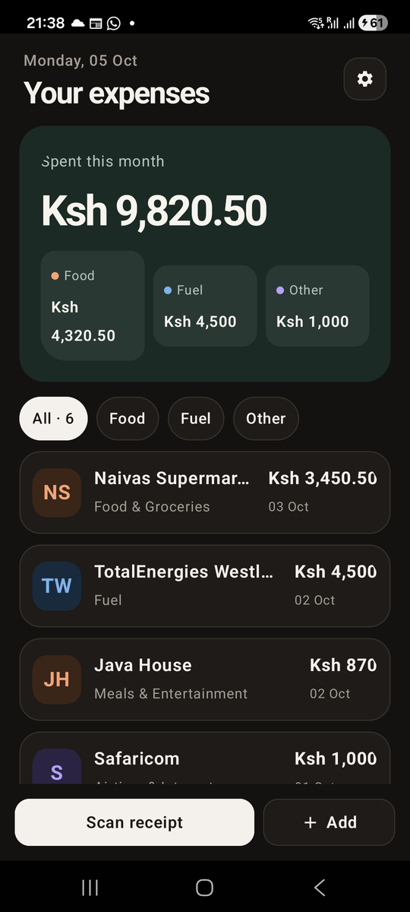

# Chapter 11: Remembering Things

Previously, we looked at testing a Mob app from the BEAM up to the real
phone. Now let's fix the bug we left in Chapter 7. The user chooses Dark,
closes the app, opens it again, and it's back to Light. Our app forgets
everything the moment it closes.

On the web, that's rarely your problem: state lives on the server and in
the database. A mobile app is different. The operating system can kill it
whenever it likes (to free memory, after an update, or because the user
swiped it away), and when it comes back, the BEAM starts from scratch.
Anything the app should remember has to be on disk.

By the end of this chapter, you will know:

- The three places a Mob app keeps state, and which to use when.
- How to read and write `Mob.State`.
- How to apply a saved setting before the first screen appears.

## Three kinds of state

| Where | Lives until | Good for |
|---|---|---|
| **Assigns** on the socket | The screen closes or crashes | What this screen is showing and doing right now: form input, the selected tab, a loading flag. |
| **`Mob.State`** | The app is uninstalled | A few dozen small settings: the theme, "onboarding done", the last tab opened, a cached user ID. |
| **SQLite**, through Ecto | The app is uninstalled | Records: anything you'd list, search, filter or count. Receipts, refunds, people. |

The question I ask is: *is this a setting, or is it data?* A setting has one
value and you look it up by name. Data has many rows and you query it. The
appearance choice is a setting, so it goes in `Mob.State`. Receipts are
data, so they go in SQLite, which is the next chapter.

There's a second question in Risiti: *does it belong to the phone or to the
person?* Later in the book, one phone can hold more than one person's
receipt book, each with its own settings stored in the database. But light
or dark is about the phone and the eyes looking at it, so it stays in
`Mob.State` even then.

## Meet `Mob.State`

`Mob.State` is a persistent key-value store. It's built on DETS, the
disk-based term storage that ships with Erlang/OTP, so any Elixir term can be
a value, atoms, maps, tuples, with no serialisation step:

```elixir
Mob.State.put(:appearance, :dark)
Mob.State.get(:appearance, :system)  #=> :dark
Mob.State.get(:missing, 0)           #=> 0
Mob.State.delete(:appearance)
```

`get/2` takes a default, returned when the key has never been set. There's
nothing to start or configure: Mob starts `Mob.State` before it calls your
`on_start/0`, and keeps its file in the app's private data folder on the
phone.

Every `put/2` writes to disk, so the value survives even if the app is
killed a moment later. That makes it perfect for small values the user
changes once in a while. Don't use it for something that changes on every
keystroke, or for thousands of entries.

## An Appearance module

We could call `Mob.State` straight from the Settings screen. But the saved
choice is needed in two places: Settings, to show which option is selected,
and `on_start/0`, to set the theme when the app starts. When two places need
the same rule, give the rule a module.

Create `lib/risiti_app/appearance.ex`:

```elixir
# lib/risiti_app/appearance.ex
defmodule RisitiApp.Appearance do
  @moduledoc """
  Light / dark / follow-the-system theme choice, saved in `Mob.State` so it
  survives a restart.

  `Mob.Theme.AdaptiveWatcher` re-applies its registered "adaptive" theme
  whenever the phone's appearance flips. Registering the user's choice there
  (rather than always `RisitiApp.Theme.Adaptive`) keeps an explicit Light or
  Dark choice from being overridden when the phone switches.
  """

  alias Mob.Theme.AdaptiveWatcher

  @modes [:system, :light, :dark]
  @key :appearance

  def modes, do: @modes

  @doc "The saved choice, `:system` until the user picks one."
  def current do
    case Mob.State.get(@key, :system) do
      mode when mode in @modes -> mode
      _ -> :system
    end
  end

  @doc "Saves `mode` and applies it immediately."
  def choose(mode) when mode in @modes do
    :ok = Mob.State.put(@key, mode)
    apply_mode(mode)
  end

  @doc "Applies the saved choice. Called once at boot."
  def apply_saved, do: apply_mode(current())

  def label(:system), do: "System"
  def label(:light), do: "Light"
  def label(:dark), do: "Dark"

  defp apply_mode(mode) do
    theme = theme_module(mode)
    AdaptiveWatcher.register_adaptive(theme)
    Mob.Theme.set(theme)
  end

  defp theme_module(:system), do: RisitiApp.Theme.Adaptive
  defp theme_module(:light), do: RisitiApp.Theme.Light
  defp theme_module(:dark), do: RisitiApp.Theme.Dark
end
```

This is the module the real Risiti uses, line for line. Let's break it down.

**`current/0` defends itself.** It reads the saved mode with `:system` as
the default for a fresh install, and the `case` falls back to `:system` for
anything it doesn't recognise. Why would there be anything else? Because
`Mob.State` outlives your code. If a future version renamed `:dark` to
`:night`, a phone updated from the old version would still have `:dark` on
disk. Data on a phone is the one thing a deploy can't fix, so code that
reads it should never trust it blindly.

**`choose/1` saves and applies together.** No screen can do one and forget
the other. The guard `when mode in @modes` rejects anything we don't know
how to theme, so a typo like `:drak` crashes here, loudly, instead of saving
garbage that breaks the next launch.

**The adaptive watcher.** Here's a subtle bug we're avoiding. Mob runs a
small process, `Mob.Theme.AdaptiveWatcher`, that listens for the phone
switching between light and dark (at sunset, say) and re-applies the app's
"adaptive" theme when it does. If that were always
`RisitiApp.Theme.Adaptive`, a user who chose **Dark** would be switched to
light the next morning. So every time we apply a mode, we register *that*
mode's theme with the watcher. For **System**, that's `Adaptive`, which
follows the phone. For **Light** or **Dark**, it's a fixed theme, and the
watcher's re-apply changes nothing.

**`label/1`.** The words for each mode live next to the modes. The Settings
screen can now draw its buttons from `modes/0` and `label/1`, so adding a
mode would be a one-module change.

## Using it in Settings

In `lib/risiti_app/screens/settings_screen.ex`, add `alias
RisitiApp.Appearance` and start from the saved choice:

```elixir
  @impl Mob.Screen
  def mount(_params, _session, socket) do
    {:ok, Mob.Socket.assign(socket, :appearance, Appearance.current())}
  end
```

Draw the buttons from the module:

```elixir
          <Row gap={8}>
            {Enum.map(Appearance.modes(), &appearance_button(&1, @appearance))}
          </Row>
```

```elixir
  defp appearance_button(mode, current) do
    ...
      accessibility_label={"Appearance: #{Appearance.label(mode)}"}
    >
      <Text
        text={Appearance.label(mode)}
        ...
```

The pill itself is the same `Box` as in Chapter 7; only the label now comes
from `Appearance.label/1`.

And the tap handler saves the choice:

```elixir
  @impl Mob.Screen
  def handle_info({:tap, {:appearance, mode}}, socket) do
    :ok = Appearance.choose(mode)
    {:noreply, Mob.Socket.assign(socket, :appearance, mode)}
  end
```

Delete the private `theme_for/1` functions at the bottom of the screen;
`Appearance` replaced them.

## Applying it at startup

Saving the choice is half the job. When the app starts, the theme must be
set *before* the first screen renders, or the user sees a flash of the light
theme before the dark one kicks in.

In `lib/risiti_app/app.ex`, call `apply_saved/0` in `on_start/0`, just before
the first screen starts:

```elixir
  @impl Mob.App
  def on_start do
    RisitiApp.Components.register_all()

    Mob.DNS.configure_pure_beam()

    {:ok, _} = Application.ensure_all_started(:ecto_sqlite3)
    {:ok, _} = RisitiApp.Repo.start_link()

    Ecto.Migrator.with_repo(RisitiApp.Repo, fn repo ->
      Ecto.Migrator.run(repo, migrations_dir(), :up, all: true)
    end)

    # After Repo and Mob.State are up and before the first screen renders, so
    # the user's Light/Dark/System choice is in place from the first frame.
    RisitiApp.Appearance.apply_saved()

    Mob.Screen.start_root(RisitiApp.Screens.ReceiptsScreen)
    Mob.Dist.ensure_started(node: :"risiti_app_android@127.0.0.1", cookie: :mob_secret)
  end
```

The `theme:` option on `use Mob.App` stays. It's the theme Mob uses before
`on_start/0` runs. A fresh install then switches to **System**, which on a
phone set to light mode looks exactly the same.

## Run it

```
mix mob.deploy --device YOUR_DEVICE_ID
```

Open Settings, choose **Dark**, then close the app completely: open the
recent apps view and swipe Risiti away. Open it again.



It opens dark, from the very first frame.

You can also check from IEx. Connect with `mix mob.connect` and ask the
phone directly:

```elixir
iex> :rpc.call(hd(Node.list()), Mob.State, :get, [:appearance, nil])
:dark
```

## Testing it

`Mob.ScreenCase` gives every screen test a throwaway `Mob.State`, so tests
don't see each other's settings, or yours. That's also why a plain module
like `Appearance` can be tested with `use Mob.ScreenCase`, even though it
isn't a screen. Create `test/risiti_app/appearance_test.exs`:

```elixir
# test/risiti_app/appearance_test.exs
defmodule RisitiApp.AppearanceTest do
  # Mob.ScreenCase opens a throwaway Mob.State for each test.
  use Mob.ScreenCase, async: false

  alias RisitiApp.Appearance

  test "follows the system until the user chooses" do
    assert Appearance.current() == :system
  end

  test "remembers the choice and applies it" do
    Appearance.choose(:dark)

    assert Appearance.current() == :dark
    assert RisitiApp.Theme.dark?()
  after
    Mob.Theme.set(RisitiApp.Theme.Light)
  end
end
```

And add one test to `test/risiti_app/screens/settings_screen_test.exs`, for
the bug we came here to fix:

```elixir
  test "Settings opens on the saved choice" do
    RisitiApp.Appearance.choose(:light)

    view = mount_screen(SettingsScreen)
    assert assigns(view).appearance == :light
  end
```

Both are `async: false`: `Mob.State` is one store for the whole app.

```
mix test
```

## A note on screen state

You may have spotted a `config :mob, :repo, RisitiApp.Repo` line in the
generated `config/config.exs`, and a `create_mob_screen_states` migration.
Mob can also save a *screen's* assigns automatically, so that when the
operating system kills the app in the background, the user comes back to
the screen exactly as they left it, half-typed form included. A screen opts
in with `use Mob.Screen, vsn: 1` and Mob stores its assigns in that table.

Risiti doesn't use it. Its screens load their data from the database in
`mount/3`, so there's nothing to restore that isn't already on disk. It
earns its place on long forms; keep it in mind for when you build one.

## What we have so far

- `RisitiApp.Appearance`, which saves the theme choice with `Mob.State` and
  keeps the adaptive watcher in step with it.
- The saved theme applied at startup, before the first frame.
- Tests for both.

The code at the end of this chapter is in `code/11/`.

`Mob.State` is perfect for settings, but our receipts still live in a module
attribute, and nobody can add one. In the next chapter, we put a real
database on the phone.
