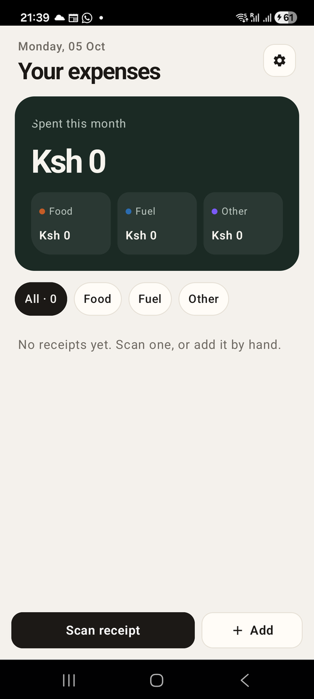

# Chapter 12: A Database on the Phone

Previously, we gave Risiti a memory for small settings with `Mob.State`.
Receipts, though, still live in a module attribute, and nobody can add one.
In this chapter we put a real database on the phone: SQLite, through the
Ecto you already know.

This is where Mob feels most like home. Schemas, changesets, migrations,
`Repo.all/1`, queries with `from`: all exactly the same as in your Phoenix
app. The database just happens to be a file on someone's phone instead of a
Postgres server.

By the end of this chapter, you will know:

- How the generated project already wires Ecto and SQLite together.
- How migrations run on a phone, where there's no `mix ecto.migrate`.
- How to turn Risiti's sample receipts into a `transactions` table, a
  schema and a context.
- How to add up a month in SQL.
- How to test against SQLite with the SQL sandbox.

## Why SQLite

Every Android and iOS phone has SQLite built in. It's a whole SQL database in
a single file, with no server to run. Most of the apps on your phone already
use it to store your messages, contacts and settings.

For Risiti, it means someone can save a receipt in a matatu with no signal,
or at a petrol station in a dead zone, and nothing is lost. Offline isn't a
feature we bolt on later; it's the default. In Part IV we'll sync this data
with a server, but the phone's database stays the source of truth for what
the user sees. That's the one rule behind Risiti's design: **the phone never
waits for the network to show you your own receipts.**

## What the generator gave us

`mix mob.new` already set Ecto up. In `mix.exs`:

```elixir
{:ecto_sqlite3, "~> 0.18"},
```

And `lib/risiti_app/repo.ex`:

```elixir
# lib/risiti_app/repo.ex
defmodule RisitiApp.Repo do
  use Ecto.Repo,
    otp_app: :risiti_app,
    adapter: Ecto.Adapters.SQLite3

  @impl true
  def init(_type, config) do
    data_dir =
      System.get_env("MOB_DATA_DIR") ||
        System.get_env("HOME") ||
        Path.join(File.cwd!(), "priv/repo")

    File.mkdir_p!(data_dir)
    {:ok, Keyword.merge(config, database: Path.join(data_dir, "app.db"), pool_size: 1)}
  end
end
```

(I've removed the generator's comments.) Two details matter.

**Where the file lives.** On the phone, Mob sets the `MOB_DATA_DIR`
environment variable to the app's private storage folder. Only our app can
read it, and Android keeps it when the app is updated. The database is
`app.db` in that folder. Note the fallback: on your computer, without
`MOB_DATA_DIR`, the database lands in your home folder, as `~/app.db`. Keep
that in mind if you ever start the repo from `iex -S mix`; our tests will
set `MOB_DATA_DIR` themselves.

**One connection.** `pool_size: 1`. SQLite allows one writer at a time, and
on a phone there's only one user. One connection is simpler and avoids
"database is locked" errors.

The repo is started in `on_start/0`, which also runs the migrations:

```elixir
    {:ok, _} = Application.ensure_all_started(:ecto_sqlite3)
    {:ok, _} = RisitiApp.Repo.start_link()

    Ecto.Migrator.with_repo(RisitiApp.Repo, fn repo ->
      Ecto.Migrator.run(repo, migrations_dir(), :up, all: true)
    end)
```

## Migrations on a phone

On a server, you run `mix ecto.migrate` as part of a deploy. A phone has no
Mix, and you can't log into your users' phones. So the app migrates itself
every time it starts: `Ecto.Migrator.run/4` with `:up, all: true` applies
any migration that hasn't run yet, and does nothing when the database is up
to date.

That has one big consequence: **a migration that has shipped can never
change.** Some of your users will open the app weeks after an update, and
their database must get from wherever it was to wherever it needs to be, one
migration at a time. Fix mistakes with a new migration, never by editing an
old one. The real Risiti has fifteen migrations for this reason, including
one that moved every receipt from an old `receipts` table into today's
`transactions` table on the phone, without losing a single one.

Remember `migrations_dir/0` from Chapter 3? This is why it exists:

```elixir
  defp migrations_dir do
    case System.get_env("MOB_BEAMS_DIR") do
      nil -> Application.app_dir(:risiti_app, "priv/repo/migrations")
      beams_dir -> Path.join([beams_dir, "priv", "repo", "migrations"])
    end
  end
```

On the phone, your `.beam` files don't sit in the usual `_build/.../ebin`
layout, so `Application.app_dir/2` can't find `priv/`. Mob tells us where it
put them through `MOB_BEAMS_DIR`. If `migrations_dir/0` pointed at the wrong
folder, the migrator would find zero migrations, log "Migrations already up",
and your tables would simply not exist. Leave this function alone.

The generator also left a `create_rounds` migration, for a demo game we
never built. We haven't shipped anything yet, so delete it:

```
rm priv/repo/migrations/20000101000000_create_rounds.exs
```

Once your app is on other people's phones, you'd leave a migration like
that alone: it's harmless, and deleting a migration that has run doesn't
undo it.

## The transactions table

Why "transactions", not "receipts"? Because in Part II a Risiti record can
also be a refund someone wants back, or a payment someone asks the team to
make. They share almost every field, so the real app keeps them in one
table, and gives each row a `type`. For Part I, every row is an `"expense"`.

Create the migration with Mix's generator:

```
mix ecto.gen.migration create_transactions
```

and fill it in:

```elixir
# priv/repo/migrations/20261005090000_create_transactions.exs
defmodule RisitiApp.Repo.Migrations.CreateTransactions do
  use Ecto.Migration

  def change do
    create table(:transactions) do
      # "expense" for now; refunds and payment requests come later.
      add :type, :string, null: false, default: "expense"
      add :date, :date, null: false
      add :vendor, :string, null: false
      add :description, :string
      # Whole cents: Ksh 3,450.50 is 345_050.
      add :amount_cents, :integer, null: false
      add :category, :string, null: false
      # How it got here: "manual" when typed in.
      add :source, :string, null: false, default: "manual"

      timestamps()
    end

    create index(:transactions, [:date])
  end
end
```

These are the first columns of the real `transactions` table. The rest
arrive chapter by chapter, each with its own migration, the way they did in
the real app: the photo in Chapter 14, KRA's QR code data and the claim
fields in Part II, and the owner and sync fields in Part IV.

The index on `date` is for the spend card, which asks for one month at a
time.

## The schema

Create `lib/risiti_app/transactions/transaction.ex`:

```elixir
# lib/risiti_app/transactions/transaction.ex
defmodule RisitiApp.Transactions.Transaction do
  @moduledoc """
  One expense: Date | Vendor | Description | Amount | Category.

  Amounts are whole cents so totals never pick up floating-point drift.
  """

  use Ecto.Schema
  import Ecto.Changeset

  @categories [
    "Food & Groceries",
    "Meals & Entertainment",
    "Transport",
    "Fuel",
    "Utilities",
    "Airtime & Internet",
    "Rent",
    "Health",
    "Office Supplies",
    "Other"
  ]

  @sources ~w(manual)

  schema "transactions" do
    field :type, :string, default: "expense"
    field :date, :date
    field :vendor, :string
    field :description, :string
    field :amount_cents, :integer
    field :category, :string
    field :source, :string, default: "manual"

    timestamps()
  end

  def categories, do: @categories

  @doc "Changeset for what the person enters."
  def changeset(transaction, attrs) do
    transaction
    |> cast(attrs, [:date, :vendor, :description, :amount_cents, :category, :source])
    |> trim([:vendor, :description])
    |> validate_required([:date, :vendor, :amount_cents, :category, :source])
    |> validate_number(:amount_cents, greater_than: 0, message: "must be more than zero")
    |> validate_inclusion(:category, @categories)
    |> validate_inclusion(:source, @sources)
    |> validate_length(:vendor, max: 120)
    |> validate_length(:description, max: 500)
  end

  # "  " becomes nil, so a blank vendor fails validate_required.
  defp trim(changeset, fields) do
    Enum.reduce(fields, changeset, &update_change(&2, &1, fn value -> blank_to_nil(value) end))
  end

  defp blank_to_nil(value) when is_binary(value) do
    case String.trim(value) do
      "" -> nil
      trimmed -> trimmed
    end
  end

  defp blank_to_nil(value), do: value
end
```

Nothing here is new to you, and that's the point. A few choices are worth a
word:

- **The ten categories live in the schema.** `validate_inclusion/3` keeps
  anything else out of the database, and the form in the next chapter will
  offer exactly this list.
- **`trim/2` turns blank text into `nil`.** A vendor of three spaces would
  pass `validate_required/2` if we didn't. Trimming also stops "Naivas " and
  "Naivas" from looking like two shops.
- **The amount must be more than zero**, with a message that reads well in
  the form: "Amount must be more than zero".
- **`type` isn't cast.** The person entering an expense can't make it a
  refund by sending `type: "refund"`. Part II adds that on purpose, with its
  own rules.

> **A formatter tip.** If `mix format` adds parentheses around `field` and
> `add`, your `.formatter.exs` doesn't know about Ecto's DSL. Add
> `import_deps: [:ecto, :ecto_sql]` to it, and
> `subdirectories: ["priv/*/migrations"]` so migrations are formatted too.
> The generated one doesn't have them yet.

## The context

Now `RisitiApp.Transactions` swaps its sample list for the database. The
screens call the same functions they called in Chapter 8, so they barely
change. Replace `lib/risiti_app/transactions.ex`:

```elixir
# lib/risiti_app/transactions.ex
defmodule RisitiApp.Transactions do
  @moduledoc """
  The expense book, stored in the phone's SQLite database. No network needed.
  """

  import Ecto.Query, only: [from: 2]

  alias RisitiApp.Repo
  alias RisitiApp.Transactions.Transaction

  # Nairobi is UTC+3 all year (no daylight saving), so "today" can be computed
  # without a timezone database, which the phone's runtime doesn't ship.
  @nairobi_offset 3 * 60 * 60

  # The spend card and the filter pills group the categories three ways.
  @groups [
    food: ["Food & Groceries", "Meals & Entertainment"],
    fuel: ["Fuel", "Transport"]
  ]

  defdelegate categories, to: Transaction

  def groups, do: [:food, :fuel, :other]

  @doc "The spending group a category belongs to: :food, :fuel or :other."
  def group(category) do
    Enum.find_value(@groups, :other, fn {group, categories} ->
      if category in categories, do: group
    end)
  end

  def group_label(:food), do: "Food"
  def group_label(:fuel), do: "Fuel"
  def group_label(:other), do: "Other"

  @doc "Every transaction, newest first, narrowed to a group unless it's `:all`."
  def list_transactions(filter \\ :all) do
    from(t in Transaction, order_by: [desc: t.date, desc: t.id])
    |> filtered(filter)
    |> Repo.all()
  end

  defp filtered(query, :all), do: query

  defp filtered(query, :other) do
    grouped = Enum.flat_map(@groups, &elem(&1, 1))
    from t in query, where: t.category not in ^grouped
  end

  defp filtered(query, group) do
    categories = Keyword.fetch!(@groups, group)
    from t in query, where: t.category in ^categories
  end

  def get_transaction(id), do: Repo.get(Transaction, id)
  def get_transaction!(id), do: Repo.get!(Transaction, id)

  @doc "For the spend card: what was spent in `month`, in total and per group."
  def summary(month \\ today()) do
    from = Date.beginning_of_month(month)
    to = Date.end_of_month(month)

    per_category =
      Repo.all(
        from t in Transaction,
          where: t.date >= ^from and t.date <= ^to,
          group_by: t.category,
          select: {t.category, sum(t.amount_cents)}
      )

    by_group =
      Enum.reduce(per_category, Map.new(groups(), &{&1, 0}), fn {category, cents}, acc ->
        Map.update!(acc, group(category), &(&1 + cents))
      end)

    %{
      total: by_group |> Map.values() |> Enum.sum(),
      by_group: by_group,
      count: Repo.aggregate(Transaction, :count)
    }
  end

  def create_transaction(attrs) do
    %Transaction{} |> Transaction.changeset(attrs) |> Repo.insert()
  end

  def update_transaction(%Transaction{} = transaction, attrs) do
    transaction |> Transaction.changeset(attrs) |> Repo.update()
  end

  def delete_transaction(%Transaction{} = transaction), do: Repo.delete(transaction)

  # today/0, format_amount/1 and format_short/1 are unchanged from Chapter 8.
end
```

Let's look at what changed.

**Filtering in SQL.** `filtered/2` turns a group into a `where` clause.
"Other" is the interesting one: it's every category *not* in the food and
fuel lists. Because it's built from `@groups`, moving a category from one
group to another is a one-line change that the filter, the spend card and
the badges all follow.

**The month adds up in SQL.** `summary/1` asks SQLite for one sum per
category for the month, then folds those few rows into the three groups in
Elixir. The database does the heavy part (reading hundreds of receipts) and
returns at most ten small rows. A phone has less memory than your laptop;
let the database do database work.

**`count` is every receipt**, for the "All" pill, with
`Repo.aggregate/2`.

**Newest first, then by id.** Two receipts on the same day would otherwise
come back in any order, and a list that reshuffles every time you open it
feels broken.

## Pointing the screens at the database

The form loads with the raising version, in `receipt_form_screen.ex`:

```elixir
    receipt = if id = params[:id], do: RisitiApp.Transactions.get_transaction!(id)
```

If the receipt doesn't exist, `get_transaction!/1` raises, the screen
crashes, and the router restarts it. That's the BEAM way: crash loudly
rather than show an empty form for a receipt that isn't there.

The receipts screen keeps working as it is: `{:select, :receipts, index}`
looks up the receipt at that index in `@items`, and pushes its database ID.

### An empty book

There's one new situation: a fresh install has no receipts at all. An empty
list is a blank space, and a blank space looks broken. So the receipts
screen says what to do instead. Replace the `<List>` in `render/1` with:

```elixir
      <Text
        :if={@items == []}
        text="No receipts yet. Scan one, or add it by hand."
        text_color={:muted}
        text_size={14}
        padding_left={22}
        padding_right={22}
        padding_top={12}
      />
      <List
        :if={@items != []}
        id={:receipts}
        items={@items}
        weight={1}
        padding_left={18}
        padding_right={18}
      />
      <Spacer :if={@items == []} weight={1} />
```

The `<Spacer weight={1}>` takes the list's place when there's no list, so
the dock still sits at the bottom of the screen.

## Run it

```
mix mob.deploy --device YOUR_DEVICE_ID
```

The migrations run on the phone, and Risiti opens on an empty book:



We can't add a receipt until the next chapter builds the form. But we can
do something better than wait: put one in from your laptop. Connect with
`mix mob.connect`, and in the IEx shell:

```elixir
iex> node = hd(Node.list())
iex> :rpc.call(node, RisitiApp.Transactions, :create_transaction, [
...>   %{date: ~D[2026-10-03], vendor: "Naivas Supermarket", amount_cents: 345_050, category: "Food & Groceries"}
...> ])
{:ok, %RisitiApp.Transactions.Transaction{id: 1, ...}}
```

That's your context function, running on the phone, writing to the phone's
database, called from your laptop. Close and reopen Risiti, and the receipt
is there, in the list and in the month's total.

## Testing against SQLite

Tests need a database too, and it must not be the one on your phone or in
your home folder. We need three things:

1. A throwaway database file.
2. Migrations applied to it before the tests run.
3. Each test running in its own transaction that's rolled back afterwards,
   so tests can't see each other's data. That's Ecto's SQL sandbox, the
   same one Phoenix uses.

First, tell the repo to use the sandbox in tests. At the bottom of
`config/config.exs`:

```elixir
# Tests run each case in a transaction that is rolled back afterwards.
if config_env() == :test do
  config :risiti_app, RisitiApp.Repo, pool: Ecto.Adapters.SQL.Sandbox
  config :logger, level: :warning
end
```

The logger line keeps Ecto's query logs out of your test output.

Then the top of `test/test_helper.exs`, before the code we already have:

```elixir
# test/test_helper.exs
# The repo keeps its database in MOB_DATA_DIR (see RisitiApp.Repo.init/2).
# Point it at a throwaway folder so tests never touch a real database.
data_dir = Path.join(System.tmp_dir!(), "risiti_app_test")
File.rm_rf!(data_dir)
System.put_env("MOB_DATA_DIR", data_dir)

{:ok, _} = Application.ensure_all_started(:ecto_sqlite3)

# Migrate with an ordinary pool, then restart the repo on the test sandbox
# (config/config.exs sets `pool: Ecto.Adapters.SQL.Sandbox` for :test).
{:ok, repo} = RisitiApp.Repo.start_link(pool: DBConnection.ConnectionPool)
migrations = Path.expand("../priv/repo/migrations", __DIR__)
Ecto.Migrator.run(RisitiApp.Repo, migrations, :up, all: true, log: false)
Supervisor.stop(repo)

{:ok, _} = RisitiApp.Repo.start_link()
Ecto.Adapters.SQL.Sandbox.mode(RisitiApp.Repo, :manual)
```

We set `MOB_DATA_DIR` ourselves, just as Mob does on the phone, so
`Repo.init/2` puts the test database in a temporary folder.

Why start the repo twice? If you migrate through the sandbox, the migrator
does its work in a separate task, and with a single sandboxed connection the
two end up waiting on each other until the checkout times out. So we migrate
with an ordinary pool, stop it, and start the repo again on the sandbox for
the tests. Note that `Ecto.Migrator.with_repo/3`, which `on_start/0` uses,
doesn't help here: it starts the repo with your configured pool, which in
tests is the sandbox.

Finally, two helpers in `RisitiApp.ScreenHelpers`, in the same file:

```elixir
  @doc "Use with `setup :checkout_repo`: each test runs in its own transaction."
  def checkout_repo(_context) do
    :ok = Ecto.Adapters.SQL.Sandbox.checkout(RisitiApp.Repo)
  end

  @doc "Saves an expense, with defaults for anything not given."
  def insert_transaction(attrs \\ %{}) do
    defaults = %{
      date: RisitiApp.Transactions.today(),
      vendor: "Naivas Supermarket",
      amount_cents: 100_000,
      category: "Food & Groceries"
    }

    {:ok, transaction} =
      RisitiApp.Transactions.create_transaction(Map.merge(defaults, Map.new(attrs)))

    transaction
  end
```

Screen tests call `mount/3` in the test process itself, so the screen uses
the test's sandboxed connection with no extra setup. That's another gift of
screens being plain callbacks.

The context gets its own tests. Replace `test/risiti_app/transactions_test.exs`:

```elixir
# test/risiti_app/transactions_test.exs
defmodule RisitiApp.TransactionsTest do
  use ExUnit.Case, async: false

  import RisitiApp.ScreenHelpers

  alias RisitiApp.Transactions

  setup :checkout_repo

  test "create_transaction/1 saves an expense and trims the vendor" do
    assert {:ok, saved} =
             Transactions.create_transaction(%{
               date: ~D[2026-10-02],
               vendor: "  Java House ",
               amount_cents: 87_000,
               category: "Meals & Entertainment"
             })

    assert saved.vendor == "Java House"
    assert saved.source == "manual"
  end

  test "create_transaction/1 refuses a blank vendor, a zero amount and an unknown category" do
    assert {:error, changeset} =
             Transactions.create_transaction(%{
               date: ~D[2026-10-02],
               vendor: "  ",
               amount_cents: 0,
               category: "Snacks"
             })

    assert %{
             vendor: ["can't be blank"],
             amount_cents: ["must be more than zero"],
             category: ["is invalid"]
           } = errors_on(changeset)
  end

  test "summary/1 adds up one month, per group" do
    insert_transaction(date: ~D[2026-10-03], category: "Food & Groceries", amount_cents: 345_050)
    insert_transaction(date: ~D[2026-10-02], category: "Fuel", amount_cents: 450_000)
    insert_transaction(date: ~D[2026-10-01], category: "Airtime & Internet", amount_cents: 100_000)
    insert_transaction(date: ~D[2026-09-30], category: "Transport", amount_cents: 64_000)

    summary = Transactions.summary(~D[2026-10-15])

    assert summary.total == 895_050
    assert summary.by_group == %{food: 345_050, fuel: 450_000, other: 100_000}
    assert summary.count == 4
  end

  test "list_transactions/1 is newest first" do
    insert_transaction(vendor: "Older", date: ~D[2026-09-01])
    insert_transaction(vendor: "Newer", date: ~D[2026-10-01])

    assert Enum.map(Transactions.list_transactions(), & &1.vendor) == ["Newer", "Older"]
  end

  # ... group/1 and the formatting tests, as in Chapter 8

  defp errors_on(changeset) do
    Ecto.Changeset.traverse_errors(changeset, fn {message, _opts} -> message end)
  end
end
```

Note the summary test's September receipt: Little Cab on the 30th is left
out of October's total. Testing the edge of the month is how you find out
whether `end_of_month` and `<=` agree.

The screen tests change in one way: they make their own data instead of
relying on the sample list. Each screen test module gets
`setup :checkout_repo`, and each test inserts what it needs:

```elixir
  test "an empty book says how to start" do
    view = mount_screen(ReceiptsScreen)

    assert text(rendered(view)) =~ "No receipts yet"
    assert_renderable(rendered(view))
  end

  test "shows this month's spend and every receipt" do
    insert_transaction(vendor: "Naivas Supermarket", amount_cents: 345_050)
    insert_transaction(vendor: "TotalEnergies Westlands", category: "Fuel", amount_cents: 450_000)

    view = mount_screen(ReceiptsScreen)
    text = text(rendered(view))

    assert text =~ "Spent this month"
    assert text =~ "Ksh 7,950.50"
    assert text =~ "Naivas Supermarket"
    assert text =~ "Ksh 3,450.50"
    assert_renderable(rendered(view))
  end
```

That's better than before: each test says exactly which receipts make it
pass, and `insert_transaction/1` dates them today, so "this month" is always
right. In `all_screens_test.exs`, a `setup` saves one transaction and passes
its real ID to the form. The full files are in `code/12/test/`.

```
mix test
```

```
28 tests, 0 failures
```

## What we have so far

- A `transactions` table, created by a migration the app runs on itself.
- A `Transaction` schema with Risiti's ten categories and its validations.
- `RisitiApp.Transactions` backed by SQLite, adding up the month in SQL.
- A receipts screen that knows what to say when the book is empty.
- A test setup with a throwaway database and the SQL sandbox.

The code at the end of this chapter is in `code/12/`.

We have a database and validations, but the only way to add a receipt is
from IEx. In the next chapter we build the receipt form, and learn how a
phone keyboard, text fields and changeset errors fit together.
