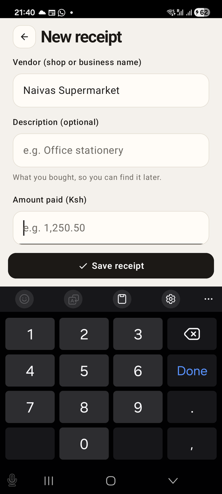
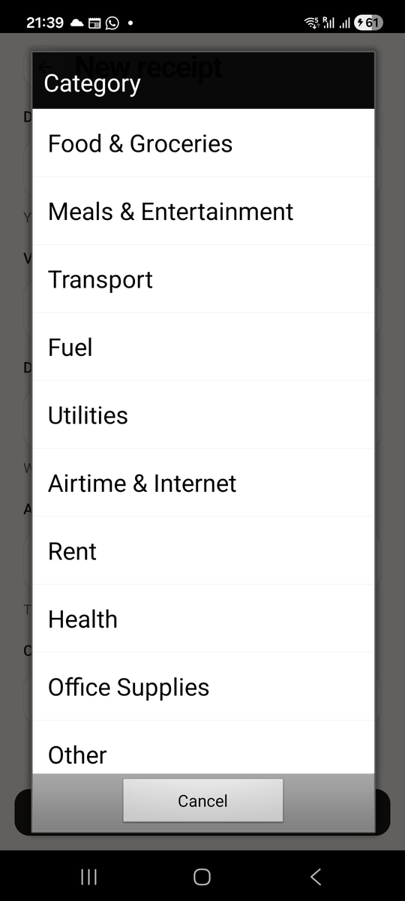
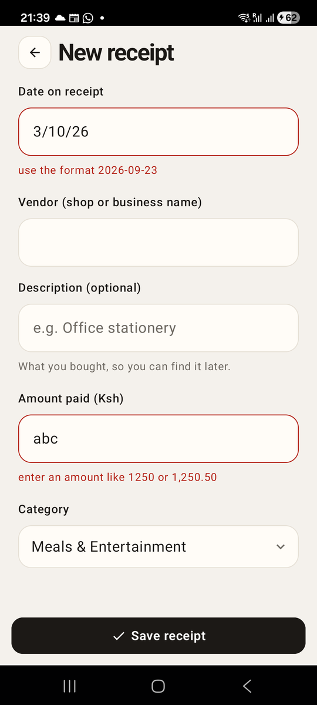

# Chapter 13: The Receipt Form

Previously, we moved Risiti's receipts into SQLite. The database has
validations, but nobody can use them yet: the only way in is IEx. In this
chapter we build the receipt form, the screen for adding a receipt by hand
and fixing one that's already saved.

Forms on a phone are harder than they look. There's a keyboard that covers
half the screen, a different keyboard for numbers, and people typing with
one thumb while standing at a till with a receipt in the other hand. We'll
handle all of that, and keep the validation where it belongs, in the
changeset.

By the end of this chapter, you will know:

- How a `<TextField>` sends you what the user types.
- How to pick the right keyboard for each field.
- How to build a form field component with a label, a hint and an error.
- How to offer a choice from a list with a native sheet.
- How to turn parsing errors and changeset errors into messages.
- How to go back to a list that shows what you just saved.

## How a text field talks to you

In LiveView, a form sends `phx-change` events with all its fields at once,
and you validate with `to_form/1` and `<.input>`. Mob has no form element.
Each `<TextField>` is on its own, and works like this:

```elixir
<TextField value={@vendor} on_change={{self(), :vendor}} />
```

- `value` is what the field shows.
- `on_change` says who to tell, and with what tag, whenever the text
  changes. On every keystroke, the screen receives
  `{:change, :vendor, "Naiv"}`.

You store the new text in an assign, the screen re-renders, and the field
shows it. If you've written a "controlled input" in React, it's the same
idea. The assigns are the truth; the field reflects them.

Note the shape of the message: `{:change, tag, value}`, not `{:tap, tag}`.
Each kind of native event has its own first element: `:tap`, `:change`,
`:select`, `:focus`, `:blur`.

## A field component

Every field on the form has the same parts: a label above, the input in a
rounded box, and under it either a hint or, after a failed save, the error.
That's a job for a component. Risiti's is a helper function, like
`ActionButton`. Create `lib/risiti_app/components/form_field.ex`:

```elixir
# lib/risiti_app/components/form_field.ex
defmodule RisitiApp.Components.FormField do
  @moduledoc """
  A text input with a visible label above it, an example in the placeholder,
  and a hint or the validation error below.

      FormField.field(
        label: "Amount paid (Ksh)",
        key: :amount,
        value: @amount,
        placeholder: "e.g. 1,250.50",
        keyboard: :decimal,
        error: @errors[:amount]
      )

  Typing arrives in the screen as `{:change, key, value}`.
  """

  import Mob.Sigil

  def field(opts) do
    label = Keyword.fetch!(opts, :label)
    key = Keyword.fetch!(opts, :key)
    value = Keyword.get(opts, :value) || ""
    placeholder = Keyword.get(opts, :placeholder, "")
    keyboard = Keyword.get(opts, :keyboard, :default)
    hint = Keyword.get(opts, :hint)
    error = Keyword.get(opts, :error)

    ~MOB"""
    <Column fill_width={true} padding_bottom={12}>
      <Text text={label} text_size={13} font_weight="medium" text_color={:on_background} />
      <Spacer size={6} />
      <Box
        background={:surface}
        border_color={if(error, do: :error, else: :border)}
        border_width={1}
        corner_radius={16}
        padding_left={2}
        padding_right={2}
        fill_width={true}
      >
        <TextField
          value={value}
          placeholder={placeholder}
          variant={:bare}
          background={:transparent}
          padding={0}
          keyboard={keyboard}
          on_change={{self(), key}}
          fill_width={true}
        />
      </Box>
      <Spacer :if={hint || error} size={4} />
      <Text :if={hint && !error} text={hint} text_size={12} text_color={:muted} />
      <Text :if={error} text={error} text_size={12} text_color={:error} />
    </Column>
    """
  end
end
```

A few details:

- **The label is a real `<Text>`.** A placeholder disappears as soon as you
  type, which leaves the user guessing what the field was for. A label stays.
- **`variant={:bare}`** turns off Material's grey fill and underline, so the
  input sits cleanly inside our own bordered box, matching the rest of
  Risiti.
- **The border turns red with an error**, and the error replaces the hint.
  Your eye goes straight to the field that needs fixing.
- **`key` is both the tag and the assign name.** The field for `:vendor`
  sends `{:change, :vendor, text}`, and the screen stores it in
  `@vendor`.

## The right keyboard

On a phone, the keyboard is part of your form's design. An amount field with
the full keyboard makes the user switch to numbers on every receipt.
`keyboard` picks the right one:

| Value | Shows |
|---|---|
| `:default` | The normal keyboard. |
| `:number` | Digits only. |
| `:decimal` | Digits and a decimal point. Good for amounts. |
| `:phone` | A phone dial pad. Risiti uses it for M-Pesa numbers in Part II. |
| `:email` | A keyboard with `@` and `.` close at hand. |
| `:url` | A keyboard with `/` and `.com`. |

A digits-only keyboard is a hint, not validation. People can still paste
anything, so the rules stay in the changeset.

## The form screen

Now replace `lib/risiti_app/screens/receipt_form_screen.ex`. It's the
longest screen in Part I, so we'll take it in parts. First, `mount/3`:

```elixir
# lib/risiti_app/screens/receipt_form_screen.ex
defmodule RisitiApp.Screens.ReceiptFormScreen do
  @moduledoc """
  Add an expense by hand, or edit a saved one.

  Mount params:

    * `%{id: id}` — edit a saved transaction.
    * `%{}` — enter an expense by hand.
  """

  use Mob.Screen

  alias RisitiApp.Transactions
  alias RisitiApp.Components.{ActionButton, FormField}
  alias RisitiApp.Transactions.Transaction

  @categories Transaction.categories()
  @category_actions @categories
                    |> Enum.with_index()
                    |> Map.new(fn {category, i} -> {:"category_#{i}", category} end)

  @text_fields [:date, :vendor, :description, :amount]

  @impl Mob.Screen
  def mount(params, _session, socket) do
    receipt =
      case params do
        %{id: id} -> Transactions.get_transaction!(id)
        _ -> %Transaction{date: Transactions.today(), category: "Other"}
      end

    socket =
      Mob.Socket.assign(socket,
        receipt: receipt,
        date: Date.to_iso8601(receipt.date),
        vendor: receipt.vendor || "",
        description: receipt.description || "",
        amount: Transactions.amount_input(receipt.amount_cents),
        category: receipt.category,
        errors: %{}
      )

    {:ok, socket}
  end
```

### One form, two jobs

Opened with `%{id: id}`, the form edits a saved receipt. Opened with no
params, it starts a new one: a `%Transaction{}` struct that isn't in the
database yet, dated today and filed under "Other". Either way, the rest of
the screen works with `@receipt`, and `@receipt.id` tells it which job it's
doing.

### The fields are strings

```elixir
date: Date.to_iso8601(receipt.date),
amount: Transactions.amount_input(receipt.amount_cents),
```

A text field holds text. While the user types, "34" on the way to
"3,450.50" isn't an amount yet, so the assigns keep exactly what's in each
field, as strings. We only turn them into a date and cents when the user
taps **Save**. When editing, we fill the fields from the receipt: a date
becomes "2026-10-03", and 345,050 cents becomes "3450.50". Add
`amount_input/1` to `lib/risiti_app/transactions.ex`:

```elixir
  @doc "Cents as a plain editable number, e.g. \"1234.50\"; blank for nil."
  def amount_input(nil), do: ""

  def amount_input(cents) do
    "#{div(cents, 100)}.#{cents |> rem(100) |> Integer.to_string() |> String.pad_leading(2, "0")}"
  end
```

No "Ksh", no thousands separators: this is for editing, and the user
shouldn't have to delete a comma to change a digit.

### The category actions

```elixir
  @category_actions @categories
                    |> Enum.with_index()
                    |> Map.new(fn {category, i} -> {:"category_#{i}", category} end)
```

At compile time, this builds a map from an atom per category to the
category: `%{category_0: "Food & Groceries", category_1: "Meals &
Entertainment", ...}`. We'll see why in a moment.

Now `render/1`:

```elixir
  @impl Mob.Screen
  def render(assigns) do
    ~MOB"""
    <Column background={:background} fill_height={true}>
      <Header title={if @receipt.id, do: "Edit receipt", else: "New receipt"} show_back={true} />
      <Scroll weight={1}>
        <Column padding_left={22} padding_right={22}>
          {FormField.field(
            label: "Date on receipt",
            key: :date,
            value: @date,
            placeholder: "YYYY-MM-DD, e.g. 2026-09-23",
            hint: "Year-month-day, as printed on the receipt.",
            error: @errors[:date]
          )}
          {FormField.field(
            label: "Vendor (shop or business name)",
            key: :vendor,
            value: @vendor,
            placeholder: "e.g. Naivas Westlands",
            error: @errors[:vendor]
          )}
          {FormField.field(
            label: "Description (optional)",
            key: :description,
            value: @description,
            placeholder: "e.g. Office stationery",
            hint: "What you bought, so you can find it later.",
            error: @errors[:description]
          )}
          {FormField.field(
            label: "Amount paid (Ksh)",
            key: :amount,
            value: @amount,
            placeholder: "e.g. 1,250.50",
            keyboard: :decimal,
            hint: "The total on the receipt, including VAT.",
            error: @errors[:amount]
          )}
          <Text text="Category" text_size={13} font_weight="medium" text_color={:on_background} />
          <Spacer size={6} />
          <Row
            fill_width={true}
            height={52}
            background={:surface}
            border_color={if(@errors[:category], do: :error, else: :border)}
            border_width={1}
            corner_radius={16}
            padding_left={16}
            padding_right={12}
            align={:center}
            on_tap={{self(), :pick_category}}
            accessibility_label={"Category: #{@category}. Change category"}
          >
            <Text text={@category} text_size={16} text_color={:on_surface} weight={1} />
            <Icon name="expand_more" text_size={20} text_color={:muted} />
          </Row>
          <Text
            :if={@errors[:category]}
            text={@errors[:category]}
            text_size={12}
            text_color={:error}
          />
          <Spacer size={16} />
        </Column>
      </Scroll>
      <Row padding={14} gap={8}>
        {if @receipt.id,
          do: ActionButton.button("trash", "Delete", :delete, style: :danger, width: 120)}
        {ActionButton.button("check", "Save receipt", :save, weight: 1)}
      </Row>
    </Column>
    """
  end
```

The fields scroll; the **Save receipt** button doesn't. The same
`weight={1}` on the `Scroll` that kept the home screen's dock at the bottom
keeps Save in reach, even with the keyboard open. **Delete** only appears
when editing; there's nothing to delete on a receipt that isn't saved yet.

Read the labels and hints as a user would. "Date on receipt" and "as
printed on the receipt" tell people to copy the receipt, not to put today's
date. "Including VAT" answers the question everyone asks at the till. Most
form errors are prevented by words, not code.

### Typing

```elixir
  @impl Mob.Screen
  def handle_info({:change, key, value}, socket) when key in @text_fields do
    {:noreply, Mob.Socket.assign(socket, key, value)}
  end
```

Because each field's `key` is its assign name, one clause handles all four.
The guard makes sure a stray `{:change, ...}` can't write an assign we
didn't plan for.

## Choosing a category with a sheet

The category isn't something to type. Ten categories are too many for a row
of buttons, and the user should pick one, not spell it. So the category
"field" is a tappable row, and tapping it opens a native **action sheet**:
the list of choices that slides up from the bottom of the screen.

```elixir
  # The category is a choice, not something to type: offer them in a sheet.
  def handle_info({:tap, :pick_category}, socket) do
    buttons =
      @categories
      |> Enum.with_index()
      |> Enum.map(fn {category, i} -> [label: category, action: :"category_#{i}"] end)

    {:noreply,
     Mob.Alert.action_sheet(socket,
       title: "Category",
       buttons: buttons ++ [[label: "Cancel", style: :cancel]]
     )}
  end

  def handle_info({:alert, action}, socket) when is_map_key(@category_actions, action) do
    {:noreply, Mob.Socket.assign(socket, :category, Map.fetch!(@category_actions, action))}
  end
```

`Mob.Alert.action_sheet/2` shows the sheet and returns at once. Each button
has an `action`, an atom, and when the user taps one, the screen receives
`{:alert, action}`.

Here's why we built `@category_actions`. The sheet can only send back an
atom, and we need to know which category it stands for. We could build the
atom from the category's name, but turning arbitrary strings into atoms is a
bad habit (atoms are never garbage collected). Instead, each category gets a
fixed atom by its position, `:category_0` to `:category_9`, made once at
compile time. The guard `is_map_key(@category_actions, action)` matches only
those ten, and `Map.fetch!/2` turns the atom back into the category.

**Cancel** sends `{:alert, :dismiss}`, which matches nothing in particular
and falls through to the catch-all. That's the pattern for every native
dialog in this book: *ask, then handle the answer as a message.*

## Saving

```elixir
  def handle_info({:tap, :save}, socket) do
    case build_attrs(socket.assigns) do
      {:ok, attrs} -> save(socket, attrs)
      {:error, errors} -> {:noreply, Mob.Socket.assign(socket, :errors, errors)}
    end
  end
```

Saving happens in two steps, because there are two kinds of mistakes.

### Step one: parse what Ecto can't

```elixir
  @doc false
  # Turns the form's inputs into changeset attrs, catching the two fields
  # (date and amount) that need parsing before Ecto sees them.
  def build_attrs(assigns) do
    date_result = Date.from_iso8601(String.trim(assigns.date))
    amount_result = Transactions.parse_amount(assigns.amount)

    errors =
      %{}
      |> put_error_if(match?({:error, _}, date_result), :date, "use the format 2026-09-23")
      |> put_error_if(amount_result == :error, :amount, "enter an amount like 1250 or 1,250.50")

    if errors == %{} do
      {:ok, date} = date_result
      {:ok, amount_cents} = amount_result

      {:ok,
       %{
         date: date,
         vendor: assigns.vendor,
         description: assigns.description,
         amount_cents: amount_cents,
         category: assigns.category
       }}
    else
      {:error, errors}
    end
  end

  defp put_error_if(errors, true, field, message), do: Map.put(errors, field, message)
  defp put_error_if(errors, false, _field, _message), do: errors
```

The date and the amount are typed as text, but stored as a `Date` and
integer cents. Ecto could cast "2026-10-03" to a date itself, but its error
would just say "is invalid". People type dates as "3/10/26" and amounts as
"Ksh 1,250", so we parse those two fields ourselves and give errors that
show the right way: "use the format 2026-09-23".

The amount parser goes in `lib/risiti_app/transactions.ex`, so the server
side can use the same rules later:

```elixir
  @doc """
  Reads an amount the way people type it: "1250", "1,250.50", "Ksh 1,250.5".
  Returns `{:ok, cents}` or `:error`. No floats are involved.
  """
  def parse_amount(nil), do: :error

  def parse_amount(text) when is_binary(text) do
    cleaned = text |> String.replace(~r/ksh\.?|kes|[\s,]/i, "")

    case Regex.run(~r/^(\d+)(?:\.(\d{1,2}))?$/, cleaned) do
      [_, shillings] -> {:ok, String.to_integer(shillings) * 100}
      [_, shillings, cents] -> {:ok, String.to_integer(shillings) * 100 + cents_value(cents)}
      nil -> :error
    end
  end

  defp cents_value(<<d>>), do: (d - ?0) * 10
  defp cents_value(two), do: String.to_integer(two)
```

It strips "Ksh", "KES", spaces and commas, then expects digits with an
optional decimal point and one or two decimals. The shillings and the cents
are parsed as separate integers, so there's never a float: "870.05" is
87,005 cents, exactly. `cents_value/1` handles one decimal: "1,250.5" means
50 cents, not 5. The `<<d>>` pattern matches a one-byte string, and
`d - ?0` turns the digit's character code into its value.

### Step two: the changeset

```elixir
  defp save(socket, attrs) do
    result =
      case socket.assigns.receipt do
        %Transaction{id: nil} -> Transactions.create_transaction(attrs)
        receipt -> Transactions.update_transaction(receipt, attrs)
      end

    case result do
      {:ok, _saved} ->
        {:noreply, back_to_list(socket)}

      {:error, changeset} ->
        {:noreply, Mob.Socket.assign(socket, :errors, changeset_errors(changeset))}
    end
  end
```

A receipt with no `id` is new, so we create it; otherwise we update it. If
the changeset refuses, its errors go under the fields:

```elixir
  # One message per field, in words: %{vendor: "Vendor can't be blank"}.
  defp changeset_errors(changeset) do
    changeset
    |> Ecto.Changeset.traverse_errors(fn {message, opts} ->
      Enum.reduce(opts, message, fn {key, value}, acc ->
        String.replace(acc, "%{#{key}}", to_string(value))
      end)
    end)
    |> Enum.reduce(%{}, fn
      {:amount_cents, [message | _]}, acc -> Map.put(acc, :amount, "Amount #{message}")
      {field, [message | _]}, acc -> Map.put(acc, field, "#{humanize(field)} #{message}")
    end)
  end

  defp humanize(field), do: field |> Atom.to_string() |> String.capitalize()
```

`traverse_errors/2` fills in placeholders like `%{count}` in "should be at
most %{count} character(s)", the same job `translate_error/1` does in a
Phoenix app. Then we keep one message per field and make it a sentence:
"Vendor can't be blank". The changeset's field is `amount_cents`, but the
form's field is `amount`, so that one is renamed on the way.

### Back to a fresh list

```elixir
  # Reset rather than pop, so the list mounts again with the new totals.
  defp back_to_list(socket) do
    Mob.Socket.reset_to(socket, RisitiApp.Screens.ReceiptsScreen, %{}, transition: :pop)
  end
```

After saving, we want the receipts screen, showing the new receipt and the
new month's total. But if we just popped back, the receipts screen would
show what it loaded in its `mount/3`, *before* we saved. It's still alive
under the form, holding its old assigns.

`reset_to/4` replaces the whole stack with a fresh `ReceiptsScreen`, which
mounts again and loads everything from the database. `transition: :pop`
makes it *look* like going back, sliding the right way. It's exactly what
the real Risiti does after saving a receipt.

> **Another way: telling the screen underneath.** Screens are processes, so
> the form could also send the receipts screen a message. Pass its pid in
> the params (`%{notify: self()}`), and after saving,
> `send(notify, {:request_saved, transaction})`. The receipts screen handles
> that message by reloading, and the form pops normally. Risiti's payment
> request form works this way, and we'll write it in Part II. For a form that
> only ever returns to one place, `reset_to/4` is simpler.

## Deleting

```elixir
  def handle_info({:tap, :delete}, socket) do
    {:noreply,
     Mob.Alert.alert(socket,
       title: "Delete this receipt?",
       message: "#{socket.assigns.receipt.vendor} will be removed from your expenses.",
       buttons: [
         [label: "Delete", style: :destructive, action: :confirm_delete],
         [label: "Cancel", style: :cancel]
       ]
     )}
  end

  def handle_info({:alert, :confirm_delete}, socket) do
    {:ok, _} = Transactions.delete_transaction(socket.assigns.receipt)
    {:noreply, back_to_list(socket)}
  end
```

Deleting is permanent, so we ask first, with `Mob.Alert.alert/2`: Android's
own dialog, centred on the screen. Like the action sheet, it returns at once
and the answer arrives as `{:alert, action}`. The `:destructive` style tells
the platform to colour the button as dangerous. The message names the
vendor, so the user knows exactly what they're about to lose.

## Wiring it up

The receipts screen already opens the form: **Add** pushes it with no
params, and tapping a receipt pushes it with the receipt's ID. Nothing to
change there.

## Run it

```
mix mob.deploy --device YOUR_DEVICE_ID
```

Tap **Add** and fill in a receipt. On the amount, the decimal keyboard
appears:



Tap the category, and the sheet slides up:



Now try saving with mistakes: a blank vendor, an amount of "abc", a date of
"3/10/26":



Only the date and the amount complain. That's the two steps at work: the
form can't build attributes from a date and amount it can't read, so the
changeset never runs, and the changeset is where "Vendor can't be blank"
comes from. Fix the date and the amount, save again, and *then* the vendor
error appears. Fix that too and save. You're back on the receipts list, with the new receipt at
the top and the month's total already updated.

## Testing it

Forms are where tests pay for themselves. Create
`test/risiti_app/screens/receipt_form_screen_test.exs`:

```elixir
# test/risiti_app/screens/receipt_form_screen_test.exs
defmodule RisitiApp.Screens.ReceiptFormScreenTest do
  use Mob.ScreenCase

  import RisitiApp.ScreenHelpers

  alias RisitiApp.Transactions
  alias RisitiApp.Screens.{ReceiptFormScreen, ReceiptsScreen}

  setup :checkout_repo

  # Types into the fields the way the phone does: one {:change, ...} each.
  defp fill_in(view, fields) do
    Enum.reduce(fields, view, fn {field, value}, view ->
      render_info(view, {:change, field, value})
    end)
  end

  test "a new receipt starts on today, in Other" do
    view = mount_screen(ReceiptFormScreen)

    assert assigns(view).date == Date.to_iso8601(Transactions.today())
    assert assigns(view).category == "Other"
    assert_renderable(rendered(view))
  end

  test "saving a new receipt goes back to a fresh list" do
    view =
      ReceiptFormScreen
      |> mount_screen()
      |> fill_in(vendor: "Java House", amount: "870", date: "2026-10-02")
      |> render_info({:alert, :category_1})
      |> render_info({:tap, :save})

    assert navigated_to(view) == ReceiptsScreen

    assert [%{vendor: "Java House", amount_cents: 87_000, category: "Meals & Entertainment"}] =
             Transactions.list_transactions()
  end

  test "a bad date and amount are caught before Ecto sees them" do
    view =
      ReceiptFormScreen
      |> mount_screen()
      |> fill_in(vendor: "Java House", amount: "abc", date: "2/10/2026")
      |> render_info({:tap, :save})

    assert navigated_to(view) == nil
    assert assigns(view).errors.date == "use the format 2026-09-23"
    assert assigns(view).errors.amount == "enter an amount like 1250 or 1,250.50"
    assert text(rendered(view)) =~ "use the format 2026-09-23"
  end

  test "the changeset's errors are shown in words" do
    view =
      ReceiptFormScreen
      |> mount_screen()
      |> fill_in(vendor: " ", amount: "0")
      |> render_info({:tap, :save})

    assert assigns(view).errors == %{
             vendor: "Vendor can't be blank",
             amount: "Amount must be more than zero"
           }

    assert Transactions.list_transactions() == []
  end

  test "editing starts from the saved values and updates them" do
    naivas = insert_transaction(vendor: "Naivas", amount_cents: 345_050)

    view = mount_screen(ReceiptFormScreen, %{id: naivas.id})
    assert %{vendor: "Naivas", amount: "3450.50"} = assigns(view)

    view = view |> fill_in(amount: "3,500") |> render_info({:tap, :save})

    assert navigated_to(view) == ReceiptsScreen
    assert Transactions.get_transaction!(naivas.id).amount_cents == 350_000
  end

  test "confirming the delete alert removes the receipt" do
    naivas = insert_transaction(vendor: "Naivas")

    view =
      ReceiptFormScreen
      |> mount_screen(%{id: naivas.id})
      |> render_info({:alert, :confirm_delete})

    assert navigated_to(view) == ReceiptsScreen
    assert Transactions.get_transaction(naivas.id) == nil
  end
end
```

`fill_in/2` is a little helper that sends one `{:change, field, value}` per
field, exactly what the phone sends as the user types.

Look at how the category is chosen in the second test:
`render_info({:alert, :category_1})`. We don't open the sheet; we send the
answer the sheet would send if the user tapped "Meals & Entertainment".
The same goes for deleting: `{:alert, :confirm_delete}` is what Android
sends when the user taps **Delete** in the dialog. Showing a dialog is
Android's job, and it needs the phone. What happens after is ours, and it's
all tested here.

The third and fourth tests check the two steps of validation separately:
parsing first, then the changeset. Note the fourth test's amount, "0":
it parses fine, to zero cents, and it's the changeset that refuses it.

And `parse_amount/1` gets a plain test in `transactions_test.exs`:

```elixir
  test "parse_amount/1 reads amounts the way people type them" do
    assert Transactions.parse_amount("1250") == {:ok, 125_000}
    assert Transactions.parse_amount("1,250.5") == {:ok, 125_050}
    assert Transactions.parse_amount("Ksh 870.05") == {:ok, 87_005}
    assert Transactions.parse_amount("12.345") == :error
    assert Transactions.parse_amount("abc") == :error
  end
```

```
mix test
```

```
35 tests, 0 failures
```

## What we have so far

- A `FormField` component: label, input, hint and error.
- The receipt form, adding and editing, with the decimal keyboard for the
  amount and a native sheet for the category.
- Two-step validation: parsing the date and amount, then the changeset.
- A delete with a native confirmation.
- `reset_to/4`, so the list always shows what was just saved.

The code at the end of this chapter is in `code/13/`.

Typing a receipt in works, but it's not why anyone installs Risiti. In the
next chapter we'll do what the big **Scan receipt** button has been
promising since Chapter 6: open the camera.
