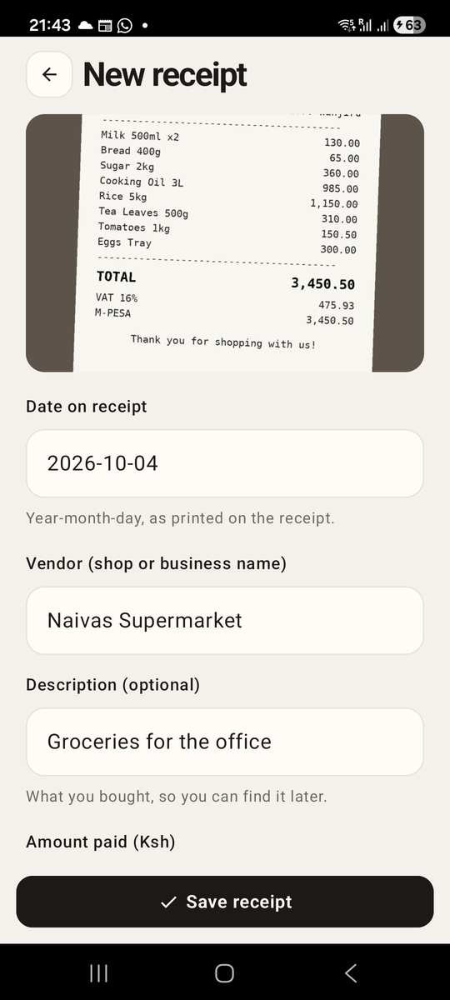

# Chapter 14: Taking the Photo

Previously, we built the receipt form. Typing a receipt in works, but it
isn't why anyone installs Risiti. The big dark **Scan receipt** button has
sat on the home screen since Chapter 6, doing nothing. In this chapter it
opens the camera, and the photo of the receipt is kept with the expense.

Reading the receipt *for* you, filling in the vendor and amount from the
photo, comes in Part II. First the photo has to arrive safely, and that
needs three things from the phone: a plugin, a permission and a camera.

By the end of this chapter, you will know:

- What a Mob plugin is, and why adding one needs a native build.
- How Android permissions work, and how to ask for one.
- How to take a photo and keep it.
- How to store files so they survive the app being updated.
- How Risiti keeps device calls testable, with one small module.

## Plugins

Mob's core stays small. Hardware features come as **plugins**: Hex packages
with an Elixir API on top and native code (Kotlin, Swift, Zig) underneath.
The camera is `mob_camera`. Later in the book Risiti also uses `mob_scanner`
for QR codes, `mob_biometric` for the fingerprint, and `mob_notify` for push
notifications.

Adding a plugin takes two steps. First, the dependency, in `mix.exs`:

```elixir
  defp deps do
    [
      {:mob, "~> 0.9.12"},
      {:mob_dev, "~> 0.7.12", only: :dev, runtime: false},
      {:ecto_sqlite3, "~> 0.18"},
      {:mob_camera, "~> 0.1"},
      # ...
    ]
  end
```

Second, activate it in `mob.exs`:

```elixir
config :mob, :plugins, [:mob_camera]
```

Why both? The dependency brings the code; activating it tells Mob's build
to compile the plugin's native code into the app, and to add what it needs
to the Android manifest. A plugin you depend on but don't activate is left
out of the native build, which keeps the app small.

You'll notice `mob.exs` also has a `:trusted_plugins` map. Plugins run
native code with your app's permissions, so Mob checks each one's signature
before building it in. The first-party plugins are already listed there.

Fetch the dependency, then, for the first time since Chapter 2, do a
**native** deploy:

```
mix deps.get
mix mob.deploy --native --device YOUR_DEVICE_ID
```

A fast deploy only pushes `.beam` files. A plugin brings native code, and
native code only reaches the phone inside a new APK. If you forget
`--native`, the first call into the plugin fails with `:nif_not_loaded`, and
`mix mob.deploy` will warn you that a NIF plugin was activated since the
last native build.

## Permissions

On Android, an app can't just open the camera. The user has to allow it.
There are two parts to that:

1. **The manifest** declares that the app *might* use the camera. The
   `mob_camera` plugin adds that declaration to `AndroidManifest.xml` for
   us when we activate it.
2. **At runtime**, the app asks, and Android shows its own dialog: "Allow
   Risiti to take pictures and record video?". The user can allow, deny, or
   deny for good.

The rule of thumb on mobile: **ask at the moment the user wants the
feature**, not at startup. Someone who taps "Scan receipt" understands why
you want the camera. Someone who sees a camera prompt the moment the app
opens taps "Deny".

In Mob, asking looks like every native feature we've met: you ask, and the
answer arrives as a message.

```elixir
Mob.Permissions.request(socket, :camera)

def handle_info({:permission, :camera, :granted}, socket), do: ...
def handle_info({:permission, :camera, :denied}, socket), do: ...
```

If the user already allowed it, Android doesn't show the dialog again, and
`:granted` arrives straight away. So we can ask every time the button is
tapped, and let Android decide whether a dialog is needed. That also covers
the user who allowed it once and turned it off later in the phone's
settings.

## One module for every device call

Before we call the camera, a question: how will we test it? Calling
`Mob.Permissions.request/2` or `MobCamera.capture_photo/2` under `mix test`
fails with `:nif_not_loaded`, because the native side only exists on the
phone. We met this in Chapter 13 with the alert and the sheet, and quietly
didn't test the taps that opened them. With the camera, that would leave the
whole flow untested.

Risiti's answer is one small module that every device call goes through.
Create `lib/risiti_app/native.ex`:

```elixir
# lib/risiti_app/native.ex
defmodule RisitiApp.Native do
  @moduledoc """
  The native calls screens make: the camera permission, the camera, toasts.

  They go straight to the phone's native layer, which does not exist under
  `mix test`. With `config :risiti_app, :native, false` each call instead
  sends `{:native, name, args}` to the calling process, so a screen test can
  assert what the screen asked the phone to do and then feed back the reply
  message.
  """

  @doc "Replies `{:permission, :camera, :granted | :denied}`."
  def request_camera(socket),
    do: call(socket, :request_camera, [], &Mob.Permissions.request(&1, :camera))

  @doc "Replies `{:camera, :photo, %{path: tmp_path}}` or `{:camera, :cancelled}`."
  def take_photo(socket),
    do: call(socket, :take_photo, [], &MobCamera.capture_photo(&1, quality: :high))

  def toast(socket, message), do: call(socket, :toast, [message], &Mob.Alert.toast(&1, message))

  defp call(socket, name, args, native) do
    if Application.get_env(:risiti_app, :native, true) do
      native.(socket)
    else
      send(self(), {:native, name, args})
      socket
    end
  end
end
```

Each public function is one device call, wrapped by `call/4`. On the phone,
`call/4` runs the real call. In tests, where we'll set
`config :risiti_app, :native, false`, it sends the screen a message instead,
`{:native, :take_photo, []}`, and returns the socket untouched.

That turns a device call into something a test can check with ExUnit's
`assert_received`, like any other message. The test can then play the
phone's part and send the reply, `{:camera, :photo, %{path: ...}}`, with
`render_info/2`.

The docs say what each call replies with. That's the contract between the
screen and the phone, and it's the part of the phone a test has to imitate,
so it's worth writing down where both can see it.

Turn the real calls off in tests, in the `:test` block of
`config/config.exs`:

```elixir
if config_env() == :test do
  config :risiti_app, RisitiApp.Repo, pool: Ecto.Adapters.SQL.Sandbox
  config :logger, level: :warning
  # Screens' calls to the phone become {:native, name, args} messages.
  config :risiti_app, :native, false
end
```

The real `RisitiApp.Native` has sixteen functions: the QR scanner, receipt
reading, Google sign-in, haptics, push registration, background sync and
more. Nearly every one is a line like these.

## Asking for the camera

Now the **Scan receipt** button can do its job. In
`lib/risiti_app/screens/receipts_screen.ex`, add `Native` to the aliases:

```elixir
  alias RisitiApp.{Native, Theme, Transactions}
```

and these clauses to `handle_info/2`:

```elixir
  # ── Scanning ──────────────────────────────────────────────────────────────

  # Asking is cheap when permission is already granted, and it covers the
  # case where the user revoked it in system settings since last time.
  def handle_info({:tap, :take_photo}, socket) do
    {:noreply, Native.request_camera(socket)}
  end

  def handle_info({:permission, :camera, :granted}, socket) do
    {:noreply, Native.take_photo(socket)}
  end

  def handle_info({:permission, :camera, _denied}, socket) do
    {:noreply,
     Mob.Alert.alert(socket,
       title: "Camera access needed",
       message: "Allow camera access in Settings to photograph receipts.",
       buttons: [
         [label: "Open Settings", action: :open_app_settings],
         [label: "Cancel", style: :cancel]
       ]
     )}
  end

  # The form keeps the photo; the camera's file is only temporary.
  def handle_info({:camera, :photo, %{path: path}}, socket) do
    {:noreply,
     Mob.Socket.push_screen(socket, RisitiApp.Screens.ReceiptFormScreen, %{photo: path})}
  end

  def handle_info({:camera, :cancelled}, socket), do: {:noreply, socket}

  def handle_info({:alert, :open_app_settings}, socket) do
    Mob.Device.open_settings(:app)
    {:noreply, socket}
  end
```

Read them top to bottom and you have the whole flow:

1. The user taps **Scan receipt**. We ask for the camera permission.
2. Granted? Open the camera. `MobCamera.capture_photo/2` shows Android's own
   camera screen and returns at once; the photo comes later.
3. Denied? Explain, and offer a shortcut. Once someone has denied a
   permission for good, Android won't ask again; the only way back is the
   app's page in the phone's settings. `Mob.Device.open_settings(:app)` opens
   exactly that page.
4. The user takes a photo: `{:camera, :photo, %{path: path, ...}}` arrives,
   and we open the form with it.
5. The user backs out of the camera instead: `{:camera, :cancelled}`.
   Nothing to do, but we handle it explicitly so it's clear we thought about
   it.

No callbacks, no promises, no `async`. Each step is a message to a process,
and the screen's mailbox keeps them in order. If you have ever written this
flow in JavaScript, you'll appreciate how calm it reads.

## Where photos live

The camera writes its photo to a temporary file. Temporary means the phone
may delete it whenever it likes, and the next photo may overwrite it. So the
form has to copy it somewhere permanent before anything else.

Where? Not the gallery: a receipt book isn't the user's holiday pictures,
and other apps shouldn't see it. The right place is the app's own private
folder, next to the database. Create `lib/risiti_app/data_dir.ex`:

```elixir
# lib/risiti_app/data_dir.ex
defmodule RisitiApp.DataDir do
  @moduledoc """
  The app's private data directory (next to the SQLite database), where
  receipt photos are kept. Files there survive app updates and are removed
  with the app.

  The directory isn't the same on every install, so the database stores
  file names only and resolves them here.
  """

  @doc "The subdirectory `name`, created if missing."
  def path(name) do
    path = Path.join(base(), name)
    File.mkdir_p!(path)
    path
  end

  defp base do
    case System.get_env("MOB_DATA_DIR") do
      nil -> RisitiApp.Repo.config() |> Keyword.fetch!(:database) |> Path.dirname()
      data_dir -> data_dir
    end
  end
end
```

It's the same `MOB_DATA_DIR` the repo uses for `app.db`, and our tests
already point it at a temporary folder. On a laptop without it, it falls
back to wherever the database is.

And the module that knows about receipt photos. Create
`lib/risiti_app/receipts/photos.ex`:

```elixir
# lib/risiti_app/receipts/photos.ex
defmodule RisitiApp.Receipts.Photos do
  @moduledoc """
  Where receipt photos live: `receipt_photos/` in the app's private data
  directory, so they survive app updates and are removed with the app.

  The database stores only the file name; `path/1` turns it into a full path.
  The data directory is not the same on every install, so a stored absolute
  path could go stale.
  """

  @dir "receipt_photos"

  @doc "A fresh, unused path to save a new photo to."
  def new_path do
    name = "receipt-#{System.os_time(:millisecond)}-#{:rand.uniform(1_000_000)}.jpg"
    Path.join(dir(), name)
  end

  @doc "Copies the camera's temporary file in, and returns the name to store."
  def keep(tmp_path) do
    path = new_path()
    File.cp!(tmp_path, path)
    name(path)
  end

  @doc "Full path for a stored file name, or nil."
  def path(nil), do: nil
  def path(name), do: Path.join(dir(), Path.basename(name))

  @doc "The file name to store for a full path."
  def name(path), do: Path.basename(path)

  def exists?(nil), do: false
  def exists?(name), do: File.regular?(path(name))

  @doc "Deletes a stored photo. Missing files are fine."
  def delete(nil), do: :ok

  def delete(name) do
    _ = File.rm(path(name))
    :ok
  end

  def dir, do: RisitiApp.DataDir.path(@dir)
end
```

The moduledoc carries the most important decision in this chapter: **the
database stores the file's name, not its path.**

It's tempting to store `/data/user/0/com.example.risiti_app/files/receipt_photos/receipt-1759...jpg`.
It would work, today, on this phone. But the data folder's location isn't
guaranteed. It can differ between phones, between Android versions, and for
the same app restored from a backup onto a new phone. A stored absolute path
would then point at nothing, and every photo would vanish from the list. A
name, joined to wherever the folder is *now*, keeps working.

`new_path/0` makes a unique name from the time in milliseconds and a random
number, so two photos taken in the same millisecond still don't collide.

## A column for the photo

The photo's name needs a column. A new migration, because the
`create_transactions` migration may already have run on your phone:

```
mix ecto.gen.migration add_photo_to_transactions
```

```elixir
# priv/repo/migrations/20261005100000_add_photo_to_transactions.exs
defmodule RisitiApp.Repo.Migrations.AddPhotoToTransactions do
  use Ecto.Migration

  def change do
    alter table(:transactions) do
      # A file name in receipt_photos/, never a full path.
      add :photo_path, :string
    end
  end
end
```

Phones that already have receipts run this the next time Risiti starts, and
their receipts simply get no photo. That's Chapter 12's rule in action: new
columns arrive with new migrations.

The column is called `photo_path` because that's its name in the real
Risiti, from before the decision to store names only. Renaming a column on
every user's phone costs a migration and buys nothing, so the name stayed,
and the comment says what it really holds.

In the schema, `lib/risiti_app/transactions/transaction.ex`, add the field,
cast it, and allow a second source:

```elixir
    field :source, :string, default: "manual"
    field :photo_path, :string
```

```elixir
  # "manual" when typed in, "photo" when it came with a receipt photo.
  @sources ~w(manual photo)
```

```elixir
    |> cast(attrs, [:date, :vendor, :description, :amount_cents, :category, :source, :photo_path])
```

And when a receipt is deleted, its photo should go too. In
`lib/risiti_app/transactions.ex`:

```elixir
  @doc "Deletes a transaction and its photo."
  def delete_transaction(%Transaction{} = transaction) do
    with {:ok, deleted} <- Repo.delete(transaction) do
      RisitiApp.Receipts.Photos.delete(deleted.photo_path)
      {:ok, deleted}
    end
  end
```

The row goes first. If the delete fails, the photo stays with its receipt.

## The form, with a photo

The receipt form learns a third way of being opened, `%{photo: tmp_path}`.
In `lib/risiti_app/screens/receipt_form_screen.ex`, add
`alias RisitiApp.Receipts.Photos`, then in `mount/3`:

```elixir
    receipt =
      case params do
        %{id: id} ->
          Transactions.get_transaction!(id)

        %{photo: tmp} ->
          %Transaction{
            date: Transactions.today(),
            category: "Other",
            source: "photo",
            photo_path: Photos.keep(tmp)
          }

        _ ->
          %Transaction{date: Transactions.today(), category: "Other"}
      end
```

The very first thing the form does with a photo is keep it. From then on,
the camera's temporary file doesn't matter.

Show the photo at the top of the form, above the fields:

```elixir
        <Column padding_left={22} padding_right={22}>
          <Image
            :if={@receipt.photo_path}
            src={Photos.path(@receipt.photo_path)}
            height={220}
            fill_width={true}
            corner_radius={16}
            content_mode={:fill}
          />
          <Spacer :if={@receipt.photo_path} size={16} />
          {FormField.field(
            label: "Date on receipt",
            ...
```

`<Image>` shows a file from the phone. `content_mode={:fill}` crops the
photo to fill its 220-high frame, rather than shrinking it with bars on the
sides; `:fit` would do that instead. The photo is there so you can read the
receipt while you type it in.

When saving, the photo and the source go along with the typed fields. In
`build_attrs/1`:

```elixir
      {:ok,
       %{
         source: assigns.receipt.source,
         photo_path: assigns.receipt.photo_path,
         date: date,
         ...
```

### Don't leave orphans behind

What if the user takes a photo, looks at the form, and taps back? The photo
was already copied in, but no receipt will ever point at it. Repeat that a
few times a day for a year and the phone fills up with photos nobody can
see. So backing out of a *new* receipt deletes its photo:

```elixir
  # Backing out of a new receipt leaves no orphan photo behind.
  def handle_info({:tap, :back}, socket) do
    if socket.assigns.receipt.id == nil, do: Photos.delete(socket.assigns.receipt.photo_path)
    {:noreply, Mob.Socket.pop_screen(socket)}
  end
```

When editing a saved receipt, the photo belongs to the receipt, so backing
out leaves it alone.

## The photo in the list

A receipt with a photo should show it in the list, in place of the initials.
In `lib/risiti_app/components/transaction_item.ex`, replace the badge `Box`
in `expand/3` with `{badge(transaction)}`, and add:

```elixir
  # The receipt photo when it's on the phone, otherwise the vendor's initials
  # on the spending group's tint.
  defp badge(%{photo_path: photo} = transaction) when is_binary(photo) do
    if Photos.exists?(photo) do
      ~MOB"""
      <Image src={Photos.path(photo)} width={46} height={46} corner_radius={14} content_mode={:fill} />
      """
    else
      initials_badge(transaction)
    end
  end

  defp badge(transaction), do: initials_badge(transaction)

  defp initials_badge(transaction) do
    group = Transactions.group(transaction.category)

    ~MOB"""
    <Box width={46} height={46} corner_radius={14} background={Theme.color(:"#{group}_tint")} align={:center}>
      <Text
        text={initials(transaction.vendor)}
        text_color={Theme.color(group)}
        text_size={17}
        font_weight="bold"
      />
    </Box>
    """
  end
```

Note the `Photos.exists?/1` check. A receipt can point at a photo that isn't
on *this* phone. In Part IV, receipts sync from the server, and their photos
download separately. Until a photo arrives, the card falls back to the
initials instead of showing a broken image.

## Run it

```
mix mob.deploy --native --device YOUR_DEVICE_ID
```

Tap **Scan receipt**. Android asks for permission:


Allow it, photograph a receipt, and confirm. The form opens with the photo
on top:



Fill in the vendor and amount, save, and the receipt's card in the list shows
its photo.


## Testing hardware without hardware

Here's where `RisitiApp.Native` pays off. Create
`test/risiti_app/screens/photo_flow_test.exs`:

```elixir
# test/risiti_app/screens/photo_flow_test.exs
defmodule RisitiApp.Screens.PhotoFlowTest do
  use Mob.ScreenCase

  import RisitiApp.ScreenHelpers

  alias RisitiApp.Receipts.Photos
  alias RisitiApp.Screens.{ReceiptFormScreen, ReceiptsScreen}
  alias RisitiApp.Transactions

  setup :checkout_repo

  # Stands in for the temporary file the camera writes.
  defp camera_file(context) do
    path = Path.join(context.tmp_dir, "camera.jpg")
    File.write!(path, "not really a jpeg")
    path
  end

  test "Scan receipt asks for the camera, then opens it" do
    view = ReceiptsScreen |> mount_screen() |> render_info({:tap, :take_photo})
    assert_received {:native, :request_camera, []}

    render_info(view, {:permission, :camera, :granted})
    assert_received {:native, :take_photo, []}
  end

  @tag :tmp_dir
  test "a photo opens the form, which keeps a copy of it", context do
    tmp = camera_file(context)

    view =
      ReceiptsScreen
      |> mount_screen()
      |> render_info({:camera, :photo, %{path: tmp, width: 1600, height: 1200}})

    assert {:push, ReceiptFormScreen, %{photo: ^tmp}} = view.socket.__mob__.nav_action

    form = mount_screen(ReceiptFormScreen, %{photo: tmp})
    name = assigns(form).receipt.photo_path

    assert name =~ ~r/^receipt-\d+-\d+\.jpg$/
    assert File.read!(Photos.path(name)) == "not really a jpeg"
    assert find(rendered(form), :image, src: Photos.path(name))
  end

  @tag :tmp_dir
  test "saving stores the photo's name on the transaction", context do
    view =
      ReceiptFormScreen
      |> mount_screen(%{photo: camera_file(context)})
      |> render_info({:change, :vendor, "Naivas"})
      |> render_info({:change, :amount, "1,250"})
      |> render_info({:tap, :save})

    assert navigated_to(view) == ReceiptsScreen
    assert [%{photo_path: name, source: "photo"}] = Transactions.list_transactions()
    assert Photos.exists?(name)
  end

  @tag :tmp_dir
  test "backing out of a new receipt deletes its photo", context do
    form = mount_screen(ReceiptFormScreen, %{photo: camera_file(context)})
    name = assigns(form).receipt.photo_path

    render_info(form, {:tap, :back})

    refute Photos.exists?(name)
  end

  @tag :tmp_dir
  test "deleting a transaction deletes its photo", context do
    name = Photos.keep(camera_file(context))
    receipt = insert_transaction(photo_path: name)

    {:ok, _} = Transactions.delete_transaction(receipt)

    refute Photos.exists?(name)
  end
end
```

The first test is the conversation with the phone, one step at a time. We
tap; the screen asks the phone for the camera permission, and
`assert_received` sees the request. We answer as Android would,
`{:permission, :camera, :granted}`; the screen asks for a photo. The whole
flow is checked, and no camera was involved.

The second test answers as the camera would, with a file we wrote
ourselves. "not really a jpeg" is enough: the app copies files, it doesn't
look inside them (yet). `@tag :tmp_dir` gives each test its own empty
folder, which ExUnit cleans up afterwards.

The last three guard the bookkeeping: names stored, not paths; no orphans
on back; no orphans on delete. Those bugs are invisible on the phone for
months, until it runs out of space, which makes them exactly the bugs
worth a test.

```
mix test
```

```
40 tests, 0 failures
```

You can do the same on a real phone, without touching the camera, from
`mix mob.connect`:

```elixir
iex> Mob.Test.send_message(hd(Node.list()), {:camera, :photo, %{path: "/path/on/phone.jpg", width: 1600, height: 1200}})
```

Handy when you're working on the form's layout and don't want to photograph
a receipt every time you save.

## What we have so far

- The `mob_camera` plugin, and a native build that includes it.
- `RisitiApp.Native`: every device call in one place, and testable.
- The camera permission, asked at the right moment, with a way back from
  "deny".
- `DataDir` and `Photos`: photos kept privately, stored by name.
- A receipt form that opens with its photo, and cards that show it.

The code at the end of this chapter is in `code/14/`.

One chapter left in Part I. Next, we'll open a receipt's photo full screen,
save it to the phone's gallery, and lock the whole receipt book behind a
fingerprint.
