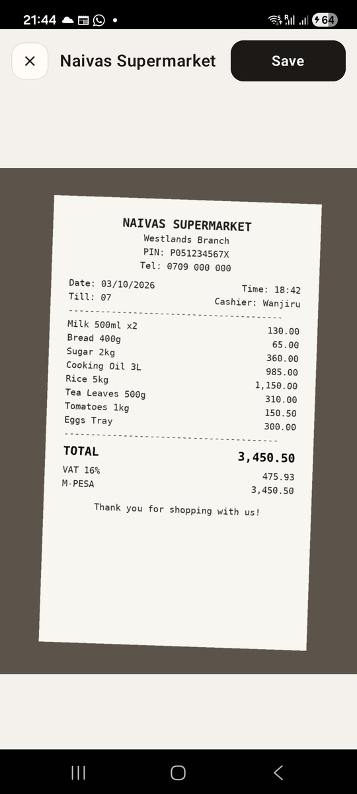
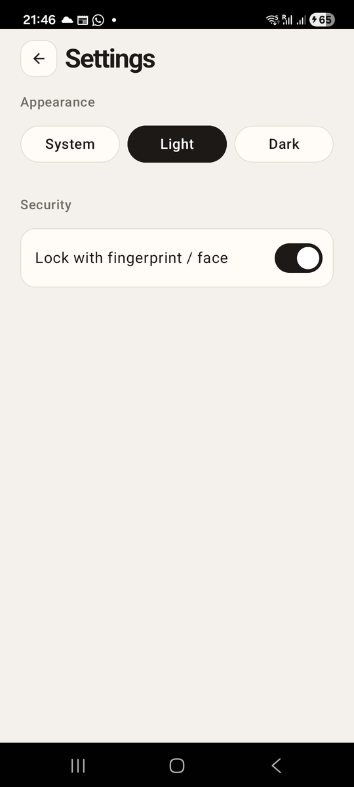
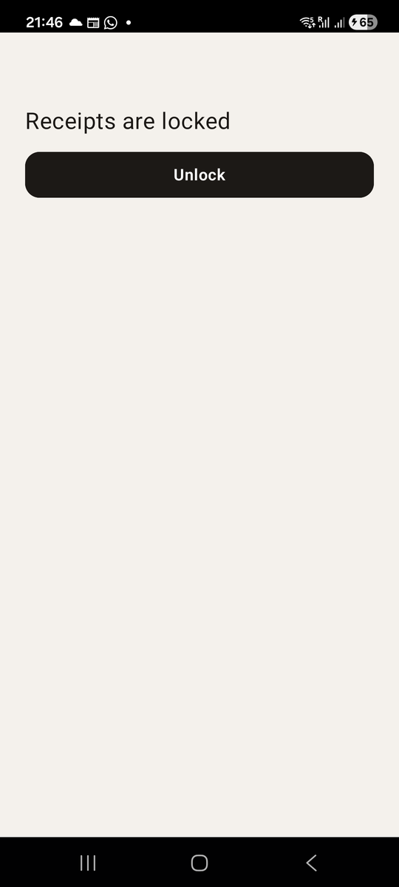

# Chapter 15: The Photo and the Lock

Previously, we photographed receipts with the camera and kept the photos
safely, by name, in Risiti's private folder. Two things are still missing
before Risiti's phone half feels finished.

A photo shown 220 high at the top of a form is fine for typing from, but
when an accountant asks "what was that charge?", you want the receipt full
screen, and sometimes you want to send it to someone. And a receipt book is
private: what you spent, where, when. On a phone that gets passed around,
lent to a child for a game, or left on a desk, it deserves a lock.

By the end of this chapter, you will know:

- How one screen can render in more than one mode.
- How to save a file to the phone's gallery.
- How to ask for a fingerprint or face check.
- How to lock a screen and unlock it.
- How to use a toggle.

## A full-screen photo, without a new screen

The obvious way to show a photo full screen is a new screen: push a
`PhotoScreen` with the photo's name, pop it to come back. It would work. But
the photo viewer doesn't do anything a screen needs: it loads nothing, and
it's always opened from the form and returns to it. Risiti does something
lighter. The form *renders differently* while a photo is being viewed.

Remember that `render/1` is a function, and functions can have more than
one clause. In `lib/risiti_app/screens/receipt_form_screen.ex`, add a
`:viewing_photo` assign in `mount/3`:

```elixir
        category: receipt.category,
        viewing_photo: false,
        errors: %{}
```

and a new `render/1` clause, *above* the one we have:

```elixir
  # The receipt photo, full screen, with a button to save it to the gallery.
  @impl Mob.Screen
  def render(%{viewing_photo: true} = assigns) do
    ~MOB"""
    <Column background={:background} fill_height={true}>
      <Row fill_width={true} align={:center} padding={12} gap={12}>
        {Header.icon_button("close", "Close photo", {self(), :close_photo})}
        <Text
          text={if @vendor == "", do: "Receipt photo", else: @vendor}
          text_size={16}
          font_weight="semibold"
          text_color={:on_background}
          max_lines={1}
          weight={1}
        />
        {ActionButton.button(nil, "Save", :save_photo, width: 96)}
      </Row>
      <Image
        src={Photos.path(@receipt.photo_path)}
        content_mode={:fit}
        fill_width={true}
        weight={1}
      />
    </Column>
    """
  end

  def render(assigns) do
    # ... the form, as before
```

When `@viewing_photo` is true, the first clause matches and the screen is a
photo viewer. Otherwise the form renders as before. The form's assigns, the
half-typed vendor and amount, are untouched while the photo is up, so
closing it brings the user back to exactly where they were.

A few details:

- **`content_mode={:fit}`**, not `:fill`. In the viewer we want the whole
  receipt, edges included, even if that leaves bars at the sides.
- **`weight={1}`** gives the photo all the height under the top bar.
- **`Header.icon_button/3`** is the square icon button from Chapter 9's
  header, reused for **Close**. That's why it's a public function.
- **The vendor as the title**, falling back to "Receipt photo" before
  anything has been typed.

If you've used a phone's photo app, you'll want to pinch to zoom. The real
Risiti has that, but it's a change to Mob's Android code, not something
stock Mob 0.9 does yet; we'll look at changing Mob's native side in Part II.

Now make the form's photo open the viewer. Add `on_tap` to the form's
`<Image>`:

```elixir
          <Image
            :if={@receipt.photo_path}
            src={Photos.path(@receipt.photo_path)}
            height={220}
            fill_width={true}
            corner_radius={16}
            content_mode={:fill}
            on_tap={{self(), :view_photo}}
            accessibility_label="View the receipt photo"
          />
```

Any node can take `on_tap`, an image included. The `accessibility_label`
tells a screen reader what tapping it does.

And handle opening and closing, with the aliases this needs
(`alias RisitiApp.{Native, Transactions}` and `Header` added to the
components alias):

```elixir
  def handle_info({:tap, :view_photo}, socket) do
    {:noreply, Mob.Socket.assign(socket, :viewing_photo, true)}
  end

  def handle_info({:tap, :close_photo}, socket) do
    {:noreply, Mob.Socket.assign(socket, :viewing_photo, false)}
  end
```

> **Back gesture.** While the photo is up, Android's back gesture still
> belongs to the router, and it pops the form, not the photo. For a viewer
> opened from a form, that's acceptable: the **Close** button is right
> there. If it bothers you, a separate screen is the way to give the photo
> its own back.

## Saving to the gallery

Risiti's photos live in its private folder, which is the right default:
other apps can't see them. But sometimes the user wants a receipt in their
gallery, to send on WhatsApp or attach to an email. Android keeps the
gallery in a shared library called the **MediaStore**, and Mob can add a
file to it.

It's a device call, so it goes in `lib/risiti_app/native.ex`:

```elixir
  @doc """
  Copies a photo into the phone's gallery. Replies
  `{:storage, :saved_to_library, path}` or `{:storage, :error, :save_to_library, reason}`.
  """
  def save_to_gallery(socket, path) do
    call(socket, :save_to_gallery, [path], &Mob.Storage.Android.save_to_media_store(&1, path, :image))
  end
```

`Mob.Storage.Android.save_to_media_store/3` copies the file into the
gallery. It needs no permission on Android 10 and later, for a file the app
made itself. Like everything native, it returns at once, and the result
arrives as a message.

The form's **Save** button calls it, and tells the user how it went:

```elixir
  def handle_info({:tap, :save_photo}, socket) do
    {:noreply, Native.save_to_gallery(socket, Photos.path(socket.assigns.receipt.photo_path))}
  end

  def handle_info({:storage, :saved_to_library, _path}, socket) do
    {:noreply, Native.toast(socket, "Saved to your phone's gallery")}
  end

  def handle_info({:storage, :error, :save_to_library, _reason}, socket) do
    {:noreply, Native.toast(socket, "Couldn't save the photo to your gallery")}
  end
```

A **toast** is the small message that appears near the bottom of the screen
for a couple of seconds and disappears by itself. It's the right weight for
"done": the user doesn't need to tap anything, but they shouldn't be left
wondering whether it worked.

## A fingerprint lock

The lock has three parts: a setting to turn it on, a check when Risiti
opens, and a locked screen until the check passes.

### The plugin

The fingerprint check is `mob_biometric`. Add it like the camera, in
`mix.exs`:

```elixir
      {:mob_camera, "~> 0.1"},
      {:mob_biometric, "~> 0.1"},
```

and in `mob.exs`:

```elixir
config :mob, :plugins, [:mob_camera, :mob_biometric]
```

Then `mix deps.get`, and a native deploy when we're done.

`mob_biometric` asks Android to check the user's fingerprint, or face on
phones that do that. There's no permission to request: the system's
biometric prompt *is* the permission. Android shows its own dialog, checks
against the fingerprints already enrolled in the phone's settings, and tells
us the result. Our app never sees the fingerprint itself.

The call goes in `RisitiApp.Native`:

```elixir
  @doc "Replies `{:biometric, :success | :failure | :not_available}`."
  def authenticate(socket, reason),
    do: call(socket, :authenticate, [reason], &MobBiometric.authenticate(&1, reason: reason))
```

The `reason` is the line Android shows in its prompt, so the user knows who
is asking and why.

### The setting

Whether the lock is on is a phone setting, like the theme, so it goes in
`Mob.State`. Create `lib/risiti_app/app_lock.ex`:

```elixir
# lib/risiti_app/app_lock.ex
defmodule RisitiApp.AppLock do
  @moduledoc """
  Whether the receipts open only after a fingerprint or face check. A phone
  setting, kept in `Mob.State`.
  """

  def enabled?, do: Mob.State.get(:app_lock, false) == true

  def set(enabled) when is_boolean(enabled), do: Mob.State.put(:app_lock, enabled)
end
```

`enabled?/0` compares with `== true` rather than trusting whatever is
stored, for the same reason as `Appearance.current/0`: data on a phone
outlives the code that wrote it.

> **In the real Risiti**, `app_lock` is a column on the user's profile, not a
> `Mob.State` key, because one phone can hold more than one person's receipt
> book, and each person chooses for their own. Profiles arrive in Part III;
> when they do, this setting moves with them.

### A toggle in Settings

On/off settings are what a **toggle** is for: the switch that slides left
and right. In `lib/risiti_app/screens/settings_screen.ex`, start from the
saved value in `mount/3`:

```elixir
     Mob.Socket.assign(socket,
       appearance: Appearance.current(),
       app_lock: RisitiApp.AppLock.enabled?()
     )
```

add a Security section under the appearance pills:

```elixir
          <Spacer size={8} />
          <Text text="Security" text_size={13} font_weight="medium" text_color={:muted} />
          {toggle_row("Lock with fingerprint / face", @app_lock, :app_lock)}
```

with the row, Risiti's own:

```elixir
  defp toggle_row(label, value, key) do
    ~MOB"""
    <Row
      fill_width={true}
      align={:center}
      background={:surface}
      border_color={:border}
      border_width={1}
      corner_radius={16}
      padding_left={16}
      padding_right={12}
      padding_top={8}
      padding_bottom={8}
    >
      <Text text={label} text_size={15} text_color={:on_surface} weight={1} />
      <Spacer size={12} />
      <Toggle value={value} on_change={{self(), key}} accessibility_label={label} />
    </Row>
    """
  end
```

and save the change as soon as it's made:

```elixir
  # A toggle sends its new value; the phone may send it as a string.
  def handle_info({:change, :app_lock, value}, socket) do
    enabled = value in [true, "true"]
    :ok = RisitiApp.AppLock.set(enabled)
    {:noreply, Mob.Socket.assign(socket, :app_lock, enabled)}
  end
```

A `<Toggle>` sends `{:change, tag, value}`, like a text field. The value
should be a boolean, but values cross from Kotlin to Elixir as data, so the
real app accepts the string `"true"` as well. Matching both costs nothing.

### Locking the receipts screen

The receipts screen is where Risiti opens, so that's where the lock goes. In
`lib/risiti_app/screens/receipts_screen.ex`, `mount/3` checks the setting
and, if it's on, asks for a fingerprint straight away:

```elixir
  @impl Mob.Screen
  def mount(_params, _session, socket) do
    socket =
      socket
      |> Mob.Socket.assign(:group, :all)
      |> Mob.Socket.assign(:locked, RisitiApp.AppLock.enabled?())
      |> Mob.List.put_renderer(:receipts, &list_item/1)
      |> load_receipts()

    socket =
      if socket.assigns.locked,
        do: Native.authenticate(socket, "Unlock your receipts"),
        else: socket

    {:ok, socket}
  end
```

While `@locked` is true, the screen shows nothing but a way to unlock. It's
the same multi-clause `render/1` trick as the photo viewer:

```elixir
  @impl Mob.Screen
  def render(%{locked: true}) do
    ~MOB"""
    <Column padding={24} background={:background} fill_height={true}>
      <Spacer size={48} />
      <Text text="Receipts are locked" text_size={:xl} text_color={:on_background} />
      <Spacer size={16} />
      {ActionButton.button(nil, "Unlock", :unlock)}
    </Column>
    """
  end

  def render(assigns) do
    # ... the receipts screen, as before
```

Note that the locked clause doesn't even take `assigns`. The receipts are
loaded, but nothing that renders them runs. There's no way for a receipt to
slip onto the screen through a bug in the normal render.

And the answers:

```elixir
  # ── App lock ──────────────────────────────────────────────────────────────

  def handle_info({:tap, :unlock}, socket) do
    {:noreply, Native.authenticate(socket, "Unlock your receipts")}
  end

  def handle_info({:biometric, :success}, socket) do
    {:noreply, Mob.Socket.assign(socket, :locked, false)}
  end

  # A phone with no fingerprint or face enrolled cannot lock the app; don't
  # lock the user out of their own receipts because of it.
  def handle_info({:biometric, :not_available}, socket) do
    socket = Native.toast(socket, "Biometric unlock is not set up on this phone")
    {:noreply, Mob.Socket.assign(socket, :locked, false)}
  end

  def handle_info({:biometric, _failure}, socket), do: {:noreply, socket}
```

The answer is one of three messages:

- `{:biometric, :success}`: the fingerprint matched. Unlock.
- `{:biometric, :failure}`: the user cancelled, or the finger didn't match.
  Stay locked; the **Unlock** button tries again.
- `{:biometric, :not_available}`: the phone has no fingerprint reader, or
  the user removed all their fingerprints after turning the lock on.

That last case needs a decision. Lock the user out of their own receipts
because their phone changed? Risiti says no: it unlocks, and says why with
a toast. An app that guards money might fall back to a PIN instead. Either
way, decide on purpose, not by accident.

## Run it

This chapter adds a plugin with native code, so:

```
mix deps.get
mix mob.deploy --native --device YOUR_DEVICE_ID
```

Open a receipt with a photo and tap the photo:



Tap **Save**, then look in your gallery. Now open Settings and turn on the
lock:



Close Risiti completely and open it again. Android asks for your
fingerprint, over a screen that shows nothing but the lock:



<!-- SHOT (by hand): Android's fingerprint prompt over this screen. Take it
with the phone's own screenshot buttons: the prompt is a system window, and
the capture script won't record system windows, because they can show your
notifications. Save it as images/15-fingerprint.png and add it here. -->

## Testing it

Every device call in this chapter went through `RisitiApp.Native`, so all of
it can be tested. Create `test/risiti_app/screens/lock_and_gallery_test.exs`:

```elixir
# test/risiti_app/screens/lock_and_gallery_test.exs
defmodule RisitiApp.Screens.LockAndGalleryTest do
  use Mob.ScreenCase, async: false

  import RisitiApp.ScreenHelpers

  alias RisitiApp.AppLock
  alias RisitiApp.Receipts.Photos
  alias RisitiApp.Screens.{ReceiptFormScreen, ReceiptsScreen, SettingsScreen}

  setup :checkout_repo

  describe "the app lock" do
    test "is off until switched on in Settings" do
      refute AppLock.enabled?()

      SettingsScreen |> mount_screen() |> render_info({:change, :app_lock, true})

      assert AppLock.enabled?()
    end

    test "a locked book asks for a fingerprint and shows nothing else" do
      AppLock.set(true)
      insert_transaction(vendor: "Naivas")

      view = mount_screen(ReceiptsScreen)

      assert_received {:native, :authenticate, ["Unlock your receipts"]}
      assert text(rendered(view)) =~ "Receipts are locked"
      refute text(rendered(view)) =~ "Naivas"
    end

    test "a recognised fingerprint unlocks it" do
      AppLock.set(true)
      insert_transaction(vendor: "Naivas")

      view = ReceiptsScreen |> mount_screen() |> render_info({:biometric, :success})

      assert text(rendered(view)) =~ "Naivas"
    end

    test "a failed check stays locked; a phone without biometrics doesn't lock you out" do
      AppLock.set(true)

      failed = ReceiptsScreen |> mount_screen() |> render_info({:biometric, :failure})
      assert assigns(failed).locked

      no_sensor = ReceiptsScreen |> mount_screen() |> render_info({:biometric, :not_available})
      refute assigns(no_sensor).locked
    end
  end

  describe "the photo viewer" do
    @tag :tmp_dir
    test "opens full screen and saves to the gallery", context do
      tmp = Path.join(context.tmp_dir, "camera.jpg")
      File.write!(tmp, "not really a jpeg")
      receipt = insert_transaction(photo_path: Photos.keep(tmp))
      path = Photos.path(receipt.photo_path)

      view =
        ReceiptFormScreen
        |> mount_screen(%{id: receipt.id})
        |> render_info({:tap, :view_photo})

      assert find(rendered(view), :image, src: path)
      refute text(rendered(view)) =~ "Date on receipt"

      render_info(view, {:tap, :save_photo})
      assert_received {:native, :save_to_gallery, [^path]}

      render_info(view, {:storage, :saved_to_library, path})
      assert_received {:native, :toast, ["Saved to your phone's gallery"]}
    end
  end
end
```

The most important test here is the second one: a locked book shows
"Receipts are locked" and *not* the vendor's name. A lock that shows your
receipts behind it isn't a lock, and that's exactly the kind of bug a quick
look on the phone misses, because the fingerprint prompt covers the screen.

Look at how the viewer test follows the whole conversation. We tap the
photo; the form becomes a viewer, and "Date on receipt" is gone. We tap
**Save**; the screen asks the phone to save the right file. We answer as
Android would; the screen asks for a toast with the right words. Three
round trips with the phone, no phone involved.

The tests that change the lock setting are `async: false`, because
`Mob.State` is one store for the whole app.

```
mix test
```

```
45 tests, 0 failures
```

## What we have so far

- A full-screen photo viewer, as a second `render/1` clause of the form.
- Saving a receipt photo to the phone's gallery.
- `RisitiApp.AppLock`, a toggle in Settings, and a receipts screen that
  stays locked until a fingerprint says otherwise.
- Tests for all of it, without a camera, a gallery or a finger.

The code at the end of this chapter is in `code/15/`.

## The end of Part I

Look at what Risiti has become. It opens on the month's spending, split into
food, fuel and everything else. It lists every receipt, filters them, and
opens any one of them. It adds, edits and deletes receipts in a database on
the phone, with no signal needed. It photographs receipts, keeps the photos
safely, shows them full screen and saves them to the gallery. It remembers
your theme, and locks behind your fingerprint. And it has 45 tests that run
in under a second on a laptop.

All of it is Elixir. We never opened Android Studio.

More important than the features are the ideas underneath them, because
they're what you'll use from here on:

- **A screen is a process.** State in assigns, events as messages.
- **The UI is data.** `render/1` returns a tree, and you can test it like
  any other value.
- **Native features are conversations.** Ask, then handle the answer in
  `handle_info/2`.
- **Device calls live at the edges.** One module wraps them, and everything
  around them is plain, testable Elixir.
- **The phone never waits for the network.** Everything the user sees is on
  the phone first.

In Part II, Risiti learns to read. We'll pull the vendor, date and total off
the photo with on-device OCR, scan the QR code on Kenyan tax receipts and
check it against the Kenya Revenue Authority, and turn expenses into refund
and payment claims.
