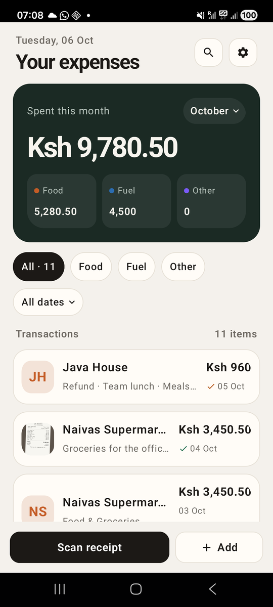
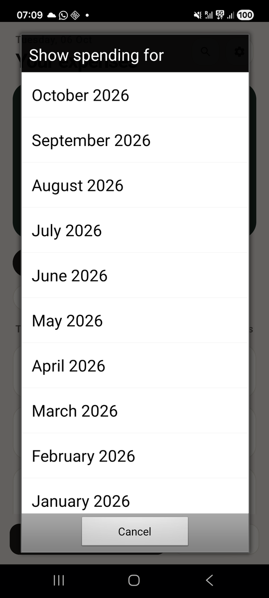
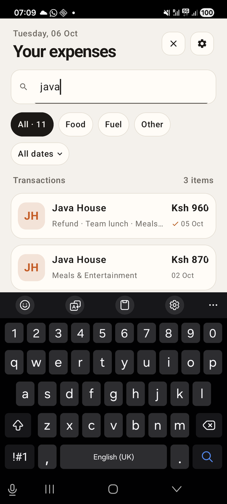
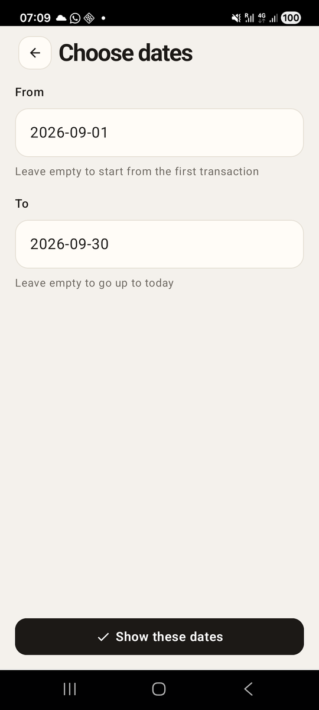
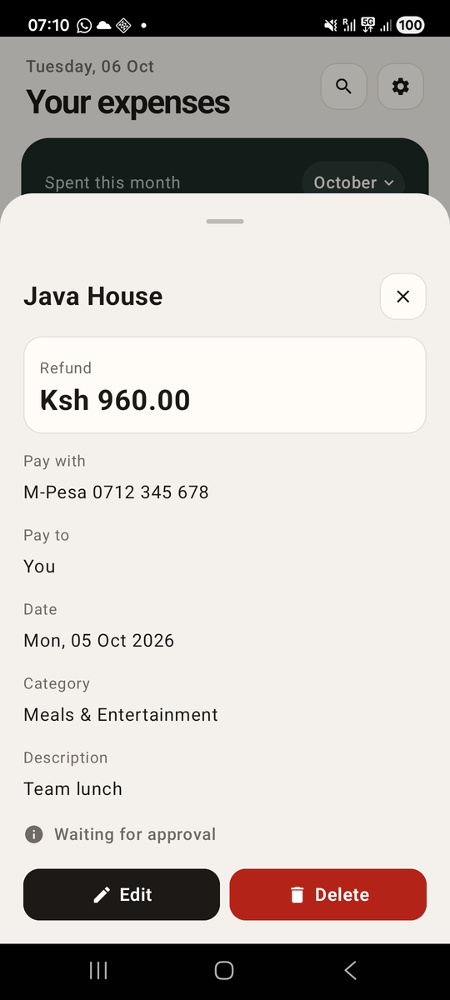

# Chapter 18: The Home Screen, Finished

Previously, we grew the `transactions` table into the real one: three types,
a status, and a `client_id` for sync. None of it showed. The home screen
still lists every row the same way, and tapping one jumps straight into the
edit form.

In this chapter, we finish the home screen. It's the screen people see
every time they open Risiti, so it has to answer their questions quickly:
how much did I spend last month? Where's that Java House receipt? What's
still waiting for approval? Every answer here is a way of narrowing the same
list, or of looking closer at one row.

By the end of this chapter, you will know:

- How to put native alerts and action sheets behind `RisitiApp.Native`, so
  tests can see them.
- How to offer a list of choices with an action sheet, and turn the answer
  back into data.
- How to search in SQLite as the user types, safely.
- How one screen asks another for an answer, and gets it back.
- How to show a native bottom sheet with Mob's `<Sheet>`.

Here's what we're adding, from top to bottom:

1. A **month pill** on the spend card, to see any of the last twelve months.
2. A **search** button in the header that swaps the spend card for a search
   box.
3. A **date pill** above the list: presets like "Last 7 days", or dates you
   choose on a screen of their own.
4. **Status** on each card: a small tick while a claim waits or once it's
   approved, a pill once it's paid or rejected.
5. A **details sheet** that slides up when you tap a transaction, with Edit
   and Delete.

## Asking the phone, through `Native`

Several of these features open something native: a list of months, a list
of periods, a "Delete this transaction?" dialog. Mob does that with
`Mob.Alert.alert/2` and `Mob.Alert.action_sheet/2`, and so far we've called
them directly. The receipt form's category sheet in Chapter 13 does.

That was fine while our tests only *answered* those dialogs. To test the
category, we sent `{:alert, :category_1}`, the message Android sends back
when the user taps an option, and never opened the sheet. But now we want
to check what the dialogs *offer*: twelve months, newest first; a "Choose
dates…" option after the presets. And under `mix test`, `Mob.Alert` calls
straight into the native layer, which isn't there.

We solved exactly this problem in Chapter 14, for the camera, with
`RisitiApp.Native`. Let's give it two more functions. In
`lib/risiti_app/native.ex`, below `toast/2`:

```elixir
  @doc "A dialog. The tapped button replies `{:alert, action}`."
  def alert(socket, opts), do: call(socket, :alert, [opts], &Mob.Alert.alert(&1, opts))

  @doc "A list of choices from the bottom of the screen. Replies `{:alert, action}`."
  def action_sheet(socket, opts),
    do: call(socket, :action_sheet, [opts], &Mob.Alert.action_sheet(&1, opts))
```

On the phone, they do what `Mob.Alert` does. In tests, they send
`{:native, :action_sheet, [opts]}` to the test process instead, and the
test can look inside `opts`. While you're in `receipts_screen.ex`, change
the camera screen's "Camera access needed" alert to `Native.alert/2` as
well, so the whole screen goes through one door.

## The month picker

Part I's spend card always shows this month. That's what you want most of
the time, but at the start of October the question is usually "what did we
spend in September?" So the card gets a pill in its top-right corner with
the month's name. Tapping it offers the last twelve months.

### Twelve months, newest first

First, the months themselves, in `lib/risiti_app/transactions.ex`:

```elixir
  @doc """
  The first day of each of the last `count` months, newest first.

      iex> RisitiApp.Transactions.recent_months(~D[2026-02-14], 3)
      [~D[2026-02-01], ~D[2026-01-01], ~D[2025-12-01]]
  """
  def recent_months(today \\ today(), count) do
    today
    |> Date.beginning_of_month()
    |> Stream.iterate(&Date.beginning_of_month(Date.add(&1, -1)))
    |> Enum.take(count)
  end
```

A month is represented by its first day. To get the month before, we step
back one day from the first, which lands on the last day of the previous
month, then take *that* month's first day. `Stream.iterate/2` keeps doing it
for as long as we ask, and `Enum.take/2` asks twelve times. Note the
doctest crossing a year boundary: February, January, then December 2025.
Month arithmetic is exactly where off-by-one bugs live, so the example is
also a test.

`summary/1` already takes a month, since Chapter 12. Nothing else in the
context changes.

### The pill

In the screen, the month becomes an assign, starting at this month:

```elixir
        month: Date.beginning_of_month(Transactions.today()),
```

and `load_receipts/1` passes it to `summary/1`. The spend card's first line
becomes a row: the label on the left, the pill on the right.

```elixir
        <Row fill_width={true} align={:center}>
          <Text
            text={spent_label(month)}
            text_size={13}
            text_color={Theme.color(:spend_muted)}
            weight={1}
          />
          <Row
            background={Theme.color(:spend_chip)}
            corner_radius={:radius_pill}
            padding_left={10}
            padding_right={6}
            padding_top={5}
            padding_bottom={5}
            align={:center}
            on_tap={{self(), :pick_month}}
            accessibility_label={"Month: #{month_label(month)}. Change month"}
          >
            <Text
              text={month_label(month)}
              text_size={13}
              font_weight="medium"
              text_color={Theme.color(:spend_text)}
            />
            <Spacer size={2} />
            <Icon name="expand_more" text_size={16} text_color={Theme.color(:spend_text)} />
          </Row>
        </Row>
```

The pill is a `Row`, not a `Box`, for the reason Chapter 6 found the hard
way: on Android, a `Box` with no width fills its whole row. A `Row` hugs
what's inside it.

The `accessibility_label` is what a screen reader says. A sighted user sees
"September" and a down arrow and understands. A blind user using TalkBack
would hear only "September", so we tell them what it is and what tapping
does.

Two small helpers write the words:

```elixir
  defp spent_label(month) do
    if month == Date.beginning_of_month(Transactions.today()),
      do: "Spent this month",
      else: "Spent in #{month_label(month, :long)}"
  end

  # "September" this year, "Sep 2025" before it; `:long` always has the year.
  defp month_label(month, style \\ :short) do
    cond do
      style == :long -> Calendar.strftime(month, "%B %Y")
      month.year == Transactions.today().year -> Calendar.strftime(month, "%B")
      true -> Calendar.strftime(month, "%b %Y")
    end
  end
```

The pill has little room, so it says "September" and only adds a year when
it isn't this one. The action sheet has room for "September 2026" every
time.

### Choices as atoms

Tapping the pill opens an action sheet: a short list of choices with a
title, the kind you get from a "Share" or "More" button. Android draws it;
we give it the title and the buttons. With Mob 0.9.12 on Android it appears
as a list in a dialog in the middle of the screen (iPhones slide theirs up
from the bottom), as you'll see when we run it.

```elixir
  def handle_info({:tap, :pick_month}, socket) do
    buttons =
      Transactions.recent_months(@months)
      |> Enum.with_index()
      |> Enum.map(fn {month, i} -> [label: month_label(month, :long), action: :"month_#{i}"] end)

    {:noreply,
     Native.action_sheet(socket,
       title: "Show spending for",
       buttons: buttons ++ [[label: "Cancel", style: :cancel]]
     )}
  end
```

Each button carries an `action`, and that's what comes back to us: tap
"August 2026" and the screen receives `{:alert, :month_2}`. An action has
to be an atom; we can't hand Android a `Date` and get it back.

So the months are numbered. `:month_0` is this month, `:month_1` last
month, and so on. At the top of the module we build a map from each action
back to its number:

```elixir
  # The month picker offers this many months back from today.
  @months 12

  # Action sheets answer with an atom, so each choice gets one, and these
  # maps turn the atom back into what was chosen.
  @month_actions Map.new(0..(@months - 1), &{:"month_#{&1}", &1})
```

and the reply looks itself up:

```elixir
  def handle_info({:alert, action}, socket) when is_map_key(@month_actions, action) do
    month = Enum.at(Transactions.recent_months(@months), @month_actions[action])
    {:noreply, socket |> Mob.Socket.assign(:month, month) |> load_receipts()}
  end
```

Why a map of twelve known atoms instead of parsing `"month_" <> n` out of
any atom that comes in? Two reasons. `is_map_key/2` works in a guard, so
this clause only ever matches our own twelve actions, and every other
`{:alert, ...}` falls through to the clauses below it. And the atoms are all
made at compile time. A screen that turned strings into atoms at run time
would be creating atoms the BEAM never frees, which is a habit worth not
starting.

Note that we look the month up again when the answer arrives, rather than
remembering the list we offered. If someone opens the sheet at 23:59 on the
last day of the month and taps at 00:01, the list has moved by one. It's an
edge case, and the cost of it is showing the neighbouring month; I've
decided I can live with that.

## Search

Next, the search. People don't scroll for receipts; they remember a name.
"The Naivas one", "that fuel receipt", "lunch".

### Searching in SQLite

The context does the work. `list_transactions` gets two more arguments, a
search and a period, each with a default so the old calls still work:

```elixir
  @doc """
  Transactions, newest first. `search` narrows them to those whose vendor,
  description or category contains it; `filter` to a spending group (or
  `:all`); `period` to a date range (see `date_range/2`).
  """
  def list_transactions(search \\ "", filter \\ :all, period \\ :all_dates) do
    from(t in Transaction, order_by: [desc: t.date, desc: t.id])
    |> filtered(filter)
    |> dated(date_range(period))
    |> searched(String.trim(search))
    |> Repo.all()
  end
```

Each narrowing is a function that takes a query and returns a query, so
they stack. That's the same composable-query style you've probably used in
Phoenix contexts: nothing touches the database until `Repo.all/1` at the end.

The search itself:

```elixir
  defp searched(query, ""), do: query

  # LIKE is case-insensitive for ASCII in SQLite; lower() on both sides
  # makes that explicit. % and _ in what was typed are matched literally.
  defp searched(query, term) do
    pattern = "%" <> escape_like(String.downcase(term)) <> "%"

    from t in query,
      where:
        fragment("lower(?) LIKE ? ESCAPE '\\'", t.vendor, ^pattern) or
          fragment("lower(?) LIKE ? ESCAPE '\\'", t.description, ^pattern) or
          fragment("lower(?) LIKE ? ESCAPE '\\'", t.category, ^pattern)
  end

  defp escape_like(term), do: String.replace(term, ~r/[\\%_]/, "\\\\\\0")
```

If you're coming from Postgres, you'd reach for `ilike/2`. SQLite doesn't
have `ILIKE`, so we lower-case both sides ourselves, through `fragment/1`.

`LIKE` has two wildcards: `%` for any run of characters and `_` for any one
character. If someone types "100%" looking for the "100% Juice Bar", the
`%` they typed would match everything. `escape_like/1` puts a backslash in
front of each `%`, `_` and backslash in what they typed, and
`ESCAPE '\'` tells SQLite that a backslash means "the next character is
just a character". The term itself is still a parameter (`^pattern`), never
pasted into the SQL, so there's no injection to worry about either. The
escaping is about getting the right answer, not about safety.

Searching description and category as well as the vendor is what makes
"lunch" or "fuel" work. People remember what something was for as often as
where they bought it.

### A search field

The box is a component, the same shape as the form fields from Chapter 13
but with a magnifying glass. Create
`lib/risiti_app/components/search_field.ex`:

```elixir
# lib/risiti_app/components/search_field.ex
defmodule RisitiApp.Components.SearchField do
  @moduledoc """
  A search box: a magnifying glass and a borderless text field in one
  rounded box.

      <SearchField query={@query} on_change={{self(), :search}} />

  Typing arrives as `{:change, tag, text}`, one message per keystroke.
  """

  import Mob.Sigil

  def expand(props, _children, _ctx) do
    query = Map.get(props, :query, "")
    on_change = Map.fetch!(props, :on_change)
    placeholder = Map.get(props, :placeholder, "Search receipts")

    ~MOB"""
    <Box
      background={:surface}
      border_color={:border}
      border_width={1}
      corner_radius={16}
      padding_left={14}
      padding_right={6}
      fill_width={true}
    >
      <Row fill_width={true} align={:center}>
        <Icon name="search" text_size={16} text_color={:muted} />
        <Spacer size={4} />
        <TextField
          value={query}
          placeholder={placeholder}
          on_change={on_change}
          weight={1}
          variant={:bare}
          background={:transparent}
          padding={0}
          return_key={:search}
        />
      </Row>
    </Box>
    """
  end
end
```

`return_key={:search}` changes the keyboard's Enter key into a magnifying
glass. It doesn't need to do anything here, because the list already
updates as you type, but the keyboard looks like it belongs to a search.

### Searching instead of spending

Where does the box go? There's no room for both a search box and the dark
spend card at the top of a phone screen, and while you're searching you
aren't interested in the month's total. So a search button in the header
*swaps* them. Two new assigns:

```elixir
        query: "",
        searching: false,
```

The header's actions start with a search button that turns into a close
button while searching:

```elixir
      <Header
        kicker={Calendar.strftime(Transactions.today(), "%A, %d %b")}
        title="Your expenses"
        actions={[search_action(@searching), {"settings", "Settings", :open_settings}]}
      />
      <Column padding_left={18} padding_right={18} padding_bottom={14}>
        <SearchField :if={@searching} query={@query} on_change={{self(), :search}} />
        {if not @searching, do: spend_card(@summary, @month)}
      </Column>
```

```elixir
  defp search_action(false), do: {"search", "Search transactions", :toggle_search}
  defp search_action(true), do: {"close", "Close search", :toggle_search}
```

The dock at the bottom goes too while searching, with
`{if not @searching, do: dock()}`. When the keyboard is up, the Scan and Add
buttons would sit right on top of it, taking room from the results.

You'll notice two different ways of leaving something out:
`<SearchField :if={...}>` and `{if not ..., do: ...}`. `:if` works on a tag.
The spend card is a function call inside braces, so it uses a plain `if`,
which returns `nil` when the condition is false; Mob skips `nil` children.

The handlers:

```elixir
  def handle_info({:tap, :toggle_search}, %{assigns: %{searching: true}} = socket) do
    {:noreply, socket |> Mob.Socket.assign(searching: false, query: "") |> load_receipts()}
  end

  def handle_info({:tap, :toggle_search}, socket) do
    {:noreply, Mob.Socket.assign(socket, :searching, true)}
  end

  def handle_info({:change, :search, query}, socket) do
    {:noreply, socket |> Mob.Socket.assign(:query, query) |> load_receipts()}
  end
```

Closing the search clears it. A list that stays quietly filtered after the
search box has gone is a list people stop trusting.

Every keystroke runs a query. Is that too much? On the phone, no. SQLite
answers from a file in the app's own storage, with no network in between,
and a person's receipt book has hundreds or a few thousand rows, not
millions. I measured nothing here because nothing felt slow. If it ever
does, the fix is an index or a short delay before searching, not a
different design.

## Date periods

The month picker answers "how much". The date pill answers "which ones".
It sits above the list and narrows it to a period: today, the last seven
days, this month, last month, this year, or any dates you choose.

### Periods as data

A period is an atom for the presets, and a tuple for chosen dates:

```elixir
  @periods [:all_dates, :today, :last_7_days, :this_month, :last_month, :this_year]

  @doc "The preset periods the date filter offers, in order."
  def periods, do: @periods
```

The context turns any period into two dates, either of which may be `nil`
for "no limit that way":

```elixir
  @doc """
  The first and last day of `period`. Either may be nil: no limit that way.

      iex> RisitiApp.Transactions.date_range(:last_month, ~D[2026-03-31])
      {~D[2026-02-01], ~D[2026-02-28]}

      iex> RisitiApp.Transactions.date_range(:last_7_days, ~D[2026-09-29])
      {~D[2026-09-23], ~D[2026-09-29]}

      iex> RisitiApp.Transactions.date_range({:dates, ~D[2026-01-01], nil}, ~D[2026-09-29])
      {~D[2026-01-01], nil}
  """
  def date_range(period, today \\ today())
  def date_range(:all_dates, _today), do: {nil, nil}
  def date_range(:today, today), do: {today, today}
  def date_range(:last_7_days, today), do: {Date.add(today, -6), today}
  def date_range(:this_month, today), do: {Date.beginning_of_month(today), today}

  def date_range(:last_month, today) do
    last_month = today |> Date.beginning_of_month() |> Date.add(-1)
    {Date.beginning_of_month(last_month), last_month}
  end

  def date_range(:this_year, today), do: {Date.new!(today.year, 1, 1), today}
  def date_range({:dates, from, to}, _today), do: {from, to}
```

`today` is an argument with a default, so the doctests can pin it.
"Last month" on the 31st of March is February, which has 28 days. That's the
kind of thing you want a test to have checked, not a user.

"Last 7 days" is today and the six days before it. Count them: seven.

Then `dated/2`, which `list_transactions/3` already calls, has one clause
per shape of range:

```elixir
  defp dated(query, {nil, nil}), do: query
  defp dated(query, {from, nil}), do: from(t in query, where: t.date >= ^from)
  defp dated(query, {nil, to}), do: from(t in query, where: t.date <= ^to)
  defp dated(query, {from, to}), do: from(t in query, where: t.date >= ^from and t.date <= ^to)
```

And the words for the pill:

```elixir
  @doc """
  What the date pill says.

      iex> RisitiApp.Transactions.period_label({:dates, ~D[2026-09-01], ~D[2026-09-15]})
      "1 Sep 2026 – 15 Sep 2026"

      iex> RisitiApp.Transactions.period_label({:dates, nil, ~D[2026-09-15]})
      "Up to 15 Sep 2026"
  """
  def period_label(:all_dates), do: "All dates"
  def period_label(:today), do: "Today"
  def period_label(:last_7_days), do: "Last 7 days"
  def period_label(:this_month), do: "This month"
  def period_label(:last_month), do: "Last month"
  def period_label(:this_year), do: "This year"
  def period_label({:dates, from, nil}), do: "From #{format_date(from)}"
  def period_label({:dates, nil, to}), do: "Up to #{format_date(to)}"
  def period_label({:dates, from, to}), do: "#{format_date(from)} – #{format_date(to)}"

  @doc """
  A date the way people write it.

      iex> RisitiApp.Transactions.format_date(~D[2026-09-03])
      "3 Sep 2026"
  """
  def format_date(%Date{} = date), do: "#{date.day} #{Calendar.strftime(date, "%b %Y")}"
```

`format_date/1` builds the day by hand because `%d` in `strftime` would
give "03 Sep", and people in Kenya write "3 Sep".

### The pill

```elixir
  # The date filter. Outlined while it shows all dates, filled in ink when
  # it's narrowing the list, so a filtered list never passes for a whole one.
  defp date_pill(period) do
    {background, border, text_color} =
      if period == :all_dates,
        do: {:surface, :border, :on_surface},
        else: {:on_background, :on_background, :background}

    ~MOB"""
    <Row padding_left={18} padding_right={18}>
      <Row
        background={background}
        border_color={border}
        border_width={1}
        corner_radius={:radius_pill}
        padding_left={12}
        padding_right={8}
        padding_top={6}
        padding_bottom={6}
        align={:center}
        on_tap={{self(), :pick_period}}
        accessibility_label={"Dates: #{Transactions.period_label(period)}. Change dates"}
      >
        <Text
          text={Transactions.period_label(period)}
          text_size={13}
          font_weight="medium"
          text_color={text_color}
          max_lines={1}
        />
        <Spacer size={2} />
        <Icon name="expand_more" text_size={16} text_color={text_color} />
      </Row>
    </Row>
    """
  end
```

It looks like the group pills from Chapter 8 on purpose: outlined when it's
not filtering, filled in ink when it is. The same visual rule everywhere
means people learn it once.

Below it, a small heading row tells them how many items they're looking
at, so a filter that hides everything but two rows says so:

```elixir
      <Row fill_width={true} padding_left={22} padding_right={22} padding_top={12} padding_bottom={8}>
        <Text
          text="Transactions"
          text_size={13}
          font_weight="semibold"
          text_color={:muted}
          weight={1}
        />
        <Text
          text={count_label(length(@items))}
          text_size={13}
          font_weight="semibold"
          text_color={:muted}
        />
      </Row>
```

```elixir
  defp count_label(1), do: "1 item"
  defp count_label(count), do: "#{count} items"
```

### Presets in an action sheet

Tapping the pill offers the presets, plus a way out to choose dates:

```elixir
  def handle_info({:tap, :pick_period}, socket) do
    presets =
      Enum.map(Transactions.periods(), fn period ->
        [label: Transactions.period_label(period), action: :"period_#{period}"]
      end)

    {:noreply,
     Native.action_sheet(socket,
       title: "Show transactions for",
       buttons:
         presets ++
           [[label: "Choose dates…", action: :choose_dates], [label: "Cancel", style: :cancel]]
     )}
  end

  def handle_info({:alert, action}, socket) when is_map_key(@period_actions, action) do
    {:noreply,
     socket |> Mob.Socket.assign(:period, @period_actions[action]) |> load_receipts()}
  end
```

The same trick as the months, with a map built at compile time from the
list of periods:

```elixir
  @period_actions Map.new(Transactions.periods(), &{:"period_#{&1}", &1})
```

Notice that this module attribute calls a function in another module,
`Transactions.periods/0`, while the screen is compiling. That works because
Elixir compiles `RisitiApp.Transactions` first when it sees the call. Keep
functions used like this simple and free of side effects; they run on your
computer, not on the phone.

### A screen that answers

"Choose dates…" needs more than an action sheet can hold: two dates, typed
in, and checked. That's a screen. But it's an odd kind of screen. It
doesn't save anything; it asks a question and hands the answer back to the
screen that opened it.

In a LiveView, you'd do this with a modal and `send(self(), ...)`, or a
`live_component` that notifies its parent. Mob screens are processes, as
we've seen since Chapter 3, so the answer to "how does one screen talk to
another?" is the BEAM's oldest one: send it a message. The home screen
passes its own pid when it pushes the date screen:

```elixir
  # Starts from the dates showing now, so a preset can be adjusted.
  def handle_info({:alert, :choose_dates}, socket) do
    {from, to} = Transactions.date_range(socket.assigns.period)

    {:noreply,
     Mob.Socket.push_screen(socket, DateRangeScreen, %{from: from, to: to, notify: self()})}
  end
```

and the date screen sends `{:dates_chosen, from, to}` to that pid before
popping itself off the stack. The home screen is still alive underneath, as
every screen on the stack is, so the message waits in its mailbox:

```elixir
  def handle_info({:dates_chosen, from, to}, socket) do
    period = if from == nil and to == nil, do: :all_dates, else: {:dates, from, to}
    {:noreply, socket |> Mob.Socket.assign(:period, period) |> load_receipts()}
  end
```

Here's the date screen. Create
`lib/risiti_app/screens/date_range_screen.ex`:

```elixir
# lib/risiti_app/screens/date_range_screen.ex
defmodule RisitiApp.Screens.DateRangeScreen do
  @moduledoc """
  Pick the dates the list shows: from one day to another. Either can be
  left empty, for no limit that way.

  Mount params: `from` and `to` (dates or nil) to start with, and `notify`,
  the screen that opened it. That screen gets `{:dates_chosen, from, to}`
  just before this one goes back to it.
  """

  use Mob.Screen

  alias RisitiApp.Components.{ActionButton, FormField}
  alias RisitiApp.Transactions

  @impl Mob.Screen
  def mount(params, _session, socket) do
    socket =
      Mob.Socket.assign(socket,
        notify: params[:notify],
        from: input(params[:from]),
        to: input(params[:to]),
        errors: %{}
      )

    {:ok, socket}
  end

  defp input(%Date{} = date), do: Date.to_iso8601(date)
  defp input(nil), do: ""

  @impl Mob.Screen
  def render(assigns) do
    ~MOB"""
    <Column background={:background} fill_width={true} fill_height={true}>
      <Header title="Choose dates" show_back={true} />
      <Column padding_left={18} padding_right={18} fill_width={true}>
        {FormField.field(
          label: "From",
          key: :from,
          value: @from,
          placeholder: "e.g. #{Date.to_iso8601(Date.beginning_of_month(Transactions.today()))}",
          hint: "Leave empty to start from the first transaction",
          error: @errors[:from]
        )}
        {FormField.field(
          label: "To",
          key: :to,
          value: @to,
          placeholder: "e.g. #{Date.to_iso8601(Transactions.today())}",
          hint: "Leave empty to go up to today",
          error: @errors[:to]
        )}
      </Column>
      <Spacer weight={1} />
      <Column fill_width={true} padding={18}>
        {ActionButton.button("check", "Show these dates", :apply)}
      </Column>
    </Column>
    """
  end

  @impl Mob.Screen
  def handle_info({:change, key, value}, socket) when key in [:from, :to] do
    {:noreply, Mob.Socket.assign(socket, key, value)}
  end

  def handle_info({:tap, :apply}, socket) do
    case parse(socket.assigns) do
      {:ok, from, to} ->
        if pid = socket.assigns.notify, do: send(pid, {:dates_chosen, from, to})
        {:noreply, Mob.Socket.pop_screen(socket)}

      {:error, errors} ->
        {:noreply, Mob.Socket.assign(socket, :errors, errors)}
    end
  end

  def handle_info({:tap, :back}, socket), do: {:noreply, Mob.Socket.pop_screen(socket)}

  def handle_info(_message, socket), do: {:noreply, socket}

  @doc """
  The two dates typed in, checked.

      iex> RisitiApp.Screens.DateRangeScreen.parse(%{from: "2026-09-01", to: " "})
      {:ok, ~D[2026-09-01], nil}

      iex> RisitiApp.Screens.DateRangeScreen.parse(%{from: "2026-09-10", to: "2026-09-01"})
      {:error, %{to: "must be on or after the From date"}}
  """
  def parse(%{from: from, to: to}) do
    case {date(from), date(to)} do
      {{:ok, from}, {:ok, to}} when is_nil(from) or is_nil(to) ->
        {:ok, from, to}

      {{:ok, from}, {:ok, to}} ->
        if Date.compare(from, to) == :gt,
          do: {:error, %{to: "must be on or after the From date"}},
          else: {:ok, from, to}

      {from, to} ->
        {:error,
         for(
           {key, :error} <- [from: from, to: to],
           into: %{},
           do: {key, "use the format 2026-09-23"}
         )}
    end
  end

  defp date(text) do
    case String.trim(text) do
      "" ->
        {:ok, nil}

      trimmed ->
        case Date.from_iso8601(trimmed) do
          {:ok, date} -> {:ok, date}
          {:error, _} -> :error
        end
    end
  end
end
```

A few things worth a word:

- **It starts from what's showing.** The home screen turns its current
  period into dates before pushing, so if you were looking at "Last month"
  and want to stretch it by a week, you start from last month's dates
  instead of two empty boxes.
- **The dates are typed.** Mob 0.9.12 doesn't have a native date picker
  component yet, so for now both dates are text, in the same ISO format the
  receipt form uses, with an example in the placeholder. The fields reuse
  `FormField` from Chapter 13, error and all.
- **`parse/1` is public and has doctests.** It has the screen's only real
  logic, and it doesn't need a screen to test.
- **The `for` comprehension** builds the error map from whichever of the two
  dates failed: one error, or both.
- **Back without applying** simply pops. No message is sent, and the home
  screen keeps the period it had.

Why `notify` and not a fixed module, say `send(ReceiptsScreen, ...)`? Because
the date screen shouldn't know who asked. It answers whoever passed their
pid, which makes it reusable by any screen, and, as we'll see, easy to test.

### When the list is empty

With three filters that combine, "No receipts yet" is no longer the only
reason for an empty list, and it would be wrong most of the time. Let's
say why it's empty:

```elixir
  # Says why the list is empty: a search, a period, a group, or a new book.
  defp empty_text("", :all, :all_dates), do: "No receipts yet. Scan one, or add it by hand."

  defp empty_text("", :all, period),
    do: "Nothing for #{String.downcase(Transactions.period_label(period))}."

  defp empty_text("", group, _period),
    do: "No #{String.downcase(Transactions.group_label(group))} expenses here."

  defp empty_text(_query, _group, _period), do: "Nothing matches your search."
```

"Nothing for last 7 days." reads a little oddly with chosen dates ("Nothing
for 1 sep 2026 – 15 sep 2026."), and I've left it that way. It's rare, it's
clear, and fixing it properly means another function head for the sake of a
capital S.

## Refunds and payments

The real home screen has a fifth pill after Other: **Refunds & payments**,
showing only the claims. We'll add it in Chapter 21, together with the
screens that create claims. A filter for things you can't make yet would
only ever show an empty list.

## Status on the card

Now that transactions have a status, the card should show it, without
turning into a form. Most of what's in someone's book is plain expenses
waiting for the next approval round; marking every one of them "Pending"
would be noise. So the card stays quiet about the normal case and speaks up
for the rest:

| What | Shown as |
|---|---|
| An expense, pending | Nothing |
| A claim, pending | An amber tick beside the date |
| Approved | A green tick beside the date |
| Paid | A green **Paid** pill under the date |
| Rejected | A red **Rejected** pill under the date |

A claim that's pending is different from an expense that's pending: someone
is waiting for their money, so it gets a mark. Paid and rejected are final,
and they get words, because colour alone is a poor way to say something
important. About one man in twelve can't tell red from green.

> **Stock icons.** The real Risiti marks paid with a banknote icon and
> pending with a "verified" badge. Mob 0.9.12's built-in icon set has 29
> names, and neither is among them; the real app patches the Android
> renderer (`MobBridge.kt`, in the generated `android/` folder) to add more.
> Here we use the stock `check` icon and pills, which say the same thing.

The amber needs a colour the theme doesn't have, so add it to both maps in
`lib/risiti_app/theme.ex`, next to the group colours:

```elixir
    other_tint: 0xFFE8E3FB,
    pending: 0xFFB45309
  }
```

```elixir
    other_tint: 0xFF2A2342,
    pending: 0xFFF59E0B
  }
```

The light theme's amber is darker than the dark theme's, so both read well
against their background.

In `lib/risiti_app/components/transaction_item.ex`, the card's text column
shows a subtitle instead of the bare category, and the amount column gets
the status:

```elixir
          <Column weight={1}>
            <Text
              text={transaction.vendor}
              text_size={15}
              font_weight="semibold"
              text_color={:on_surface}
              max_lines={1}
            />
            <Text
              text={subtitle(transaction)}
              text_size={12}
              text_color={:muted}
              max_lines={1}
            />
          </Column>
          <Column>
            <Text
              text={Transactions.format_short(transaction.amount_cents)}
              text_size={15}
              font_weight="bold"
              text_color={:on_surface}
            />
            <Row align={:center}>
              {status_icon(transaction)}
              <Text
                text={Calendar.strftime(transaction.date, "%d %b")}
                text_size={11}
                text_color={:muted}
              />
            </Row>
            {status_tag(transaction)}
          </Column>
```

and the functions behind it, below `expand/3`:

```elixir
  @doc """
  What it was for: the type of a claim, the description, the category.

      iex> RisitiApp.Components.TransactionItem.subtitle(%{
      ...>   type: "refund", description: "Team lunch", category: "Meals & Entertainment"
      ...> })
      "Refund · Team lunch · Meals & Entertainment"
  """
  def subtitle(transaction) do
    [claim_label(transaction), Map.get(transaction, :description), transaction.category]
    |> Enum.reject(&(&1 in [nil, ""]))
    |> Enum.join(" · ")
  end

  defp claim_label(%{type: type}) when type in ["refund", "payment_request"],
    do: Transactions.type_label(type)

  defp claim_label(_expense), do: nil

  # A tick beside the date: amber while a claim waits, green once approved.
  # An expense waiting for approval is the normal case, so it shows nothing.
  defp status_icon(%{status: "pending"} = transaction) do
    if Transaction.claim?(transaction),
      do: tick(Theme.color(:pending), "Waiting for approval"),
      else: []
  end

  defp status_icon(%{status: "approved"}), do: tick(:secondary, "Approved")
  defp status_icon(_transaction), do: []

  defp tick(color, label) do
    ~MOB"""
    <Row align={:center} accessibility_label={label}>
      <Icon name="check" text_size={13} text_color={color} />
      <Spacer size={3} />
    </Row>
    """
  end

  # Paid and rejected are final, so they get words, not just a colour.
  defp status_tag(%{status: status}) when status in ["paid", "rejected"] do
    {background, text_color} =
      if status == "paid", do: {:secondary, :on_secondary}, else: {:error, :on_error}

    ~MOB"""
    <Column padding_top={3}>
      <Row
        background={background}
        corner_radius={:radius_pill}
        padding_left={6}
        padding_right={6}
      >
        <Text
          text={Transactions.status_label(status)}
          text_size={10}
          font_weight="semibold"
          text_color={text_color}
        />
      </Row>
    </Column>
    """
  end

  defp status_tag(_transaction), do: []
```

Add `alias RisitiApp.Transactions.Transaction` at the top for `claim?/1`.

The subtitle puts the kind of claim first: "Refund · Team lunch · Meals &
Entertainment". On a card one line tall, the first words are the ones that
survive `max_lines={1}`, so they should be the ones that matter most.

The tick's `accessibility_label` is on its `Row`, so TalkBack says "Waiting
for approval" rather than "check".

Every function returns `[]` when there's nothing to show. A list is a
valid child in `~MOB`, and an empty one draws nothing. It's the same idea
as returning `nil`, and either works; the real app's components use `[]`,
so these do too.

## The details sheet

Last, what happens when you tap a transaction. Until now it opened the edit
form. That's a big jump for "let me check the amount", and with claims and
decisions there's more to show than the form has fields for: who it's paid
to, the approver's note, when it was decided. So a tap now opens a
**bottom sheet**: a panel that slides up over the list, shows everything
about the transaction, and offers Edit and Delete. Swipe it down and you're
back where you were.

You've used these in Google Maps (the panel about a place) and in most
music apps. Android calls it a modal bottom sheet. Mob gives us one as a
tag: `<Sheet>`.

### What the sheet shows

The body of the sheet is a list of labelled details. It lives in
`TransactionItem`, next to the card, because both are "how a transaction
looks", and the approver's screen in Part IV will show the same details:

```elixir
  @doc """
  The body of the details sheet: the type and amount in a box, then a row
  for each detail the transaction has. Empty ones are left out.
  """
  def details(transaction) do
    ~MOB"""
    <Column fill_width={true}>
      <Box
        background={:surface}
        border_color={:border}
        border_width={1}
        corner_radius={16}
        padding={14}
        fill_width={true}
      >
        <Column fill_width={true}>
          <Text text={Transactions.type_label(transaction.type)} text_size={12} text_color={:muted} />
          <Text
            text={Transactions.format_amount(transaction.amount_cents)}
            text_size={22}
            font_weight="bold"
            text_color={:on_surface}
          />
        </Column>
      </Box>
      {detail_row("Pay with", Transactions.pay_details(transaction))}
      {detail_row("Pay to", pay_to_label(transaction.pay_to))}
      {detail_row("Date", Calendar.strftime(transaction.date, "%a, %d %b %Y"))}
      {detail_row("Category", transaction.category)}
      {detail_row("Description", transaction.description)}
      {detail_row("Approver's note", transaction.decision_note)}
    </Column>
    """
  end

  defp pay_to_label("self"), do: "You"
  defp pay_to_label("supplier"), do: "A supplier"
  defp pay_to_label(_nobody), do: nil

  defp detail_row(_label, value) when value in [nil, ""], do: []

  defp detail_row(label, value) do
    ~MOB"""
    <Column fill_width={true} padding_top={10}>
      <Text text={label} text_size={12} text_color={:muted} />
      <Text text={value} text_size={14} text_color={:on_background} max_lines={3} />
    </Column>
    """
  end
```

`detail_row/2` leaves out anything empty, so an expense with no description
and no way of paying shows only what it has. The sheet works for all three
types without a `case` on the type.

The amount here is `format_amount/1`, with the cents: "Ksh 870.00". The card
uses the shorter `format_short/1`. In a list you're scanning; in the details
you're checking.

`pay_details/1` puts the way of paying into one line. It goes in the
context, with the method labels, since the PDF in Chapter 23 will print the
same line:

```elixir
  def method_label("cash"), do: "Cash"
  def method_label("send_money"), do: "Send money"
  def method_label("till"), do: "Till (Buy Goods)"
  def method_label("paybill"), do: "Paybill"
  def method_label("card"), do: "Card"
  def method_label("bank"), do: "Bank transfer"
  def method_label("other"), do: "Other"
  def method_label(nil), do: nil

  @doc """
  Where the money goes, in one line; nil when no way of paying is set.

      iex> RisitiApp.Transactions.pay_details(%RisitiApp.Transactions.Transaction{method: "paybill", paybill_number: "400200", account_number: "12345"})
      "Paybill 400200 · Acc 12345"

      iex> RisitiApp.Transactions.pay_details(%RisitiApp.Transactions.Transaction{method: "send_money", phone: "+254712345678"})
      "M-Pesa 0712 345 678"
  """
  def pay_details(%Transaction{method: "send_money", phone: phone}),
    do: "M-Pesa #{local_phone(phone)}"

  def pay_details(%Transaction{method: "till", till_number: till}), do: "Till #{till}"

  def pay_details(%Transaction{method: "paybill", paybill_number: paybill, account_number: acc}),
    do: "Paybill #{paybill} · Acc #{acc}"

  def pay_details(%Transaction{method: method}), do: method_label(method)

  # "+254712345678" as people write it: "0712 345 678".
  defp local_phone("+254" <> <<a::binary-size(3), b::binary-size(3), c::binary-size(3)>>),
    do: "0#{a} #{b} #{c}"

  defp local_phone(phone), do: phone || ""
```

The phone number is stored as `+254712345678` (Chapter 17 made sure of
that), and shown the way it's written on a Kenyan business card. The binary
pattern in `local_phone/1` splits the nine digits into three groups of
three, right in the function head.

### The sheet itself

Create `lib/risiti_app/components/transaction_sheet.ex`:

```elixir
# lib/risiti_app/components/transaction_sheet.ex
defmodule RisitiApp.Components.TransactionSheet do
  @moduledoc """
  A bottom sheet with everything about one transaction, opened by tapping it
  in the list.

      <TransactionSheet :if={@selected} transaction={@selected} />

  Sends `{:tap, :edit_transaction}`, `{:tap, :delete_transaction}` and
  `{:tap, :close_transaction}`, or `{:dismiss, :close_transaction}` when
  it's swiped away.
  """

  import Mob.Sigil

  alias RisitiApp.Components.{ActionButton, Header, TransactionItem}
  alias RisitiApp.Transactions.Transaction

  def expand(props, _children, _ctx) do
    transaction = Map.fetch!(props, :transaction)

    ~MOB"""
    <Sheet
      id={"transaction-#{transaction.id}"}
      detents={[:content]}
      background={:background}
      corner_radius={28}
      on_dismiss={{self(), :close_transaction}}
    >
      <Column fill_width={true} padding={20}>
        <Row fill_width={true} align={:center}>
          <Text
            text={transaction.vendor}
            text_size={20}
            font_weight="bold"
            text_color={:on_background}
            max_lines={2}
            weight={1}
          />
          <Spacer size={12} />
          {Header.icon_button("close", "Close", {self(), :close_transaction})}
        </Row>
        <Spacer size={14} />
        {TransactionItem.details(transaction)}
        {status_line(transaction)}
        <Spacer size={16} />
        {edit_buttons(transaction)}
      </Column>
    </Sheet>
    """
  end

  # Where the decision stands, in words.
  defp status_line(transaction) do
    {icon, color, text} = status(transaction)

    ~MOB"""
    <Row fill_width={true} align={:center} padding_top={12}>
      <Icon name={icon} text_size={18} text_color={color} />
      <Spacer size={8} />
      <Text text={text} text_size={13} font_weight="medium" text_color={color} weight={1} />
    </Row>
    """
  end

  defp status(%{status: "paid", paid_at: at}), do: {"check", :secondary, "Paid#{on(at)}"}

  defp status(%{status: "approved", decided_at: at} = transaction) do
    waiting = if Transaction.claim?(transaction), do: " · waiting to be paid", else: ""
    {"check", :secondary, "Approved#{on(at)}#{waiting}"}
  end

  defp status(%{status: "rejected", decided_at: at}), do: {"close", :error, "Rejected#{on(at)}"}
  defp status(_pending), do: {"info", :muted, "Waiting for approval"}

  defp on(%DateTime{} = at), do: " · #{Calendar.strftime(at, "%d %b")}"
  defp on(nil), do: ""

  # A paid transaction is settled: nothing left to change.
  defp edit_buttons(%{status: "paid"}), do: []

  defp edit_buttons(_transaction) do
    ~MOB"""
    <Row fill_width={true} gap={8}>
      {ActionButton.button("edit", "Edit", :edit_transaction, weight: 1)}
      {ActionButton.button("trash", "Delete", :delete_transaction, style: :danger, weight: 1)}
    </Row>
    """
  end
end
```

Let's break down the `<Sheet>`:

- **`detents={[:content]}`.** A *detent* is a height the sheet rests at.
  The standard ones are `:medium` (half the screen) and `:large` (nearly
  all of it). `:content` means "as tall as what's inside", which suits a
  short list of details.
- **`on_dismiss`** is what makes swiping work. When the user drags the sheet
  down, taps the dimmed list behind it, or presses Back, Android closes it
  *itself*, then tells us with `{:dismiss, :close_transaction}`. We still
  need to clear `selected`, or the next render would bring the sheet
  straight back.
- **`id`** includes the transaction's id, so tapping a different
  transaction is a different sheet, not the same one with new text.
- **Children are ordinary Mob nodes.** Everything inside the sheet is the
  same `Column`, `Row`, `Text` and components as the rest of the app.

The sheet's status line is the long form of the card's ticks and pills:
"Approved · 03 Oct · waiting to be paid". The card has room for a mark; the
sheet has room for a sentence.

There are no Edit or Delete buttons on a paid transaction, which matches the
rule in the context: `update_transaction/2` refuses a paid one. The form's
toast from Chapter 17 is the safety net, and this is the reason it rarely
shows.

### Opening, closing, editing, deleting

The sheet is driven by one assign, `selected`. It's `nil` when nothing is
selected, and the transaction when one is. At the bottom of `render/1`:

```elixir
      <TransactionSheet :if={@selected} transaction={@selected} />
```

A sheet is a child of the screen like any other, and `:if` decides whether
it's there. That's the same shape as a LiveView modal driven by an assign:
the state says whether it's open, and rendering follows.

Selecting a row, which used to push the form, now selects:

```elixir
  @impl Mob.Screen
  def handle_info({:select, :receipts, index}, socket) do
    {:noreply, Mob.Socket.assign(socket, :selected, Enum.at(socket.assigns.items, index))}
  end
```

and the sheet's buttons:

```elixir
  def handle_info({event, :close_transaction}, socket) when event in [:tap, :dismiss] do
    {:noreply, Mob.Socket.assign(socket, :selected, nil)}
  end

  def handle_info({:tap, :edit_transaction}, socket) do
    %{id: id} = socket.assigns.selected

    {:noreply,
     socket
     |> Mob.Socket.assign(:selected, nil)
     |> Mob.Socket.push_screen(ReceiptFormScreen, %{id: id})}
  end

  def handle_info({:tap, :delete_transaction}, socket) do
    {:noreply,
     Native.alert(socket,
       title: "Delete this transaction?",
       message: "It will be removed from this phone. This cannot be undone.",
       buttons: [
         [label: "Delete", style: :destructive, action: :confirm_delete],
         [label: "Cancel", style: :cancel]
       ]
     )}
  end

  def handle_info({:alert, :confirm_delete}, %{assigns: %{selected: nil}} = socket),
    do: {:noreply, socket}

  def handle_info({:alert, :confirm_delete}, socket) do
    {:ok, _} = Transactions.delete_transaction(socket.assigns.selected)

    {:noreply,
     socket
     |> Mob.Socket.assign(:selected, nil)
     |> Native.toast("Deleted")
     |> load_receipts()}
  end
```

`{event, :close_transaction}` with a guard handles both the Close button
(`:tap`) and the swipe (`:dismiss`) in one clause.

Edit closes the sheet *before* pushing the form. When you come back from
the form, the home screen is mounted fresh (Chapter 13's `reset_to/4`), so
it wouldn't matter here, but a sheet left open under a pushed screen is a
classic source of "why is that still there?" bugs. Close what you opened.

The delete confirmation guards against `selected` being `nil`. Can that
happen? The alert is a separate native dialog; while it's up, nothing else
should close the sheet. But "shouldn't" isn't "can't", and the empty clause
costs two lines.

## Wiring it up

The screen uses two new tags, `<SearchField>` and `<TransactionSheet>`, so
register them in `lib/risiti_app/components.ex`:

```elixir
  @composites [
    header: RisitiApp.Components.Header,
    transaction_item: RisitiApp.Components.TransactionItem,
    search_field: RisitiApp.Components.SearchField,
    transaction_sheet: RisitiApp.Components.TransactionSheet
  ]
```

and tell the sigil about them in `config/config.exs`:

```elixir
config :mob, :extra_tags, ~w(Header TransactionItem SearchField TransactionSheet)
```

Forget the second step and the compiler warns about an unknown tag at the
line that uses it. As in Chapter 9, run `mix compile --force` once after
changing `extra_tags`, so screens that were already compiled pick it up.

The mount gathers all the new assigns in one place:

```elixir
  @impl Mob.Screen
  def mount(_params, _session, socket) do
    socket =
      socket
      |> Mob.Socket.assign(
        query: "",
        searching: false,
        group: :all,
        period: :all_dates,
        month: Date.beginning_of_month(Transactions.today()),
        selected: nil,
        locked: RisitiApp.AppLock.enabled?()
      )
      |> Mob.List.put_renderer(:receipts, &list_item/1)
      |> load_receipts()

    socket =
      if socket.assigns.locked,
        do: Native.authenticate(socket, "Unlock your receipts"),
        else: socket

    {:ok, socket}
  end

  defp load_receipts(socket) do
    %{query: query, group: group, period: period, month: month} = socket.assigns

    Mob.Socket.assign(socket,
      items: Transactions.list_transactions(query, group, period),
      summary: Transactions.summary(month)
    )
  end
```

`load_receipts/1` reads everything it needs from the assigns. Every handler
that changes a filter assigns the new value and calls it, so there's one
place that decides what the list shows. If you've ever chased a LiveView
bug where one filter forgot to keep the others, you'll see why it's worth
the extra line in each handler.

One last change came from running it on a phone. With amounts like
"Ksh 5,280.50", the Food cell on the spend card wrapped onto two lines.
The cells are narrow, and their labels already say what they hold, so they
drop the currency:

```elixir
          text={bare_amount(cents)}
```

```elixir
  # "5,280.50" without the currency: the cells are narrow, and the label
  # above them already says what they are.
  defp bare_amount(cents),
    do: cents |> Transactions.format_short() |> String.replace_prefix("Ksh ", "")
```

The big total above them keeps its "Ksh". Tests wouldn't have caught this;
only the phone did.

The full screen, with all of this in place, is in
`code/18/lib/risiti_app/screens/receipts_screen.ex`.

## Run it

```
mix mob.deploy --device YOUR_DEVICE_ID
```

The spend card has its month pill, and the date pill sits above the list:



At the top of the list are a refund waiting for approval (the amber tick),
an approved expense (green) and, just below, one rejected as a duplicate.

Tap the month pill, pick last month, and the card follows:



Tap the magnifying glass and type "java":



Note the keyboard's Enter key: a magnifying glass, from `return_key={:search}`.

Close the search, tap **All dates**, pick **Last month**, then tap the pill
again and choose **Choose dates…**. The screen starts from last month's
dates, ready to adjust:



And tap any transaction:



To see the statuses, you need some decisions, and nothing on the phone
makes them yet. Use the connected IEx shell, as in Chapter 17:

```elixir
iex> node = hd(Node.list())
iex> [first, second | _] = :rpc.call(node, RisitiApp.Transactions, :list_transactions, [])
iex> :rpc.call(node, RisitiApp.Transactions, :decide, [first, "approved"])
iex> :rpc.call(node, RisitiApp.Transactions, :decide, [second, "rejected", "Personal"])
```

The screen doesn't know the database changed behind its back, so tap the
**All** pill to reload the list. The first card has a green tick, the
second a red pill, and its sheet shows the approver's note.

## Testing it

The screen does a lot more than it did, so it gets the most tests. First,
the context, in `test/risiti_app/transactions_test.exs`. Add a doctest
line under `setup :checkout_repo`, which runs every example in
`RisitiApp.Transactions`' docs:

```elixir
  doctest RisitiApp.Transactions
```

and a `describe` block for the list:

```elixir
  describe "list_transactions/3" do
    test "search matches vendor, description and category, in any case" do
      insert_transaction(vendor: "Naivas Westlands")
      insert_transaction(vendor: "Java House", description: "Lunch with the Naivas team")
      insert_transaction(vendor: "Shell Ngong Road", category: "Fuel")

      vendors = &(&1 |> Transactions.list_transactions() |> Enum.map(fn t -> t.vendor end))

      assert vendors.("naivas") |> Enum.sort() == ["Java House", "Naivas Westlands"]
      assert vendors.("FUEL") == ["Shell Ngong Road"]
      assert vendors.("  ") |> length() == 3
    end

    test "% and _ in a search are just characters" do
      insert_transaction(vendor: "Naivas")
      insert_transaction(vendor: "100% Juice Bar")

      assert [%{vendor: "100% Juice Bar"}] = Transactions.list_transactions("%")
      assert Transactions.list_transactions("_") == []
    end

    test "a period keeps the dates inside it, and the filters combine" do
      today = Transactions.today()
      insert_transaction(vendor: "Today's lunch", category: "Meals & Entertainment", date: today)

      insert_transaction(
        vendor: "Old lunch",
        category: "Meals & Entertainment",
        date: Date.add(today, -40)
      )

      insert_transaction(vendor: "Today's fuel", category: "Fuel", date: today)

      assert today
             |> then(&Transactions.list_transactions("lunch", :food, {:dates, &1, &1}))
             |> Enum.map(& &1.vendor) == ["Today's lunch"]

      assert length(Transactions.list_transactions("", :all, :last_7_days)) == 2
    end
  end
```

The second test is the one that would have caught a missing
`escape_like/1`. Without it, "%" matches both vendors and "_" matches
everything.

Then the components, in `test/risiti_app/components_test.exs`. The card's
test used a plain map until now; with statuses and types it needs a real
`%Transaction{}`, so let's define one at the top of the module and reuse it:

```elixir
  alias RisitiApp.Components.{ActionButton, Header, TransactionItem, TransactionSheet}
  alias RisitiApp.Transactions.Transaction

  doctest TransactionItem

  @java %Transaction{
    id: 1,
    vendor: "Java House",
    category: "Meals & Entertainment",
    amount_cents: 87_000,
    date: ~D[2026-10-02]
  }
```

The struct's defaults fill in the rest: an `"expense"`, `"pending"`. The
old test becomes `TransactionItem.expand(%{transaction: @java}, [], %{})`,
and two new ones check the status marks and the sheet:

```elixir
  test "TransactionItem keeps quiet about a pending expense, not a pending claim" do
    card = &TransactionItem.expand(%{transaction: &1}, [], %{})

    refute find(card.(@java), :row, accessibility_label: "Waiting for approval")

    claim = %{@java | type: "refund", method: "cash"}
    assert find(card.(claim), :row, accessibility_label: "Waiting for approval")
    assert text(card.(claim)) =~ "Refund · Meals & Entertainment"

    assert find(card.(%{@java | status: "approved"}), :row, accessibility_label: "Approved")
    assert text(card.(%{@java | status: "rejected"})) =~ "Rejected"
    assert text(card.(%{@java | status: "paid"})) =~ "Paid"
  end

  test "TransactionSheet shows the details, and no buttons once it's paid" do
    sheet = &TransactionSheet.expand(%{transaction: &1}, [], %{})

    pending = sheet.(%{@java | description: "Team lunch"})
    assert text(pending) =~ "Ksh 870.00"
    assert text(pending) =~ "Team lunch"
    assert text(pending) =~ "Waiting for approval"
    assert find(pending, :box, accessibility_label: "Edit")
    assert_renderable(pending)

    paid =
      sheet.(%{
        @java
        | type: "refund",
          status: "paid",
          method: "send_money",
          phone: "+254712345678"
      })

    assert text(paid) =~ "M-Pesa 0712 345 678"
    refute find(paid, :box, accessibility_label: "Edit")
  end
```

Note how the tests find the ticks: by their `accessibility_label`. That's
not a trick. If a test can't tell an approved card from a pending one
without looking at colours, neither can a blind user, and the label is
what fixes both.

The date screen gets a test file of its own,
`test/risiti_app/screens/date_range_screen_test.exs`:

```elixir
# test/risiti_app/screens/date_range_screen_test.exs
defmodule RisitiApp.Screens.DateRangeScreenTest do
  use Mob.ScreenCase

  alias RisitiApp.Screens.DateRangeScreen

  doctest DateRangeScreen

  test "starts from the dates it's given" do
    view = mount_screen(DateRangeScreen, %{from: ~D[2026-09-01], to: nil})
    assert %{from: "2026-09-01", to: ""} = assigns(view)
  end

  test "sends the dates back to the screen that asked, then goes back" do
    view =
      DateRangeScreen
      |> mount_screen(%{notify: self()})
      |> render_info({:change, :from, "2026-09-01"})
      |> render_info({:change, :to, "2026-09-15"})
      |> render_info({:tap, :apply})

    assert_received {:dates_chosen, ~D[2026-09-01], ~D[2026-09-15]}
    assert view.socket.__mob__.nav_action == {:pop}
  end

  test "a date it can't read stays on the screen, with the error under it" do
    view =
      DateRangeScreen
      |> mount_screen(%{notify: self()})
      |> render_info({:change, :from, "1/9/2026"})
      |> render_info({:tap, :apply})

    refute_received {:dates_chosen, _, _}
    assert text(tree(view)) =~ "use the format 2026-09-23"
  end
end
```

Look at the second test. The test process passes *itself* as `notify`, plays
the part of the home screen, and receives the answer in its own mailbox.
Screens are processes, tests are processes, and a message is a message.

Add `{DateRangeScreen, %{}}` to the list in `all_screens_test.exs`, so the
new screen is checked for a renderable tree and for ignoring stray messages
like every other.

Finally, the home screen. In `receipts_screen_test.exs`, the test that
expected a tap to open the form becomes three about the sheet, and the new
features get theirs. Here are the ones that show something new:

```elixir
  defp vendors(view), do: view |> assigns() |> Map.fetch!(:items) |> Enum.map(& &1.vendor)

  describe "the details sheet" do
    test "selecting a row opens its sheet; Close shuts it" do
      insert_transaction(vendor: "Java House", amount_cents: 87_000)

      view = ReceiptsScreen |> mount_screen() |> render_info({:select, :receipts, 0})

      assert assigns(view).selected.vendor == "Java House"
      assert find(rendered(view), :sheet, [])
      assert text(rendered(view)) =~ "Ksh 870.00"
      assert_renderable(rendered(view))

      view = render_info(view, {:dismiss, :close_transaction})
      refute find(rendered(view), :sheet, [])
    end

    test "Delete asks first, then removes it" do
      insert_transaction(vendor: "Java House")

      view =
        ReceiptsScreen
        |> mount_screen()
        |> render_info({:select, :receipts, 0})
        |> render_info({:tap, :delete_transaction})

      assert_received {:native, :alert, [opts]}
      assert opts[:title] == "Delete this transaction?"
      assert vendors(view) == ["Java House"]

      view = render_info(view, {:alert, :confirm_delete})

      assert vendors(view) == []
      assert Transactions.list_transactions() == []
      assert_received {:native, :toast, ["Deleted"]}
    end
  end

  describe "the month picker" do
    test "offers the last twelve months and shows the one picked" do
      last_month = Transactions.today() |> Date.beginning_of_month() |> Date.add(-1)
      insert_transaction(amount_cents: 100_000)
      insert_transaction(amount_cents: 250_000, date: last_month)

      view = ReceiptsScreen |> mount_screen() |> render_info({:tap, :pick_month})

      assert_received {:native, :action_sheet, [opts]}
      assert length(opts[:buttons]) == 13
      assert hd(opts[:buttons])[:label] == Calendar.strftime(Transactions.today(), "%B %Y")

      view = render_info(view, {:alert, :month_1})

      assert text(rendered(view)) =~ "Spent in #{Calendar.strftime(last_month, "%B %Y")}"
      assert text(rendered(view)) =~ "Ksh 2,500"
    end
  end

  describe "dates" do
    setup do
      today = Transactions.today()
      insert_transaction(vendor: "Today", date: today)
      insert_transaction(vendor: "Last year", date: Date.add(today, -400))
      [today: today]
    end

    test "Choose dates opens the date screen, which answers with the dates", %{today: today} do
      view = ReceiptsScreen |> mount_screen() |> render_info({:alert, :choose_dates})

      assert {:push, DateRangeScreen, %{from: nil, to: nil, notify: pid}} =
               view.socket.__mob__.nav_action

      assert pid == self()

      view = render_info(view, {:dates_chosen, nil, Date.add(today, -1)})
      assert vendors(view) == ["Last year"]
      assert text(rendered(view)) =~ "Up to "
    end
  end
```

The month test is where `Native.action_sheet/2` pays off. We check what the
sheet *offers* (twelve months and Cancel, newest first) and then answer it
the way Android would, with `{:alert, :month_1}`.

The date test is the other half of the date screen's test. There, the test
played the home screen; here, it plays the date screen, sending
`{:dates_chosen, ...}` straight to the home screen's `handle_info/2`.
Between the two, the whole conversation is covered without either screen
needing the other.

The rest (Edit, the two search tests, and a preset period) are in
`code/18/test/risiti_app/screens/receipts_screen_test.exs`.

```
mix test
```

```
15 doctests, 73 tests, 0 failures
```

## What we have so far

- `Native.alert/2` and `Native.action_sheet/2`, so tests can see what a
  dialog offers.
- A month pill on the spend card, choosing from the last twelve months.
- Search as you type, across vendor, description and category, with `LIKE`
  escaped properly.
- A date pill with presets, and a Choose dates screen that answers the
  screen that opened it with a message.
- Status on each card, quiet for the normal case and in words for the
  final ones.
- A native bottom sheet with a transaction's details, Edit and Delete.

The code at the end of this chapter is in `code/18/`.

The home screen is finished, but filling it is still slow: every receipt is
typed in by hand, even when its photo is right there. In the next chapter,
we teach Risiti to read the receipt.
