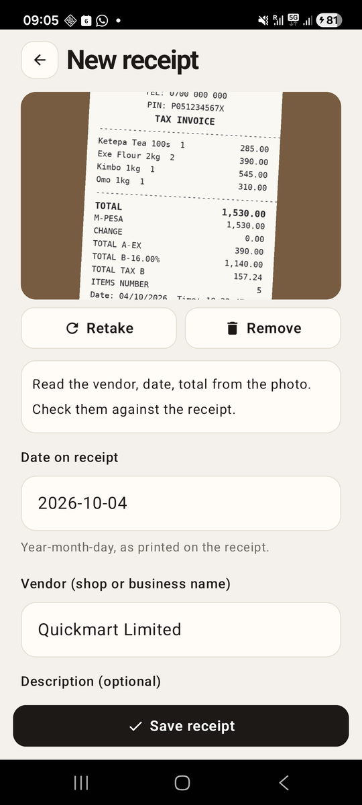
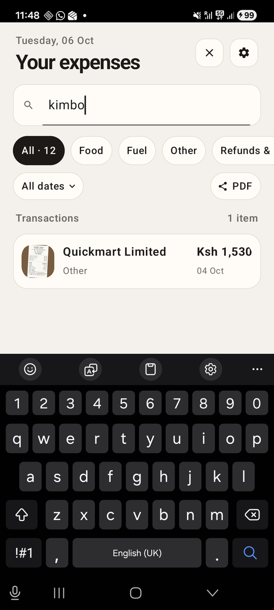

# Chapter 19: Reading a Receipt

Previously, we finished the home screen: a month picker, search, date
periods, and a sheet with each transaction's details. Filling the list,
though, is still slow. You photograph a receipt, then type its vendor, its
date and its total by hand, while the photo with all three printed on it
sits right above the form.

In this chapter, Risiti reads the receipt. You take the photo, and a second
later the form fills itself in. This is the feature people notice first,
and the one that decides whether they keep using the app after the first
week.

By the end of this chapter, you will know:

- Why Risiti reads receipts on the phone and not on a server.
- How to add a plugin that lives inside your own project, and call it.
- What text recognition really gives back from a receipt, noise and all.
- How to pull a total, a date and a vendor out of that text.
- How to test a parser with a folder of real receipts.
- How to fill a form from a slow background job without overwriting what
  the person has typed.

## Why on the phone

There are two places a receipt photo could be read: on the phone, or on a
server with a bigger model. Risiti reads on the phone, for three reasons.

**It works offline.** The whole design since Chapter 12 is that the phone
never waits for the network. Someone photographing a fuel receipt at a
petrol station on a stretch of highway may have no signal at all.
A reading that needs the server would leave them with an empty form,
exactly when typing is least convenient.

**It's free.** On-device text recognition costs nothing per receipt. A
server model costs money on every photo, and a small team scanning a few
hundred receipts a month is precisely the customer who notices that on
the bill.

**It's private.** A receipt says where you were, when, and what you bought.
Reading it on the phone means the photo only leaves when the person syncs
it to their own team.

What it costs is accuracy. A phone's text recognizer reads printed text
well, and a receipt is mostly printed text, but it has no idea what a
receipt *is*. It hands back lines of characters, and the job of deciding
which number is the total is ours. That's the bigger half of this chapter.

> The real Risiti tried the other road, for one day. Books connected to a
> team read their receipt photos with an AI model on the server. It turned
> out unreliable in use, and the same day the app went back to reading on
> the phone.
> <!-- KAMARO: a sentence in your own words on what broke, if you want to say more. -->

## The `mob_ocr` plugin

Text recognition on Android means Google's **ML Kit**, a library of
on-device models that ships inside the app. ML Kit is Kotlin and Java. Mob
doesn't wrap it, so Risiti has its own plugin for it: `mob_ocr`. (*OCR* is
optical character recognition: turning a picture of text into text.)

We met plugins in Chapter 14, when `mob_camera` gave us the camera. Those
came from Hex. `mob_ocr` is different: it lives in the project itself, in
a `plugins/` folder, because it's specific to Risiti. Copy it in from the
book's code:

```
cp -r path/to/book/code/19/plugins risiti_app/
```

```
plugins/mob_ocr/
├── mix.exs                          an ordinary Mix project
├── lib/mob_ocr.ex                   the Elixir API
├── src/mob_ocr_nif.erl              the NIF stub
└── priv/
    ├── mob_plugin.exs               what the plugin adds to the native build
    └── native/
        ├── jni/mob_ocr_nif.zig      the bridge from the BEAM to Kotlin
        └── android/MobOcrBridge.kt  the Android side: ML Kit
```

In this chapter we'll use it from Elixir and look at what it does. How the
Zig and Kotlin parts work, and how to write a plugin like it from nothing,
is Chapter 22.

### Adding it to the project

A plugin in a folder is a path dependency, the same as any local Mix
project. In `mix.exs`:

```elixir
      {:mob_biometric, "~> 0.1"},
      # Our own plugin, in plugins/: reads the text on a receipt photo.
      {:mob_ocr, path: "plugins/mob_ocr"},
```

Then activate it in `mob.exs`, next to the other two:

```elixir
config :mob, :plugins, [:mob_camera, :mob_biometric, :mob_ocr]

# mob_ocr is the app's own plugin (plugins/mob_ocr), not signed with the mob
# release key. Acknowledge it so the signature check lets it build.
config :mob, :acknowledge_unsafe_plugins, [:mob_ocr]
```

Remember the trust check from Chapter 14? Mob refuses to build a plugin
whose signature it can't verify, so that a tampered package can't slip
native code into your app. The official plugins are signed by Mob's
release key. Ours isn't signed by anyone, and `acknowledge_unsafe_plugins`
is how we tell the build "I know, it's mine". The word "unsafe" is about
the missing signature, not about the code.

### What the plugin brings in

`priv/mob_plugin.exs` is the plugin's manifest. It tells the native build
what to add:

```elixir
# mob_ocr — receipt photo processing + on-device OCR and QR detection (ML Kit).
%{
  name: :mob_ocr,
  mob_version: "~> 0.9",
  plugin_spec_version: 1,
  nifs: [
    # Android only for now: zig NIF bridging to io.mob.ocr.MobOcrBridge.
    # iOS would use Apple Vision (VNRecognizeTextRequest); until then the
    # Elixir wrapper reports {:ocr, :error, %{"message" => "not_available"}}.
    %{module: :mob_ocr_nif, native_dir: "priv/native/jni", lang: :zig, platform: :android}
  ],
  android: %{
    bridge_kt: "priv/native/android/MobOcrBridge.kt",
    bridge_class: "io.mob.ocr.MobOcrBridge",
    gradle_deps: [
      # Bundled Latin model: works offline from first launch (no Play
      # Services model download). 16.0.1 is the release ML Kit lists with
      # 16 KB page-size support.
      "com.google.mlkit:text-recognition:16.0.1",
      # Same artifact/version mob_scanner already pulls in; used to find the
      # eTIMS QR code in the receipt photo itself.
      "com.google.mlkit:barcode-scanning:17.3.0"
    ]
  }
}
```

The line that matters most for Risiti is `text-recognition:16.0.1`. ML Kit
comes in two flavours: one that downloads its model from Google Play
Services the first time it's used, and one with the model *bundled* in the
app. We use the bundled one. It makes the APK a few megabytes bigger, but a
phone that has never been online since installing Risiti can still read
its first receipt.

The plugin also looks for a QR code in the photo. KRA's eTIMS receipts
carry one, and it's worth more than all the text put together. That's the
next chapter; for now we'll ignore it.

### Calling it

From Elixir, the whole plugin is one function. Here's `lib/mob_ocr.ex`:

```elixir
defmodule MobOcr do
  @moduledoc """
  On-device receipt photo processing: straighten, shrink and save the photo,
  read its text, and look for a QR code in it — in one native pass, offline.

  Android uses ML Kit (bundled Latin text recognition + barcode scanning). iOS
  is not implemented yet; there the call answers with an error message so the
  app can fall back to manual entry.

      socket = MobOcr.process(socket, tmp_photo_path, save_to: "/…/receipt-1.jpg")

      def handle_info({:ocr, :result, json}, socket)
      def handle_info({:ocr, :error, json}, socket)

  Decode the payload with `decode/1`:

    * result — `%{"text" => rows, "qr" => value | nil, "path" => saved_jpeg}`.
      `text` is rebuilt row by row from the words' positions, so a receipt
      line like `TOTAL ........ 2,450.00` stays on one line even though ML Kit
      sees the label and the amount as separate blocks.
    * error  — `%{"message" => reason, "path" => saved_jpeg | nil}`. The photo
      may still have been saved (e.g. text recognition failed after saving).

  The work runs on a background thread; the message arrives at the process
  that called `process/3` (the screen).
  """

  @default_max_dimension 2048
  @default_quality 85

  @spec process(socket, String.t(), keyword()) :: socket when socket: term()
  def process(socket, source, opts) do
    args =
      :json.encode(%{
        "src" => source,
        "dest" => Keyword.fetch!(opts, :save_to),
        "max_dim" => Keyword.get(opts, :max_dimension, @default_max_dimension),
        "quality" => Keyword.get(opts, :quality, @default_quality)
      })

    try do
      :mob_ocr_nif.ocr_process(IO.iodata_to_binary(args))
    rescue
      # No native implementation on this platform (iOS for now, or a host
      # dev build). Answer the same way a native failure would.
      error in ErlangError ->
        if error.original == :nif_not_loaded do
          send(self(), {:ocr, :error, ~s({"message":"not_available","path":null})})
        else
          reraise error, __STACKTRACE__
        end
    end

    socket
  end

  @spec decode(binary()) :: map()
  def decode(json) when is_binary(json) do
    {decoded, :ok, ""} = :json.decode(json, :ok, %{null: nil})
    decoded
  end
end
```

(I've cut the `@doc`s.) This is the shape every Mob plugin call has, and
you've used it since the camera: call a function, get the socket back
straight away, and receive the answer later as a message. In LiveView terms
it's `start_async/3`, except the async work runs in Kotlin on its own
thread, and the result is a plain message to the screen's process.

In one pass, on a background thread, the native side:

1. Loads the camera's photo at a reduced size, so a 12-megapixel image
   never sits in memory whole.
2. Turns it upright. Camera apps often store a portrait photo sideways, with
   a tag (EXIF orientation) that says "rotate me". ML Kit wants the pixels
   the right way up.
3. Shrinks it to at most 2048 pixels on the long side, and saves it as a JPEG
   at `save_to`. This is the copy we keep. A receipt photo goes from 3 or 4
   MB to a few hundred KB, which matters when it syncs over mobile data in
   Part IV.
4. Deletes the camera's temporary file.
5. Reads the text, and looks for a QR code.
6. Sends `{:ocr, :result, json}` to the screen.

The arguments and the answer travel as JSON strings. That's a choice about
the bridge, not about Elixir: passing one string between the BEAM, Zig and
Kotlin is much simpler than building Erlang terms on the Kotlin side.
Erlang's `:json` module, new in OTP 27, decodes it with no dependency.

Notice the `rescue` in `process/3`. On iOS, or under `mix test` on your
computer, the native library isn't there, and calling the NIF raises
`:nif_not_loaded`. The plugin catches that and answers with an ordinary
`{:ocr, :error, ...}` message. The screen never has to know the platform:
on a phone that can't read, the form simply says so and lets you type.

### Through `Native`, as always

Screens don't call plugins directly; they go through `RisitiApp.Native`,
so tests can stand in for the phone. One more function there:

```elixir
  @doc """
  Straightens and shrinks the camera's photo, saves it at `dest`, and reads
  its text, all on the phone (see `MobOcr`). Replies `{:ocr, :result, json}`
  or `{:ocr, :error, json}`.
  """
  def process_photo(socket, tmp, dest),
    do: call(socket, :process_photo, [tmp, dest], &MobOcr.process(&1, tmp, save_to: dest))
```

## What OCR gives back

Before writing a parser, look at what it has to parse. Here's a receipt in
the layout supermarkets in Kenya print for KRA's eTIMS, with made-up
details. It's an image I made of a receipt lying on a table, tilted a few
degrees the way real receipt photos are, and handed to the app as if the
camera had just taken it, the same way the tests do. The reading itself
was done by the phone:



Here's what ML Kit gave back on the phone, exactly as the plugin delivered
it, one line per row:

```
QUICKMART LIMITED
QUICKMART KILIMANI
P.0 BOX 12345-00100 NAIROBI
TEL: 0700 000 000
PIN: P051234567X
TAX INVOICE
Ketepa Tea l00s
285.0O
Exe Flour 2kg 2
390.00
Kimbo 1kg 1
545.00
Omo lkg 1
310.00
TOTAL
1,530.00
M-PESA
1,530.00
CHANGE
0.00
TOTAL A-EX
390.00
TOTAL B- 16.00%
1,140.00
TOTAL TAX B
157.24
ITEMS NUMBER
5
Date: 04/10/2026 Time: 18:22:47
CU INVOICE NO.: KRACUO300001234/5678
THANK YOU FOR SHOPPING WITH US
```

It's good. Every line is there, in order. But look closer, because every
kind of trouble a parser meets is on this one receipt.

**Letters and digits swap.** "P.0 BOX" has a zero for the letter O. "l00s"
has a lowercase L for the digit 1. "285.0O" ends in a letter O, and
"KRACUO300001234" has an O where the receipt printed a zero. To a
recognizer, `0` and `O`, and `1` and `l`, are nearly the same shape, and
without knowing what a word *should* be it guesses.

**Labels and amounts come apart.** On the paper, "TOTAL" and "1,530.00" are
on the same line. Here they're on two. The photo is tilted three degrees,
so the right-hand end of each line sits a little lower than the left. Over
the width of a receipt that's enough for the amount to fall into the next
row. On a straight photo they'd share a line; on a real one, sometimes they
won't.

**There are six totals.** "TOTAL" is the one we want. "TOTAL A-EX" and
"TOTAL B- 16.00%" are the totals for each tax band (A is exempt, B is the
16% VAT rate). "TOTAL TAX B" is the VAT. "M-PESA" is how much was paid,
which matches the total here but wouldn't if they'd paid cash and got
change. Every eTIMS receipt prints this block.

**The same number appears more than once.** 1,530.00 is there twice. 390.00
is both the flour and the exempt band.

### Rows, not blocks

One thing the plugin already does for us is worth knowing about. ML Kit
doesn't return lines of the page; it returns *blocks*, chunks of text it
thinks belong together, and on a receipt that means one block of item names
on the left and another block of prices on the right. Read block by block,
you'd get all the names, then all the prices, with no way to pair them up.

So `MobOcrBridge.kt` throws away the blocks and rebuilds rows from where
each line sits on the photo. Lines whose vertical centres are close enough
are one row, read left to right. That's why most of the output above looks
like the receipt. It's also why a tilt can split a row: "close enough" is
half a line's height, and three degrees across the receipt is more than
that. The parser has to cope with both.

## Finding the total

Now the parser. It's a plain module, `RisitiApp.Receipts.OcrParser`, with
one public function: text in, a map of three guesses out.

```elixir
  def parse(text, opts \\ []) when is_binary(text) do
    today = Keyword.get(opts, :today, RisitiApp.Transactions.today())

    lines =
      text
      |> String.split(~r/\R/)
      |> Enum.map(&String.trim/1)
      |> Enum.reject(&(&1 == ""))

    upper = Enum.map(lines, &String.upcase/1)

    %{
      vendor: vendor(lines, upper),
      date: date(upper, today),
      amount_cents: total(upper)
    }
  end
```

Every field may be `nil`. A wrong guess the person has to notice and fix is
worse than an empty field they know to fill, so when the parser isn't sure,
it says nothing.

`today` is an option for the same reason `date_range/2` took one in
Chapter 18: the tests pin it.

The parser works on the upper-cased lines, so "Total", "TOTAL" and "total"
are the same. The vendor is the exception; it uses the original lines, to
keep the shop's own capitals when it has any.

### What an amount looks like

```elixir
  # 2,450.00 or 2 450.00 or 2450.00 (or with a decimal comma), not part of
  # a longer number.
  @money ~r/(?<![\d.,])(\d{1,3}(?:[, ]\d{3})+|\d+)[.,](\d{2})(?![\d])/
```

An amount on a receipt always has two decimal places. That one rule throws
out most of the numbers on a receipt: phone numbers, PINs, item counts,
times, the box number. Thousands may be grouped with commas or spaces
(both are common in Kenya), and the decimal point is sometimes a comma.

The `(?<!...)` and `(?!...)` at the ends are *lookarounds*: they say "not
preceded by a digit, dot or comma" and "not followed by a digit". They stop
the regex from finding "16.00" in the middle of "116.005" or the end of a
longer number. They look without consuming, so they don't become part of
the match.

Turning the match into cents is integer arithmetic only, the same rule as
`parse_amount/1` in Chapter 13: no floats anywhere near money.

```elixir
  defp to_cents([_, shillings, cents]) do
    String.to_integer(String.replace(shillings, ~r/[, ]/, "")) * 100 + String.to_integer(cents)
  end
```

### Labels, strong and plain

The total is found by its label. Some labels can only mean the amount paid,
and those win wherever they are:

```elixir
  # Labels that name the amount paid, strongest first.
  @strong_total ~r/\b(GRAND\s*TOTAL|TOTAL\s+(AMOUNT|AMT|DUE|PAYABLE|KES|KSH|SALES?)|AMOUNT\s+(DUE|PAYABLE)|NET\s+(AMOUNT|TOTAL))\b/
  @plain_total ~r/\bTOTAL\b/
```

A plain "TOTAL" is the fallback, but only if the line isn't one of the
impostors:

```elixir
  # "TOTAL" lines that are not the amount paid: subtotals, tax-band and tax
  # totals, item counts, payment and change lines.
  @not_total ~r/SUB\s*-?\s*TOTAL|\bTAX\b|\bVAT\b|%|\bITEMS?\b|\bQTY\b|QUANTITY|DISCOUNT|SAVING|CHANGE|TENDER|\bCASH\b|TOTAL\s+[A-E]\s*[-–]|\bEX\b|EXEMPT/
```

Read that list against the receipt above. `\bTAX\b` removes "TOTAL TAX B".
`%` removes "TOTAL B- 16.00%". `TOTAL\s+[A-E]\s*[-–]` removes "TOTAL A-EX",
the tax-band lines, with an en dash allowed because some printers use one.
`\bITEMS?\b` removes "TOTAL ITEMS 3" on restaurant bills. Each of these
words is in the list because a real receipt put it there.

Then the search itself:

```elixir
  # The first line with a strong label wins; failing that, the first plain
  # TOTAL that isn't one of the impostors.
  defp total(lines) do
    indexed = Enum.with_index(lines)

    Enum.find_value([@strong_total, @plain_total], fn label ->
      Enum.find_value(indexed, &labelled_amount(&1, label, lines))
    end)
  end

  # The amount is at the end of the label's line, or alone on the next one.
  defp labelled_amount({line, i}, label, lines) do
    if Regex.match?(label, line) and not Regex.match?(@not_total, line) do
      positive(last_amount(line) || first_amount(Enum.at(lines, i + 1)))
    end
  end

  defp positive(cents) when is_integer(cents) and cents > 0, do: cents
  defp positive(_), do: nil
```

Two nested `Enum.find_value/2` calls: for each kind of label, strongest
first, find the first line that has one and an amount to go with it.

`labelled_amount/3` looks for the amount in two places. First at the end of
the label's own line: the *last* amount, because a line like "Kimbo 1kg 1
545.00" has the quantity before the price. Then, if the line has no amount,
at the start of the next line. That second rule is the one that saved us on
the tilted Quickmart photo: "TOTAL" alone on its row, "1,530.00" on the
next.

`positive/1` drops a zero total. A receipt with "TOTAL 0.00" is a void, or a
misread, and either way not something to put in the amount field.

You might wonder why not simply take the biggest amount on the receipt. On
a cash sale, the biggest number is often what the customer handed over:
"CASH 2,000.00" on a 1,530.00 bill. On some receipts it's a loyalty points
balance. "Biggest" is right often enough to be
dangerous.

## Finding the date and vendor

### Dates

Receipts in Kenya write dates every way there is. These are all on real
receipts:

```
2026-09-21    21/09/2026    21.09.26    21 Sep 2026    21-SEP-26    Sep 21, 2026
```

The rule that makes it possible: **in Kenya, a date with numbers only is
day first.** 04/10/2026 is the 4th of October, never April the 10th. The
only month-first form is the one with the month spelled out, which can't be
mistaken.

```elixir
  # Every way a date is printed on receipts in Kenya: 2026-09-21,
  # 21/09/2026, 21.09.26, 21 Sep 2026, Sep 21, 2026. Day before month,
  # always, except in the last form.
  defp candidates(line) do
    month = Enum.join(@months, "|")

    iso =
      for [_, y, m, d] <- Regex.scan(~r/\b(20\d{2})[-\/.](\d{1,2})[-\/.](\d{1,2})\b/, line),
          do: {int(y), int(m), int(d)}

    day_first =
      for [_, d, m, y] <- Regex.scan(~r/\b(\d{1,2})[-\/.](\d{1,2})[-\/.](\d{4}|\d{2})\b/, line),
          do: {year(y), int(m), int(d)}

    named =
      for [_, d, mon, y] <-
            Regex.scan(~r/\b(\d{1,2})[\s\-\/.]*(#{month})[A-Z]*[\s\-\/.,]*(\d{4}|\d{2})\b/, line),
          do: {year(y), month_number(mon), int(d)}

    us_named =
      for [_, mon, d, y] <-
            Regex.scan(~r/\b(#{month})[A-Z]*\.?\s+(\d{1,2}),?\s+(\d{4})\b/, line),
          do: {year(y), month_number(mon), int(d)}

    iso ++ day_first ++ named ++ us_named
  end

  defp int(s), do: String.to_integer(s)
  defp year(<<_, _>> = yy), do: 2000 + int(yy)
  defp year(yyyy), do: int(yyyy)
  defp month_number(mon), do: Enum.find_index(@months, &(&1 == mon)) + 1
```

Each comprehension turns one format into `{year, month, day}` tuples.
`for [_, y, m, d] <- Regex.scan(...)` destructures each match in the
generator, so a match that doesn't fit is simply skipped.

`year/1` uses a binary pattern to tell a two-digit year from a four-digit
one: `<<_, _>>` matches a string of exactly two bytes. "26" becomes 2026.

`[A-Z]*` after the month name lets "SEPT" and "SEPTEMBER" match "SEP".

A candidate isn't a date until it's checked:

```elixir
  # The first candidate on the line that is a real date, this century, and
  # not after tomorrow.
  defp find_date(line, today) do
    candidates(line)
    |> Enum.find_value(fn {y, m, d} ->
      with {:ok, date} <- Date.new(y, m, d),
           true <- date.year >= 2000 and Date.compare(date, Date.add(today, 1)) != :gt do
        date
      else
        _ -> nil
      end
    end)
  end
```

`Date.new/3` refuses the 31st of February. The year check throws out
numbers that only look like dates. And a receipt can't be from the future,
with one day of slack for a phone whose clock or time zone is a little off.
Many receipts print an expiry date for a promotion or a warranty; this is
what keeps it out.

Which line to look at first?

```elixir
  defp date(lines, today) do
    # A line that says DATE is the transaction date; anything else (an
    # expiry, a promotion) is only a fallback.
    {dated, other} = Enum.split_with(lines, &String.contains?(&1, "DATE"))
    Enum.find_value(dated ++ other, &find_date(&1, today))
  end
```

Lines that say "DATE" go first, then everything else in order.

### The vendor

The vendor is the hardest of the three, because nothing labels it. The rule
is the one you'd use yourself: **the business name is the first thing
printed, usually in capitals.** The parser takes the first of the top eight
lines that looks like a name and isn't something else:

```elixir
  # Header lines that are not the business name.
  @not_vendor ~r/\bPIN\b|\bTEL\b|PHONE|MOBILE|\bBOX\b|P\.?\s*O\.?\b|RECEIPT|INVOICE|\bTAX\b|\bVAT\b|WELCOME|\bDATE\b|\bTIME\b|\bTILL\b|CASHIER|\bKRA\b|ETIMS|EMAIL|WWW|@|\.COM|\bSTREET\b|\bROAD\b|\bRD\b|\bBRANCH\b|\bCOPY\b/
```

```elixir
  defp vendor(lines, upper) do
    lines
    |> Enum.zip(upper)
    |> Enum.take(8)
    |> Enum.find_value(fn {line, up} ->
      if vendor_like?(up) and not Regex.match?(@not_vendor, up), do: tidy_vendor(line)
    end)
  end

  defp vendor_like?(line) do
    letters = line |> String.replace(~r/[^A-Z]/, "") |> String.length()
    visible = line |> String.replace(~r/\s/, "") |> String.length()
    letters >= 3 and visible <= 60 and letters / visible >= 0.6
  end
```

"Looks like a name" is "at least three letters, and mostly letters". A row
of stars, a phone number, or "12/10 Moi Avenue" fails it. "WELCOME TO" is
mostly letters, which is why `WELCOME` is in the not-a-vendor list: plenty
of restaurants print "WELCOME TO" above their name.

Then a little tidying:

```elixir
  defp tidy_vendor(line) do
    # Decoration around the name: "* RUBIS ENERGY *", "== NAIVAS ==".
    line =
      line
      |> String.replace(~r/\s{2,}/, " ")
      |> String.replace(~r/^[\s*=-]+|[\s*=-]+$/, "")

    if line == String.upcase(line) do
      line
      |> String.split(" ")
      |> Enum.map_join(" ", &title_word/1)
    else
      line
    end
  end

  # Short all-caps words are usually abbreviations (LTD is not, but KFC, EABL
  # and TMC are); keep those as they are.
  defp title_word(word) when byte_size(word) <= 3 and word not in ~w(LTD THE AND), do: word
  defp title_word(word), do: String.capitalize(word)
```

An all-caps name becomes title case, "QUICKMART LIMITED" to "Quickmart
Limited", because that's how it reads in a list. Short words stay as they
are, since on a receipt they're usually initials: KFC, EABL. "LTD", "THE"
and "AND" are the exceptions everyone would expect.

The first `String.replace/3` in `tidy_vendor/1` has a story, which I'll
tell in the next section.

## Testing a parser

A parser like this one is never finished. Every new shop prints its receipt
a little differently, and every fix for one receipt can break another. What
makes it safe to keep changing is a set of real receipts that must keep
reading correctly.

So the tests keep receipts as files. `test/fixtures/receipts/` holds one
text file per receipt, exactly as `MobOcr` hands the text over:

```
test/fixtures/receipts/
├── fuel_station.txt
├── java_house.txt
├── naivas_etims.txt
└── quickmart_phone.txt
```

`quickmart_phone.txt` is the text above, copied off the phone. The others
are typed out from receipts with the layouts of a fuel station, a
restaurant and a supermarket, with made-up details.

The test reads each file and checks it against what it should say:

```elixir
# test/risiti_app/receipts/ocr_parser_test.exs
defmodule RisitiApp.Receipts.OcrParserTest do
  use ExUnit.Case, async: true

  alias RisitiApp.Receipts.OcrParser

  @today ~D[2026-10-06]
  @fixtures Path.expand("../../fixtures/receipts", __DIR__)

  # One file per receipt, as MobOcr hands the text over: one visual row
  # per line. Add a file and a line here whenever a real receipt reads wrong.
  @expected %{
    "naivas_etims.txt" => %{vendor: "Naivas Limited", date: ~D[2026-09-21], amount_cents: 245_000},
    "java_house.txt" => %{vendor: "Java House", date: ~D[2026-09-05], amount_cents: 165_000},
    # Read by ML Kit on a Galaxy A53 from a photo tilted by 3 degrees.
    "quickmart_phone.txt" => %{
      vendor: "Quickmart Limited",
      date: ~D[2026-10-04],
      amount_cents: 153_000
    },
    "fuel_station.txt" => %{vendor: "Rubis Energy", date: ~D[2026-09-19], amount_cents: 360_944}
  }

  for {file, expected} <- @expected do
    test "reads #{file}" do
      text = File.read!(Path.join(@fixtures, unquote(file)))
      assert OcrParser.parse(text, today: @today) == unquote(Macro.escape(expected))
    end
  end

  test "every fixture has an expected reading" do
    assert @fixtures |> File.ls!() |> Enum.sort() == @expected |> Map.keys() |> Enum.sort()
  end
```

The `for` outside any test generates one test per receipt, at compile time,
so each gets its own name in the output: "reads java_house.txt". When one
fails, you know which receipt broke. `unquote/1` puts the loop's values into
each generated test, and `Macro.escape/1` is needed for the map because it
holds a `Date` struct, which can't go into code as-is.

"Every fixture has an expected reading" stops a file from being added and
forgotten. Drop a receipt in the folder without saying what it should read
as, and the suite fails.

Then a few short tests for rules that are easier to state than to find on a
real receipt:

```elixir
  test "a strong label beats an earlier plain TOTAL" do
    text = """
    SHOP
    TOTAL  1,000.00
    TOTAL AMOUNT  1,160.00
    """

    assert %{amount_cents: 116_000} = OcrParser.parse(text, today: @today)
  end

  test "accepts ISO, two-digit-year and month-name dates" do
    assert %{date: ~D[2026-08-30]} = OcrParser.parse("X\nDATE 2026-08-30", today: @today)
    assert %{date: ~D[2026-08-30]} = OcrParser.parse("X\nDate: 30.08.26", today: @today)
    assert %{date: ~D[2026-08-30]} = OcrParser.parse("X\nAug 30, 2026", today: @today)
  end

  test "ignores impossible and future dates" do
    assert %{date: nil} = OcrParser.parse("X\nDATE 31/02/2026", today: @today)
    assert %{date: nil} = OcrParser.parse("X\nDATE 01/01/2030", today: @today)
  end

  test "keeps short all-caps words like KFC as they are" do
    assert %{vendor: "KFC Junction Mall"} = OcrParser.parse("KFC JUNCTION MALL", today: @today)
  end

  test "text with nothing recognisable gives all nils" do
    assert OcrParser.parse("", today: @today) == %{vendor: nil, date: nil, amount_cents: nil}
  end
end
```

### The bug the fixtures found

Here's the story I promised. The fuel station receipt starts with
`* RUBIS ENERGY *`, and the first time the test ran, it read the vendor as
"\* Rubis Energy \*". The tidying line used to be:

```elixir
line |> String.replace(~r/\s{2,}/, " ") |> String.trim(" *-=")
```

which looks like it trims spaces, stars, dashes and equals signs off both
ends. It doesn't. `String.trim/2` takes a *string* to remove, not a set of
characters: it trims the exact four-character sequence `" *-="`, which
never appears. The fix is a regex with a character class,
`~r/^[\s*=-]+|[\s*=-]+$/`, which removes any run of those characters at
either end.

That line had been in Risiti's parser since it was first written. No
receipt in its tests had decoration around the name, so nothing caught it. One new fixture did.
That's the whole argument for a folder of receipts: you don't have to
predict the bug, only collect the receipts.

> When a receipt reads wrong in the app, the fix starts here: copy its text
> into a new fixture, write down what it should read as, watch the test
> fail, then change the parser until every fixture passes.

## Filling only what the person hasn't touched

Now the form. Reading takes a second or two, and people don't wait. They
start typing the vendor while the "Reading receipt…" card is still up.
When the reading arrives, it must not overwrite what they typed.

The form keeps a set of the fields that have been typed in:

```elixir
        # Fields the person has typed in, which a reading must not overwrite.
        touched: MapSet.new(),
```

and every keystroke adds to it:

```elixir
  @impl Mob.Screen
  def handle_info({:change, key, value}, socket) when key in @text_fields do
    {:noreply,
     socket
     |> Mob.Socket.assign(key, value)
     |> Mob.Socket.assign(:touched, MapSet.put(socket.assigns.touched, key))}
  end
```

When the reading comes back, each field it found fills its input only if
that input isn't in the set:

```elixir
  # What was read fills a field only if the person hasn't typed in it.
  defp fill_untouched(socket, fields) do
    candidates = [
      date: fields.date && Date.to_iso8601(fields.date),
      vendor: fields.vendor,
      amount: fields.amount_cents && Transactions.amount_input(fields.amount_cents)
    ]

    Enum.reduce(candidates, socket, fn
      {_key, nil}, acc ->
        acc

      {key, value}, acc ->
        if key in acc.assigns.touched, do: acc, else: Mob.Socket.assign(acc, key, value)
    end)
  end
```

The parser's `Date` and cents become the strings the inputs hold, through
the same `amount_input/1` the form used for editing since Chapter 13.
`key in acc.assigns.touched` works because `in` works on any enumerable,
`MapSet` included.

Why "touched" and not "not empty"? Because someone might clear a field on
purpose, say a wrong vendor from a previous reading, and an empty field
they've cleared is still their decision.

### Starting the reading

A photo now arrives at the form in two ways: from the home screen's
**Scan receipt** (as `%{photo: tmp}` in the mount params), and from the
form's own **Retake** and **Add receipt photo** buttons. Both go through one
function:

```elixir
  # Starts reading a photo the camera just took. MobOcr saves the upright,
  # shrunk copy we keep at a new path, and deletes the camera's file.
  defp read_photo(socket, tmp) do
    socket
    |> Mob.Socket.assign(reading: true, notice: nil)
    |> Native.process_photo(tmp, Photos.new_path())
  end
```

In Chapter 14, the form copied the camera's file with `Photos.keep/1`.
Now the plugin writes the copy itself, upright and shrunk, at a path from
`Photos.new_path/0`.

The mount starts it when there's a photo:

```elixir
    socket =
      case params do
        %{photo: tmp} -> read_photo(socket, tmp)
        _ -> socket
      end
```

While `reading` is true, the photo section shows a card instead:

```elixir
  # While the photo is read, a card says so where the photo will be.
  defp photo_section(%{reading: true}) do
    ~MOB"""
    <Box
      background={:surface}
      border_color={:border}
      border_width={1}
      corner_radius={16}
      padding={14}
      fill_width={true}
    >
      <Column fill_width={true}>
        <Text
          text="Reading receipt…"
          text_size={15}
          font_weight="semibold"
          text_color={:on_surface}
        />
        <Spacer size={2} />
        <Text
          text="Finding the vendor, date and total in your photo."
          text_size={12}
          text_color={:muted}
        />
      </Column>
    </Box>
    """
  end
```

and the Save button says "Reading receipt…" and ignores taps:

```elixir
  # Saving half-read would race the reading; the button says to wait.
  def handle_info({:tap, :save}, %{assigns: %{reading: true}} = socket), do: {:noreply, socket}
```

That clause comes before the real `{:tap, :save}` handler, so it matches
first. A pattern on the assigns in the function head is the screen
equivalent of a guard on a LiveView event.

### The answer

```elixir
  def handle_info({:ocr, :result, json}, socket) do
    data = MobOcr.decode(json)
    text = data["text"] || ""
    fields = OcrParser.parse(text)

    {:noreply,
     socket
     |> replace_photo(Photos.name(data["path"]))
     |> update_receipt(&%{&1 | ocr_text: text, source: "ocr"})
     |> fill_untouched(fields)
     |> Mob.Socket.assign(reading: false, notice: ocr_notice(fields))}
  end
```

Four things happen: the draft points at the saved photo, it keeps the text
and records that it was read (`source: "ocr"`), the untouched fields fill
in, and a notice says what was found:

```elixir
  # Says what was found, and what wasn't, so the person knows what to check.
  defp ocr_notice(fields) do
    names = [vendor: "vendor", date: "date", amount_cents: "total"]
    {found, missing} = Enum.split_with(names, fn {key, _} -> fields[key] end)
    found = Enum.map(found, &elem(&1, 1))
    missing = Enum.map(missing, &elem(&1, 1))

    cond do
      found == [] ->
        "Couldn't find the details in this photo. Fill them in below."

      missing == [] ->
        "Read the #{Enum.join(found, ", ")} from the photo. Check them against the receipt."

      true ->
        "Read the #{Enum.join(found, ", ")} from the photo. Couldn't find the " <>
          "#{Enum.join(missing, " or ")}, so please fill it in."
    end
  end
```

The notice always asks the person to check. The form fills itself in, but
the person is still the one saving it, and a wrong total that goes to an
approver is their name on it.

When reading fails, the photo may still have been saved, because the plugin
saves before it reads. So the error keeps the photo and says why the fields
are empty:

```elixir
  # The photo may have been saved even if reading it failed.
  def handle_info({:ocr, :error, json}, socket) do
    data = MobOcr.decode(json)

    socket =
      case data["path"] do
        path when is_binary(path) ->
          socket
          |> replace_photo(Photos.name(path))
          |> update_receipt(&%{&1 | source: "photo"})

        nil ->
          socket
      end

    notice =
      if data["message"] == "not_available",
        do: "Reading photos isn't available on this phone. Fill in the details below.",
        else:
          "Couldn't read the text in this photo. Fill in the details below, or retake it in better light."

    {:noreply, Mob.Socket.assign(socket, reading: false, notice: notice)}
  end
```

### The text, kept

The text is worth keeping after the fields are filled. A new migration adds
a column for it:

```elixir
# priv/repo/migrations/20261007090000_add_ocr_text_to_transactions.exs
defmodule RisitiApp.Repo.Migrations.AddOcrTextToTransactions do
  use Ecto.Migration

  def change do
    alter table(:transactions) do
      # Everything the phone read off the receipt photo, kept for search.
      add :ocr_text, :text
    end
  end
end
```

In the schema, `field :ocr_text, :string` joins the cast list, and `"ocr"`
joins the sources:

```elixir
  # "manual" when typed in, "photo" when it came with a receipt photo, "ocr"
  # when the photo was read too.
  @sources ~w(manual photo ocr)
```

and `build_attrs/1` in the form passes `ocr_text: assigns.receipt.ocr_text`
along with the photo.

What's it for? Search. In `Transactions.searched/2`, one more `or`:

```elixir
          fragment("lower(?) LIKE ? ESCAPE '\\'", t.category, ^pattern) or
          fragment("lower(?) LIKE ? ESCAPE '\\'", t.ocr_text, ^pattern)
```

Now searching "kimbo" finds the Quickmart receipt, though "Kimbo" is in no
field anyone typed. People remember what they bought more often than where.
Notice it's `:text` in the migration and `:string` in the schema. SQLite
doesn't limit either, but saying `:text` documents that this one is long.

## Retake, remove, add later

A photo is now something a transaction can gain, lose and swap, from the
form, at any time. The photo section has three states:

```elixir
  defp photo_section(%{receipt: %Transaction{photo_path: nil}}) do
    ActionButton.button("add", "Add receipt photo", :take_photo, style: :secondary)
  end

  defp photo_section(%{receipt: receipt}) do
    ~MOB"""
    <Column fill_width={true}>
      <Image
        src={Photos.path(receipt.photo_path)}
        height={220}
        fill_width={true}
        corner_radius={16}
        content_mode={:fill}
        on_tap={{self(), :view_photo}}
        accessibility_label="View the receipt photo"
      />
      <Spacer size={8} />
      <Row fill_width={true} gap={8}>
        {ActionButton.button("refresh", "Retake", :take_photo, style: :secondary, weight: 1)}
        {ActionButton.button("trash", "Remove", :remove_photo, style: :secondary, weight: 1)}
      </Row>
    </Column>
    """
  end
```

plus the reading card. Retake and Add both send `:take_photo`, which asks
for the camera exactly as the home screen does (Chapter 14), and the photo
comes back to `read_photo/2`:

```elixir
  def handle_info({:tap, :take_photo}, socket), do: {:noreply, Native.request_camera(socket)}

  def handle_info({:permission, :camera, :granted}, socket),
    do: {:noreply, Native.take_photo(socket)}

  def handle_info({:permission, :camera, _denied}, socket) do
    {:noreply, Native.toast(socket, "Camera access is off. Allow it in Settings to add photos.")}
  end

  def handle_info({:camera, :photo, %{path: tmp}}, socket), do: {:noreply, read_photo(socket, tmp)}
```

A retaken photo is read again, and the touched rule applies: a vendor you
fixed by hand stays fixed.

### Whose file is it?

The tricky part is the files. A photo is a file on disk that a row points
at, and now the row can point at a new file before it's saved. Backing out
of an edit must leave the saved receipt as it was, photo included. And no
file should be left behind that nothing points at.

The rule: **the saved photo is only deleted once the new one is saved.**
The form remembers which photo the saved receipt has:

```elixir
        # The photo the saved receipt already had: a replaced one is deleted
        # on save, and a new, unsaved one on back.
        saved_photo: receipt.photo_path,
```

When the draft gets a new photo, the one it pointed at before goes, unless
it's that saved one:

```elixir
  # Points the draft at a new photo file. The file it pointed at before is
  # deleted, unless it's the saved receipt's photo: that one goes on save,
  # so backing out of an edit leaves the receipt as it was.
  defp replace_photo(socket, name) do
    %{receipt: receipt, saved_photo: saved_photo} = socket.assigns
    if receipt.photo_path not in [nil, saved_photo, name], do: Photos.delete(receipt.photo_path)
    update_receipt(socket, &%{&1 | photo_path: name})
  end

  defp update_receipt(socket, fun),
    do: Mob.Socket.assign(socket, :receipt, fun.(socket.assigns.receipt))
```

Retake three times and the first two retakes are deleted as you go; the
saved photo waits. Remove works the same way, with `nil` as the new photo:

```elixir
  def handle_info({:tap, :remove_photo}, socket) do
    {:noreply,
     socket
     |> replace_photo(nil)
     |> update_receipt(&%{&1 | ocr_text: nil, source: "manual"})
     |> Mob.Socket.assign(:notice, nil)}
  end
```

Backing out deletes the draft's photo if it isn't the saved one:

```elixir
  # Backing out leaves no orphan photo behind, and a saved receipt keeps
  # the photo it had.
  def handle_info({:tap, :back}, socket) do
    %{receipt: %{photo_path: photo}, saved_photo: saved_photo} = socket.assigns
    if photo != saved_photo, do: Photos.delete(photo)
    {:noreply, Mob.Socket.pop_screen(socket)}
  end
```

And saving deletes the saved one if it was replaced:

```elixir
  defp save(socket, attrs) do
    result =
      case socket.assigns.receipt do
        %Transaction{id: nil} ->
          Transactions.create_transaction(attrs)

        # The draft has been changed in memory (a new photo, say), so compare
        # the attrs with the row as it's saved, or Ecto would see no change.
        %Transaction{id: id} ->
          Transactions.update_transaction(Transactions.get_transaction!(id), attrs)
      end

    case result do
      {:ok, saved} ->
        # A replaced photo goes once the new one is safely saved.
        old = socket.assigns.saved_photo
        if old not in [nil, saved.photo_path], do: Photos.delete(old)
        {:noreply, back_to_list(socket)}
```

Look at the comment on the update. Until this chapter, the form passed its
`receipt` assign straight to `update_transaction/2`. That stopped working
the moment the form started changing the draft in memory. Ecto builds a
changeset by comparing the attrs with the struct it's given. If the struct
already has the new `photo_path`, the attrs have the same one, Ecto sees no
change, and the photo is never saved. The tests below caught it. The fix is
to load the row fresh and compare with what's really in the database.

## Run it

The plugin brings native code, so the first deploy needs `--native`:

```
mix mob.deploy --native --device YOUR_DEVICE_ID
```

Tap **Scan receipt** and photograph a receipt. The form opens with "Reading
receipt…" where the photo will be, and a second or so later it's filled
in:


That's the Quickmart receipt from earlier, read on a Samsung Galaxy A53.
Check the details, pick a category, and save. Then tap the magnifying glass
on the home screen and search for something only the receipt says, like
"kimbo":

<!-- SHOT: home screen, search open, "kimbo" typed, the Quickmart receipt listed. -->


If you don't have a receipt to hand, any printed text works for trying it
out: a page of a book, a label. The vendor and total will be wrong, which
is its own lesson in what the parser expects.

## Testing it

The parser has its tests already. The form's tests go in
`test/risiti_app/screens/photo_flow_test.exs`, which we started in Chapter
14. Under `mix test`, `Native.process_photo/3` sends
`{:native, :process_photo, [tmp, dest]}` to the test, so the test can play
the phone: write a file at `dest`, the way the plugin would, and answer
with some text.

```elixir
  @receipt_text """
  JAVA HOUSE
  Junction Mall, Ngong Rd
  GRAND TOTAL KES  1,650.00
  Served on 5 Sep 2026  13:05
  """

  # Does what MobOcr does on the phone: writes the kept photo to `dest`,
  # then answers with what it read.
  defp read_by_phone(view, text) do
    assert_received {:native, :process_photo, [_tmp, dest]}
    File.mkdir_p!(Path.dirname(dest))
    File.write!(dest, "the upright copy")

    json = IO.iodata_to_binary(:json.encode(%{"text" => text, "qr" => nil, "path" => dest}))
    render_info(view, {:ocr, :result, json})
  end
```

With that helper, each part of the flow is a short test:

```elixir
  @tag :tmp_dir
  test "what's read fills the form, and says what it found", context do
    form =
      ReceiptFormScreen
      |> mount_screen(%{photo: camera_file(context)})
      |> read_by_phone(@receipt_text)

    assert %{vendor: "Java House", date: "2026-09-05", amount: "1650.00", reading: false} =
             assigns(form)

    assert Photos.exists?(assigns(form).receipt.photo_path)
    assert text(rendered(form)) =~ "Read the vendor, date, total from the photo."
  end

  @tag :tmp_dir
  test "a reading never overwrites what was typed", context do
    form =
      ReceiptFormScreen
      |> mount_screen(%{photo: camera_file(context)})
      |> render_info({:change, :vendor, "Java House Junction"})
      |> read_by_phone(@receipt_text)

    assert %{vendor: "Java House Junction", amount: "1650.00"} = assigns(form)
  end

  @tag :tmp_dir
  test "a retaken photo replaces the old one only when saved", context do
    old = Photos.keep(camera_file(context))
    receipt = insert_transaction(vendor: "Java House", photo_path: old)

    form =
      ReceiptFormScreen
      |> mount_screen(%{id: receipt.id})
      |> render_info({:tap, :take_photo})
      |> render_info({:permission, :camera, :granted})
      |> render_info({:camera, :photo, %{path: camera_file(context)}})
      |> read_by_phone(@receipt_text)

    new = assigns(form).receipt.photo_path
    assert new != old
    assert Photos.exists?(old), "the saved photo stays until the edit is saved"

    render_info(form, {:tap, :save})

    refute Photos.exists?(old)
    assert Transactions.get_transaction!(receipt.id).photo_path == new
  end
```

The second test is the touched rule, in four lines: type the vendor, then
let the reading arrive, and the typed vendor survives while the amount
fills in.

The third walks the whole retake: tap, permission, camera, reading, save.
Its last assertion is the one that failed before `save/2` loaded the row
fresh. The test file in `code/19` also covers the reading card and the
Save button waiting for it, a failed reading keeping its photo, backing out
of a new receipt, removing a photo, and saving the text with the
transaction.

And one more in `transactions_test.exs`, for search:

```elixir
    test "search finds words anywhere on the receipt" do
      insert_transaction(vendor: "Naivas", ocr_text: "NAIVAS LIMITED\nBrookside Milk 500ml  2  130.00")
      insert_transaction(vendor: "Java House")

      assert [%{vendor: "Naivas"}] = Transactions.list_transactions("brookside")
    end
```

```
mix test
```

```
15 doctests, 90 tests, 0 failures
```

## What we have so far

- `mob_ocr`, a plugin inside the project, reading receipts on the phone
  with ML Kit, offline, through `Native.process_photo/3`.
- A clear picture of what OCR gives back: swapped letters, split rows, and
  six totals.
- `OcrParser`, finding the total by its label, the date in every format
  Kenyan receipts use, and the vendor by elimination.
- A folder of receipt fixtures, one of them read by the phone, that has
  already caught one bug.
- A form that fills in only what you haven't typed, and a photo you can
  retake, remove or add later without ever losing the saved one.
- The receipt's text kept, so search finds what you bought.

The code at the end of this chapter is in `code/19/`.

The parser is good, but it's guessing. Many receipts in Kenya carry
something better than text: a QR code that links to KRA's own record of
the sale, with the exact total and the seller's details. In the next
chapter, we'll scan it and trust KRA's record over our guesses.
