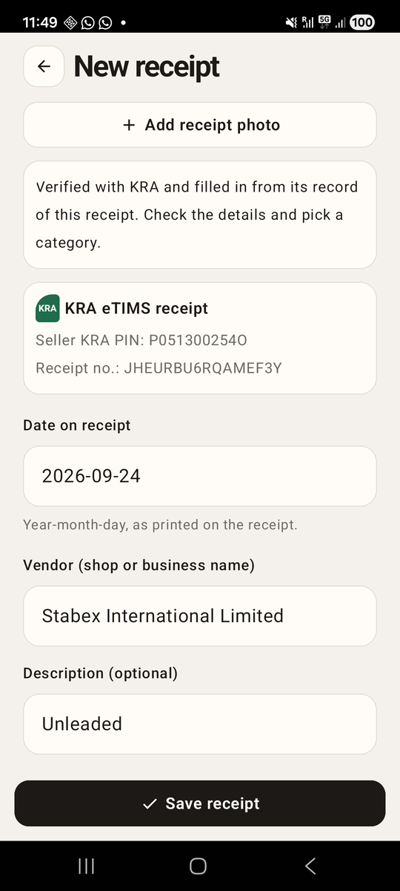

# Chapter 20: KRA Receipts

Previously, Risiti learned to read a receipt photo: a plugin of our own ran
text recognition on the phone, and a parser picked the vendor, date and
total out of the noise. It works, but it guesses. A letter O where a zero
should be, a total split from its label: the parser copes, and sometimes
it's wrong.

Many receipts in Kenya carry something better than text. Since KRA, the
Kenya Revenue Authority, brought in its electronic tax invoice system,
eTIMS, a business's receipts carry a QR code. Scan it and you get a link to
KRA's own record of that sale: the seller, the date, the exact total, the
items. That's not a guess. It's the tax authority's copy.

In this chapter, Risiti scans those codes and trusts KRA's record over
anything it reads off the paper.

By the end of this chapter, you will know:

- What's in a KRA QR code, and how to read it without a network.
- How to scan QR codes with `mob_scanner`.
- How to make HTTPS requests from the BEAM on Android, which needs two
  things a server never does.
- How to read KRA's page into a receipt, and test it against saved pages.
- How to check saved receipts with KRA in the background without blocking
  the screen or retrying forever.
- How to decide whose answer wins when KRA, the photo and the person all
  have one.

## What's in a KRA QR code

There are two kinds of KRA receipt in Kenya today:

- **eTIMS**, the current system. The QR code is a link to KRA's eTIMS
  verification page.
- **TIMS** (also called ETR, for the electronic tax registers that came
  before), which many shops still print. Its QR code links to KRA's iTax
  invoice checker.

An eTIMS QR code holds a URL like this:

```
https://etims.kra.go.ke/common/link/etims/receipt/indexEtimsReceiptData?Data=P051234567X00ABCDEF0123456789
```

The interesting part is `Data`. It's three things back to back:

```
P051234567X   00   ABCDEF0123456789
seller's PIN  branch   receipt signature
```

A KRA PIN is eleven characters: a letter (P for a company, A for a person),
nine digits and a check letter. Then a two-digit branch, then the
receipt's signature, which identifies this one sale.

What you *won't* find in the code is the vendor's name, the date or the
total. Those live on KRA's side. The code is a key, not the record. So
reading a KRA receipt is two steps: parse the code, which works offline,
and then fetch KRA's page, which doesn't.

### Parsing the code

`RisitiApp.Receipts.QrParser` does the offline step. Copy it from
`code/20/lib/risiti_app/receipts/qr_parser.ex`; here are the parts worth
reading. The entry point:

```elixir
  def parse(content) when is_binary(content) do
    content = String.trim(content)

    case kra_link(content) do
      {:ok, uri, query} -> parse_link(content, uri, query)
      :error -> parse_text(content)
    end
  end
```

Every result has the same keys: `source`, `seller_pin`, `branch_id`,
`invoice_number`, `verify_url`, and `date`, `amount_cents` and `vendor`,
which for KRA links are always `nil`. `source` is what kind of code it was:
`"etims"`, `"tims"`, `"kra"` for another KRA link, or `"other"`.

The first question is whether the code is a KRA link at all:

```elixir
  # Only links on a KRA host count: the verify button opens this URL in the
  # browser, so a look-alike domain must not be treated as KRA's.
  defp kra_link(content) do
    with %URI{scheme: scheme, host: host} = uri when scheme in ["http", "https"] <-
           URI.parse(content),
         true <- is_binary(host) and kra_host?(String.downcase(host)) do
      {:ok, uri, URI.decode_query(uri.query || "")}
    else
      _ -> :error
    end
  end

  defp kra_host?(host), do: host == "kra.go.ke" or String.ends_with?(host, ".kra.go.ke")
```

This check matters more than it looks. A QR code is just text; anyone can
print one. If Risiti trusted any link with "kra" in it, a fake receipt with
a code pointing at `etims.kra.go.ke.evil.example` would show a "View on
KRA" button that opened someone else's site, with KRA's name on it. So the
host must be `kra.go.ke` itself or end in `.kra.go.ke`. Note the dot:
`notkra.go.ke` doesn't pass. Parsing with `URI.parse/1` rather than looking
at the string means a host is a host, not whatever text happens to come
before the first slash.

Then the eTIMS `Data`, split with one regex:

```elixir
  defp parse_etims(content, data) do
    data = String.upcase(data)

    case Regex.run(~r/^([AP]\d{9}[A-Z])(\d{2})([A-Z0-9]+)$/, data) do
      [_, pin, branch, signature] ->
        %{
          blank("etims")
          | seller_pin: pin,
            branch_id: branch,
            invoice_number: signature,
            verify_url: content
        }

      nil ->
        %{blank("etims") | invoice_number: data, verify_url: content}
    end
  end
```

A TIMS link has an `invoiceNo` in its query string instead, and that's
all we take from it. Anything that isn't a KRA link goes to `parse_text/1`,
which picks a PIN, a date and a total out of the text if they're there:
some till printers encode a plain-text summary of the receipt as their QR
code.

## Scanning

To scan a code, Risiti uses `mob_scanner`, one of Mob's official plugins.
It opens a full-screen camera view, finds a code, closes itself, and sends
the screen what it read. Add it to `mix.exs`:

```elixir
      # Reads QR codes with the camera. Needs mob_camera's permission.
      {:mob_scanner, "~> 0.1"},
```

and to the plugins in `mob.exs`:

```elixir
config :mob, :plugins, [:mob_camera, :mob_biometric, :mob_scanner, :mob_ocr]
```

It's signed by Mob's release key and already in `:trusted_plugins`, so
there's nothing to acknowledge this time. It does depend on `mob_camera`,
which owns the camera permission; we've had that since Chapter 14.

Through `Native`, as always:

```elixir
  @doc """
  Opens the QR scanner. Replies `{:scan, :result, %{value: text}}`,
  `{:scan, :cancelled}`, `{:scan, :permission_denied}` or
  `{:scan, :not_available}`.
  """
  def scan_qr(socket), do: call(socket, :scan_qr, [], &MobScanner.scan(&1, formats: [:qr]))
```

The home screen's dock gets a third button, between **Scan receipt** and
**Add**:

```elixir
      {ActionButton.button(nil, "QR", :scan_qr, style: :secondary, width: 64)}
```

Stock Mob has no QR icon, so the button says "QR". The real Risiti has one,
from the patched icon set Chapter 18 mentioned.

### One receipt, one transaction

Here's the first thing a QR code gives us that a photo never could: a
reliable way to tell that a receipt has been saved already. Two photos of
the same receipt differ in every pixel. Two scans of the same code are the
same string.

People do scan a receipt twice. They forget they've done it, or they want
to look at it, and the scanner is the quickest way to find it. So the home
screen checks first:

```elixir
  # The scanner asks for the camera itself if it has to.
  def handle_info({:tap, :scan_qr}, socket), do: {:noreply, Native.scan_qr(socket)}

  # A code that's already saved opens that receipt instead of a duplicate.
  def handle_info({:scan, :result, %{value: value}}, socket) when is_binary(value) do
    case Transactions.find_by_qr(value) do
      nil ->
        {:noreply, Mob.Socket.push_screen(socket, ReceiptFormScreen, %{qr: value})}

      existing ->
        {:noreply,
         socket
         |> Native.toast("You already saved this receipt")
         |> Mob.Socket.assign(:selected, existing)}
    end
  end
```

A saved code opens that receipt's details sheet, from Chapter 18. A new one
opens the form.

The database enforces the same rule, so it holds even if two paths race.
The QR fields arrive in one migration:

```elixir
# priv/repo/migrations/20261008090000_add_kra_to_transactions.exs
defmodule RisitiApp.Repo.Migrations.AddKraToTransactions do
  use Ecto.Migration

  def change do
    alter table(:transactions) do
      # The QR code's text exactly as scanned, and what it identifies.
      add :qr_content, :text
      add :seller_pin, :string
      add :branch_id, :string
      add :invoice_number, :string
      # KRA's page for this receipt, and when it last confirmed the receipt.
      add :verify_url, :text
      add :verified_at, :utc_datetime
    end

    # One receipt, one transaction: scanning the same code twice is a mistake.
    create unique_index(:transactions, [:qr_content])
  end
end
```

A unique index allows any number of `NULL`s in SQLite, as in Postgres, so
transactions without a QR code don't collide with each other.

In the schema, the six fields join the cast list, the sources grow:

```elixir
  # "manual" when typed in, "photo" when it came with a receipt photo, "ocr"
  # when the photo was read too. A QR code makes it "etims" or "tims" (KRA
  # receipts we can look up), "kra" (another KRA link) or "other".
  @sources ~w(manual photo ocr etims tims kra other)
```

and the changeset turns a duplicate into a message rather than a crash:

```elixir
    |> unique_constraint(:qr_content, message: "You already saved this receipt")
```

The context gets the functions the screens need: `find_by_qr/1`, and
`new_from_qr/1` and `put_qr/2` to put a code on a draft transaction:

```elixir
  @doc """
  An unsaved expense from a scanned QR code, for the person to confirm. A
  KRA code holds no vendor or total, so those come later: from KRA's page,
  the photo, or the person.
  """
  def new_from_qr(qr_content) do
    parsed = QrParser.parse(qr_content)

    %Transaction{date: today(), category: "Other"}
    |> put_qr(qr_content)
    |> Map.merge(%{date: parsed.date || today(), amount_cents: parsed.amount_cents})
  end

  @doc """
  Puts a QR code on a draft transaction: the code itself and what it
  identifies. Used for a scanned code and for one found in a photo.
  """
  def put_qr(%Transaction{} = transaction, qr_content) do
    parsed = QrParser.parse(qr_content)

    %{
      transaction
      | qr_content: String.trim(qr_content),
        source: parsed.source,
        seller_pin: parsed.seller_pin || transaction.seller_pin,
        branch_id: parsed.branch_id,
        invoice_number: parsed.invoice_number || transaction.invoice_number,
        verify_url: parsed.verify_url
    }
  end
```

and three small questions the screens keep asking:

```elixir
  @doc "True for a receipt whose QR code is a KRA link."
  def kra?(%Transaction{source: source}), do: source in ["etims", "tims", "kra"]

  @doc "True when KRA's page for this receipt can be read: eTIMS and TIMS links only."
  def verifiable?(%Transaction{source: source, verify_url: url}),
    do: source in ["etims", "tims"] and is_binary(url)

  def verified?(%Transaction{verified_at: verified_at}), do: verified_at != nil
```

## Fetching KRA's record

Now the online half. KRA doesn't offer an API for this. What it offers is
the verification page the QR link opens: an HTML page meant for a person
holding a phone. So Risiti does what that person would do: it fetches the
page and reads it.

### HTTPS from the BEAM, on a phone

Making a request is where Android surprises an Elixir developer. On a
server you'd add Req and be done. On the phone, two things that OTP
assumes about the operating system aren't true:

1. **There's no trust store the BEAM can read.** To check a site's TLS
   certificate, `:ssl` needs the list of certificate authorities the system
   trusts. On Linux it finds them in `/etc/ssl/certs`. Android keeps its
   list behind a Java API the BEAM can't reach, so every HTTPS connection
   fails before it starts.
2. **The BEAM's own DNS lookup can fail.** Erlang resolves host names its
   own way, and on a real phone that can come back with `nxdomain` for a
   host that resolves fine in the browser.

Mob has an answer for each. For the first, we ship a trust store with the
app: `priv/cacerts.pem`, the Mozilla list of certificate authorities, the
same file the `castore` package carries. Copy it from `code/20/priv/` and
load it when the app starts, in `RisitiApp.App.on_start/0`:

```elixir
    # Android has no CA store the BEAM can read, so HTTPS (the KRA receipt
    # lookup) verifies against this bundled copy of the Mozilla trust store.
    # The app works offline without it, so a failure only costs the lookup.
    with {:error, reason} <- Mob.Certs.load_cacerts(priv_path("cacerts.pem")) do
      Logger.warning("CA certificates not loaded, KRA lookups will fail: #{inspect(reason)}")
    end
```

`priv_path/1` is Chapter 12's `migrations_dir/0`, generalised: now that two
things live in `priv/`, it takes the path inside it.

```elixir
  # A file or folder under priv/, wherever this platform keeps it.
  #
  # On Android and iOS, Mob deploys the .beam files to one flat directory with
  # no versioned lib/ layout, so Application.app_dir/2 can't find priv/. The
  # native launcher sets MOB_BEAMS_DIR, and the deployer copies priv/ there.
  # (Chapter 12 explains what goes wrong when migrations can't be found.)
  defp priv_path(relative) do
    case System.get_env("MOB_BEAMS_DIR") do
      nil -> Application.app_dir(:risiti_app, Path.join("priv", relative))
      beams_dir -> Path.join([beams_dir, "priv", relative])
    end
  end
```

and the migration call becomes `priv_path("repo/migrations")`. (Add
`require Logger` at the top of the module for the warning.)

For the second, `Mob.DNS.resolve/1` asks the phone's own resolver, the one
the browser uses, and seeds the BEAM's host table with the answer.

With those two in place, a small client over OTP's built-in `:httpc` is
enough. No dependency: `:httpc` comes with the Erlang runtime Mob already
puts on the phone. Create `lib/risiti_app/http.ex`:

```elixir
# lib/risiti_app/http.ex
defmodule RisitiApp.Http do
  @moduledoc """
  A small HTTP client over OTP's `:httpc`, which ships with the app's Erlang
  runtime: no extra dependencies on the phone.

  It deals with the two things a phone needs that a server doesn't:

    * TLS verifies against the CA bundle `RisitiApp.App` loads at start
      (Android gives the BEAM no trust store of its own; see `Mob.Certs`);
    * host names resolve through the phone's resolver (`Mob.DNS.resolve/1`),
      because the BEAM's own lookup can fail on a real phone.

  Only GET for now. Part IV adds request bodies, for the server's API.
  """

  @timeout 20_000

  @doc "Fetches `url`. Returns `{:ok, status, body}` or `{:error, reason}`."
  def get(url, opts \\ []) do
    with :ok <- start(),
         :ok <- check_tls(url) do
      resolve_host(url)

      timeout = Keyword.get(opts, :timeout, @timeout)
      request = {String.to_charlist(url), [{~c"user-agent", ~c"RisitiApp"}]}
      http_opts = [timeout: timeout, connect_timeout: timeout, ssl: ssl_opts()]

      case :httpc.request(:get, request, http_opts, body_format: :binary) do
        {:ok, {{_, status, _}, _headers, body}} -> {:ok, status, body}
        {:error, reason} -> {:error, reason}
      end
    end
  end

  defp start do
    with {:ok, _} <- Application.ensure_all_started(:inets),
         {:ok, _} <- Application.ensure_all_started(:ssl) do
      :ok
    end
  end

  # Without a trust store, refuse HTTPS rather than connect unverified.
  defp check_tls("https://" <> _),
    do: if(Mob.Certs.loaded?(), do: :ok, else: {:error, :no_cacerts})

  defp check_tls(_url), do: :ok

  # Seeds the BEAM's host table from the phone's own resolver. Off the phone
  # (no NIF) this fails harmlessly and the normal lookup is used. IP
  # addresses need no lookup.
  defp resolve_host(url) do
    with %URI{host: host} when is_binary(host) <- URI.parse(url),
         {:error, _} <- :inet.parse_address(String.to_charlist(host)) do
      Mob.DNS.resolve(host)
    end
  end

  defp ssl_opts do
    if Mob.Certs.loaded?() do
      [
        verify: :verify_peer,
        cacerts: :public_key.cacerts_get(),
        depth: 4,
        customize_hostname_check: [
          match_fun: :public_key.pkix_verify_hostname_match_fun(:https)
        ]
      ]
    else
      []
    end
  end
end
```

The line I'd point at is `check_tls/1`. When the trust store isn't loaded,
the client refuses HTTPS instead of quietly connecting without checking the
certificate. A receipt "verified with KRA" by whoever answered on a café's
Wi-Fi would be worse than one not verified at all.

`ssl_opts/0` is the standard set for verifying a server properly with
`:ssl`: check the chain against our CAs, and check that the certificate is
for the host we asked for. `:httpc` doesn't do the second by default.

### Reading the page

`RisitiApp.Receipts.KraReceipt` fetches the page and reads it. The two
are kept apart so the reading can be tested without a network:

```elixir
  @timeout 15_000

  @doc """
  Fetches `url` (a KRA link from `QrParser`) and parses it. Blocks for up to
  #{div(@timeout, 1000)} seconds, so call it off the screen process.
  """
  def fetch(url) do
    case RisitiApp.Http.get(url, timeout: @timeout) do
      {:ok, 200, html} when is_binary(html) -> parse(html)
      {:ok, status, _body} -> {:error, {:http, status}}
      {:error, reason} -> {:error, reason}
    end
  end

  @doc "Parses a KRA verification page. `{:error, :unrecognised}` when it holds no receipt."
  def parse(html) when is_binary(html) do
    details =
      cond do
        html =~ "Supplier Name" -> parse_tims(html)
        html =~ "topinfo" -> parse_etims(html)
        true -> nil
      end

    case details do
      %{vendor: vendor, amount_cents: cents} = found
      when is_binary(vendor) or is_integer(cents) ->
        {:ok, found}

      _ ->
        {:error, :unrecognised}
    end
  end
```

`parse/1` recognises which of the two layouts it has, by a word only that
layout contains, and reads it. If it can't find at least a vendor or a
total, the page isn't a receipt, and it says `:unrecognised` rather than
returning a map of `nil`s that looks like success.

That case is common. Ask KRA about a code it doesn't know and it doesn't
send an error: it answers 200 OK with a page that says "The invoice could
not be verified at this time. Please try again later, or contact the
supplier to confirm whether the invoice has been successfully transmitted
to KRA." Sellers' systems sometimes send receipts to KRA hours or days
late, so a real receipt can be unknown to KRA when you scan it. We'll
handle that separately from a dropped connection, below.

The eTIMS page puts each value in a `<span>` after its label's `<span>`:

```elixir
  # `<span class="tit lt">LABEL</span> : <span class="value ...">VALUE</span>`
  # — matched on the exact label so "TOTAL" doesn't hit "TOTAL TAX".
  defp etims_value(html, label) do
    regex =
      ~r/<span class="tit[^"]*"[^>]*>\s*#{Regex.escape(label)}\s*(?::|&nbsp;)*\s*<\/span>\s*:?\s*<span class="value[^"]*">([^<]*)</

    capture(regex, html)
  end
```

```elixir
  defp parse_etims(html) do
    top = section(html, ~r/<div class="topinfo[^"]*">(.*?)<hr/s)

    items =
      ~r/<div class="tit">(.*?)<\/div>/s
      |> Regex.scan(html, capture: :all_but_first)
      |> Enum.map(fn [item] -> item |> text() |> item_name() end)
      |> Enum.reject(&(&1 == ""))

    %{
      vendor: top |> first_div() |> tidy_name(),
      date: html |> etims_value("Date") |> parse_date(),
      amount_cents: html |> etims_value("TOTAL") |> parse_amount(),
      description: describe(items),
      invoice_number: capture(~r/Invoice Number\s*:\s*([^<]+)</, top)
    }
  end
```

Regexes over HTML: you've been warned about this, and so have I. For a
page Risiti doesn't control, with a layout that's stable but nowhere
documented, the honest trade-off is this one. An HTML parser like Floki
would be sturdier, and it would also be a dependency on the phone for two
pages. The regexes are narrow, each matches one labelled value, and the
tests below run them against saved copies of real pages. When KRA changes
its page, a test will fail rather than a receipt quietly reading wrong.

Notice the item names becoming the description: "Unleaded" for a fuel
receipt. KRA knows what was bought, and that's the description most people
would have typed.

The rest of the module, the TIMS layout and small helpers to turn HTML into
text, amounts and dates, is in `code/20/lib/risiti_app/receipts/kra_receipt.ex`.

### In the background

`fetch/1` can take up to fifteen seconds on a slow connection. A screen is
a single process: if it called `fetch/1` itself, it couldn't handle a tap,
a keystroke or anything else until KRA answered. So the fetch runs in a
process of its own, and sends the answer back as a message:

```elixir
  @doc """
  Looks a receipt up on KRA's page, in a separate process so the screen
  stays responsive. Replies `{:kra, :result, details}` or
  `{:kra, :error, reason}`, with `ref` added at the end when one is given:
  `{:kra, :result, details, ref}`.
  """
  def lookup_kra(socket, url, ref \\ nil) do
    args = if ref == nil, do: [url], else: [url, ref]

    call(socket, :lookup_kra, args, fn socket ->
      screen = self()
      Task.start(fn -> send(screen, kra_reply(KraReceipt.fetch(url), ref)) end)
      socket
    end)
  end

  defp kra_reply({:ok, details}, nil), do: {:kra, :result, details}
  defp kra_reply({:error, reason}, nil), do: {:kra, :error, reason}
  defp kra_reply({:ok, details}, ref), do: {:kra, :result, details, ref}
  defp kra_reply({:error, reason}, ref), do: {:kra, :error, reason, ref}
```

It's in `Native` with the plugins, though it isn't native, because it's
the same kind of thing for a test: something slow and outside that the
test wants to stand in for. Under `mix test` it sends
`{:native, :lookup_kra, args}` instead, and the test answers.

`Task.start/1`, not `Task.async/1`: we don't want to await the result,
just to be sent it. `screen = self()` has to be taken *before* the task
starts, since inside the task `self()` is the task.

The `ref` is for the home screen, which may have several lookups in flight
and needs to know which receipt each answer is for.

## Verifying in the background

A receipt scanned in a matatu with no signal can't be fetched from KRA
then. It's saved with its QR code and without KRA's confirmation. The home
screen catches up later, quietly, one receipt at a time.

The context finds the next one to check:

```elixir
  @doc """
  The newest receipt that KRA could verify but hasn't yet, skipping the ids
  in `except` (ones already tried).
  """
  def next_unverified(except \\ []) do
    except = Enum.to_list(except)

    Repo.one(
      from t in Transaction,
        where:
          is_nil(t.verified_at) and t.source in ["etims", "tims"] and not is_nil(t.verify_url) and
            t.id not in ^except,
        order_by: [desc: t.date, desc: t.id],
        limit: 1
    )
  end

  @doc "Records that KRA's page returned this receipt."
  def mark_verified(%Transaction{} = transaction) do
    transaction
    |> Ecto.Changeset.change(verified_at: DateTime.truncate(DateTime.utc_now(), :second))
    |> Repo.update()
  end
```

`mark_verified/1` uses `Ecto.Changeset.change/2`, not the form's
changeset. Verification isn't something the person enters; it's a fact the
app records, like the decisions in Chapter 17.

The home screen keeps two assigns for it:

```elixir
        # KRA checks in flight, id => :tap (the person asked, so say how it
        # went) or :background (quiet), and the ids tried on this visit.
        verifying: %{},
        tried: MapSet.new(),
```

and starts the first check when it mounts, with `|> verify_next()` at the
end of the mount pipeline:

```elixir
  # Quietly checks saved KRA receipts, one at a time: ones saved while
  # offline, or before KRA answered. `tried` stops a receipt KRA couldn't
  # answer for from being retried over and over on this visit.
  defp verify_next(%{assigns: %{verifying: verifying}} = socket) when map_size(verifying) > 0,
    do: socket

  defp verify_next(socket) do
    case Transactions.next_unverified(socket.assigns.tried) do
      nil -> socket
      receipt -> start_verify(socket, receipt, :background)
    end
  end

  # Starts a KRA check for `receipt`. One already running for it is promoted
  # to :tap so the person hears the answer, rather than started twice.
  defp start_verify(socket, receipt, mode) do
    %{verifying: verifying, tried: tried} = socket.assigns

    socket =
      Mob.Socket.assign(socket,
        verifying: Map.put(verifying, receipt.id, mode),
        tried: MapSet.put(tried, receipt.id)
      )

    if Map.has_key?(verifying, receipt.id),
      do: socket,
      else: Native.lookup_kra(socket, receipt.verify_url, {:verify, receipt.id})
  end
```

Three rules keep this polite:

- **One at a time.** `verify_next/1` does nothing while a check is in
  flight. A book with forty unverified receipts doesn't fire forty requests
  at KRA over someone's mobile data.
- **Each receipt once per visit.** `tried` holds every id this screen has
  checked. A receipt KRA couldn't answer for, because its page is down or
  the code is wrong, isn't retried in a loop, which would drain a battery
  and a data bundle doing nothing useful. The next time the home screen
  mounts, `tried` starts empty, so it gets another chance later.
- **Quiet in the background.** A check the person didn't ask for doesn't
  pop up toasts.

When the answer comes back, the screen marks the receipt and moves on:

```elixir
  # Each answer carries the receipt's id, so it lands on the right receipt
  # even if the sheet was closed in the meantime.
  def handle_info({:kra, :result, details, {:verify, id}}, socket) do
    {mode, socket} = finish_verify(socket, id)

    socket =
      case Transactions.get_transaction(id) do
        nil ->
          socket

        receipt ->
          {:ok, verified} = Transactions.mark_verified(receipt)

          socket =
            case socket.assigns.selected do
              %{id: ^id} -> Mob.Socket.assign(socket, :selected, verified)
              _ -> socket
            end

          if mode == :tap,
            do: Native.toast(socket, verified_message(verified, details)),
            else: socket
      end

    {:noreply, socket |> load_receipts() |> verify_next()}
  end

  def handle_info({:kra, :error, reason, {:verify, id}}, socket) do
    {mode, socket} = finish_verify(socket, id)

    socket =
      if mode == :tap,
        do: Native.toast(socket, kra_error_message(reason)),
        else: socket

    {:noreply, verify_next(socket)}
  end
```

with the same distinction as the form makes, below:

```elixir
  # KRA answering "no such receipt" isn't a connection problem.
  defp kra_error_message(:unrecognised),
    do: "KRA has no record of this receipt yet. Try again in a day or two."

  defp kra_error_message(_reason), do: "Couldn't reach KRA. Check your connection and try again."
```

```elixir
  defp finish_verify(socket, id) do
    {mode, verifying} = Map.pop(socket.assigns.verifying, id)
    {mode, Mob.Socket.assign(socket, :verifying, verifying)}
  end
```

`Transactions.get_transaction(id)` can return `nil`: the person may have
deleted the receipt while KRA was thinking. The `^id` pin in the `case`
updates the open sheet only if it's showing this receipt.

### Checking by hand

The sheet from Chapter 18 shows where a KRA receipt stands, under the
vendor, and offers a button:

```elixir
  # "Verified with KRA · 24 Sep 2026", or that it isn't yet.
  defp kra_status(transaction) do
    if Transactions.kra?(transaction) do
      ~MOB"""
      <Row fill_width={true} align={:center} padding_top={6}>
        {KraBadge.badge(transaction)}
        <Text
          text={kra_status_text(transaction)}
          text_size={13}
          font_weight="medium"
          text_color={if(Transactions.verified?(transaction), do: :secondary, else: :muted)}
        />
      </Row>
      """
    else
      []
    end
  end

  defp kra_status_text(%{verified_at: %DateTime{} = at}),
    do: "Verified with KRA · #{Calendar.strftime(at, "%d %b %Y")}"

  defp kra_status_text(transaction) do
    if Transactions.verifiable?(transaction), do: "Not verified yet", else: "KRA link"
  end

  # Unverified receipts are checked in the app; once verified, or for a KRA
  # link whose page the app can't read, the button opens KRA's page.
  defp kra_button(transaction) do
    cond do
      Transactions.verifiable?(transaction) and not Transactions.verified?(transaction) ->
        ~MOB"""
        <Column fill_width={true} padding_top={8}>
          {ActionButton.button("check", "Verify with KRA", :verify_receipt, style: :secondary)}
        </Column>
        """

      is_binary(transaction.verify_url) ->
        ~MOB"""
        <Column fill_width={true} padding_top={8}>
          {ActionButton.button("forward", "View on KRA", :open_on_kra, style: :secondary)}
        </Column>
        """

      true ->
        []
    end
  end
```

**Verify with KRA** starts a check in `:tap` mode, so the answer gets a
toast:

```elixir
  def handle_info({:tap, :verify_receipt}, %{assigns: %{selected: %{} = receipt}} = socket) do
    if Transactions.verifiable?(receipt),
      do: {:noreply, socket |> Native.toast("Checking with KRA…") |> start_verify(receipt, :tap)},
      else: {:noreply, socket}
  end
```

If a background check for the same receipt is already running,
`start_verify/3` doesn't start another; it changes the mode to `:tap`, so
the answer that's coming is reported. One request, and the person still
hears about it.

The toast has one more job:

```elixir
  # KRA vouches for the receipt; say so if its total differs from ours.
  defp verified_message(receipt, %{amount_cents: cents})
       when is_integer(cents) and cents != receipt.amount_cents,
       do: "Verified with KRA, but KRA's total is #{Transactions.format_amount(cents)}"

  defp verified_message(_receipt, _details), do: "Verified with KRA"
```

Verification doesn't change the amount someone saved; that's theirs, under
Chapter 16's rule. But if KRA's total differs, they should know.

**View on KRA** opens the page in the phone's browser, through one more
function in `Native`:

```elixir
  @doc "Opens a web page in the phone's browser."
  def open_url(socket, url),
    do:
      call(socket, :open_url, [url], fn socket ->
        Mob.Device.open_url(url)
        socket
      end)
```

```elixir
  def handle_info({:tap, :open_on_kra}, %{assigns: %{selected: %{verify_url: url}}} = socket)
      when is_binary(url),
      do: {:noreply, Native.open_url(socket, url)}
```

This is the button that `kra_link/1`'s host check protects.

### The KRA tag

On the list, a small green "KRA" tag in front of the subtitle marks a KRA
receipt. It's a component, `RisitiApp.Components.KraBadge`:

```elixir
# lib/risiti_app/components/kra_badge.ex
defmodule RisitiApp.Components.KraBadge do
  @moduledoc """
  A small green "KRA" tag for a receipt with a KRA QR code. Renders nothing
  for any other transaction.

      <Row>
        {KraBadge.badge(transaction)}
        <Text text="..." />
      </Row>

  The gap after the tag is part of the badge, so it can sit right in front
  of text.
  """

  import Mob.Sigil

  alias RisitiApp.Transactions

  def badge(transaction) do
    if Transactions.kra?(transaction), do: tag(Transactions.verified?(transaction)), else: []
  end

  defp tag(verified?) do
    label = if verified?, do: "KRA receipt, verified", else: "KRA receipt, not verified yet"

    ~MOB"""
    <Row align={:center} accessibility_label={label}>
      <Row background={:secondary} corner_radius={4} padding_left={3} padding_right={3}>
        <Text
          text="KRA"
          text_size={8}
          font_weight="bold"
          letter_spacing={0.3}
          text_color={:on_secondary}
        />
      </Row>
      <Spacer size={5} />
    </Row>
    """
  end
end
```

In `TransactionItem`, the subtitle becomes a row with the badge in front,
and `details/1` gets two more rows, the seller's PIN and the receipt
number. Both are in `code/20`.

## KRA wins

Now the form, where three sources of the same facts meet: KRA's record,
the photo, and the person. Here's the order of trust:

1. **What the person typed.** Always. They have the paper in their hand.
2. **KRA's record.** It's the tax authority's copy of the sale.
3. **The photo.** A good guess, but a guess.

The form already follows rule 1 with `touched`, from Chapter 19. Rule 2
over 3 needs one more set:

```elixir
        # Fields filled from KRA's record, which a photo must not overwrite.
        from_kra: MapSet.new(),
```

and `fill_untouched/3` takes a set of protected fields along with the
touched ones:

```elixir
  # What was read or fetched fills a field only if the person hasn't typed
  # in it, and it isn't one of the `protected` ones (KRA's).
  defp fill_untouched(socket, fields, protected) do
    date = fields[:date]
    cents = fields[:amount_cents]

    candidates = [
      date: date && Date.to_iso8601(date),
      vendor: fields[:vendor],
      description: fields[:description],
      amount: cents && Transactions.amount_input(cents)
    ]

    skip = MapSet.union(socket.assigns.touched, protected)

    Enum.reduce(candidates, socket, fn
      {_key, nil}, acc -> acc
      {key, value}, acc -> if key in skip, do: acc, else: Mob.Socket.assign(acc, key, value)
    end)
  end
```

It reads `fields[:date]` with the Access syntax, not `fields.date`,
because the maps it gets have different keys: KRA's has a description, the
photo parser's doesn't. `fields[:description]` is `nil` for a map without
the key; `fields.description` would raise.

A photo reading passes `socket.assigns.from_kra` as `protected`. KRA's
answer passes an empty set, since nothing outranks it but the person, and
records what it filled:

```elixir
  # KRA's record fills what the person hasn't typed, and those fields are
  # then KRA's: a photo read later won't change them.
  def handle_info({:kra, :result, details}, socket) do
    filled =
      [date: :date, vendor: :vendor, amount: :amount_cents, description: :description]
      |> Enum.filter(fn {_field, key} -> details[key] end)
      |> Enum.map(&elem(&1, 0))
      |> Enum.reject(&(&1 in socket.assigns.touched))

    # KRA returning the receipt is what makes it verified.
    verified_at = DateTime.truncate(DateTime.utc_now(), :second)

    {:noreply,
     socket
     |> update_receipt(&%{&1 | verified_at: verified_at})
     |> fill_untouched(details, MapSet.new())
     |> Mob.Socket.assign(
       from_kra: MapSet.union(socket.assigns.from_kra, MapSet.new(filled)),
       notice:
         "Verified with KRA and filled in from its record of this receipt. " <>
           "Check the details and pick a category."
     )}
  end
```

KRA has no idea which category a fuel receipt belongs to in your books, so
the notice asks for that.

When KRA doesn't give us the receipt, the notice says why, because the two
reasons ask different things of the person:

```elixir
  # KRA answered, but has no record of this receipt (yet): sellers sometimes
  # send their receipts to KRA late.
  def handle_info({:kra, :error, :unrecognised}, socket) do
    {:noreply,
     Mob.Socket.assign(
       socket,
       :notice,
       "KRA has no record of this receipt yet. Fill in the details from the " <>
         "paper receipt. You can verify it later from the list."
     )}
  end

  def handle_info({:kra, :error, _reason}, socket) do
    {:noreply,
     Mob.Socket.assign(
       socket,
       :notice,
       "Couldn't get this receipt from KRA. Check your connection, and fill in " <>
         "the details from the paper receipt. You can verify it later from the list."
     )}
  end
```

"Check your connection" for a receipt KRA simply hasn't heard of sends
someone toggling airplane mode for nothing. I found this while writing the
chapter, by asking KRA about a made-up code; the real Risiti still says
"check your connection" in both cases.

### The photo taken after a scan

A scanned receipt still deserves a photo. The QR code proves the sale
happened; the photo is what an accountant flips through at the end of the
month, and thermal paper fades. So when the form opens from a
scan, it asks KRA and opens the camera at the same time:

```elixir
    socket =
      case params do
        %{photo: tmp} -> read_photo(socket, tmp)
        %{qr: _} -> socket |> lookup_kra() |> Native.request_camera()
        _ -> socket
      end
```

The mount builds the draft with `Transactions.new_from_qr(qr)` for that
case. Cancel the camera and the form simply has no photo.

The camera is usually faster than KRA. So the photo is often being read
while KRA's answer is still on its way, and either can arrive first.
Here's how each order works out:

- **KRA first, then the photo.** KRA fills the fields and marks them
  `from_kra`. The photo reading skips them.
- **Photo first, then KRA.** The photo fills the fields. KRA's answer then
  fills them again, because KRA only skips what was *typed*, not what was
  read. KRA's values win either way.

The notices follow the same rule. While a photo is read, KRA's notice
stays on show, and when the reading arrives it doesn't replace it:

```elixir
  defp read_photo(socket, tmp) do
    # What KRA said stays on show while the photo is read.
    notice = if kra_answered?(socket), do: socket.assigns.notice, else: nil

    socket
    |> Mob.Socket.assign(reading: true, notice: notice)
    |> Native.process_photo(tmp, Photos.new_path())
  end

  defp kra_answered?(socket), do: socket.assigns.receipt.verified_at != nil

  defp put_photo_notice(socket, fields) do
    if kra_answered?(socket),
      do: socket,
      else: Mob.Socket.assign(socket, :notice, ocr_notice(fields))
  end
```

### A code in the photo

Remember that `mob_ocr` looks for a QR code in every photo it reads? Now
we use it. Someone who takes a photo of an eTIMS receipt without scanning
it first gets the same lookup:

```elixir
     |> replace_photo(Photos.name(data["path"]))
     |> update_receipt(&%{&1 | ocr_text: text, source: photo_source(&1)})
     |> attach_qr(data["qr"])
     |> fill_untouched(fields, socket.assigns.from_kra)
     |> Mob.Socket.assign(reading: false)
     |> put_photo_notice(fields)}
```

```elixir
  # A QR code already on the draft wins: it was scanned on purpose.
  defp attach_qr(socket, qr) when is_binary(qr) and qr != "" do
    case socket.assigns.receipt do
      %Transaction{qr_content: nil} = receipt ->
        socket
        |> Mob.Socket.assign(:receipt, Transactions.put_qr(receipt, qr))
        |> duplicate_check()
        |> lookup_kra()

      _ ->
        socket
    end
  end

  defp attach_qr(socket, _qr), do: socket

  # Only eTIMS and TIMS links lead to a page with the receipt on it.
  defp lookup_kra(%{assigns: %{receipt: receipt}} = socket) do
    if Transactions.verifiable?(receipt) do
      socket
      |> Mob.Socket.assign(:notice, "Getting this receipt's details from KRA…")
      |> Native.lookup_kra(receipt.verify_url)
    else
      socket
    end
  end
```

`photo_source/1` keeps a QR code's source when there is one; a photo of a
receipt we found by its code is still an `"etims"` receipt, not an
`"ocr"` one:

```elixir
  # A photo of a receipt found by its QR code keeps the QR code's source.
  defp photo_source(%Transaction{source: source}) when source in ["manual", "photo"], do: "ocr"
  defp photo_source(%Transaction{source: source}), do: source
```

And if neither the scan nor the photo found a code, the form offers a
**Scan the receipt's QR code** button, which shows what the code said once
there is one. It's `qr_section/1` in the form, with the scanner's answer
handled by:

```elixir
  def handle_info({:scan, :result, %{value: value}}, socket) when is_binary(value) do
    {:noreply,
     socket
     |> attach_qr(value)
     |> fill_untouched(QrParser.parse(value), socket.assigns.from_kra)}
  end
```

### Duplicates, early

The home screen catches a code that's already saved before the form even
opens. A code found in a photo, or scanned from the form, can't be caught
there, so the form checks whenever a code arrives:

```elixir
  # Says so now, rather than at Save, when this code is already on another
  # saved receipt. (The unique index would refuse the save anyway.)
  defp duplicate_check(%{assigns: %{receipt: %Transaction{qr_content: nil}}} = socket), do: socket

  defp duplicate_check(%{assigns: %{receipt: receipt}} = socket) do
    case Transactions.find_by_qr(receipt.qr_content) do
      %Transaction{id: id} = existing when id != receipt.id ->
        Mob.Socket.assign(socket, :errors, %{
          base:
            "You already saved this receipt (#{existing.vendor}, " <>
              "#{Calendar.strftime(existing.date, "%d %b %Y")})."
        })

      _ ->
        socket
    end
  end
```

A `:base` error is one that belongs to the whole form, not a field. It's
shown above the Save button with
`<Text :if={@errors[:base]} text={@errors[:base]} text_color={:error} />`,
and `changeset_errors/1` turns the unique index's error into one, for the
rare case where the check above didn't see the duplicate in time:

```elixir
      {:qr_content, [message | _]}, acc -> Map.put(acc, :base, message)
```

Finally, `build_attrs/1` passes the six QR fields from the draft along with
the photo, and they're saved with the rest.

## Run it

`mob_scanner` brings native code, so deploy with `--native` once:

```
mix mob.deploy --native --device YOUR_DEVICE_ID
```

Tap **QR** and point the camera at the QR code on an eTIMS receipt. The
form opens, says it's getting the receipt from KRA, and opens the camera
for a photo. Take one, or cancel. A moment later the form is filled in from
KRA's record:

<!-- SHOT: the form after a scan, filled in from KRA: notice "Verified with KRA…", the KRA eTIMS receipt box with PIN and receipt number, vendor Stabex International Limited, amount 1998.45. -->


Pick a category and save. On the list the receipt has its KRA tag, and in
its sheet:

<!-- SHOT: the sheet for the KRA receipt: "Verified with KRA · date", Seller KRA PIN, Receipt / invoice no., View on KRA. -->


Tap **View on KRA** to see KRA's own page for it. Then try the offline
path: turn on airplane mode, scan another receipt, and save it when the
form says it couldn't reach KRA. Turn airplane mode off, close the app and
open it again. The home screen checks it in the background, and its sheet
says "Verified with KRA".

## Testing it

The parsers get plain tests. For `QrParser`, in
`test/risiti_app/receipts/qr_parser_test.exs`, the case I'd never skip:

```elixir
  test "a look-alike domain is not treated as KRA and gets no verify link" do
    url = "https://etims.kra.go.ke.evil.example/indexEtimsReceiptData?Data=P051234567X00ABC"

    assert %{source: "other", verify_url: nil} = QrParser.parse(url)
  end
```

For `KraReceipt`, saved copies of KRA's two pages live in
`test/fixtures/kra/`, the same idea as Chapter 19's receipts folder. They
were saved from real receipts, with the buyer's PIN replaced:

```elixir
  # Saved copies of KRA's verification pages (buyer PIN replaced).
  defp fixture(name), do: File.read!(Path.join("test/fixtures/kra", name))

  test "reads an eTIMS receipt page" do
    assert {:ok, details} = KraReceipt.parse(fixture("etims_receipt.html"))

    assert details == %{
             vendor: "Stabex International Limited",
             date: ~D[2026-09-24],
             amount_cents: 199_845,
             description: "Unleaded",
             invoice_number: "KRACU0300010612/58385"
           }
  end
```

When KRA redesigns its page, save the new one next to the old and make
both pass.

The screens get `test/risiti_app/screens/kra_flow_test.exs`. Every call to
KRA goes through `Native.lookup_kra/3`, so the test sees the request as
`{:native, :lookup_kra, args}` and answers with the details KRA's page
would give:

```elixir
  @etims "https://etims.kra.go.ke/common/link/etims/receipt/indexEtimsReceiptData?Data=P051234567X00ABCDEF0123456789"

  # What KraReceipt.parse/1 makes of KRA's page for this receipt.
  @details %{
    vendor: "Stabex International Limited",
    date: ~D[2026-09-24],
    amount_cents: 199_845,
    description: "Unleaded",
    invoice_number: "KRACU0300010612/58385"
  }
```

Here are the two tests for the order of trust. The person's typing beats
KRA:

```elixir
    test "KRA's record fills the form and verifies the receipt" do
      form =
        ReceiptFormScreen
        |> mount_screen(%{qr: @etims})
        |> render_info({:change, :description, "Fuel for the site visit"})
        |> render_info({:kra, :result, @details})

      assert %{
               vendor: "Stabex International Limited",
               date: "2026-09-24",
               amount: "1998.45",
               description: "Fuel for the site visit"
             } = assigns(form)

      assert assigns(form).receipt.verified_at
      assert text(rendered(form)) =~ "Verified with KRA"
    end
```

and KRA beats the photo:

```elixir
    test "a photo read afterwards doesn't overwrite what KRA said" do
      form =
        ReceiptFormScreen
        |> mount_screen(%{qr: @etims})
        |> render_info({:kra, :result, @details})
        |> render_info({:camera, :photo, %{path: "/tmp/camera.jpg"}})

      assert_received {:native, :process_photo, [_tmp, dest]}

      json =
        IO.iodata_to_binary(
          :json.encode(%{
            "text" => "STABEX\nTOTAL  1,000.00\nDate: 01/09/2026",
            "qr" => :null,
            "path" => dest
          })
        )

      form = render_info(form, {:ocr, :result, json})

      assert %{vendor: "Stabex International Limited", amount: "1998.45"} = assigns(form)
      assert text(rendered(form)) =~ "Verified with KRA"
    end
```

Note `"qr" => :null`. Erlang's `:json` writes the atom `:null` as JSON
`null`; Elixir's `nil` is just another atom to it, and comes out as the
string `"nil"`. Chapter 19's tests got away with `nil` because nothing read
the QR key then. Here, the form would have "found" a QR code reading `nil`.

And the rule that keeps the background checks polite:

```elixir
    test "a receipt KRA couldn't answer for isn't retried on the same visit" do
      receipt = insert_kra_receipt()
      id = receipt.id

      view = mount_screen(ReceiptsScreen)
      assert_received {:native, :lookup_kra, [_, {:verify, ^id}]}

      render_info(view, {:kra, :error, :timeout, {:verify, id}})

      refute_received {:native, :lookup_kra, _}
      assert assigns(view).tried == MapSet.new([id])
    end
```

`refute_received` is the assertion that matters: after the failure, the
screen asked KRA for nothing more.

The file also covers scanning from the home screen, a saved code opening
its receipt, the form when KRA can't be reached or has no record, a code
found in a photo,
an early duplicate warning, and the sheet's **Verify with KRA** with a
total that differs. The KRA tag gets a test in `components_test.exs`, and
the form opened from a scan joins the list in `all_screens_test.exs`.

```
mix test
```

```
17 doctests, 114 tests, 0 failures
```

## What we have so far

- `QrParser`, reading eTIMS and TIMS codes offline, and refusing links
  that only look like KRA's.
- `mob_scanner` behind `Native.scan_qr/1`, and a scanned receipt that's
  already saved opening instead of being saved twice.
- HTTPS from the BEAM on Android: a bundled trust store, the phone's
  resolver, and a client that refuses to connect unverified.
- `KraReceipt`, reading KRA's page into a receipt, tested against saved
  pages.
- Receipts verified in the background, one at a time, each once per visit,
  and by hand from the sheet.
- An order of trust in the form: what you type, then KRA, then the photo.

The code at the end of this chapter is in `code/20/`.

Every transaction so far is an expense: money spent and recorded. In the
next chapter, Risiti asks for money back. We'll add refunds and payment
requests to the screens, using the claim fields Chapter 17 put in the
table.
