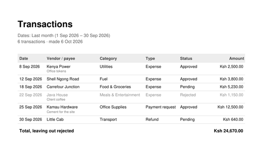

# Chapter 23: A PDF on the Phone

Previously, we wrote a native plugin from nothing, and followed one call
from Elixir through Zig and Kotlin to an Android system screen and back.
That finished the hardest part of Part II.

This last chapter of Part II is about the end of the month. Somebody has
to hand the month's spending to an accountant, attach it to an email, or
print it for a file. They don't want to scroll a list on a phone for that;
they want a document. So Risiti makes one: a PDF of exactly what the list
shows, made on the phone, opened in the phone's own PDF viewer to read,
print or share.

The interesting part is how. The phone has no PDF library we can call
from the BEAM, and we're not going to add one. Instead, we'll write the
PDF format ourselves, in a module of about 180 lines. PDF sounds
intimidating. For a page of text and lines, it isn't, and seeing it done
is the best way to stop being afraid of a file format.

By the end of this chapter, you will know:

- What's inside a PDF file, and how little of it a report needs.
- How to lay out text in points, and fit it in a column.
- How to split a table over pages.
- How to do slow work off the screen process, and test it.
- How to hand a file to the phone's own viewer.

## What the report holds

The report is the list, as it's showing. If the person has picked "Last
month" and the Fuel pill, the PDF is last month's fuel; if they've searched
for "naivas", it's those. That's the simplest rule to explain, and it means
the filters from Chapter 18 are also the report's settings. There's no
second screen of options to build or learn.

Here's what it looks like for a month with a little of everything:



Top to bottom:

- **A heading** that says what was picked: the dates, with the actual
  range spelled out when it was a preset ("Last month (1 Sep 2026 – 30 Sep
  2026)", because "last month" means something different next month), the
  pill if one was on, the search if there was one, and how many
  transactions.
- **A table**, oldest first, which is how an accountant reads a month.
  Each row has the date, the vendor or payee, the category, the type, the
  status and the amount, with the description in small grey text under the
  vendor when there is one. A rejected transaction is greyed out.
- **The total**, which, like the spend card, leaves out rejected
  transactions, and says so when there are any.
- **A footer** on every page: when it was made, and "page 2 of 3".

## Writing a PDF in Elixir

### What's in a PDF

Open a PDF in a text editor and you'll find, under the compressed parts,
something surprisingly readable. A PDF is a list of numbered **objects**,
plus an index saying where in the file each one starts. The objects a
simple document needs:

```
1 0 obj  << /Type /Catalog /Pages 2 0 R >>                 the root
2 0 obj  << /Type /Pages /Kids [6 0 R 8 0 R] /Count 2 >>   the list of pages
3 0 obj  << /Type /Font /BaseFont /Helvetica ... >>        a font
4 0 obj  << /Type /Font /BaseFont /Helvetica-Bold ... >>   another
5 0 obj  << /Title (...) /Producer (Risiti) >>             the file's properties
6 0 obj  << /Type /Page /MediaBox [0 0 595 842] ... >>     page 1
7 0 obj  << /Length 1234 >> stream ... endstream           page 1's drawing
8 0 obj  ...                                               page 2, and so on
```

`<< ... >>` is a dictionary, `/Name` is a name (like an atom), and
`6 0 R` is a reference to object 6. So the catalog points at the page
list, which points at each page, which points at its fonts and at a
**content stream**: the instructions that draw the page.

The content stream is a tiny language, written backwards in the way old
calculators were: arguments first, then the operator. Here's how a bold
heading at the top-left of a page is written:

```
0 g BT /F2 20 Tf 40 798 Td (Transactions) Tj ET
```

Read it as: set the fill colour to grey level 0, black (`0 g`); begin text
(`BT`); use font F2, which is Helvetica-Bold, at 20 points (`/F2 20 Tf`);
move to x 40, y 798 (`40 798 Td`); show the string "Transactions"
(`(...) Tj`); end text (`ET`). Lines and filled boxes are just as short.

Coordinates are in **points**, 1/72 of an inch, measured from the
*bottom*-left corner of the page. An A4 page is 595 by 842 points. If
you've drawn on an HTML canvas, the y-axis is the surprise: up is bigger.

Finally, after the objects, the **cross-reference table** (`xref`) lists
the byte offset where each object starts, and a short trailer says where
the `xref` is and which object is the root. That's how a reader can jump
to page 40 of a long PDF without reading the first 39.

That's all a report needs. No images, no compression, no embedded fonts.

### Fonts we don't have to ship

That last point deserves a word. Every PDF reader must know fourteen
"standard" fonts without the file including them, Helvetica among them.
So we name Helvetica and the reader supplies it, and the file stays tiny.

The price is encoding. Those standard fonts work with single-byte
encodings, and we use the common one, **WinAnsiEncoding**, Windows-1252.
It covers English and the accented Latin letters, the en dash, curly
quotes, the euro sign. It doesn't cover everything: a vendor name in
Arabic script or an emoji prints as `?`. For receipts in Kenya, almost all
in English and Swahili, that's a trade worth making.

### `RisitiApp.Pdf`

The module takes pages as lists of drawing operations, plain tuples, and
returns the bytes of a PDF. Create `lib/risiti_app/pdf.ex`; the full file
is in `code/23`. Its moduledoc describes the operations:

```elixir
defmodule RisitiApp.Pdf do
  @moduledoc """
  Just enough PDF to print a table: A4 pages of text in Helvetica (regular
  and bold), lines and shaded boxes. The phone has no PDF library, so this
  writes the file format directly.

  Coordinates are points (1/72 inch) from the bottom-left corner of the
  page. A page is a list of drawing operations:

    * `{:text, x, y, size, :regular | :bold, text}` — `text` is UTF-8; what
      the built-in fonts can't show (anything outside Windows-1252) prints
      as `?`;
    * `{:text, x, y, size, font, text, gray}` — the same in a gray from 0
      (black) to 1 (white);
    * `{:line, x1, y1, x2, y2, gray}`;
    * `{:box, x, y, width, height, gray}` — a filled rectangle.
  """
```

Describing a page as data, and turning data into bytes in one place, is
the same separation as `~MOB` and the renderer: the report decides *what*
goes where, and `Pdf` knows how a PDF says it. The tests for the report
can look at the operations without parsing a PDF.

Each operation becomes one line of the content stream:

```elixir
  defp op({:text, x, y, size, font, text}), do: op({:text, x, y, size, font, text, 0})

  defp op({:text, x, y, size, font, text, gray}) do
    f = if font == :bold, do: "F2", else: "F1"
    "#{num(gray)} g BT /#{f} #{num(size)} Tf #{num(x)} #{num(y)} Td #{string(text)} Tj ET"
  end

  defp op({:line, x1, y1, x2, y2, gray}),
    do: "#{num(gray)} G 0.5 w #{num(x1)} #{num(y1)} m #{num(x2)} #{num(y2)} l S"

  defp op({:box, x, y, w, h, gray}),
    do: "#{num(gray)} g #{num(x)} #{num(y)} #{num(w)} #{num(h)} re f"
```

A line is: stroke colour (`G`, capital for lines), width half a point
(`0.5 w`), move to (`m`), line to (`l`), stroke (`S`). A box is fill
colour, a rectangle (`re`), fill (`f`).

Text goes into a PDF string, which is where the encoding happens:

```elixir
  # A PDF literal string in Windows-1252, with ( ) \ escaped.
  defp string(text) do
    bytes =
      text
      |> String.to_charlist()
      |> Enum.map(fn
        c when c in [?(, ?), ?\\] -> [?\\, c]
        c when c in 32..126 or c in 160..255 -> c
        c -> Map.get(@cp1252, c, ??)
      end)

    IO.iodata_to_binary(["(", bytes, ")"])
  end
```

`String.to_charlist/1` gives Unicode code points. ASCII and the Latin-1
range (160–255) are the same numbers in Windows-1252, so they go through
as bytes. Brackets and backslashes are escaped, because a PDF string is
written between brackets. A few characters Windows-1252 keeps in the
range 128–159 come from a small map:

```elixir
  # Characters Windows-1252 has outside Latin-1 that receipts and labels use.
  @cp1252 %{
    ?– => 0x96,
    ?— => 0x97,
    ?‘ => 0x91,
    ?’ => 0x92,
    ?“ => 0x93,
    ?” => 0x94,
    ?• => 0x95,
    ?… => 0x85,
    ?€ => 0x80
  }
```

and everything else becomes `?`. The result is iodata, a list of bytes
and binaries, turned into one binary at the end.

### Putting it together

`render/2` builds the objects and the cross-reference table:

```elixir
  @doc "The PDF file for `pages`, with `title` in its properties."
  def render(pages, title) do
    page_count = length(pages)
    # Objects: 1 catalog, 2 page tree, 3 regular font, 4 bold font, 5 info,
    # then a page and its content stream for each page.
    page_ids = Enum.map(0..(page_count - 1)//1, &(6 + 2 * &1))

    fixed = [
      "<< /Type /Catalog /Pages 2 0 R >>",
      "<< /Type /Pages /Kids [#{Enum.map_join(page_ids, " ", &"#{&1} 0 R")}] /Count #{page_count} >>",
      font("Helvetica"),
      font("Helvetica-Bold"),
      "<< /Title #{text_string(title)} /Producer (Risiti) >>"
    ]

    page_objects =
      Enum.flat_map(Enum.zip(pages, page_ids), fn {ops, id} ->
        stream = content(ops)

        [
          "<< /Type /Page /Parent 2 0 R /MediaBox [0 0 #{@width} #{@height}] " <>
            "/Resources << /Font << /F1 3 0 R /F2 4 0 R >> >> /Contents #{id + 1} 0 R >>",
          "<< /Length #{byte_size(stream)} >>\nstream\n" <> stream <> "\nendstream"
        ]
      end)

    objects = fixed ++ page_objects
    header = "%PDF-1.4\n%\xE2\xE3\xCF\xD3\n"

    {body, xref_at} =
      objects
      |> Enum.with_index(1)
      |> Enum.map_reduce(byte_size(header), fn {object, n}, offset ->
        chunk = "#{n} 0 obj\n#{object}\nendobj\n"
        {{chunk, offset}, offset + byte_size(chunk)}
      end)

    chunks = Enum.map(body, &elem(&1, 0))
    count = length(objects) + 1

    xref =
      [
        "xref\n0 #{count}\n0000000000 65535 f \n"
        | Enum.map(body, fn {_chunk, offset} ->
            String.pad_leading(Integer.to_string(offset), 10, "0") <> " 00000 n \n"
          end)
      ]

    trailer =
      "trailer\n<< /Size #{count} /Root 1 0 R /Info 5 0 R >>\nstartxref\n#{xref_at}\n%%EOF\n"

    IO.iodata_to_binary([header, chunks, xref, trailer])
  end
```

The object numbers are fixed by position: the five shared objects first,
then a page and its stream for each page, so page *n* is object
`6 + 2(n − 1)`. The page tree can list every page before any is written.

`Enum.map_reduce/3` is the interesting call. It walks the objects, turning
each into its text (the map) while adding up byte sizes (the reduce), so
it returns both the chunks and, for each, the offset where it starts. The
final accumulator is where the `xref` begins. One pass, no mutation, and
the offsets are right by construction.

Note `byte_size/1` everywhere, never `String.length/1`. Offsets in a PDF
are bytes, and a string with "é" in it has more bytes than characters.

The header's second line, `%` followed by four bytes above 127, is a
convention: it tells tools that move files around that this one is binary,
so they don't "fix" its line endings.

`font/1` writes a font object, a standard font with WinAnsiEncoding:

```elixir
  defp font(name),
    do: "<< /Type /Font /Subtype /Type1 /BaseFont /#{name} /Encoding /WinAnsiEncoding >>"
```

### The title, and the bug in it

The title is the one string that isn't on a page: it's in the file's
properties, which a viewer may show in its title bar or file list. Run
`pdfinfo`, a command-line tool from poppler that prints those properties,
on a report written the obvious way, with the same `string/1` as the
page text, and it says:

```
Title:           Transactions ΠLast month
```

The title is "Transactions – Last month", with an en dash. The page
strings are in Windows-1252, where the en dash is byte 150. But strings
outside a page don't use the fonts' encoding; they use another one the
PDF standard defines, PDFDocEncoding, where byte 150 is "Œ". Same byte,
different table.

The fix is the other form the standard allows for such strings: UTF-16,
starting with a byte-order mark, written in hex between angle brackets.
UTF-16 can say any character, so the title can be anything:

```elixir
  # Text outside a page (the title in the file's properties) isn't in the
  # fonts' encoding: it's PDFDocEncoding, where Windows-1252's en dash is "Œ".
  # UTF-16 with a byte-order mark, written in hex, says any character.
  defp text_string(text) do
    utf16 = :unicode.characters_to_binary(text, :utf8, {:utf16, :big})
    "<FEFF" <> Base.encode16(utf16) <> ">"
  end
```

`:unicode.characters_to_binary/3`, from Erlang's standard library,
converts between encodings; `Base.encode16/1` writes the bytes as hex.
This bug is in the real Risiti's report too, and has been since it was
written. Nothing on the page was wrong, so nobody looked at the
properties.

### Measuring text

A table needs to know how wide text is, to right-align amounts and to cut
a long vendor name before it runs into the next column. A PDF reader knows
each character's width; we have to know it too. Helvetica's widths are
published, in thousandths of the font size, and the module keeps the ones
for ASCII:

```elixir
  # Helvetica's advance widths (per 1000 points of font size) for ASCII 32–126.
  @helvetica [278, 278, 355, 556, 556, 889, 667, 191, 333, 333, 389, 584, 278, 333, 278, 278] ++
               [556, 556, 556, 556, 556, 556, 556, 556, 556, 556, 278, 278, 584, 584, 584, 556] ++
               [1015, 667, 667, 722, 722, 667, 611, 778, 722, 278, 500, 667, 556, 833, 722, 778] ++
               [667, 778, 722, 667, 611, 722, 667, 944, 667, 667, 611, 278, 278, 278, 469, 556] ++
               [333, 556, 556, 500, 556, 556, 278, 556, 556, 222, 222, 500, 222, 833, 556, 556] ++
               [556, 556, 333, 500, 278, 556, 500, 722, 500, 500, 500, 334, 260, 334, 584]

  @widths @helvetica |> Enum.with_index(32) |> Map.new(fn {w, c} -> {c, w} end)
```

The second attribute turns the list into a map from character to width,
once, at compile time. Then:

```elixir
  @doc """
  How wide `text` prints at `size` points. Bold is a little wider than
  regular; the estimate errs on the wide side.
  """
  def text_width(text, size, font \\ :regular) do
    units =
      text
      |> String.to_charlist()
      |> Enum.reduce(0, &(&2 + Map.get(@widths, &1, 556)))

    units * size / 1000 * if(font == :bold, do: 1.03, else: 1.0)
  end
```

Anything not in the map counts as 556, the width of a digit: about
average, and wide enough that an estimate errs on the side of fitting.
Bold Helvetica has its own widths, a little wider; 3% more is close
enough, and again errs wide.

`fit/4` cuts text to a width, with an ellipsis:

```elixir
  @doc """
  `text` cut to fit in `width` points, ending in "…" when it was cut.

      iex> RisitiApp.Pdf.fit("Naivas Supermarket Westlands", 60, 10)
      "Naivas Sup…"
  """
  def fit(text, width, size, font \\ :regular) do
    if text_width(text, size, font) <= width,
      do: text,
      else: cut(text, width, size, font)
  end

  defp cut(text, width, size, font) do
    text
    |> String.graphemes()
    |> Enum.reduce_while("", fn g, acc ->
      if text_width(acc <> g <> "…", size, font) <= width,
        do: {:cont, acc <> g},
        else: {:halt, acc}
    end)
    |> String.trim_trailing()
    |> Kernel.<>("…")
  end
```

It adds one *grapheme* at a time, a character as a person sees it, until
the next one wouldn't fit with the ellipsis. `Enum.reduce_while/3` stops
the moment it's full. It goes by graphemes, not bytes, so it never cuts a
character in half.

## The report

`RisitiApp.Transactions.Report` lays the transactions out as pages of
operations and hands them to `Pdf`. It's 220 lines of arithmetic about
where things go, so here are the decisions; the full module is in
`code/23/lib/risiti_app/transactions/report.ex`.

The columns are data, with widths that add up to the 515 points between
the margins:

```elixir
  @margin 40
  @row 18
  # The description, when there is one, goes on a second line.
  @row_with_note 28
  @header_row 20

  # {title, width, align}: 515 points between the margins.
  @columns [
    {"Date", 62, :left},
    {"Vendor / payee", 120, :left},
    {"Category", 104, :left},
    {"Type", 78, :left},
    {"Status", 64, :left},
    {"Amount", 87, :right}
  ]
```

One function draws any row of cells from those columns, fitting each value
and right-aligning the amount:

```elixir
  defp cells(values, y, size, font, gray) do
    @columns
    |> Enum.zip(values)
    |> Enum.map_reduce(@margin, fn {{_title, width, align}, value}, x ->
      text = Pdf.fit(value, width - 8, size, font)

      x_text =
        if align == :right,
          do: x + width - 4 - Pdf.text_width(text, size, font),
          else: x + 4

      {{:text, x_text, y, size, font, text, gray}, x + width}
    end)
    |> elem(0)
  end
```

`Enum.map_reduce/3` again, this time carrying the x position from one
column to the next. Right-aligning is the reason `text_width/3` exists:
the amount starts at the column's right edge minus its own width.

### Splitting into pages

A month of a busy team's spending doesn't fit on one page. Rows have two
heights, 18 points or 28 with a description, so a page can't be "every 40
rows". `paginate/3` walks down the page, keeping track of y:

```elixir
  # Splits the rows into pages: the first starts under the heading, the
  # rest at the top; the last leaves room for the total.
  defp paginate(rows, first_top, top) do
    bottom = @margin + 30

    {pages, current, _y} =
      Enum.reduce(rows, {[], [], first_top - @header_row}, fn row, {pages, current, y} ->
        h = row_height(row)

        if y - h < bottom and current != [],
          do: {[Enum.reverse(current) | pages], [row], top - @header_row - h},
          else: {pages, [row | current], y - h}
      end)

    pages = if current == [], do: pages, else: [Enum.reverse(current) | pages]
    Enum.reverse(pages)
  end
```

The accumulator is the finished pages, the page being filled, and where
the next row would go. When a row won't fit above the bottom margin, the
current page is finished and the row starts a new one, below a repeated
column header. Rows are added at the front of the list and reversed when a
page is finished, the usual way to build lists in Elixir, since adding to
the front is cheap and adding to the end isn't.

`and current != []` makes sure a page always gets at least one row, even
one taller than a page, so a strange row can't loop forever.

### The rest

The rest of the module is the heading, the table and the total, each a
function returning a list of operations, concatenated per page. A few
details worth knowing:

- **Oldest first.** `render/3` sorts by date, and by id within a day, so
  two receipts from the same day stay in the order they were added. The
  list on screen is newest first; a report for an accountant isn't.
- **Rejected rows are grey**, with the gray value 0.55 on each cell, and
  the total skips them, like the spend card. If any were skipped, the
  total's label says "Total, leaving out rejected", so nobody adds up the
  column and wonders why it disagrees.
- **An empty list still makes a page.** One page that says "Nothing to
  show.", which is clearer than a file with nothing in it.
- **`render/3` takes `today`**, defaulting to today in Kenya, so the tests
  can pin the "made on" date and the meaning of "last month".

Writing the file is the last step:

```elixir
  @doc "Writes the PDF and returns its path."
  def write(transactions, scope) do
    dir = DataDir.path("exports")
    Enum.each(File.ls!(dir), &File.rm(Path.join(dir, &1)))

    path = Path.join(dir, file_name(scope.period))

    with :ok <- File.write(path, render(transactions, scope)), do: {:ok, path}
  end
```

It empties `exports/` first, so there's only ever one report on the phone.
Once it's been read or shared, an old report is just a stale copy of data
the app already has. The file is named for the period,
`risiti-transactions-last-month.pdf`, which is the name the person sees
when they share it.

## Doing it off the screen

A month's report takes a moment to make, and a year's takes longer. A
screen is one process: while it's making a PDF, it can't respond to a tap.
So, like the KRA lookup in Chapter 20, the work goes to a process of its
own. This time it's not a call to a plugin or the network, just slow
Elixir, so `Native` gets a general-purpose helper:

```elixir
  @doc """
  Runs `fun` in a process of its own and sends the screen `{tag, result}`,
  so slow work doesn't hold the screen up. Under tests it runs inline, so
  the reply is already in the mailbox and the database sandbox still
  applies.
  """
  def background(socket, tag, fun) do
    screen = self()

    if Application.get_env(:risiti_app, :native, true),
      do: Task.start(fn -> send(screen, {tag, fun.()}) end),
      else: send(screen, {tag, fun.()})

    socket
  end
```

On the phone it starts a task and returns at once. Under tests it does the
work inline and puts the answer in the mailbox. Why not a task in tests
too? Because of the SQL sandbox from Chapter 12: a test's database
connection belongs to the test process, and a new task couldn't see the
rows the test inserted. Running inline keeps everything in one process.
The screen's code is the same either way: it gets `{tag, result}` as a
message.

### The PDF button

On the home screen, the date pill shares its row with a **PDF** pill on
the right, shown only when there's something to export:

```elixir
  # The date pill, and on the right a PDF of what the list shows.
  defp list_tools(period, any?, exporting?) do
    ~MOB"""
    <Row fill_width={true} align={:center} padding_right={18}>
      {date_pill(period)}
      <Spacer weight={1} />
      <Row
        :if={any?}
        background={:surface}
        border_color={:border}
        border_width={1}
        corner_radius={:radius_pill}
        padding_left={10}
        padding_right={12}
        padding_top={6}
        padding_bottom={6}
        align={:center}
        on_tap={{self(), :export_pdf}}
        accessibility_label="Export these transactions as a PDF"
      >
        <Icon name="share" text_size={15} text_color={:on_surface} />
        <Spacer size={6} />
        <Text
          text={if(exporting?, do: "Making PDF…", else: "PDF")}
          text_size={13}
          font_weight="medium"
          text_color={:on_surface}
        />
      </Row>
    </Row>
    """
  end
```

`<Spacer weight={1} />` pushes the PDF pill to the right edge: a spacer
with a weight takes whatever room is left, like `flex: 1` in CSS.

The screen gets an `exporting: false` assign, and three handlers:

```elixir
  # One at a time: a second tap while the first is being made does nothing.
  def handle_info({:tap, :export_pdf}, %{assigns: %{exporting: true}} = socket),
    do: {:noreply, socket}

  def handle_info({:tap, :export_pdf}, socket) do
    %{items: items, period: period, group: group, query: query} = socket.assigns
    scope = %{period: period, filter: filter_label(group), search: query}

    {:noreply,
     socket
     |> Mob.Socket.assign(:exporting, true)
     |> Native.background(:pdf_written, fn -> Report.write(items, scope) end)}
  end

  def handle_info({:pdf_written, {:ok, path}}, socket) do
    {:noreply, socket |> Mob.Socket.assign(:exporting, false) |> Native.open_file(path)}
  end

  def handle_info({:pdf_written, {:error, _reason}}, socket) do
    {:noreply,
     socket
     |> Mob.Socket.assign(:exporting, false)
     |> Native.toast("Couldn't make the PDF. Check your phone has free space.")}
  end
```

The report is made from `items`, the transactions already on screen, so
it's exactly what the person sees, without querying again. `exporting`
does two jobs: the pill says "Making PDF…" while it's true, and a second
tap is ignored, so an impatient person can't start three PDFs.

`filter_label/1` turns the pill into the heading's "Showing:" line:

```elixir
  defp filter_label(:all), do: nil
  defp filter_label(group), do: Transactions.group_label(group)
```

## Opening it

When the file is written, the screen hands it to the phone with
`Native.open_file/2`, which we added in Chapter 21 for attachments. The
phone opens it in whatever app reads PDFs: Google's PDF viewer, Drive, a
reader the person installed. From there, *that* app offers print and
share, to email, WhatsApp, Drive or a printer.

That's a decision worth naming. Risiti could draw its own preview, its own
share menu, its own print dialog. All three would be worse than the ones
the person already knows, and all three would be ours to maintain. Making
the file is the part only Risiti can do; everything after that, the phone
already does well.

## Run it

```
mix mob.deploy --device YOUR_DEVICE_ID
```

Pick **Last month** on the date pill and tap **PDF**. The pill says
"Making PDF…" for a moment, then the phone's PDF viewer opens with the
report.

<!-- SHOT: the report open in the phone's PDF viewer, from code/23 with the September data. -->


Use the viewer's share button to send it to yourself, and open it on a
computer. It's an ordinary PDF; nothing about it says it was made on a
phone.

## Testing it

The PDF writer gets a test that checks the file's structure, in
`test/risiti_app/pdf_test.exs`:

```elixir
  test "writes a PDF whose cross-reference table points at each object" do
    pdf =
      Pdf.render(
        [[{:text, 40, 800, 12, :bold, "Café (Nairobi) – 50\\50"}], [{:line, 0, 0, 10, 10, 0.5}]],
        "Test"
      )

    assert "%PDF-1.4" <> _ = pdf
    assert String.ends_with?(pdf, "%%EOF\n")
    # Latin-1 é, Windows-1252 en dash, escaped brackets and backslash.
    assert pdf =~ <<"(Caf", 0xE9, " \\(Nairobi\\) ", 0x96, " 50\\\\50)">>

    [_, xref_at] = Regex.run(~r/startxref\n(\d+)/, pdf)
    xref = binary_part(pdf, String.to_integer(xref_at), 4)
    assert xref == "xref"

    offsets = Regex.scan(~r/^(\d{10}) 00000 n $/m, pdf, capture: :all_but_first)

    for {[offset], n} <- Enum.with_index(offsets, 1) do
      assert binary_part(pdf, String.to_integer(offset), byte_size("#{n} 0 obj")) == "#{n} 0 obj"
    end
  end
```

It does what a PDF reader does: finds `startxref`, checks there's an
`xref` at that offset, then checks every offset in the table lands on the
start of the right object. If a byte count were ever off by one (a
`String.length` where a `byte_size` should be), this fails. The one string
crosses all the encoding cases: a Latin-1 "é", a Windows-1252 en dash,
brackets and a backslash, and the expected bytes are written as a binary
literal so there's no doubt what they are.

Its neighbour pins the title fix:

```elixir
  test "the title in the file's properties keeps characters like the en dash" do
    pdf = Pdf.render([[]], "Transactions – Last month")
    # "–" is U+2013: 2013 in UTF-16, after the FEFF byte-order mark.
    assert pdf =~ "/Title <FEFF005400720061006E00730061006300740069006F006E0073002020130020"
  end
```

`test/risiti_app/transactions/report_test.exs` checks the report's
decisions by looking for strings in the PDF, which works because our
strings are plain text in the file:

```elixir
  test "the total leaves out rejected transactions, and says so" do
    {:ok, rejected} =
      Transactions.decide(expense(vendor: "Personal", amount_cents: 50_000), "rejected")

    pdf =
      Report.render([expense(vendor: "Naivas", amount_cents: 245_000), rejected], @scope, @today)

    assert pdf =~ "(Total, leaving out rejected)"
    assert pdf =~ "(Ksh 2,450.00)"
  end

  test "a long list runs onto more pages, each numbered" do
    rows = for i <- 1..60, do: expense(vendor: "Shop #{i}")
    pdf = Report.render(rows, @scope, @today)

    [_, count] = Regex.run(~r/\/Count (\d+)/, pdf)
    pages = String.to_integer(count)
    assert pages > 1
    assert pdf =~ "page #{pages} of #{pages}"
  end
```

The file also checks the heading, an empty list, and that `write/2` keeps
only one file in `exports/`. And when you change the layout, render one
and look at it. A test can say the total is there; only your eyes can say
it's in the right place. `pdftoppm`, from the poppler tools, turns a page
into a PNG; that's how the picture at the top of this chapter was made.

The screen test shows how to test `Native.background/3`:

```elixir
    test "makes the report in the background and opens it in the phone's viewer" do
      insert_transaction(vendor: "Naivas")

      view = ReceiptsScreen |> mount_screen() |> render_info({:tap, :export_pdf})
      assert assigns(view).exporting
      assert text(rendered(view)) =~ "Making PDF…"

      # Under tests the work runs inline, and its answer waits in our mailbox
      # for us to hand to the screen, as the phone's Task would send it.
      assert_received {:pdf_written, {:ok, path} = result}
      view = render_info(view, {:pdf_written, result})

      assert_received {:native, :open_file, [^path]}
      assert "%PDF" <> _ = File.read!(path)
      assert assigns(view).exporting == false
    end
```

The test plays the part of the phone's task: it takes the answer out of
its own mailbox and delivers it to the screen. In between, it can check
what the screen shows while the PDF is being made, which with a real task
would be a race.

```
mix test
```

```
22 doctests, 144 tests, 0 failures
```

## What we have so far

- `RisitiApp.Pdf`: a PDF writer in about 180 lines, with text, lines,
  boxes, text measuring and fitting, and correct offsets by construction.
- A report of exactly what the list shows: heading, table, total, pages.
- `Native.background/3`, for slow Elixir off the screen process, and a way
  to test it.
- The file handed to the phone's own viewer, which already knows how to
  print and share.

The code at the end of this chapter is in `code/23/`.

## The end of Part II

That's the phone finished. Risiti photographs receipts and reads them,
scans KRA's QR codes and trusts KRA's record, checks receipts with KRA in
the background, asks for refunds and payments with attachments, signs in
with Google (or will, once there's something to sign in to), and hands the
month to an accountant as a PDF. All of it works with no network, except
the parts that are about the network.

What it can't do is the other half of Chapter 16's rule. The phone owns
the figures; somebody has to own the decisions. Every refund and payment
request on the phone is waiting for an approver who doesn't exist yet.

In Part III, we build the server.
